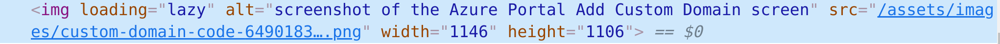
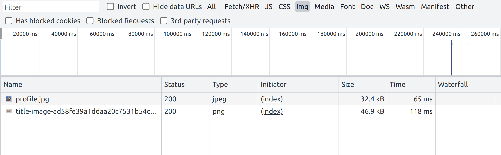

If you'd like to improve the performance of a Docusaurus website by implementing native lazy-loading of images, you can. This post shows you how you too can have `

## Updated 26/02/2022

You don't need this anymore. As of Docusaurus [v2.0.0-beta.16](https://github.com/facebook/docusaurus/releases/tag/v2.0.0-beta.16) Docusaurus lazy loads markdown images by default. You can see the commit where it was added [here](https://github.com/facebook/docusaurus/pull/6598). Isn't that wonderful?

✅cumulative no of network requests for Docusaurus sites will go 👇
✅perceived performance will go ☝️
✅hosting costs will go 👇

## Lazy loading images

Native browser lazy loading for images is a relatively recent innovation. To read more on the topic, [do look at this post](https://web.dev/browser-level-image-lazy-loading/). The TL;DR is this though: by adding the `loading="lazy"` attribute to an `img` element, modern browsers will delay loading the image until it is needed. This provides better performance to your users: when it comes to loading, less is more.

## Docusaurus

If you're using Docusaurus then you're likely writing Markdown. I am. This blog is written using Markdown, and converted, using [MDX plugins](https://docusaurus.io/docs/next/markdown-features/plugins) into JSX. This handles images as well as we can [see here](https://github.com/facebook/docusaurus/blob/6ec0db4722cbf988fd5280a4442223637c2de8d7/packages/docusaurus-mdx-loader/src/remark/transformImage/index.ts#L79):

```ts
jsxNode.value = ``;
```

The crucial thing to note about the above, is the lack of the `loading="lazy"` attribute. Can we add that somehow? Yes we can!

## Rehype plugin

To do this, we're going to write our own mini [rehype plugin](https://github.com/rehypejs) that will take the HTML being pumped out of Docusaurus and add the `loading="lazy"` attribute.

Alongside our `docusaurus.config.js` we're going to create a `image-lazy-remark-plugin.js` file:

```js
const visit = require('unist-util-visit');

/** @type {import('unified').Plugin<[], import('hast').Root>} */
function lazyLoadImagesPlugin() {
  return (tree) => {
    visit(tree, ['element', 'jsx'], (node) => {
      if (node.type === 'element' && node.tagName === 'img') {
        // handles nodes like this:

        // {
        //   type: 'element',
        //   tagName: 'img',
        //   properties: {
        //     src: 'https://some.website.com/cat.gif',
        //     alt: null
        //   },
        //   ...
        // }

        node.properties.loading = 'lazy';
      } else if (node.type === 'jsx' && node.value.includes(''
        // }

        node.value = node.value.replace(/<img /g, '<img loading="lazy" ');
      }
    });
  };
}

module.exports = lazyLoadImagesPlugin;
```

As the code above suggests, it looks for `img` elements, whether they be in HTML or JSX, and adds in the `loading="lazy"` attribute.

To apply this to our blog, we simply tweak the `docusaurus.config.js` file to make use of our plugin:

```js
const imageLazyRemarkPlugin = require('./image-lazy-remark-plugin');

// ...

/** @type {import('@docusaurus/types').Config} */
const config = {
  // ...

  presets: [
    [
      '@docusaurus/preset-classic',
      /** @type {import('@docusaurus/preset-classic').Options} */
      ({
        // ...
        blog: {
          // ...
          rehypePlugins: [imageLazyRemarkPlugin],
        },
        // ...
      }),
    ],
  ],
  // ...
};
```

## What's the result?

With this in place, next time we run a build, we can see the attribute being applied to our image elements:



Consequently, when we fire up devtools we can see that only the images onscreen are being loaded. In the example below we're _not_ seeing five other images being loaded because they're offscreen and haven't been scrolled to as yet:



Amazing! It works! It's possible that this could land directly in Docusaurus one day. [Go here to follow the discussion on this.](https://docusaurus.io/feature-requests/p/lazy-loading-images-in-blog-posts-by-default)
