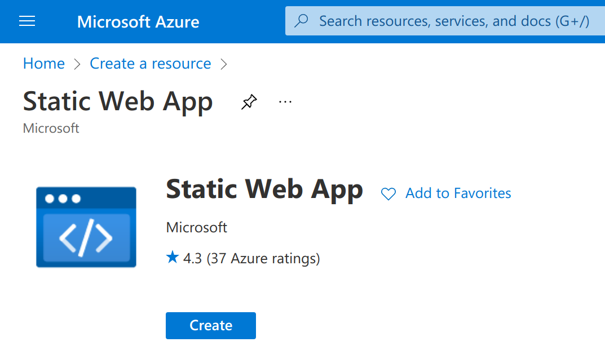
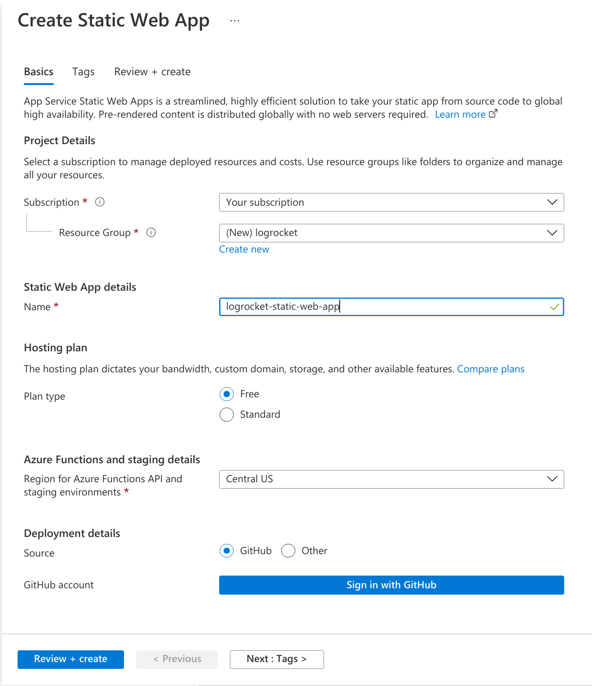
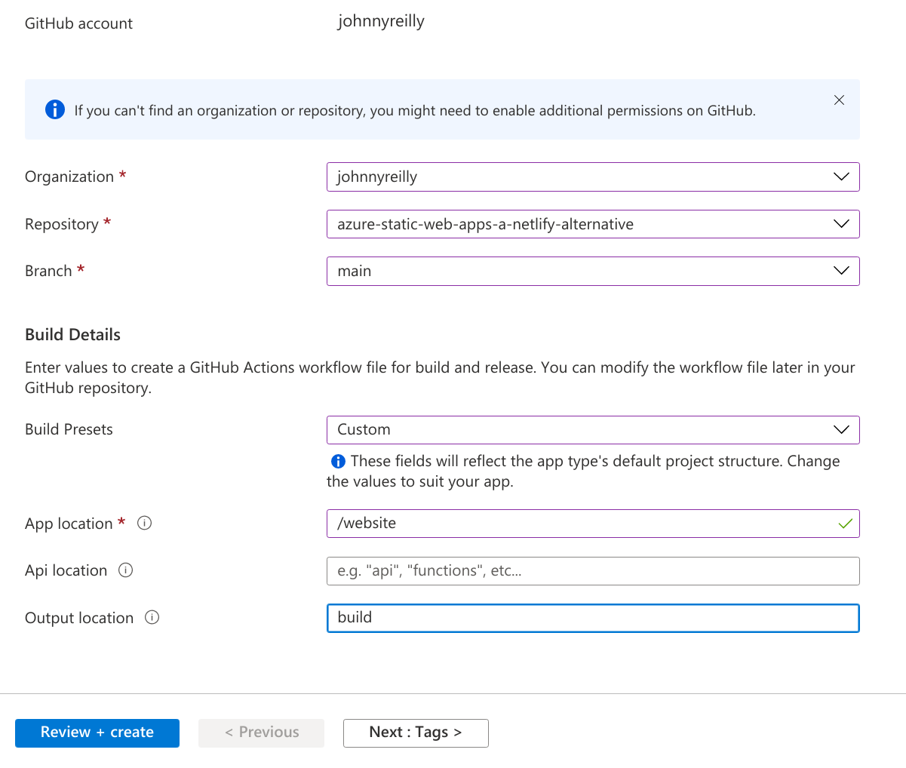
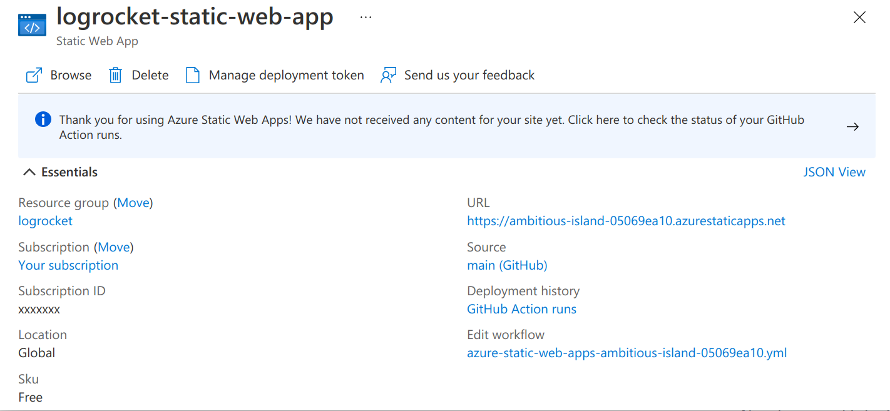
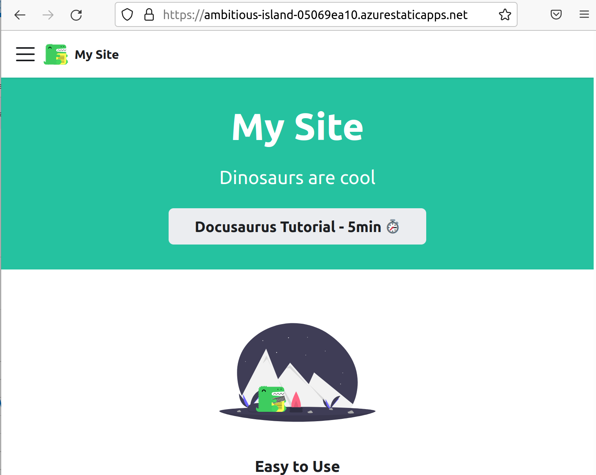

Jamstack sites have taken the world by storm. There's currently fierce competition between offerings like [Netlify and Cloudflare](https://blog.logrocket.com/netlify-vs-cloudflare-pages/). A new player in this space is Azure Static Web Apps. This post will look at what working with SWAs is like and will demonstrate deploying one using GitHub Actions.

## Jamstack and Azure Static Web Apps

[Jamstack](https://en.m.wikipedia.org/wiki/Jamstack) stands for JavaScript, API and Markup In Jamstack websites, the application logic typically resides on the client side. Typically these clients are built as [single-page applications](https://en.m.wikipedia.org/wiki/Single-page_application) and often have HTML files statically generated for every possible path to support search engine optimization.

Azure Static Web Apps were released for general use in [May 2021](https://azure.microsoft.com/en-us/updates/azure-static-web-apps-is-now-generally-available/) and offer features including:

- Globally distributed content for production apps
- Auto-provisioned preview environments
- Custom domain configuration and free SSL certificates
- Built-in access to a variety of authentication providers
- Route-based authorization
- Custom routing
- Integration with serverless APIs powered by Azure Functions
- A custom Visual Studio Code developer extension

Significantly, [these features are available to use for free](https://azure.microsoft.com/en-gb/pricing/details/app-service/static/). With Netlify there is also a [free tier](https://www.netlify.com/pricing/), however it's quite easy to exceed the build limits of the free tier and land yourself with an unexpected bill. By combining Azure Static Web Apps with GitHub Actions we can build comparable experiences and save ourselves money!

So let's build ourselves a simple SWA and deploy it with GitHub Actions.

## Create our application

Inside the root of our repository we're going to create a [Docusaurus site](https://docusaurus.io/). Docusaurus is a good example of a static site, the kind of which is a natural fit for Jamstack. We could equally use something else like [Hugo](https://gohugo.io/) for instance.

At the command line we'll enter:

```shell
npx create-docusaurus@latest website classic
```

And Docusaurus will create a new site in the `website` directory. Let's commit and push this and turn our attention to Azure.

## Creating a Static Web App in Azure

There's a number of ways to create a Static Web App in Azure. It's possible to use [infrastructure as code with a language like Bicep](https://blog.johnnyreilly.com/2021/08/15/bicep-azure-static-web-apps-azure-devops#bicep-template). But for this post let's use the [Azure Portal](https://portal.azure.com) instead. If you don't have an account already, you can set one up for free very quickly.

Once you've logged in, click "Create a resource" and look up Static Web App:



Click on "Create" and you'll be take to the creation dialog:



You'll need to create a resource group for your SWA to live in, give the app a name, the "Free" plan and a deployment source of GitHub.

Click on the "Sign in with GitHub" button and authorize Azure to access your GitHub account for Static Web Apps.



At this point Azure will query GitHub on your behalf and look up the organisations and repositories you have access to. Select the repository that you'd like to deploy to your Static Web App and select the branch you'd like to deploy.

You also need to provide Azure with some build details that help it understand how your app is built. We'll provide a preset of "Custom". We'll set the "App location" (the root of our front end app) to be `"/website"` to tally up with the application we just created. We'll leave Api blank and we'll set the output location to be `"build"` - this is the directory under `website` where Docusaurus will create our site.

Finally click "Review + create" and then "Create".

Azure will now:

- Create an Azure Static Web app resource in Azure
- Update your repository to add a GitHub Actions workflow to deploy your static web app
- Kick off a first run of the GitHub Actions workflow to deploy your SWA.

Pretty amazing, right?

When you look at the resource in Azure it will look something like this:



If you click on the GitHub Action runs you'll be presented with your GitHub Action:


And when that finishes running you'll be able to see your deployed Static Web App by clicking on the URL in the Azure Portal:



We've gone from having nothing, to having a brand new website in Azure, shipped via continous deployment in GitHub Actions in a matter of minutes. This is low friction and high value!

## Authentication

Now we've done our initial deployment, let's take it a stage further and add authentication.

One of the awesome features of Static Web Apps is the fact that [authentication is available straight out of the box](https://docs.microsoft.com/en-us/azure/static-web-apps/authentication-authorization?tabs=invitations#login). We can pick from GitHub, Azure Active Directory and Twitter as identity providers. Let's roll with GitHub and amend our `index.js` to support authentication.
