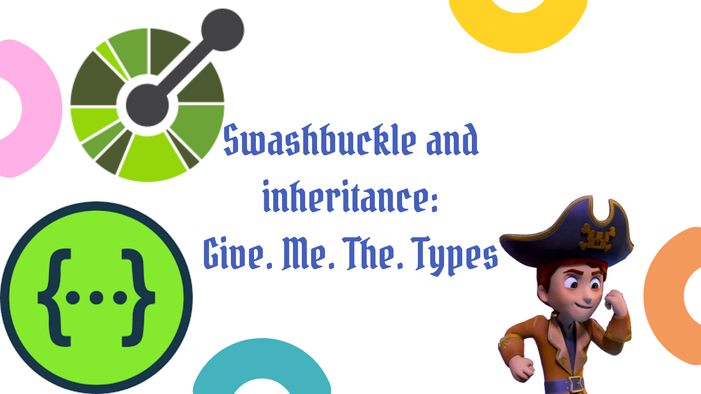

For API endpoints that return multiple types, you can use inheritance with Swashbuckle to get create a Swagger / Open API definition featuring the variety of available types. Serving all these types is not the default behaviour. This post shows you how to opt in.



<!--truncate-->

## Making a simple API

The first thing we're going to need is an API, which we'll build with the .NET 6 SDK:

```bash
dotnet new webapi
dotnet add package Swashbuckle.AspNetCore
```

When we run this with `dotnet run` we find Swashbuckle living at http://localhost:5000/swagger/index.html defining our web api that serves up a WeatherForecast:


If we look at the `swagger.json` created at our `http://localhost:5000/swagger/v1/swagger.json` endpoint we see the following definition:

```json
{
  "openapi": "3.0.1",
  "info": {
    "title": "SwashbuckleInheritance",
    "version": "1.0"
  },
  "paths": {
    "/WeatherForecast": {
      "get": {
        "tags": ["WeatherForecast"],
        "operationId": "GetWeatherForecast",
        "responses": {
          "200": {
            "description": "Success",
            "content": {
              "text/plain": {
                "schema": {
                  "type": "array",
                  "items": {
                    "$ref": "#/components/schemas/WeatherForecast"
                  }
                }
              },
              "application/json": {
                "schema": {
                  "type": "array",
                  "items": {
                    "$ref": "#/components/schemas/WeatherForecast"
                  }
                }
              },
              "text/json": {
                "schema": {
                  "type": "array",
                  "items": {
                    "$ref": "#/components/schemas/WeatherForecast"
                  }
                }
              }
            }
          }
        }
      }
    }
  },
  "components": {
    "schemas": {
      "WeatherForecast": {
        "type": "object",
        "properties": {
          "date": {
            "type": "string",
            "format": "date-time"
          },
          "temperatureC": {
            "type": "integer",
            "format": "int32"
          },
          "temperatureF": {
            "type": "integer",
            "format": "int32",
            "readOnly": true
          },
          "summary": {
            "type": "string",
            "nullable": true
          }
        },
        "additionalProperties": false
      }
    }
  }
}
```

Only a single return type is defined: `WeatherForecast`.

## Multiple return types

Now we've got our simple API, let's evolve it to serve up multiple types. We're going to do this by updating our `WeatherForecast.cs` as follows:

```cs
public class WeatherForecast
{
    public DateTime Date { get; set; }

    public int TemperatureC { get; set; }

    public int TemperatureF => 32 + (int)(TemperatureC / 0.5556);

    public string? Summary { get; set; }
}

public class WeatherForecastWithLocation : WeatherForecast
{
    public string? Location { get; set; }
}
```

We now have both a `WeatherForecast` and a `WeatherForecastWithLocation` that inherits from `WeatherForecast` and adds in a `Location` property.

We'll also update the `GetWeatherForecast` endpoint to surface both these types:

```cs
[HttpGet(Name = "GetWeatherForecast")]
public IEnumerable<WeatherForecast> Get() =>
    DateTime.Now.Minute < 30
        ? Enumerable.Range(1, 5).Select(index => new WeatherForecast
        {
            Date = DateTime.Now.AddDays(index),
            TemperatureC = Random.Shared.Next(-20, 55),
            Summary = Summaries[Random.Shared.Next(Summaries.Length)]
        })
        : Enumerable.Range(1, 5).Select(index => new WeatherForecastWithLocation
        {
            Date = DateTime.Now.AddDays(index),
            TemperatureC = Random.Shared.Next(-20, 55),
            Summary = Summaries[Random.Shared.Next(Summaries.Length)],
            Location = "London"
        })
        .ToArray();
```

We've amended the endpoint to return `WeatherForecast`s for the first thirty minutes of each hour, and `WeatherForecastWithLocation`s for the second thirty minutes. This is plainly a contrived example, but it demonstrates what it looks like to have an API endpoint with multiple return types.

Incidentally, the reason we're able to achieve this without the compiler shouting at us is because our endpoint is saying it returns a `WeatherForecast` and that is the base type of `WeatherForecastWithLocation` as well.

To prove that it works, we wait for half past the hour and enter:

```bash
curl -X 'GET' 'http://localhost:5000/WeatherForecast'
```

We see back JSON that includes the `Location` property. Huzzah!

```json
[
  {
    "location": "London",
    "date": "2022-03-07T08:51:02.0932353+00:00",
    "temperatureC": -4,
    "temperatureF": 25,
    "summary": "Bracing"
  },
  {
    "location": "London",
    "date": "2022-03-08T08:51:02.0938418+00:00",
    "temperatureC": -5,
    "temperatureF": 24,
    "summary": "Balmy"
  },
  {
    "location": "London",
    "date": "2022-03-09T08:51:02.0938513+00:00",
    "temperatureC": 51,
    "temperatureF": 123,
    "summary": "Warm"
  },
  {
    "location": "London",
    "date": "2022-03-10T08:51:02.0938518+00:00",
    "temperatureC": 35,
    "temperatureF": 94,
    "summary": "Warm"
  },
  {
    "location": "London",
    "date": "2022-03-11T08:51:02.0938537+00:00",
    "temperatureC": 2,
    "temperatureF": 35,
    "summary": "Cool"
  }
]
```

Whilst we've got behaviour that handles multiple return types, what we don't have is Swagger / Open API that represents that. Despite our tweaks, our Swagger / Open API definition remains unchanged.

## Serving up subtypes

In a perfect world, C# would have support for discriminated unions, and we'd be using [`oneOf`](https://swagger.io/docs/specification/data-models/oneof-anyof-allof-not/) to represent the multiple types being surfaced. [The day may come where C# supports discriminated unions](https://github.com/dotnet/csharplang/issues/113), but until that time we'll be achieving this behaviour with inheritance. We do this by having an endpoint that surfaces up a base type, and all our possible return types must either subclass that base type, or be that base type.

To be clearer: we want our served up Swagger / Open API definition to serve up the definitions of our subclasses. It needs to shout about `WeatherForecastWithLocation` in the same way it shouts about `WeatherForecast`.

It turns out that this is eminently achievable with Swashbuckle, but you do need to know where to look. [Look here](https://github.com/domaindrivendev/Swashbuckle.AspNetCore#describing-discriminators).

To apply this tweak to our own `Program.cs` we simply update the `AddSwaggerGen` as follows:

```cs
builder.Services.AddSwaggerGen(swaggerGenOptions =>
{
    swaggerGenOptions.UseAllOfForInheritance();
    swaggerGenOptions.UseOneOfForPolymorphism();

    swaggerGenOptions.SelectSubTypesUsing(baseType =>
        typeof(Program).Assembly.GetTypes().Where(type => type.IsSubclassOf(baseType))
    );
});
```

There's three things we're doing here:

1. With [`UseAllOfForInheritance`](https://github.com/domaindrivendev/Swashbuckle.AspNetCore#enabling-inheritance) we're enabling inheritance - this allows us to maintain the inheritance hierarchy in any generated client models.
2. With [`UseOneOfForPolymorphism`](https://github.com/domaindrivendev/Swashbuckle.AspNetCore#enabling-polymorphism) we're listing the possible subtypes for an action that accepts/returns base types.
3. With [`SelectSubTypesUsing`](https://github.com/domaindrivendev/Swashbuckle.AspNetCore#detecting-subtypes) we're pointing Swashbuckle at the type hierarchies it exposes in the generated Swagger.

Then next time we `dotnet run` we see that we're serving up both `WeatherForecast` and `WeatherForecastWithLocation`:


We can also see this directly in the `swagger.json` created at our `http://localhost:5000/swagger/v1/swagger.json` endpoint:

```json
{
  "openapi": "3.0.1",
  "info": {
    "title": "SwashbuckleInheritance",
    "version": "1.0"
  },
  "paths": {
    "/WeatherForecast": {
      "get": {
        "tags": ["WeatherForecast"],
        "operationId": "GetWeatherForecast",
        "responses": {
          "200": {
            "description": "Success",
            "content": {
              "text/plain": {
                "schema": {
                  "type": "array",
                  "items": {
                    "oneOf": [
                      {
                        "$ref": "#/components/schemas/WeatherForecast"
                      },
                      {
                        "$ref": "#/components/schemas/WeatherForecastWithLocation"
                      }
                    ]
                  }
                }
              },
              "application/json": {
                "schema": {
                  "type": "array",
                  "items": {
                    "oneOf": [
                      {
                        "$ref": "#/components/schemas/WeatherForecast"
                      },
                      {
                        "$ref": "#/components/schemas/WeatherForecastWithLocation"
                      }
                    ]
                  }
                }
              },
              "text/json": {
                "schema": {
                  "type": "array",
                  "items": {
                    "oneOf": [
                      {
                        "$ref": "#/components/schemas/WeatherForecast"
                      },
                      {
                        "$ref": "#/components/schemas/WeatherForecastWithLocation"
                      }
                    ]
                  }
                }
              }
            }
          }
        }
      }
    }
  },
  "components": {
    "schemas": {
      "WeatherForecast": {
        "type": "object",
        "properties": {
          "date": {
            "type": "string",
            "format": "date-time"
          },
          "temperatureC": {
            "type": "integer",
            "format": "int32"
          },
          "temperatureF": {
            "type": "integer",
            "format": "int32",
            "readOnly": true
          },
          "summary": {
            "type": "string",
            "nullable": true
          }
        },
        "additionalProperties": false
      },
      "WeatherForecastWithLocation": {
        "type": "object",
        "allOf": [
          {
            "$ref": "#/components/schemas/WeatherForecast"
          }
        ],
        "properties": {
          "location": {
            "type": "string",
            "nullable": true
          }
        },
        "additionalProperties": false
      }
    }
  }
}
```

There's two things to note about the new definition:

1. The `WeatherForecastWithLocation` type is included in the `schemas`
2. The return type has widened to include `WeatherForecastWithLocation` as well using `oneOf`

   ```json
   "oneOf": [
       {
           "$ref": "#/components/schemas/WeatherForecast"
       },
       {
           "$ref": "#/components/schemas/WeatherForecastWithLocation"
       }
   ]
   ```

Success!
