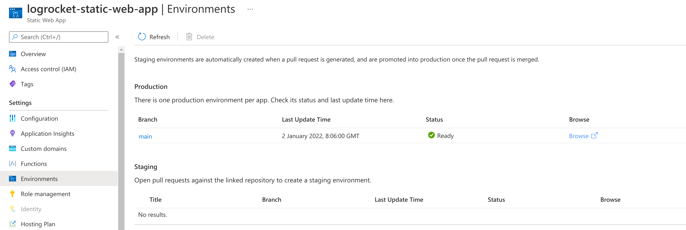
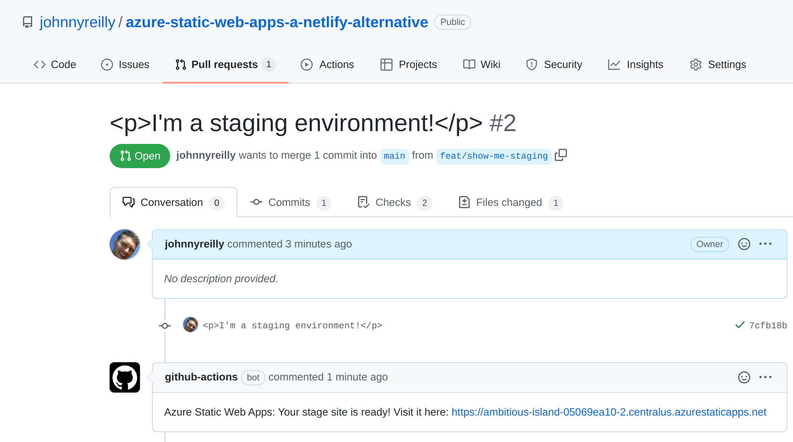

Lighthouse is a tremendous tool for auditing the performance and usability of websites. Rather than having to perform these audits manually, it's helpful to be able to plug it into your CI pipeline. This post illustrates how to integrate Lighthouse into a GitHub Actions workflow, and report findings directly in pull requests that are raised.


## What we'll do

This post isn't a walkthrough of how to use Lighthouse effectively. There is already [great guidance out there on this topic](https://blog.logrocket.com/lighthouse-and-how-to-use-it-more-effectively/).

Instead, we're going build a simple web application, in the context of a GitHub repo. We'll wire it up to deploy via GitHub Actions to Azure Static Web Apps. Static Web Apps is a free hosting option for static websites and it comes with [staging environments](https://docs.microsoft.com/en-us/azure/static-web-apps/review-publish-pull-requests) or deployment previews built in. This feature deploys a fully functional version of a site each time a pull request is raised, built upon the changes implemented in that pull request.

The staging environment is a perfect place to implement our Lighthouse checks. If a pull request impacts usability or performance, seeing those details in the context of our pull request is exactly where we'd like to learn this. This kind of check gives us the opportunity to ensure we only merge when we're happy that the changes do not negatively impact our Lighthouse scores.

In this post we'll start from the point of an empty GitHub repo and build up from there.

## Create our application

Inside the root of our repository we're going to create a [Docusaurus site](https://docusaurus.io/). Docusaurus is a good example of a static site, the kind of which is a natural fit for Jamstack. We could equally use something else like [Hugo](https://gohugo.io/) for instance.

At the command line we'll enter:

```shell
npx create-docusaurus@latest website classic
```

And Docusaurus will create a new site in the `website` directory. Let's commit and push this and turn our attention to Azure.

## Creating a Static Web App in Azure

There's a number of ways to create a Static Web App in Azure. It's possible to use [infrastructure as code with a language like Bicep](https://blog.johnnyreilly.com/2021/08/15/bicep-azure-static-web-apps-azure-devops#bicep-template). But for this post let's use the [Azure Portal](https://portal.azure.com) instead. If you don't have an account already, you can set one up for free very quickly.

Once you've logged in, click "Create a resource" and look up Static Web App:


Click on "Create" and you'll be take to the creation dialog:


You'll need to create a resource group for your SWA to live in, give the app a name, the "Free" plan and a deployment source of GitHub.

Click on the "Sign in with GitHub" button and authorize Azure to access your GitHub account for Static Web Apps.


At this point Azure will query GitHub on your behalf and look up the organisations and repositories you have access to. Select the repository that you'd like to deploy to your Static Web App and select the branch you'd like to deploy.

You also need to provide Azure with some build details that help it understand how your app is built. We'll provide a preset of "Custom". We'll set the "App location" (the root of our front end app) to be `"/website"` to tally up with the application we just created. We'll leave "Api location" blank and we'll set the output location to be `"build"` - this is the directory under `website` where Docusaurus will create our site.

Finally click "Review + create" and then "Create".

Azure will now:

- Create an Azure Static Web app resource in Azure
- Update your repository to add a GitHub Actions workflow to deploy your static web app
- Kick off a first run of the GitHub Actions workflow to deploy your SWA.

Pretty amazing, right?

When you look at the resource in Azure it will look something like this:


If you click on the GitHub Action runs you'll be presented with your GitHub Action:


And when that finishes running you'll be able to see your deployed Static Web App by clicking on the URL in the Azure Portal:


We now have:

- a GitHub repo
- which contains a simple web application
- and a GitHub Actions workflow which:
  - deploys to an Azure Static Web App
  - spins up a staging environment for pull requests

## Staging Environments

Finally, let's look at a super cool feature that Static Web Apps provides by default. If you take a look at the Environments tab of your SWA you'll see this:



> ## Staging
>
> Open pull requests against the linked repository to create a staging environment.

Let's try that out! We'll create a new branch:

```shell
git checkout -b feat/show-me-staging
```

In our `index.js` we'll add an arbitrary piece of text:

```jsx
<p>I'm a staging environment!</p>
```

Then we'll commit and push our branch to GitHub and create a pull request. This triggers our GitHub Action to run once again. But this time, rather than publishing over our existing Static Web App, it's going to spin up a brand new one with our changes in. Not only that, it's going to put a link for us in our GitHub pull request so we can browse straight to it:



This is the equivalent of Netlify Deploy Previews, implemented with Azure Static Web Apps and GitHub Actions. Given the allowances for GitHub Actions currently sit at [2,000 free minutes per month](https://docs.github.com/en/billing/managing-billing-for-github-actions/about-billing-for-github-actions) as compared with Netlify's [300 free minutes per month](https://www.netlify.com/pricing/), you're less likely to receive a bill for using Static Web Apps.

This staging environment will last only until the pull request is closed. At that point the environment is torn down by the GitHub Action.

## Conclusion

In this post we've deployed a website to a Static Web App using GitHub Actions and implemented authentication. We've also demonstrated Azure's equivalent of Netlify's deploy previews; staging environments.

[This post was originally published on LogRocket.](https://blog.logrocket.com/azure-static-web-apps-netlify-alternative/)
