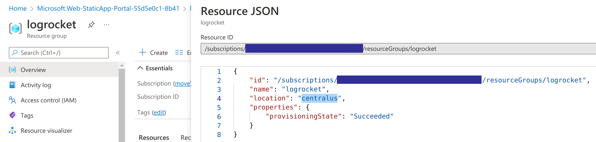
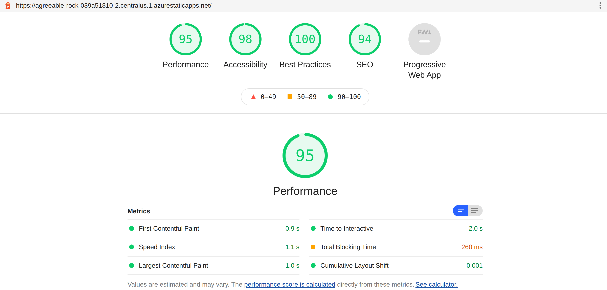

Lighthouse is a tremendous tool for auditing the performance and usability of websites. Rather than having to perform these audits manually, it's helpful to be able to plug it into your CI pipeline. This post illustrates how to integrate Lighthouse into a GitHub Actions workflow for an Azure Static Web App, and report findings directly in pull requests that are raised.


<!--truncate-->

## What we'll do

This post isn't a walkthrough of how to use Lighthouse effectively. There is already [great guidance out there on this topic](https://blog.logrocket.com/lighthouse-and-how-to-use-it-more-effectively/).

Instead, we're going build a simple web application, in the context of a GitHub repo. We'll wire it up to deploy via GitHub Actions to Azure Static Web Apps. Static Web Apps is a free hosting option for static websites and it comes with [staging environments](https://docs.microsoft.com/en-us/azure/static-web-apps/review-publish-pull-requests) or deployment previews built in. This feature deploys a fully functional version of a site each time a pull request is raised, built upon the changes implemented in that pull request.

The staging environment is a perfect place to implement our Lighthouse checks. If a pull request impacts usability or performance, seeing those details in the context of our pull request is exactly where we'd like to learn this. This kind of check gives us the opportunity to ensure we only merge when we're happy that the changes do not negatively impact our Lighthouse scores.

In this post we'll start from the point of an empty GitHub repo and build up from there.

## Create our application

Inside the root of our repository we're going to create a [Docusaurus site](https://docusaurus.io/). Docusaurus is a good example of a static site, the kind of which is a natural fit for Jamstack. We could equally use something else like [Hugo](https://gohugo.io/) for instance.

At the command line we'll enter:

```shell
npx create-docusaurus@latest website classic
```

And Docusaurus will create a new site in the `website` directory. Let's commit and push this and turn our attention to Azure.

## Creating a Static Web App in Azure

There's a number of ways to create a Static Web App in Azure. It's possible to use [infrastructure as code with a language like Bicep](https://johnnyreilly.com/2021/08/15/bicep-azure-static-web-apps-azure-devops#bicep-template). But for this post let's use the [Azure Portal](https://portal.azure.com) instead. If you don't have an account already, you can set one up for free very quickly.

Once you've logged in, click "Create a resource" and look up Static Web App:


Click on "Create" and you'll be take to the creation dialog:


You'll need to create a resource group for your SWA to live in, give the app a name, the "Free" plan and a deployment source of GitHub.

Click on the "Sign in with GitHub" button and authorize Azure to access your GitHub account for Static Web Apps.


At this point Azure will query GitHub on your behalf and look up the organisations and repositories you have access to. Select the repository that you'd like to deploy to your Static Web App and select the branch you'd like to deploy.

You also need to provide Azure with some build details that help it understand how your app is built. We'll provide a preset of "Custom". We'll set the "App location" (the root of our front end app) to be `"/website"` to tally up with the application we just created. We'll leave "Api location" blank and we'll set the output location to be `"build"` - this is the directory under `website` where Docusaurus will create our site.

Finally click "Review + create" and then "Create".

Azure will now:

- Create an Azure Static Web app resource in Azure
- Update your repository to add a GitHub Actions workflow to deploy your static web app
- Kick off a first run of the GitHub Actions workflow to deploy your SWA.

Pretty amazing, right?

When you look at the resource in Azure it will look something like this:


If you click on the GitHub Action runs you'll be presented with your GitHub Action:


And when that finishes running you'll be able to see your deployed Static Web App by clicking on the URL in the Azure Portal:


We now have:

- a GitHub repo
- which contains a simple web application
- and a GitHub Actions workflow which:
  - deploys to an Azure Static Web App
  - spins up a staging environment for pull requests

## Preparing to plug in Lighthouse

With this groundwork in place we're ready to add Lighthouse into the mix. If you look in the `/.github/workflows` folder of your repo, you'll find a workflow file with contents along these lines:

```yml
name: Azure Static Web Apps CI/CD

on:
  push:
    branches:
      - main
  pull_request:
    types: [opened, synchronize, reopened, closed]
    branches:
      - main

jobs:
  build_and_deploy_job:
    if: github.event_name == 'push' || (github.event_name == 'pull_request' && github.event.action != 'closed')
    runs-on: ubuntu-latest
    name: Build and Deploy Job
    steps:
      - uses: actions/checkout@v2
        with:
          submodules: true

      - name: Build And Deploy
        id: builddeploy
        uses: Azure/static-web-apps-deploy@v1
        with:
          azure_static_web_apps_api_token: ${{ secrets.AZURE_STATIC_WEB_APPS_API_TOKEN_AGREEABLE_ROCK_039A51810 }}
          repo_token: ${{ secrets.GITHUB_TOKEN }} # Used for Github integrations (i.e. PR comments)
          action: 'upload'
          ###### Repository/Build Configurations - These values can be configured to match your app requirements. ######
          # For more information regarding Static Web App workflow configurations, please visit: https://aka.ms/swaworkflowconfig
          app_location: '/website' # App source code path
          api_location: '' # Api source code path - optional
          output_location: 'build' # Built app content directory - optional
          ###### End of Repository/Build Configurations ######

  close_pull_request_job:
    if: github.event_name == 'pull_request' && github.event.action == 'closed'
    runs-on: ubuntu-latest
    name: Close Pull Request Job
    steps:
      - name: Close Pull Request
        id: closepullrequest
        uses: Azure/static-web-apps-deploy@v1
        with:
          azure_static_web_apps_api_token: ${{ secrets.AZURE_STATIC_WEB_APPS_API_TOKEN_AGREEABLE_ROCK_039A51810 }}
          action: 'close'
```

This was created for us when we set up our SWA in Azure. We're now going to update the contents to add some Lighthouse jobs.

Before we do that, we need to acquire two things:

1. the custom domain of our static web app
2. the location of the resource group where the SWA resides

These two pieces of information are required such that we can determine the URL of our staging environments.

### Custom domain

We acquire the custom domain of our static web app in the "Custom Domains" screen of the Azure Portal:


The custom domain is the auto-generated custom domain - it's highlighted in the screenshot above. For the SWA we're building here the custom domain is `agreeable-rock-039a51810.1.azurestaticapps.net`.

### Location

We acquire the location by looking at the resource group in the Azure Portal. For the SWA we've been building the location is "Central US". However, rather than the "display name" variant of the location, what we want is the "code" which will be used in the URL. You can see what this is by clicking on the "JSON view" in the Azure Portal:



As the screenshot above demonstrates, the code we need is `centralus`.

## Plugging in Lighthouse

We now have all we need to plug in Lighthouse. Let's create a branch:

```shell
git checkout -b lighthouse
```

We're going to add a new "Lighthouse report" job to our GitHub Actions workflow file:

```yml
env:
  RESOURCE_GROUP: rg-blog-johnnyreilly-com
  LOCATION: westeurope
  STATICWEBAPPNAME: blog.johnnyreilly.com

lighthouse_report_job:
  name: Lighthouse report
  if: github.event_name == 'pull_request' && github.event.action != 'closed'
  runs-on: ubuntu-latest
  steps:
    - uses: actions/checkout@v2

    # Auth between GitHub and Azure is handled by https://github.com/jongio/github-azure-oidc
    # https://github.com/Azure/login#sample-workflow-that-uses-azure-login-action-using-oidc-to-run-az-cli-linux
    # other login options are possible too
    - name: AZ CLI login 🔑
      uses: azure/login@v1
      with:
        client-id: ${{ secrets.AZURE_CLIENT_ID }}
        tenant-id: ${{ secrets.AZURE_TENANT_ID }}
        subscription-id: ${{ secrets.AZURE_SUBSCRIPTION_ID }}

    - name: Static Web App - get preview URL
      id: static_web_app_preview_url
      uses: azure/CLI@v2
      with:
        inlineScript: |
          DEFAULTHOSTNAME=$(az staticwebapp show -n '${{ env.STATICWEBAPPNAME }}' | jq -r '.defaultHostname')

          PREVIEW_URL="https://${DEFAULTHOSTNAME/.[1-9]./-${{github.event.pull_request.number }}.${{ env.LOCATION }}.1.}"

          echo "PREVIEW_URL=$PREVIEW_URL" >> $GITHUB_OUTPUT

    - name: Static Web App - wait for preview
      id: static_web_app_wait_for_preview
      uses: nev7n/wait_for_response@v1
      with:
        url: '${{ steps.static_web_app_preview_url.outputs.PREVIEW_URL }}'
        responseCode: 200
        timeout: 600000
        interval: 1000

    - name: Audit URLs using Lighthouse
      id: lighthouse_audit
      uses: treosh/lighthouse-ci-action@v8
      with:
        urls: |
          ${{ steps.static_web_app_preview_url.outputs.PREVIEW_URL }}
        configPath: ./.github/workflows/lighthousesrc.json
        uploadArtifacts: true
        temporaryPublicStorage: true
        runs: 5

    - name: Format lighthouse score
      id: format_lighthouse_score
      uses: actions/github-script@v5
      with:
        script: |
          const lighthouseCommentMaker = require('./.github/workflows/lighthouseCommentMaker.js');

          const lighthouseOutputs = {
            manifest: ${{ steps.lighthouse_audit.outputs.manifest }},
            links: ${{ steps.lighthouse_audit.outputs.links }}
          };

          const comment = lighthouseCommentMaker({ lighthouseOutputs });
          core.setOutput("comment", comment);

    - name: Add Lighthouse stats as comment
      id: comment_to_pr
      uses: marocchino/sticky-pull-request-comment@v2.0.0
      with:
        GITHUB_TOKEN: ${{ secrets.GITHUB_TOKEN }}
        number: ${{ github.event.pull_request.number }}
        header: lighthouse
        message: ${{ steps.format_lighthouse_score.outputs.comment }}
```

There's a number of things happening in this workflow. Let's walk through them.

### Static Web App - get preview URL

Here we acquire the preview URL of our static web app using:

- the default host name of the static web app
- the location
- the pull request number eg 123

Given a default host name of `agreeable-rock-039a51810`, a location of `centralus` and a pull request number of `123`, the preview url would be `agreeable-rock-039a51810-123.centralus.1.azurestaticapps.net`. Using a little bash magic we create an output variable named `PREVIEW_URL` containing that value. We'll re-use it later in the workflow.

### Static Web App - wait for preview

We don't want to run our test until the static web app is up and running. To cater for this we're going to pull in the [`wait_for_response`](https://github.com/nev7n/wait_for_response) GitHub Action. This polls until a website returns a `200`, we're going to point it at our SWA.

### Audit URLs using Lighthouse

The big moment has arrived! We're going to plug Lighthouse into our workflow using the [`lighthouse-ci-action`](https://github.com/treosh/lighthouse-ci-action) GitHub Action.

We provide a `configPath: ./.github/workflows/lighthousesrc.json` which points to file that configures our Lighthouse configuration. We'll create that file as well and populate it with this:

```json
{
  "ci": {
    "collect": {
      "settings": {
        "configPath": "./.github/workflows/lighthouse-config.js"
      }
    }
  }
}
```

This in turn hands off the specific configuration to a `lighthouse-config.js` file that we also need to create:

```js
// see https://github.com/GoogleChrome/lighthouse/blob/master/docs/configuration.md
module.exports = {
  extends: 'lighthouse:default',
  settings: {
    // audits can be found here:
    // https://github.com/GoogleChrome/lighthouse/blob/eba2a4d19c5786dc37e993858ff4b663181f81e5/lighthouse-core/config/default-config.js#L174
    skipAudits: [
      'canonical', // for staging sites this will always be incorrect
      'maskable-icon',
      'valid-source-maps',
      'unsized-images',
      'offline-start-url',
    ],
  },
};
```

The configuration above can be amended based upon the various links in the comments. Generally it's a good idea to roll with the defaults; however skipping the `canonical` audit is sensible as it will reliably be incorrect for staging sites.

Along side the Lighthouse configuration, there's config for the GitHub Action itself:

- `uploadArtifacts: true` - will save results as an action artifacts
- `temporaryPublicStorage: true` - will upload lighthouse report to the temporary storage
- `runs: 5` - will run Lighthouse 5 times to get more reliable performance results

### Format lighthouse score

We've run Lighthouse at this point. What we want to do next is take the results of the run and build up some text that we can add to our pull request as a comment.

For this we're going to use the [`github-script`](https://github.com/actions/github-script) GitHub Action, grab the outputs of the previous step and call out to a `lighthouseCommentMaker.js` file we're going to write to make the comment we'd like to publish to our PR:

```js
// @ts-check

/**
 * @typedef {Object} Summary
 * @prop {number} performance
 * @prop {number} accessibility
 * @prop {number} best-practices
 * @prop {number} seo
 * @prop {number} pwa
 */

/**
 * @typedef {Object} Manifest
 * @prop {string} url
 * @prop {boolean} isRepresentativeRun
 * @prop {string} htmlPath
 * @prop {string} jsonPath
 * @prop {Summary} summary
 */

/**
 * @typedef {Object} LighthouseOutputs
 * @prop {Record<string, string>} links
 * @prop {Manifest[]} manifest
 */

const formatScore = (/** @type { number } */ score) => Math.round(score * 100);
const emojiScore = (/** @type { number } */ score) =>
  score >= 0.9 ? '🟢' : score >= 0.5 ? '🟠' : '🔴';

const scoreRow = (
  /** @type { string } */ label,
  /** @type { number } */ score,
) => `| ${emojiScore(score)} ${label} | ${formatScore(score)} |`;

/**
 * @param {LighthouseOutputs} lighthouseOutputs
 */
function makeComment(lighthouseOutputs) {
  const { summary } = lighthouseOutputs.manifest[0];
  const [[testedUrl, reportUrl]] = Object.entries(lighthouseOutputs.links);

  const comment = `## ⚡️🏠 Lighthouse report

We ran Lighthouse against the changes and produced this [report](${reportUrl}). Here's the summary:

| Category | Score |
| -------- | ----- |
${scoreRow('Performance', summary.performance)}
${scoreRow('Accessibility', summary.accessibility)}
${scoreRow('Best practices', summary['best-practices'])}
${scoreRow('SEO', summary.seo)}
${scoreRow('PWA', summary.pwa)}

*Lighthouse ran against [${testedUrl}](${testedUrl})*
`;

  return comment;
}

module.exports = ({ lighthouseOutputs }) => {
  return makeComment(lighthouseOutputs);
};
```

The above code takes the Lighthouse outputs and creates some Markdown to represent the results. It uses some nice emoji as well. Wonderfully, we're entirely free to customise this as much as we'd like; it's just code! All that matters is that a string is pumped out at the end.

### Add Lighthouse stats as comment

Finally we're ready to add the comment to the PR. We'll do this using the [`sticky-pull-request-comment`](https://github.com/marocchino/sticky-pull-request-comment) GitHub Action. We pass in the comment we've just made in the previous step, as well as some other parameters, and this will write the comment to the PR.

## Putting it all together

When we commit our changes and raise a pull request, we see our GitHub Action run, and then once it has we see a Lighthouse report being attached to our pull request:


Note you can also click on a link in the comment to go directly to the full report.



Now, with each PR that is raised, any regressions in performance can be observed and resolved _before_ they make get in front of customer's eyes!

[This post was originally published on LogRocket.](https://blog.logrocket.com/lighthouse-meets-github-actions-use-lighthouse-ci/)

<head>
    <link rel="canonical" href="https://blog.logrocket.com/lighthouse-meets-github-actions-use-lighthouse-ci/" />
</head>
