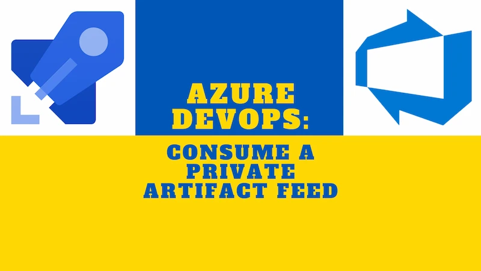

Private Azure Artifact feeds in in Azure DevOps can be used to serve NuGet packages. To build applications both locally and in an Azure Pipeline using those packages, there are a few steps to follow which this post will demonstrate.



<!--truncate-->

## Make a `nuget.config`

To consume a private feed, you'll likely want to create a `nuget.config` file in the root of your repo. Here you list the package sources you want to consume, typically the NuGet official package source _as well_ as your private feed. See the example below:

```xml
<?xml version="1.0" encoding="utf-8"?>
  <configuration>
    <packageSources>
      <add key="NuGet official package source" value="https://api.nuget.org/v3/index.json" />
      <add key="my-nuget-packages" value="https://pkgs.dev.azure.com/my-org/_packaging/my-nuget-packages/nuget/v3/index.json" />
    </packageSources>
  </configuration>
```

## Consuming a private feed locally with the Azure Artifacts Credential Provider

With our `nuget.config` in place, can we build locally? Yes, once we've authenticated. If you're using Rider or Visual Studio, these may take care of this for you. However, if you're using VS Code you might need to do something else.

If you experience 401's when you run `dotnet restore` like so:

```shell
error : Unable to load the service index for source https://pkgs.dev.azure.com/my-org/_packaging/not-there/nuget/v3/index.json. [/dev.azure.com/project/repo/src/App.csproj]
error : Response status code does not indicate success: 401
```

Then it's probably a sign you need to install the [Azure Artifacts Credential Provider](https://github.com/Microsoft/artifacts-credprovider). With that you should be able to restore nuget packages. See instructions [here](https://github.com/Microsoft/artifacts-credprovider#setup).

On Linux and Mac this is as simple as running `sh -c "$(curl -fsSL https://aka.ms/install-artifacts-credprovider.sh)"` in your terminal.

Subsequently, running `dotnet restore --interactive` should trigger an authentication flow in the terminal, and subject to successful authentication, restore packages from the private feed.

## Consuming a private feed in Azure Pipelines

You will need to authenticate within your pipeline before you can acquire your private feed packages. This is as simple as this:

```yml
- task: NuGetAuthenticate@0
```

Before building / publishing or running tests, you must first explicitly `dotnet restore` and provide the path to the `nuget.config`. You can do this with the dedicated [.NET Core CLI task](https://docs.microsoft.com/en-us/azure/devops/pipelines/tasks/build/dotnet-core-cli) task like so:

```yml
- task: DotNetCoreCLI@2
  displayName: 'dotnet restore'
  inputs:
    command: 'restore'
    projects: 'src/App/App.csproj'
    nugetConfigPath: '../../nuget.config'
    feedsToUse: config
```

## The publish gotcha

On occasion, it can happen that Azure Pipelines doesn't seem to be happy running a publish task with private feeds. Consider, a task like this:

```yml
- task: DotNetCoreCLI@2
  displayName: 'dotnet publish'
  inputs:
    command: publish
    arguments: '--configuration Release --output $(Build.ArtifactStagingDirectory)/${{parameters.artifactName}} /p:SourceRevisionId=$(Build.SourceVersion)'
    zipAfterPublish: true
    publishWebProjects: false
    workingDirectory: src/App
```

This can result in non-actionable errors like this:

> `##[error]Error: There was an error when attempting to execute the process '/opt/hostedtoolcache/dotnet/dotnet'. This may indicate the process failed to start. Error: spawn /opt/hostedtoolcache/dotnet/dotnet ENOENT`

A workaround in this situation is to invoke .NET through a bash script directly like so:

```yml
- bash: |
    cd src/App
    dotnet --list-sdks
    echo ""
    echo "**************"
    echo "dotnet restore --configfile ../../nuget.config"
    dotnet restore --configfile ../../nuget.config
    echo ""
    echo "**************"
    echo "dotnet build --configuration Release --no-restore"
    dotnet build --configuration Release
    echo ""
    echo "**************"
    echo "dotnet publish --configuration Release --no-restore --output $(Build.ArtifactStagingDirectory)/App /p:SourceRevisionId=$(Build.SourceVersion)"
    dotnet publish --configuration Release --no-restore --output $(Build.ArtifactStagingDirectory)/App /p:SourceRevisionId=$(Build.SourceVersion)
  displayName: 'dotnet publish'

- task: ArchiveFiles@2
  displayName: 'Create $(Build.ArtifactStagingDirectory)/App.zip'
  inputs:
    rootFolderOrFile: '$(Build.ArtifactStagingDirectory)/App'
    includeRootFolder: false
    archiveFile: '$(Build.ArtifactStagingDirectory)/App.zip'
```

And note that after publishing we use the [Archive Files task](https://docs.microsoft.com/en-us/azure/devops/pipelines/tasks/utility/archive-files) to zip up the output of our publishing.

You may be tempted to use the zip command line utility to make your zip. Do not do this. I did this. I learned, through no small amount of suffering, that there is a problem with this. Whilst you can make a zip this way that will be consumed happily by Mac and OSX, when it comes to being deployed to Azure (even if you're deploying to Linux within Azure) via zip deploy it will not work. I can't tell you why, just that it won't. So use the dedicated task.

## Summing up

And that's it; with these approaches in place you should be able to build applications consuming privage NuGet feeds with ease.
