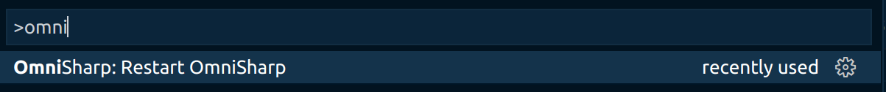
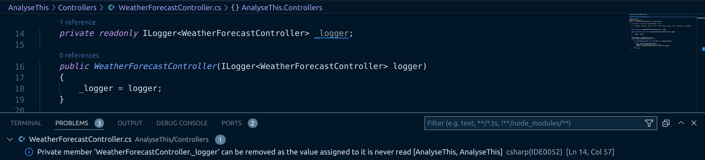

ESLint provides a great linting experience for TypeScript and JavaScript in VS Code. The suggestions, fixes and ignore options make creating clean code a joy. A similar experience is available for C# in VS Code through Roslyn Analyzers - this post tells us more.


<!--truncate-->

## Linting and C#

JavaScript and TypeScript benefit from a tremendous tooling ecosystem which allows us to simply format and lint our codebases as we're editing. Similar tooling exists for C#. [Previously I wrote about using `dotnet-format` to have a Prettier-like experience for formatting our C#](../2020-12-22-prettier-your-csharp-with-dotnet-format-and-lint-staged/index.md). If that last post focussed on formatting C#; looking through the lens of [Prettier](https://prettier.io/), this post focusses on linting; looking through the lens of [ESLint](https://eslint.org/).

## Roslyn Analyzers

There's often overlap between linting and formatting tooling; and so it goes with C# as well. Linting and formatting in the .NET space make use of the [Roslyn Analyzers](https://github.com/dotnet/roslyn-analyzers):

> Roslyn analyzers analyze your code for style, quality and maintainability, design and other issues. The documentation for Roslyn Analyzers can be found at docs.microsoft.com/dotnet/fundamentals/code-analysis/overview.

To learn more about them, it's worth reading [the excellent piece on the topic](https://endjin.com/blog/2022/01/raising-coding-standard-dotnet-analyzers) by [Ian Griffiths](https://twitter.com/idg10).

## "Analyse `this`"

In order that we can see what the linting experience is like in VS Code, we're going to need a project to work on. We have the .NET 6 SDK installed, so we'll create ourselves a project:

```shell
dotnet new webapi -o AnalyseThis
```

We have the [C# extension](https://marketplace.visualstudio.com/items?itemName=ms-dotnettools.csharp) installed already, but we're getting no feedback on the code. Maybe it's already beautiful?

Or maybe not. We're going to need an `.editorconfig` file to control all the code style settings. You can create this directly using the `dotnet` CLI like so;

```shell
dotnet new editorconfig
```

Once this runs, it creates a file with all of the settings in with their default values. Alongside that, we need to wake VS Code up to our brave new world by setting the following in our `settings.json`:

```json
{
  "omnisharp.enableRoslynAnalyzers": true,
  "omnisharp.enableEditorConfigSupport": true
}
```

Or alternatively, use the GUI in VS Code to set these settings directly:


It's then a good idea to turn OmniSharp off and on again, so it picks up these changes:



Then, excitingly, we start to see code analysis, or linting, messages in the problems pane of VS Code:



It's possible to use the `dotnet-format` command to surface this information:

```shell
dotnet format style -v detailed --severity info --verify-no-changes
  The dotnet runtime version is '6.0.2'.
  Formatting code files in workspace '/workspaces/AnalyseThis.csproj'.
    Determining projects to restore...
  All projects are up-to-date for restore.
  Project AnalyseThis is using configuration from '/workspaces/.editorconfig'.
  Project AnalyseThis is using configuration from '/workspaces/obj/Debug/net6.0/AnalyseThis.GeneratedMSBuildEditorConfig.editorconfig'.
  Project AnalyseThis is using configuration from '/usr/share/dotnet/sdk/6.0.200/Sdks/Microsoft.NET.Sdk/analyzers/build/config/analysislevel_6_default.editorconfig'.
  Running 45 analyzers on AnalyseThis.
/workspaces/Controllers/WeatherForecastController.cs(14,57): info IDE0052: Private member 'WeatherForecastController._logger' can be removed as the value assigned to it is never read [/workspaces/AnalyseThis.csproj]
  Formatted code file '/workspaces/Controllers/WeatherForecastController.cs'.
  Formatted 1 of 6 files.
  Format complete in 7993ms.
```

Note the `IDE0052: Private member 'WeatherForecastController._logger' can be removed as the value assigned to it is never read` message above.

## Now fail my build!

This is all very exciting - we've a world of extra linting at our fingertips! But what's a touch disappointing, is that the above information isn't surfaced in my build. What if as a team we commit to a particular code style? If I can't enforce that in the build, it's likely not going to happen.

So what do I do? Well, the information is out there on how to do this, but it's easy to miss. [You can find the details here](https://docs.microsoft.com/en-us/dotnet/fundamentals/code-analysis/overview#enable-on-build). We update our `AnalyseThis.csproj` to include an `EnforceCodeStyleInBuild` setting like so:

```xml
  <PropertyGroup>
    <TargetFramework>net6.0</TargetFramework>
    <Nullable>enable</Nullable>
    <ImplicitUsings>enable</ImplicitUsings>

    <EnforceCodeStyleInBuild>true</EnforceCodeStyleInBuild>
  </PropertyGroup>
```

We're going to replace our exhaustive `.editorconfig` file with a much simpler one:

```ini
# Remove the line below if you want to inherit .editorconfig settings from higher directories
root = true

[*.cs]
# Default severity for analyzer diagnostics with category 'Style' (escalated to build warnings)
dotnet_analyzer_diagnostic.category-Style.severity = warning
```

Do you see what we did here? We told our build to treat `Style` diagnostics (lints) as warnings. Once OmniSharp picks this up, more linting messages start to appear in the problems pane of VS Code:


And what's more, if we attempt to build, guess what?

```shell
dotnet build
Microsoft (R) Build Engine version 17.1.0+ae57d105c for .NET
Copyright (C) Microsoft Corporation. All rights reserved.

  Determining projects to restore...
  All projects are up-to-date for restore.
/workspaces/AnalyseThis/Controllers/WeatherForecastController.cs(3,1): warning IDE0160: Convert to block scoped namespace [/workspaces/AnalyseThis/AnalyseThis.csproj]
/workspaces/AnalyseThis/WeatherForecast.cs(1,1): warning IDE0160: Convert to block scoped namespace [/workspaces/AnalyseThis/AnalyseThis.csproj]
/workspaces/AnalyseThis/Program.cs(1,1): warning IDE0008: Use explicit type instead of 'var' [/workspaces/AnalyseThis/AnalyseThis.csproj]
/workspaces/AnalyseThis/Program.cs(10,1): warning IDE0008: Use explicit type instead of 'var' [/workspaces/AnalyseThis/AnalyseThis.csproj]
/workspaces/AnalyseThis/Program.cs(15,5): warning IDE0058: Expression value is never used [/workspaces/AnalyseThis/AnalyseThis.csproj]
/workspaces/AnalyseThis/Program.cs(16,5): warning IDE0058: Expression value is never used [/workspaces/AnalyseThis/AnalyseThis.csproj]
  AnalyseThis -> /workspaces/AnalyseThis/bin/Debug/net6.0/AnalyseThis.dll

Build succeeded.

/workspaces/AnalyseThis/Controllers/WeatherForecastController.cs(3,1): warning IDE0160: Convert to block scoped namespace [/workspaces/AnalyseThis/AnalyseThis.csproj]
/workspaces/AnalyseThis/WeatherForecast.cs(1,1): warning IDE0160: Convert to block scoped namespace [/workspaces/AnalyseThis/AnalyseThis.csproj]
/workspaces/AnalyseThis/Program.cs(1,1): warning IDE0008: Use explicit type instead of 'var' [/workspaces/AnalyseThis/AnalyseThis.csproj]
/workspaces/AnalyseThis/Program.cs(10,1): warning IDE0008: Use explicit type instead of 'var' [/workspaces/AnalyseThis/AnalyseThis.csproj]
/workspaces/AnalyseThis/Program.cs(15,5): warning IDE0058: Expression value is never used [/workspaces/AnalyseThis/AnalyseThis.csproj]
/workspaces/AnalyseThis/Program.cs(16,5): warning IDE0058: Expression value is never used [/workspaces/AnalyseThis/AnalyseThis.csproj]
    6 Warning(s)
    0 Error(s)

Time Elapsed 00:00:06.53
```

That's right! The same messages from the problems pane are now surfaced in our build as warnings. And we can kick it up a notch too; let's make them errors:

```ini
# Remove the line below if you want to inherit .editorconfig settings from higher directories
root = true

[*.cs]
# Default severity for analyzer diagnostics with category 'Style' (escalated to build errors)
dotnet_analyzer_diagnostic.category-Style.severity = error
```

Once OmniSharp catches up we see our warnings transform into errors:


And if we build...

```shell
dotnet build
Microsoft (R) Build Engine version 17.1.0+ae57d105c for .NET
Copyright (C) Microsoft Corporation. All rights reserved.

  Determining projects to restore...
  All projects are up-to-date for restore.
/workspaces/AnalyseThis/WeatherForecast.cs(1,1): error IDE0160: Convert to block scoped namespace [/workspaces/AnalyseThis/AnalyseThis.csproj]
/workspaces/AnalyseThis/Controllers/WeatherForecastController.cs(3,1): error IDE0160: Convert to block scoped namespace [/workspaces/AnalyseThis/AnalyseThis.csproj]
/workspaces/AnalyseThis/Program.cs(1,1): error IDE0008: Use explicit type instead of 'var' [/workspaces/AnalyseThis/AnalyseThis.csproj]
/workspaces/AnalyseThis/Program.cs(10,1): error IDE0008: Use explicit type instead of 'var' [/workspaces/AnalyseThis/AnalyseThis.csproj]
/workspaces/AnalyseThis/Program.cs(15,5): error IDE0058: Expression value is never used [/workspaces/AnalyseThis/AnalyseThis.csproj]
/workspaces/AnalyseThis/Program.cs(16,5): error IDE0058: Expression value is never used [/workspaces/AnalyseThis/AnalyseThis.csproj]

Build FAILED.

/workspaces/AnalyseThis/WeatherForecast.cs(1,1): error IDE0160: Convert to block scoped namespace [/workspaces/AnalyseThis/AnalyseThis.csproj]
/workspaces/AnalyseThis/Controllers/WeatherForecastController.cs(3,1): error IDE0160: Convert to block scoped namespace [/workspaces/AnalyseThis/AnalyseThis.csproj]
/workspaces/AnalyseThis/Program.cs(1,1): error IDE0008: Use explicit type instead of 'var' [/workspaces/AnalyseThis/AnalyseThis.csproj]
/workspaces/AnalyseThis/Program.cs(10,1): error IDE0008: Use explicit type instead of 'var' [/workspaces/AnalyseThis/AnalyseThis.csproj]
/workspaces/AnalyseThis/Program.cs(15,5): error IDE0058: Expression value is never used [/workspaces/AnalyseThis/AnalyseThis.csproj]
/workspaces/AnalyseThis/Program.cs(16,5): error IDE0058: Expression value is never used [/workspaces/AnalyseThis/AnalyseThis.csproj]
    0 Warning(s)
    6 Error(s)

Time Elapsed 00:00:04.22
```

Yes! Our style diagnostics are now failing the build. This is terrific!

## Categories

It's worth pausing a second and considering the category upgrade we did here:

```ini
dotnet_analyzer_diagnostic.category-Style.severity = error
```

There's a number of different categories that encapsulate groups of rules, [they're documented here](https://docs.microsoft.com/en-us/dotnet/fundamentals/code-analysis/categories). Taken from there you can see the wealth of different categories that exist:

| Category                               | Description                                                                                                                                                                              | EditorConfig value                                              |
| -------------------------------------- | ---------------------------------------------------------------------------------------------------------------------------------------------------------------------------------------- | --------------------------------------------------------------- |
| Design rules                           | Design rules support adherence to the .NET Framework Design Guidelines.                                                                                                                  | `dotnet_analyzer_diagnostic.category-Design.severity`           |
| Documentation rules                    | Documentation rules support writing well-documented libraries through the correct use of XML documentation comments for externally visible APIs.                                         | `dotnet_analyzer_diagnostic.category-Documentation.severity`    |
| Globalization rules                    | Globalization rules support world-ready libraries and applications.                                                                                                                      | `dotnet_analyzer_diagnostic.category-Globalization.severity`    |
| Portability and interoperability rules | Portability rules support portability across different platforms. Interoperability rules support interaction with COM clients.                                                           | `dotnet_analyzer_diagnostic.category-Interoperability.severity` |
| Maintainability rules                  | Maintainability rules support library and application maintenance.                                                                                                                       | `dotnet_analyzer_diagnostic.category-Maintainability.severity`  |
| Naming rules                           | Naming rules support adherence to the naming conventions of the .NET design guidelines.                                                                                                  | `dotnet_analyzer_diagnostic.category-Naming.severity`           |
| Performance rules                      | Performance rules support high-performance libraries and applications.                                                                                                                   | `dotnet_analyzer_diagnostic.category-Performance.severity`      |
| SingleFile rules                       | Single-file rules support single-file applications.                                                                                                                                      | `dotnet_analyzer_diagnostic.category-SingleFile.severity`       |
| Reliability rules                      | Reliability rules support library and application reliability, such as correct memory and thread usage.                                                                                  | `dotnet_analyzer_diagnostic.category-Reliability.severity`      |
| Security rules                         | Security rules support safer libraries and applications. These rules help prevent security flaws in your program.                                                                        | `dotnet_analyzer_diagnostic.category-Security.severity`         |
| Style rules                            | Style rules support consistent code style in your codebase. These rules start with the "IDE" prefix.                                                                                     | `dotnet_analyzer_diagnostic.category-Style.severity`            |
| Usage rules                            | Usage rules support proper usage of .NET.                                                                                                                                                | `dotnet_analyzer_diagnostic.category-Usage.severity`            |
| N/A                                    | You can use this EditorConfig value to enable the following rules: IDE0051, IDE0064, IDE0076. While these rules start with "IDE", they are not technically part of the `Style` category. | `dotnet_analyzer_diagnostic.category-CodeQuality.severity`      |

The `IDE0052` information we saw when we used `dotnet format` earlier is technically part of the `CodeQuality` category. If we wanted to, we we could dial that up that category to an error like so:

```ini
# Default severity for analyzer diagnostics with category 'CodeQuality' (escalated to build errors)
dotnet_analyzer_diagnostic.category-CodeQuality.severity = error
```

## Opt out of rules

As it turns out, I disagree with the complaints I'm getting on the codebase right now, so I'd like to dial those down to ignore. To do that globally, you simply put configuration in the `.editorconfig` to reflect that:

```ini
# Remove the line below if you want to inherit .editorconfig settings from higher directories
root = true

[*.cs]
# Default severity for analyzer diagnostics with category 'Style' (escalated to build warnings)
dotnet_analyzer_diagnostic.category-Style.severity = error

dotnet_diagnostic.IDE0008.severity = none
dotnet_diagnostic.IDE0058.severity = none
dotnet_diagnostic.IDE0160.severity = none
```

What we're doing here is saying "upgrade all [style rules](https://docs.microsoft.com/en-us/dotnet/fundamentals/code-analysis/style-rules/) to be errors, but `IDE0008`, `IDE0058` and `IDE0160` (which are style rules) - ignore those; don't tell me about them".

Now I'm not going to be bothered by those errors in future. Great.

## Dial up information to warning

If we look again at our problems pane in VS Code, we can see there's an entry there. It's not an error, it's not a warning. It's information:


Let's say we want to take that and dial it up to be a warning, such that it surfaces in the build too. We can with a simple addition to our `.editorconfig`:

```ini
# Remove the line below if you want to inherit .editorconfig settings from higher directories
root = true

[*.cs]
# Default severity for analyzer diagnostics with category 'Style' (escalated to build warnings)
dotnet_analyzer_diagnostic.category-Style.severity = error

dotnet_diagnostic.IDE0008.severity = none
dotnet_diagnostic.IDE0058.severity = none
dotnet_diagnostic.IDE0160.severity = none

# Roslyn analzer surfaces this as information - we'll dial it up to a warning
dotnet_diagnostic.IDE0052.severity = warning
```

Once OmniSharp notices:


And if we run the build, there it is!

```
dotnet build
Microsoft (R) Build Engine version 17.1.0+ae57d105c for .NET
Copyright (C) Microsoft Corporation. All rights reserved.

  Determining projects to restore...
  All projects are up-to-date for restore.
/workspaces/AnalyseThis/Controllers/WeatherForecastController.cs(14,57): warning IDE0052: Private member 'WeatherForecastController._logger' can be removed as the value assigned to it is never read [/workspaces/AnalyseThis/AnalyseThis.csproj]
  AnalyseThis -> /workspaces/AnalyseThis/bin/Debug/net6.0/AnalyseThis.dll

Build succeeded.

/workspaces/AnalyseThis/Controllers/WeatherForecastController.cs(14,57): warning IDE0052: Private member 'WeatherForecastController._logger' can be removed as the value assigned to it is never read [/workspaces/AnalyseThis/AnalyseThis.csproj]
    1 Warning(s)
    0 Error(s)

Time Elapsed 00:00:02.21
```

## Deactivate linting partially

Let's say we want to ignore that one warning. We'd like the equivalent functionality to `// eslint-disable-next-line`. That doesn't exist alas. However, what does is the equivalent to this:

```js
/* eslint-disable */

alert('foo');

/* eslint-enable */
```

In our case what we'd do is this:

```cs
#pragma warning disable
    private readonly ILogger<WeatherForecastController> _logger;
#pragma warning restore
```

Or to be more specific:

```cs
#pragma warning disable IDE0052
    private readonly ILogger<WeatherForecastController> _logger;
#pragma warning restore IDE0052
```

And now we can opt out of that rule in this specific place - whilst maintaining it more generally.

## Conclusion

There's powerful linting tools in C#, hopefully this guide has made it easier for you to surface them, control them and apply them both to VS Code and to your build.

Thanks to [Joey Robichaud](https://twitter.com/JoeyRobichaud), [Tim Heuer](https://twitter.com/timheuer) and [Youssef Victor](https://twitter.com/YoussefV1313) for some excellent pointers that fed into the writing of this post. [You can see the help they provided here](https://github.com/dotnet/roslyn/issues/60620).
