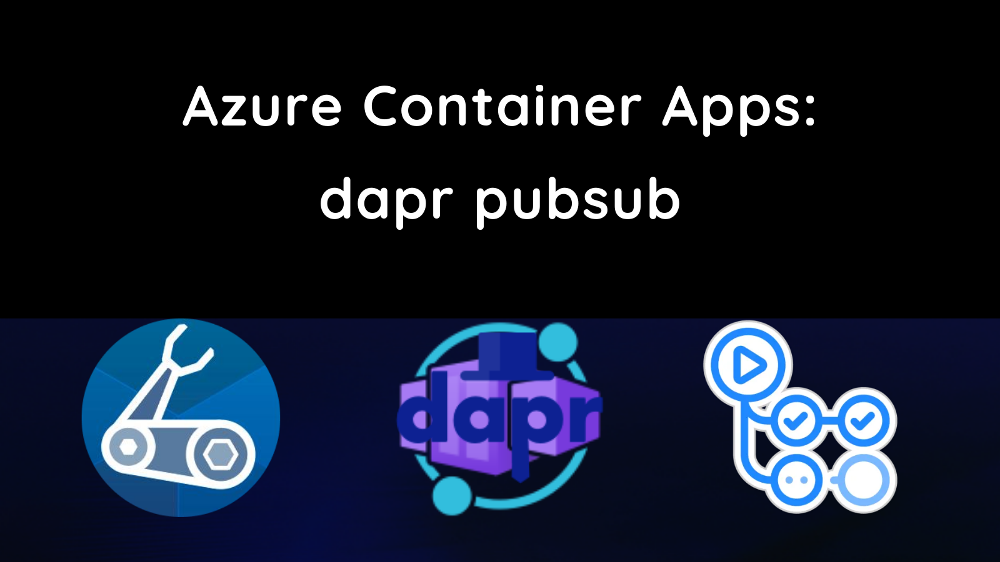
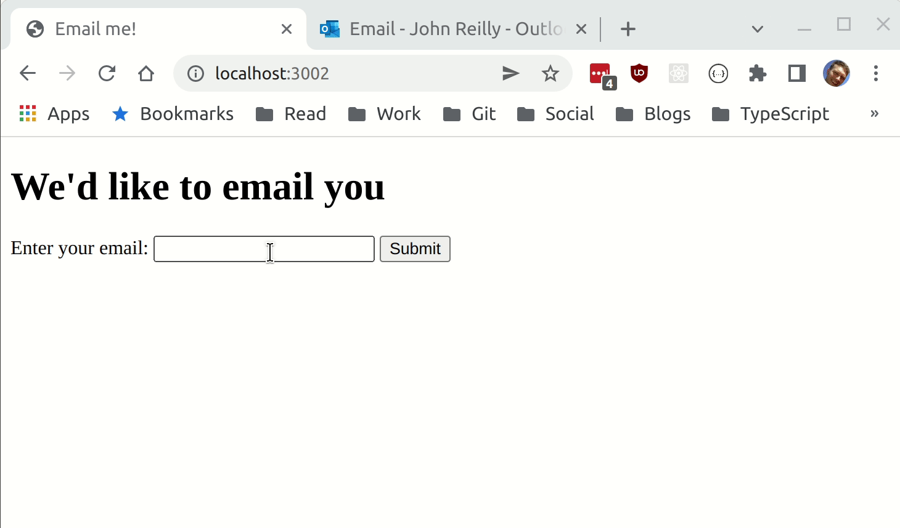
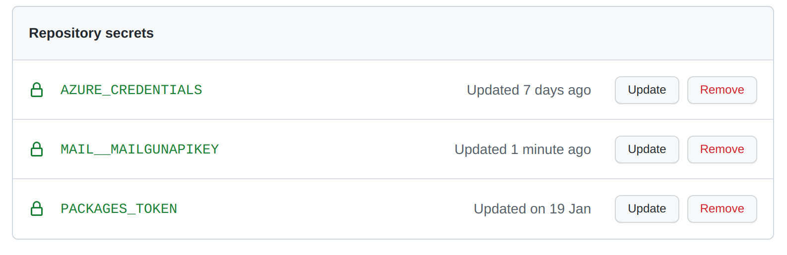

This post shows how to build and deploy two Azure Container Apps using Bicep and GitHub Actions. These apps will communicate using [dapr](https://docs.dapr.io/)'s [publish & subscribe (pubsub) building block](https://docs.dapr.io/developing-applications/building-blocks/pubsub/howto-publish-subscribe/).



## You've got mail

This post will build upon code written in a [previous post](../2022-01-22-azure-container-apps-dapr-bicep-github-actions-debug-devcontainer/index.md) which built and deployed a simple web application to Azure Container Apps using Bicep and GitHub Actions using the GitHub container registry. Behind the scenes, that app was made up of a .NET app and a Node.js app communicating via dapr's [service invocation building block](https://docs.dapr.io/developing-applications/building-blocks/service-invocation/howto-invoke-discover-services/).

Right now we have a:

- Node.js web app and a
- .NET app

The web app, when called, uses dapr service invocation to acquire a weather forecast from a .NET app.

What we want to investigate is dapr's pubsub building block. But pubsub doesn't really "fit" into our current app. Let's alter it. Instead of showing users a weather forecast when they browse to the site, we'll instead look for our users to provide an email address, and we'll mail them a weather forecast.

This kind of app could work both using dapr service invocation or using pubsub. We're going to implement using our current service invocation approach first. Once that works, we'll then pivot that into using dapr pubsub.

This isn't rocket surgery; this is playing around with dapr and Azure Container Apps and seeing how they all hang together.

## .NET meet mailgun

Our existing .NET app needs the ability to send email. For that we're going to reach for [mailgun](https://app.mailgun.com/app/dashboard), and we'll use [RestSharp](https://restsharp.dev/) to call it. Let's add RestSharp as a dependency:

```shell
dotnet add package RestSharp
```

With that in place, let's turn to our `WeatherForecastController` and make it send an email.

```cs
using Config;

using Microsoft.AspNetCore.Mvc;
using Microsoft.Extensions.Options;

using RestSharp;
using RestSharp.Authenticators;

namespace WeatherService.Controllers;

[ApiController]
public class WeatherForecastController : ControllerBase
{
    private static readonly string[] Summaries = new[]
    {
        "Freezing", "Bracing", "Chilly", "Cool", "Mild", "Warm", "Balmy", "Hot", "Sweltering", "Scorching"
    };

    private readonly ILogger<WeatherForecastController> _logger;
    private readonly MailConfig _options;

    public WeatherForecastController(
        ILogger<WeatherForecastController> logger,
        IOptions<MailConfig> options
    )
    {
        _logger = logger;
        _options = options.Value;
    }

    public record SendWeatherForecastBody(string? Email);

    [HttpPost("SendWeatherForecast")]
    public async Task<string> SendWeatherForecast(SendWeatherForecastBody body)
    {
        try
        {
            if (string.IsNullOrEmpty(body.Email)) throw new Exception("Email required");

            var weatherForecast = Enumerable.Range(1, 5).Select(index => new WeatherForecast
            {
                Date = DateTime.Now.AddDays(index),
                TemperatureC = Random.Shared.Next(-20, 55),
                Summary = Summaries[Random.Shared.Next(Summaries.Length)]
            })
            .ToArray();

            var toEmailAddress = body.Email;
            var text = $@"The weather forecast is:

{string.Join("\n", weatherForecast.Select(wf => $"On {wf.Date} the weather will be {wf.Summary}"))}
";

            await SendSimpleMessage(
                toEmailAddress: toEmailAddress,
                text: text
            );

            return $"We have mailed {toEmailAddress} with the following:\n\n{text}";
        }
        catch (Exception exc)
        {
            _logger.LogError(exc, $"Problem!");

            return exc.Message;
        }
    }

    async Task<RestResponse> SendSimpleMessage(string toEmailAddress, string text)
    {
        RestClient client = new(new RestClientOptions
        {
            BaseUrl = new Uri("https://api.mailgun.net/v3")
        })
        {
            Authenticator =
            new HttpBasicAuthenticator("api", _options.MailgunApiKey)
        };
        RestRequest request = new();
        request.AddParameter("domain", "mg.priou.co.uk", ParameterType.UrlSegment);
        request.Resource = "{domain}/messages";
        request.AddParameter("from", "John Reilly <johnny_reilly@hotmail.com>");
        request.AddParameter("to", toEmailAddress);
        request.AddParameter("subject", "Weather forecast");
        request.AddParameter("text", text);

        return await client.PostAsync(request);
    }
}
```

In our new and improved controller we:

- Switch our `GET` endpoint to be a `POST` one instead, to reflect that we're going to take an action (sending an email) each time it's hit. (RESTful to the end)
- Rather than returning the weather forecast to our caller, we take the email address supplied and we send the weather forecast to it

You'll also notice we're passing a `IOptions<MailConfig>` to the constructor of our class, it's in this configuration object we store our Mailgun api key. So we're going to need to define a `MailConfig` class:

```cs
public class MailConfig
{
    public string MailgunApiKey { get; set; } = string.Empty;
}
```

And we need to update our `Program.cs` so it recognises `MailConfig` and configures it:

```cs
var builder = WebApplication.CreateBuilder(args);

builder.Services.Configure<MailConfig>(builder.Configuration.GetSection("Mail"));
// ...
```

Thanks to the default setup of .NET, we'll now be able to populate this using `appsettings.json` files and environment variables. Since our API key is a secret we'll avoid putting it in source control, and instead populate an environment variable that .NET can read:

```
MAIL__MAILGUNAPIKEY=key-goes-here
```

The `__` above is the convention that .NET follows for nesting with environment variables; this is equivalent to the following structure in an `appsettings.json` file:

```json
{
  "Mail": {
    "MailgunApiKey": "api-key-goes-here"
  }
  // ...
}
```

## Webservice gets a form

Now that we've tweaked our WeatherService, we need to tweak the web site that calls it. We'll do that by first adding some dependencies that allow our Koa web service to handle routing a little easier:

```shell
npm install @koa/router koa-body --save
npm install @types/koa__router --save-dev
```

Then we'll tweak our `index.ts` like so:

```ts
import Koa from 'koa';
import Router from '@koa/router';
import koaBody from 'koa-body';
import axios from 'axios';

// How we connect to the dotnet service with dapr
const daprSidecarBaseUrl = `http://localhost:${
  process.env.DAPR_HTTP_PORT || 3501
}`;
// app id header for service discovery
const weatherServiceAppIdHeaders = {
  'dapr-app-id': process.env.WEATHER_SERVICE_NAME || 'dotnet-app',
};

const app = new Koa();
const router = new Router();

app.use(async (ctx, next) => {
  try {
    await next();
    const status = ctx.status || 404;
    if (status === 404) ctx.throw(404);
  } catch (err: any) {
    ctx.status = err.status || 500;
    ctx.body = ctx.status === 404 ? 'not found alas' : `hmmm: ${ctx.status}`;
  }
});

const formHtml = (header: string) => `<!DOCTYPE html>
<html>
<head>
<title>Email me!</title>
</head>
<body>
<form method="post">
    <h1>${header}</h1>
    <label for="email">Enter your email:</label>
    <input type="email" id="email" name="email" required>
    <button type="submit">Submit</button>
</form>
</body>
</html>
`;

router.get('/', async (ctx, next) => {
  ctx.body = formHtml("We'd like to email you");
});

router.post('/', koaBody(), async (ctx, next) => {
  try {
    if (ctx.request.body.email) {
      await axios.post(
        `${daprSidecarBaseUrl}/SendWeatherForecast`,
        {
          email: ctx.request.body.email,
        },
        {
          headers: weatherServiceAppIdHeaders,
        }
      );

      ctx.body = formHtml('Message sent');
    } else {
      ctx.body = formHtml('No email supplied');
    }
  } catch (exc) {
    console.error('Problem calling weather service', exc);
    ctx.body = 'Something went wrong!';
  }
});

app.use(router.routes()).use(router.allowedMethods());

const portNumber = 3000;
app.listen(portNumber);
console.log(`listening on port ${portNumber}`);
```

The above leaves us with a very simple form based web app that sends an email containing weather forecast:



## Secrets in Bicep

Whilst we can run locally, we want to be able to deploy this. So we need to update our Bicep template to receive a `MAIL__MAILGUNAPIKEY` parameter:

```bicep
param branchName string

param webServiceImage string
param webServicePort int
param webServiceIsExternalIngress bool

param weatherServiceImage string
param weatherServicePort int
param weatherServiceIsExternalIngress bool

param containerRegistry string
param containerRegistryUsername string
@secure()
param containerRegistryPassword string

param tags object

@secure()
param MAIL__MAILGUNAPIKEY string

param location string = resourceGroup().location
var minReplicas = 0
var maxReplicas = 1

var branch = toLower(last(split(branchName, '/')))

var environmentName = '${branch}-env'
var workspaceName = '${branch}-log-analytics'
var appInsightsName = '${branch}-app-insights'
var webServiceContainerAppName = '${branch}-web'
var weatherServiceContainerAppName = '${branch}-weather'

var containerRegistryPasswordRef = 'container-registry-password'
var mailgunApiKeyRef = 'mailgun-api-key'

resource workspace 'Microsoft.OperationalInsights/workspaces@2021-12-01-preview' = {
  name: workspaceName
  location: location
  tags: tags
  properties: {
    sku: {
      name: 'PerGB2018'
    }
    retentionInDays: 30
    workspaceCapping: {}
  }
}

resource appInsights 'Microsoft.Insights/components@2020-02-02' = {
  name: appInsightsName
  location: location
  tags: tags
  kind: 'web'
  properties: {
    Application_Type: 'web'
    Flow_Type: 'Bluefield'
  }
}

resource environment 'Microsoft.Web/kubeEnvironments@2021-03-01' = {
  name: environmentName
  kind: 'containerenvironment'
  location: location
  tags: tags
  properties: {
    type: 'managed'
    internalLoadBalancerEnabled: false
    appLogsConfiguration: {
      destination: 'log-analytics'
      logAnalyticsConfiguration: {
        customerId: workspace.properties.customerId
        sharedKey: listKeys(workspace.id, workspace.apiVersion).primarySharedKey
      }
    }
    containerAppsConfiguration: {
      daprAIInstrumentationKey: appInsights.properties.InstrumentationKey
    }
  }
}

resource weatherServiceContainerApp 'Microsoft.Web/containerapps@2021-03-01' = {
  name: weatherServiceContainerAppName
  kind: 'containerapps'
  tags: tags
  location: location
  properties: {
    kubeEnvironmentId: environment.id
    configuration: {
      secrets: [
        {
          name: containerRegistryPasswordRef
          value: containerRegistryPassword
        }
        {
          name: mailgunApiKeyRef
          value: MAIL__MAILGUNAPIKEY
        }
      ]
      registries: [
        {
          server: containerRegistry
          username: containerRegistryUsername
          passwordSecretRef: containerRegistryPasswordRef
        }
      ]
      ingress: {
        external: weatherServiceIsExternalIngress
        targetPort: weatherServicePort
      }
    }
    template: {
      containers: [
        {
          image: weatherServiceImage
          name: weatherServiceContainerAppName
          transport: 'auto'
          env: [
            {
              name: 'MAIL__MAILGUNAPIKEY'
              secretRef: mailgunApiKeyRef
            }
          ]
        }
      ]
      scale: {
        minReplicas: minReplicas
        maxReplicas: maxReplicas
      }
      dapr: {
        enabled: true
        appPort: weatherServicePort
        appId: weatherServiceContainerAppName
      }
    }
  }
}

resource webServiceContainerApp 'Microsoft.Web/containerapps@2021-03-01' = {
  name: webServiceContainerAppName
  kind: 'containerapps'
  tags: tags
  location: location
  properties: {
    kubeEnvironmentId: environment.id
    configuration: {
      secrets: [
        {
          name: containerRegistryPasswordRef
          value: containerRegistryPassword
        }
      ]
      registries: [
        {
          server: containerRegistry
          username: containerRegistryUsername
          passwordSecretRef: containerRegistryPasswordRef
        }
      ]
      ingress: {
        external: webServiceIsExternalIngress
        targetPort: webServicePort
      }
    }
    template: {
      containers: [
        {
          image: webServiceImage
          name: webServiceContainerAppName
          transport: 'auto'
          env: [
            {
              name: 'WEATHER_SERVICE_NAME'
              value: weatherServiceContainerAppName
            }
          ]
        }
      ]
      scale: {
        minReplicas: minReplicas
        maxReplicas: maxReplicas
      }
      dapr: {
        enabled: true
        appPort: webServicePort
        appId: webServiceContainerAppName
      }
    }
  }
}

output webServiceUrl string = webServiceContainerApp.properties.latestRevisionFqdn
```

We can see that we treat the `MAIL__MAILGUNAPIKEY` as a secret. It's passed in using the `@secure` decorator and it's configured as a secret inside the `weatherServiceContainerApp` Azure Container App.

We have a GitHub Action that handles our deployment. We'll need to introduce the `MAIL__MAILGUNAPIKEY` secret both to the deploy step of the `build-and-deploy.yaml`:

```yaml
deploy:
  runs-on: ubuntu-latest
  needs: [build]
  steps:
    - name: Checkout repository
      uses: actions/checkout@v2

    - name: Azure Login
      uses: azure/login@v1
      with:
        creds: ${{ secrets.AZURE_CREDENTIALS }}

    - name: Deploy bicep
      uses: azure/CLI@v1
      if: github.event_name != 'pull_request'
      with:
        inlineScript: |
          REF_SHA='${{ github.ref }}.${{ github.sha }}'
          DEPLOYMENT_NAME="${REF_SHA////-}"
          echo "DEPLOYMENT_NAME=$DEPLOYMENT_NAME"

          TAGS='{"owner":"johnnyreilly", "email":"johnny_reilly@hotmail.com"}'
          az deployment group create \
            --resource-group ${{ env.RESOURCE_GROUP }} \
            --name "$DEPLOYMENT_NAME" \
            --template-file ./infra/main.bicep \
            --parameters \
                branchName='${{ github.event.number == 0 && 'main' ||  format('pr-{0}', github.event.number) }}' \
                webServiceImage='${{ needs.build.outputs.image-node }}' \
                webServicePort=3000 \
                webServiceIsExternalIngress=true \
                weatherServiceImage='${{ needs.build.outputs.image-dotnet }}' \
                weatherServicePort=5000 \
                weatherServiceIsExternalIngress=false \
                containerRegistry=${{ env.REGISTRY }} \
                containerRegistryUsername=${{ github.actor }} \
                containerRegistryPassword=${{ secrets.PACKAGES_TOKEN }} \
                tags="$TAGS" \
                MAIL__MAILGUNAPIKEY="${{ secrets.MAIL__MAILGUNAPIKEY }}"
```

And we'll need to create the associated secret as well:



## PubSub time!

So we're now at the point where we have a pubsub style app - but still implemented using the service invocation approach. It's time to start migrating to using dapr's pubsub capabilities.

```shell
curl -X POST http://localhost:3501/v1.0/publish/weather-forecast-pub-sub/weather-forecasts -H 'Content-Type: application/json' -d '{"email":"johnny_reilly@hotmail.com"}'
```

## CONTINUE HERE
