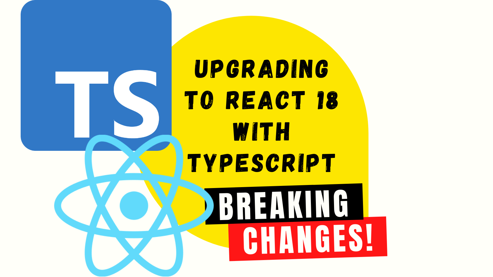

The upgrade of the React type definitions to support React 18 involved some significant breaking changes. This post digs into that and examines what the upgrade path looks like.



<!--truncate-->

## React 18 and Definitely Typed

After a significant period of time in alpha / beta, [React 18 shipped on March 29th 2022](https://reactjs.org/blog/2022/03/29/react-v18.html). Since the first alpha was released, [support has been available in TypeScript](https://blog.logrocket.com/how-to-use-typescript-with-react-18-alpha/). This has been made possible through the type definitions at [Definitely Typed](https://github.com/DefinitelyTyped/DefinitelyTyped), the repository for high quality TypeScript type definitions. It's particularly down to the fine work of [Sebastian Silbermann](https://twitter.com/sebsilbermann) who has put a lot of work into the React 18 definitions.

Now that React 18 has shipped, [the type definitions for React 18 were updated in Sebastian's pull request](https://github.com/DefinitelyTyped/DefinitelyTyped/pull/56210). Many projects have been, and will be, broken by this change. This post will look at what that breakage can look like and how to resolve it.

Before we do that, let's first consider the problem of Definitely Typed and [semantic versioning](http://semver.org/).

## Definitely Typed and semantic versioning

People are used to the idea of semantic versioning in the software they consume. They expect a major version bump to indicate breaking changes. This is exactly what React has just done by incrementing from v17 to v18.

**Definitely Typed does not support semantic versioning.**

This is not out of spite. This is because DT intentionally publishes type definitions to npm, under the scope of `@types`. So, for example, the type definitions of React are published to [`@types/react`](https://www.npmjs.com/package/@types/react).

It's important to be aware that npm is built on top of semantic versioning. To make consumption of type definitions easier, the versioning of a type definition package will seek to emulate the versioning of the npm package it supports. So for [`react`](https://www.npmjs.com/package/react) `18.0.0`, the corresponding type definition would be [`@types/react`](https://www.npmjs.com/package/@types/react)'s `18.0.0`.

If there's a breaking change to the `@types/react` type definition (or any other for that matter) then the new version published will not increment the major or minor version numbers. The increment will be applied to the patch number alone. This is done to maintain the simpler consumption model of types through npm.

## React 18 - breaking type changes

All that said, for very widely used type definitions, it's not unusual to at least make an effort towards minimising breaking changes where that is possible.

As an aside, it's interesting to know that the Definitely Typed automation tooling splits type definitions into three categories: ["Well-liked by everyone", "Popular" and "Critical"](https://github.com/DefinitelyTyped/dt-mergebot/blob/5485345b210a4baf8e63376a930554bf2b7dd311/src/basic.ts#L11-L14). Thanks [Andrew Branch for sharing that](https://twitter.com/atcb/status/1438559981838626817)! React, being very widely used, is considered "Critical".

When Sebastian submitted [a pull request to upgrade the TypeScript React type definitions](https://github.com/DefinitelyTyped/DefinitelyTyped/pull/56210), the opportunity was taken to make breaking changes. These were not all directly related to React 18. Many were fixing long standing issues with the React type definitions.

Sebastian's write up on the PR is excellent and I'd encourage you to read it. Here is a summary of the breaking changes:

1. Removal of implicit children
2. Remove `{}` from `ReactFragment` (related to 1.)
3. `this.context` becomes `unknown`
4. Using `noImplicitAny` now enforces a type is supplied with `useCallback`
5. Remove deprecated types to align with official React ones

Of the above, the removal of implicit children is the most breaking of the changes and [Sebastian wrote a blog post to explain the rationale](https://solverfox.dev/writing/no-implicit-children). He was also good enough to write a [codemod to help](https://github.com/eps1lon/types-react-codemod).

With that in mind, let's go upgrade a codebase to React 18!

## Upgrading

To demonstrate what upgrading looks like, I'm going to upgrade my aunt's website. It's a fairly simple site, and the pull request for the upgrade [can be found here](https://github.com/johnnyreilly/poor-clares-arundel-koa/pull/69).

The first thing to do is upgrade React itself in the `package.json`:

```diff
-    "react": "^17.0.0",
-    "react-dom": "^17.0.0",
+    "react": "^18.0.0",
+    "react-dom": "^18.0.0",
```

Next we'll upgrade our type definitions:

```diff
-    "@types/react": "^17.0.0",
-    "@types/react-dom": "^17.0.0",
+    "@types/react": "^18.0.0",
+    "@types/react-dom": "^18.0.0",
```

When you install your dependencies, do check your lock file (`yarn.lock` / `package-lock.json` etc). It's important that you only have `@types/react` and `@types/react-dom` packages which are version 18+ listed.

Now that your install has completed, we start to see the following error message:

> Property 'children' does not exist on type 'LoadingProps'.ts(2339)

... In the following code:

```tsx
interface LoadingProps {
  // you'll note there's no `children` prop here - this is what's prompting the error message
  noHeader?: boolean;
}

// if props.noHeader is false then this component returns just the icon and a message
// if props.noHeader is true then this component returns the same but wrapped in an h1
const Loading: React.FunctionComponent<LoadingProps> = (props) =>
  props.noHeader ? (
    <>
      <FontAwesomeIcon icon={faSnowflake} spin /> Loading {props.children} ...
    </>
  ) : (
    <h1 className="loader">
      <FontAwesomeIcon icon={faSnowflake} spin /> Loading {props.children} ...
    </h1>
  );
```


What we're seeing here is the "removal of implicit children" in action. Before we did the upgrade, all `React.Component` and `React.FunctionComponent`s had a `children` property in place which allowed React users to use this without declaring it. This is no longer the case. If you have a component with `children` you have to explicitly declare them.

In my case, I could fix the issue by adding a `children` property directly:

```tsx
interface LoadingProps {
  noHeader?: boolean;
  children: string;
}
```

But why write code when you can get someone else to write it on your behalf?

Let's make use of [Sebastian's codemod](https://github.com/eps1lon/types-react-codemod) instead. To do that we simply enter the following command:

```shell
npx types-react-codemod preset-18 ./src
```

When it runs you should find yourself with a prompt which says something like this:

```shell
? Pick transforms to apply (Press <space> to select, <a> to toggle all, <i> to invert selection, and <enter> to proceed)
❯◉ context-any
 ◉ deprecated-react-type
 ◉ deprecated-sfc-element
 ◉ deprecated-sfc
 ◉ deprecated-stateless-component
 ◉ implicit-children
 ◉ useCallback-implicit-any
```


I'm going to select `a` and let the codemod run. For my own project, 37 files are updated. It's the same modification for all files. In each case, a components props are wrapped by `React.PropsWithChildren`. Let's look at what that looks like for our `Loading` component:

```diff
-const Loading: React.FunctionComponent<LoadingProps> = (props) =>
+const Loading: React.FunctionComponent<React.PropsWithChildren<LoadingProps>> = (props) =>
```

`PropsWithChildren` is very simple; it just adds `children` back, like so:

```ts
type PropsWithChildren<P> = P & { children?: ReactNode | undefined };
```

This resolves the compilation issues we were having earlier; no type issues are reported anymore.

## Wrapping up

We now understand how the breaking type changes came to present with React 18, and we know how to upgrade our codebase using the handy codemod. Thanks [Sebastian Silbermann](https://twitter.com/sebsilbermann) for not only putting this work into getting the type definitions in the best state they could be, and making it easier for the community to upgrade.

[This post was originally published on LogRocket.](https://blog.logrocket.com/upgrading-react-18-typescript/)

<head>
    <link rel="canonical" href="https://blog.logrocket.com/upgrading-react-18-typescript/" />
</head>
