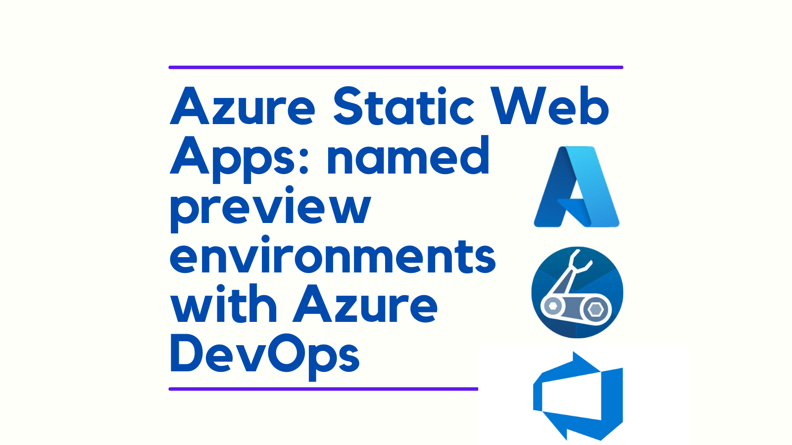
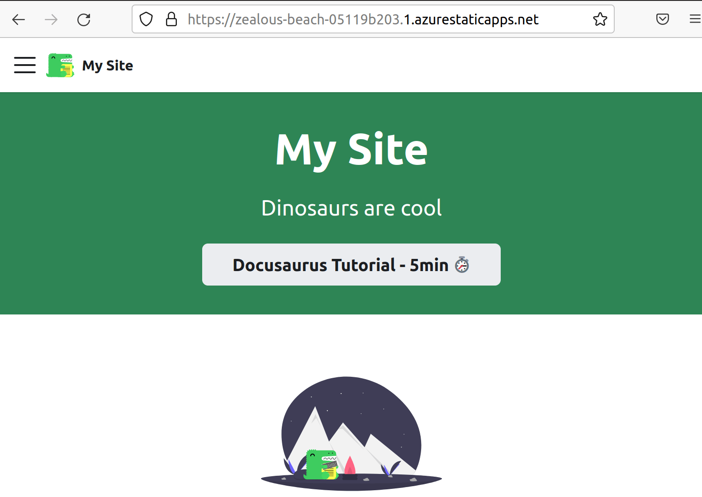
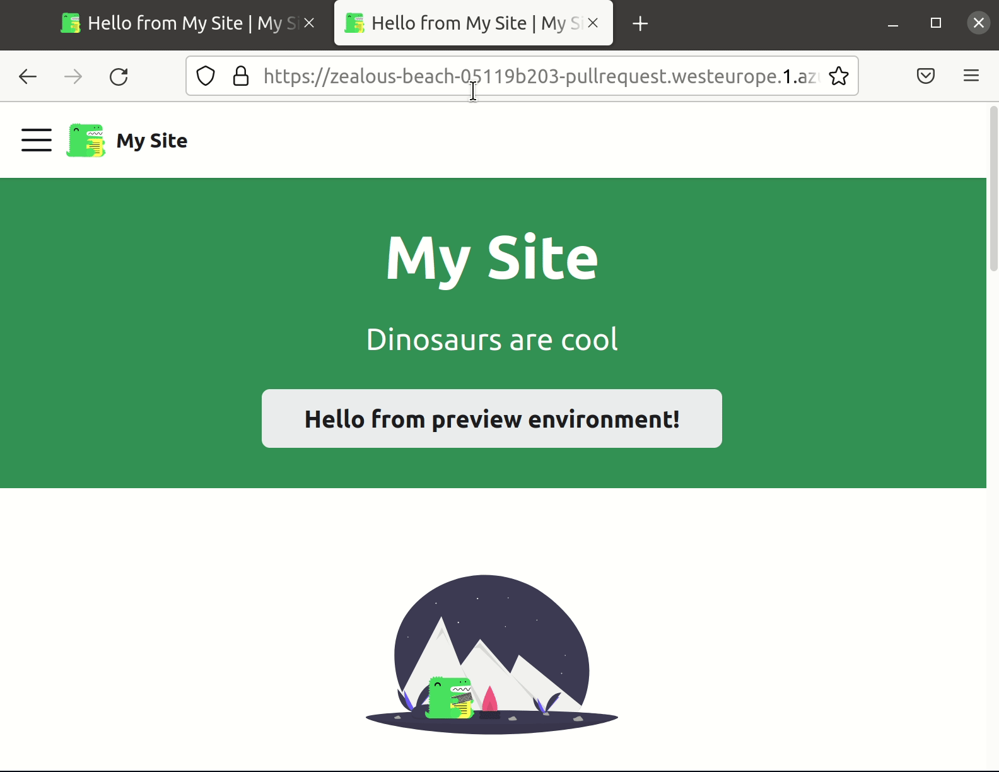

Azure Static Web Apps have just released a new feature for Azure DevOps users called "named preview environments". They allow users to deploy changes to an environment, prior to merging.



<!--truncate-->

## What are named preview environments?

The [announcement](https://docs.microsoft.com/en-gb/azure/static-web-apps/named-environments?tabs=azure-devops) describes them like so:

> You can configure your site to deploy every change to a named environment. This preview deployment is published at a stable URL that includes the environment name. For example, if the environment is named `release`, then the preview is available at a location like `<DEFAULT_HOST_NAME>-release.<LOCATION>.azurestaticapps.net`.

[I'd previously written about how to hand roll preview environments with Azure DevOps using Bicep](../2021-12-05-azure-static-web-app-deploy-previews-with-azure-devops/index.md). But now there's dedicated functionality that covers this, let's see if we can test it out.

## Deploy Static Web App with Bicep

We'll start with an empty repo in Azure DevOps and we'll create the Bicep template for deploying a Static Web App to Azure:

```bicep
param appName string
param repositoryUrl string
param repositoryBranch string

param location string = resourceGroup().location
param skuName string = 'Free'
param skuTier string = 'Free'

resource staticWebApp 'Microsoft.Web/staticSites@2021-03-01' = {
  name: appName
  location: location
  sku: {
    name: skuName
    tier: skuTier
  }
  properties: {
    // The provider, repositoryUrl and branch fields are required for successive deployments to succeed
    // for more details see: https://github.com/Azure/static-web-apps/issues/516
    provider: 'DevOps'
    repositoryUrl: repositoryUrl
    branch: repositoryBranch
    buildProperties: {
      skipGithubActionWorkflowGeneration: true
    }
  }
}

output staticWebAppDefaultHostName string = staticWebApp.properties.defaultHostname // eg gentle-bush-0db02ce03.azurestaticapps.net
output staticWebAppId string = staticWebApp.id
output staticWebAppName string = staticWebApp.name
```

The above deploys a Static Web App configured for Azure DevOps.

We are now outputting the `defaultHostname`, `id` and `name` of our newly provisioned SWA. Doing this allows us to do build things in the pipeline around our SWA should we choose to.

## Azure Pipelines

We're going to need an Azure Pipeline for this. We'll create an `azure-pipelines.yml` file in the root of our repo:

```yml
trigger:
  - '*'

pool:
  vmImage: ubuntu-latest

variables:
  # subscriptionId is a variable defined on the pipeline itself
  - name: appName
    value: 'our-static-web-app'
  - name: location
    value: 'westeurope' # at time of writing static sites are available in limited locations such as westeurope
  - name: serviceConnection
    value: 'azure-resource-manager-rg-static-web-apps' # Azure Resource Manager Service Connection created in Azure DevOps with permission against the rg-static-web-apps resource group in Azure
  - name: azureResourceGroup # this resource group lives in westeurope
    value: 'rg-static-web-apps'
  - name: isMain
    value: $[eq(variables['Build.SourceBranch'], 'refs/heads/main')] # runtime expression

steps:
  - checkout: self
    submodules: true

  - bash: az bicep build --file infra/static-web-app/main.bicep
    displayName: 'Compile Bicep to ARM'

  - task: AzureResourceManagerTemplateDeployment@3
    name: DeployStaticWebAppInfra
    displayName: Deploy Static Web App infra
    inputs:
      deploymentScope: Resource Group
      azureResourceManagerConnection: $(serviceConnection)
      subscriptionId: $(subscriptionId)
      action: Create Or Update Resource Group
      resourceGroupName: $(azureResourceGroup)
      location: $(location)
      templateLocation: Linked artifact
      csmFile: 'infra/static-web-app/main.json' # created by bash script
      overrideParameters: >-
        -repositoryUrl $(Build.Repository.Uri)
        -repositoryBranch $(Build.SourceBranchName)
        -appName $(appName)
      deploymentMode: Incremental
      deploymentOutputs: deploymentOutputs

  - task: PowerShell@2
    name: 'SetDeploymentOutputVariables'
    displayName: 'Set Deployment Output Variables'
    inputs:
      targetType: inline
      script: |
        $armOutputObj = '$(deploymentOutputs)' | ConvertFrom-Json
        $armOutputObj.PSObject.Properties | ForEach-Object {
          $keyname = $_.Name
          $value = $_.Value.value

          # Creates a standard pipeline variable
          Write-Output "##vso[task.setvariable variable=$keyName;]$value"

          # Display keys and values in pipeline
          Write-Output "output variable: $keyName $value"
        }
      pwsh: true

  - task: AzureCLI@2
    displayName: 'Acquire API key for deployment'
    inputs:
      azureSubscription: $(serviceConnection)
      scriptType: bash
      scriptLocation: inlineScript
      inlineScript: |
        APIKEY=$(az staticwebapp secrets list --name $(staticWebAppName) | jq -r '.properties.apiKey')
        echo "##vso[task.setvariable variable=apiKey;issecret=true]$APIKEY"

  - task: AzureStaticWebApp@0
    name: DeployStaticWebApp
    displayName: Deploy Static Web App
    condition: and(succeeded(), eq(variables.isMain, 'true'))
    inputs:
      app_location: 'static-web-app'
      # api_location: 'api'
      output_location: 'build'
      azure_static_web_apps_api_token: $(apiKey)

  - task: AzureStaticWebApp@0
    name: DeployStaticWebAppPreview
    displayName: Deploy Static Web App to named preview environment
    condition: and(succeeded(), ne(variables.isMain, 'true'))
    inputs:
      app_location: 'static-web-app'
      # api_location: 'api'
      output_location: 'build'
      azure_static_web_apps_api_token: $(apiKey)
      deployment_environment: 'pullrequest'
```

There's two significant parts to the above pipeline. First the trigger, which ensures we run the pipeline on each change:

```yml
trigger:
  - '*' # this means we'll trigger on each change
```

Next the two `AzureStaticWebApp@0` tasks:

```yml
- task: AzureStaticWebApp@0
  name: DeployStaticWebApp
  displayName: Deploy Static Web App
  condition: and(succeeded(), eq(variables.isMain, 'true'))
  inputs:
    app_location: 'static-web-app'
    # api_location: 'api'
    output_location: 'build'
    azure_static_web_apps_api_token: $(apiKey)

- task: AzureStaticWebApp@0
  name: DeployStaticWebAppPreview
  displayName: Deploy Static Web App to named preview environment
  condition: and(succeeded(), ne(variables.isMain, 'true'))
  inputs:
    app_location: 'static-web-app'
    # api_location: 'api'
    output_location: 'build'
    azure_static_web_apps_api_token: $(apiKey)
    deployment_environment: 'pullrequest'
```

Depending upon whether we're using the `main` branch or not, we either use or do not use the `deployment_environment` property. When it is not the `main` branch we supply the `deployment_environment` property with a value of `'pullrequest'`. This is the name of our preview environment; and the value will be used in the URL we end up with. In my own experiments it seems that using hyphens in the name can be problematic - so I would advise avoiding this.

## Creating a site

So we can test this out, we need a static web app to deploy. We'll spin up a simple Docusaurus site:

```
npx create-docusaurus@latest static-web-app classic
```

Upon the initial commit of our main branch we end up with a website, once the pipeline has run:


Note the URL:



## Testing the preview

Now our main site is deployed, let's test out the preview environment. We'll create a new branch:

```shell
git checkout -b test-preview
```

And we'll update the `pages.index.js` file to include this message: "Hello from preview environment!". Once we commit and push our changes, we see the pipeline run:


Note that this time we are deploying to our preview environment instead.


As we can see, this preview is showing our "Hello from preview environment!" changes as well; whilst the main environment is unchanged.



## Conclusion

Azure DevOps now has support for named preview environments for Azure Static Web Apps; a powerful addition to the product.

You can see further discussion of this feature on the [Azure/static-web-apps repo](https://github.com/Azure/static-web-apps/issues/510#issuecomment-1116307462).
