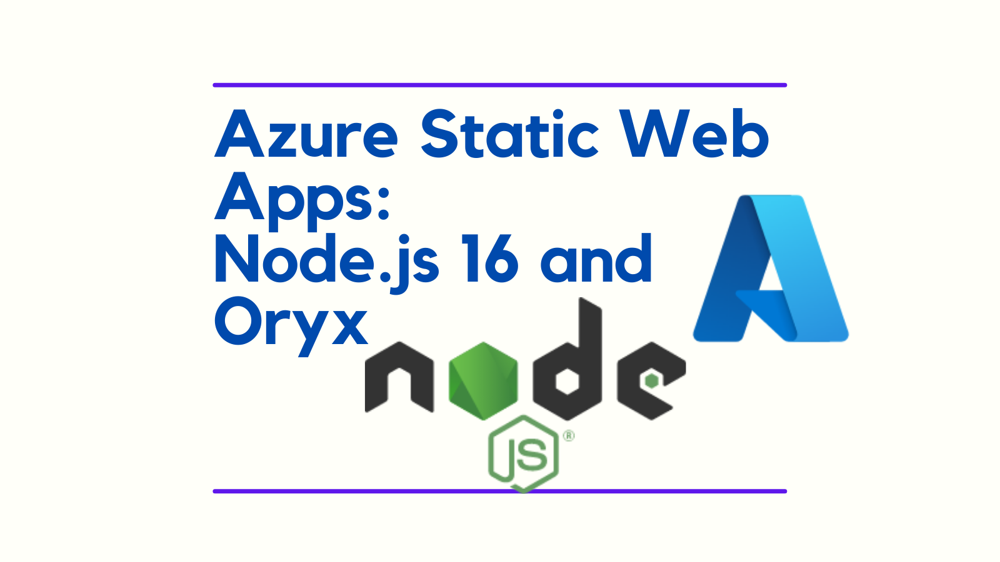

Azure Static Web Apps presently fixes to Node.js 14 when building. If you require a different version of Node to build, this can be a problem. This post outlines a workaround.



<!--truncate-->

## The engine "node" is incompatible

As I was upgrading this blog to [Docusaurus v2.0.0-beta.21](https://github.com/facebook/docusaurus/releases/tag/v2.0.0-beta.21) I noticed this error in my build:

```shell
error @docusaurus/core@2.0.0-beta.21: The engine "node" is incompatible with this module. Expected version ">=16.14". Got "14.19.1"
error Found incompatible module.


---End of Oryx build logs---
Oryx has failed to build the solution.
```

[Oryx](https://github.com/microsoft/Oryx), which performs the build for Static Web Apps, is fixed to Node 14 for the default LTS version (for now, this will definitely change sometime in 2023). You can check for the constant `NodeLtsVersion` [here](https://github.com/microsoft/Oryx/blob/main/src/BuildScriptGenerator/Node/NodeConstants.cs) to check which version of Node Oryx is using as the `DEFAULT_NODE_VERSION`. To override this default, can either use an `engines` setting in `package.json`, or use an environment setting in the The GitHub Action.

## Solution 1: `engines` to the rescue!

You can specify the node version you require in your `package.json` with the [`engines`](https://docs.npmjs.com/cli/v7/configuring-npm/package-json#engines) property. This means you can do something like this:

```json
  "engines": {
    "node": ">=16"
  }
```

And have the version of Node.js you require installed by Oryx.

Thanks to [Cormac McCarthy](https://github.com/cormacpayne) for his [comment](https://github.com/Azure/static-web-apps/issues/694#issuecomment-1137492562) which lead me to try this approach out.

[You can see the PR where I made this change for my blog here.](https://github.com/johnnyreilly/blog.johnnyreilly.com/pull/228)

## Solution 2: Environment variables for the win!

You can change the version for the build step using an environnment variable. This is documented in the [Microsoft Docs](https://learn.microsoft.com/en-us/azure/developer/javascript/how-to/with-web-app/static-web-app-with-swa-cli/create-static-web-app)

Modify the workflow file, from the `./github/workflows` directory. Just add these last two lines:

```yaml
     - name: Build And Deploy
        id: builddeploy
        uses: Azure/static-web-apps-deploy@v1
        with:
          azure_static_web_apps_api_token: ${{ secrets.AZURE_STATIC_WEB_APPS_API_TOKEN_SAMPLE }}
          repo_token: ${{ secrets.GITHUB_TOKEN }} # Used for Github integrations (i.e. PR comments)
          action: 'upload'
          app_location: '/' # App source code path
          api_location: 'api' # Api source code path - optional
          output_location: 'public' # Built app content directory - optional
        env:  # Put a node version on the following line
          NODE_VERSION: 18.12.0
```

You can use a specific node version (18.12.0 or 16.18.0) or a major node version (18 or 16). The latter approach installs the latest minor version.

**Note:** The Oryx image is updated quarterly. You can get a list of the supported node versions [here](https://github.com/microsoft/Oryx/blob/main/doc/supportedPlatformVersions.md).

Thanks to Eric Côté from [React Academy](https://reactAcademy.live) for the information.
