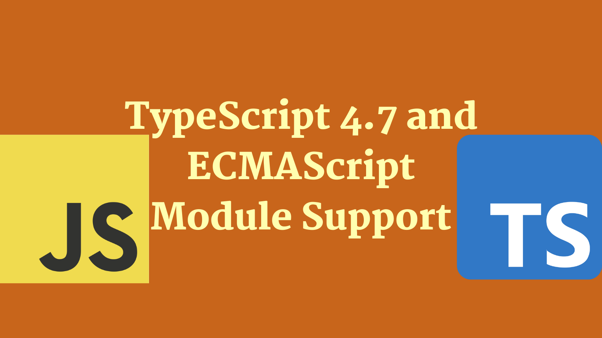

As part of the TypeScript 4.7 release comes a major upgrade to ECMAScript Module Support for Node.js. This post takes a look at what that means.

## A short history of ECMAScript modules

When ES6 shipped back in 2015, with it came the concept of modules for JavaScript. Back then it was known as "ES6 modules". These days they are called ECMAScript modules.

Whilst writing code using ECMAScript module semantics came quickly for front end, for the back end (which is generally Node.js) that has not the case. There's a number of reasons for this:

1. There was already an established module system used in Node.js called [CommonJS](https://en.wikipedia.org/wiki/CommonJS)
2. Node.js itself did not initially offer support for ECMAScript modules; in large part because of the problems associated with being able to support CommonJS _as well_ as ECMAScript modules.

However, with the release Node.js 14 support for ECMAScript modules (AKA "ESM") landed. If you're interested in the details of that module support then it's worth [reading this post on ECMAScript modules](https://blog.logrocket.com/es-modules-in-node-today/).

## TypeScript support

The TypeScript team have been experimenting with ways to offer support for ECMAScript modules from a Node.js perspective, and with TypeScript 4.7 support is being released.

In this post we'll test drive that support by attempting to build a simple module in TypeScript using the new ECMAScript modules support. As we do this, we'll discuss what it looks like to author ECMAScript modules for Node.js in TypeScript.

Let's go!

## Making a module
