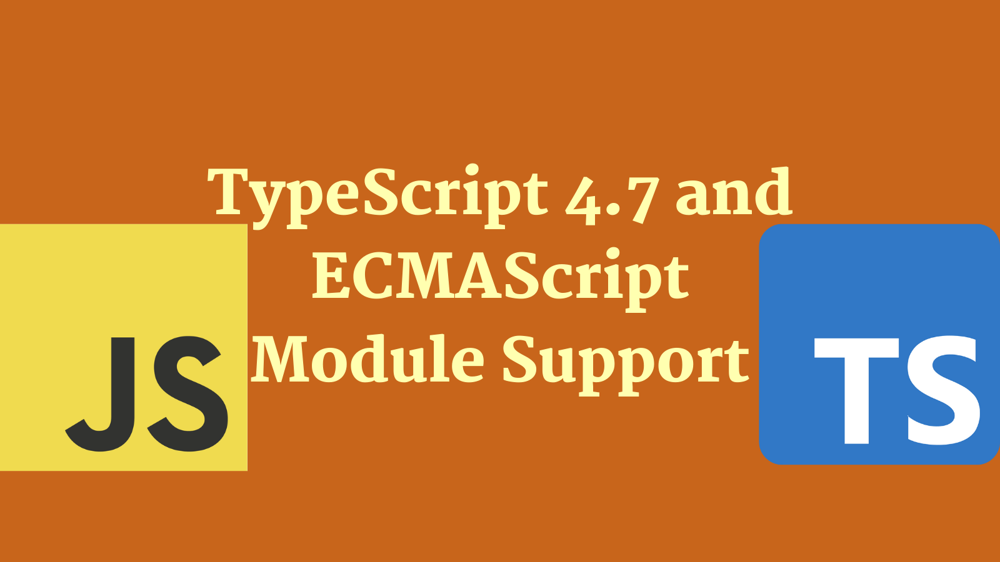
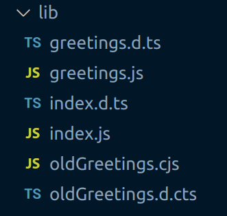

As part of the TypeScript 4.7 release comes a major upgrade to ECMAScript Module Support for Node.js. This post takes a look at what that means.



<!--truncate-->

## A short history of ECMAScript modules

When ES6 shipped back in 2015, with it came the concept of modules for JavaScript. Back then it was known as "ES6 modules". These days they are called ECMAScript modules.

Whilst writing code using ECMAScript module semantics came quickly for front end, for the back end (which is generally Node.js) that has not the case. There's a number of reasons for this:

1. There was already an established module system used in Node.js called [CommonJS](https://en.wikipedia.org/wiki/CommonJS)
2. Node.js itself did not initially offer support for ECMAScript modules; in large part because of the problems associated with being able to support CommonJS _as well_ as ECMAScript modules.

However, with the release Node.js 14 support for ECMAScript modules (AKA "ESM") landed. If you're interested in the details of that module support then it's worth [reading this post on ECMAScript modules](https://blog.logrocket.com/es-modules-in-node-today/).

## TypeScript support

The TypeScript team have been experimenting with ways to offer support for ECMAScript modules from a Node.js perspective, and with TypeScript 4.7 support is being released.

In this post we'll test drive that support by attempting to build a simple module in TypeScript using the new ECMAScript modules support. As we do this, we'll discuss what it looks like to author ECMAScript modules for Node.js in TypeScript.

Let's go!

## Making a module

We're going to make a module named `greeter` - let's initialise it:

```shell
mkdir greeter
cd greeter
npm init --yes
```

We now have a `package.json` that looks something like this:

```json
{
  "name": "greeter",
  "version": "1.0.0",
  "description": "",
  "main": "index.js",
  "scripts": {
    "test": "echo \"Error: no test specified\" && exit 1"
  },
  "keywords": [],
  "author": "",
  "license": "ISC"
}
```

Node.js supports a new setting in `package.json` called `type`. [This can be set to either "module" or "commonjs"](https://nodejs.org/api/packages.html#type). To quote the docs:

> Files ending with `.js` are loaded as ES modules when the nearest parent package.json file contains a top-level field `"type"` with a value of `"module"`.

With that in mind, we'll add a `"type": "module"` to our `package.json`.

We're now ECMAScript module support compliant, let's start adding some TypeScript.

## Adding TypeScript 4.7

In order that we can make use of TypeScript ECMAScript modules support we're going to install TypeScript 4.7 (currently in beta):

```
npm install typescript@4.7.0-beta --save
```

With this in place we'll initialise a TypeScript project:

```
npx tsc --init
```

This will create a `tsconfig.json` file which contains many options. We will tweak the `module` option to be `nodenext` to opt into ECMAScript module support:

```json
{
  "compilerOptions": {
    // ...
    "module": "nodenext" /* Specify what module code is generated. */,
    "outDir": "./lib" /* Specify an output folder for all emitted files. */,
    "declaration": true /* Generate .d.ts files from TypeScript and JavaScript files in your project. */

    // ...
  }
}
```

We've also set the `outDir` option, such that compiled JavaScript will go into that directory, and the `declaration` option such that `.d.ts` files will be generated. We'll also update the `"scripts"` section of our `package.json` to include `build` and `start` scripts:

```json
  "scripts": {
    "build": "tsc",
    "start": "node lib/index.js"
  },
```

## Writing TypeScript ECMAScript modules

With all that set up, we're ready to write some TypeScript ECMAScript modules. First we'll write a `greetings.ts` module:

```ts
export function helloWorld(): string {
  return 'hello world!';
}
```

There is nothing new or surprising about this; it's just a module exporting a single function named `helloWorld`. It becomes more interesting as we write our `index.ts` module:

```ts
import { helloWorld } from './greetings.js';

const greeting = helloWorld();

console.log(greeting);
```

The code above imports our `helloWorld` function and then executes it; writing the output to the console. Not particularly noteworthy. However, the way we import is. We are importing from `'./greetings.js'`. In the past we would have written:

```ts
import { helloWorld } from './greetings';
```

Now we write:

```ts
import { helloWorld } from './greetings.js';
```

This can feel slightly odd and unnatural because we have no `greetings.js` in our codebase; only `greetings.ts`. The imports we're writing, reflect the code that will end up being executed; once our TypeScript has been compiled to JavaScript. In ES modules relative import paths need to use extensions.

The easiest way to demonstrate that this is legitimate, is to run the code:

```shell
npm run build && npm start
```

Which results in:

```shell
> greeter@1.0.0 build
> tsc


> greeter@1.0.0 start
> node lib/index.js

hello world!
```

So it works!

## ECMAScript and CommonJS side by side

Part of ECMAScript module support is the ability to specify the module type of a file based on the file suffix. If you use `.mjs`, you're explicitly saying a file is an ECMAScript module. If you use `.cjs`, you're explicitly saying a file is an CommonJS module. If you're authoring with TypeScript you'd use `mts` and `cts` respectively and they'd be transpiled to `mjs` and `cjs`.

Happily Node.js allows ES modules to import CommonJS modules as if they were ES modules with a default export; which is good news for interop. Let's test that out by writing a `oldGreetings.cts` module:

```ts
export function helloOldWorld(): string {
  return 'hello old world!';
}
```

Exactly the same syntax as before. We'll adjust our `index.ts` to consume this:

```ts
import { helloWorld } from './greetings.js';
import { helloOldWorld } from './oldGreetings.cjs';

console.log(helloWorld());
console.log(helloOldWorld());
```

Note that we're importing from `'./oldGreetings.cjs'`. We'll see if it works:

```shell
npm run build && npm start
```

Which results in:

```shell
> greeter@1.0.0 build
> tsc


> greeter@1.0.0 start
> node lib/index.js

hello world!
hello old world!
```

It does work!

## What files are emitted?

Before we close out, it might be interesting to look at what TypeScript is doing when we run our `npm run build`. It transpiles our TypeScript into JavaScript in our `lib` directory:



Note the `greetings.ts` file has resulted in `greetings.js` and a `greetings.d.ts` files. Whereas `oldGreetings.cts` has resulted in `oldGreetings.cjs` and a `oldGreetings.d.cts` files; reflecting the different module types represented.

It's also interesting to look at the difference in the emitted JavaScript. When you consider how similar the source files were. If you look at `greetings.js`:

```js
export function helloWorld() {
  return 'hello world!';
}
```

This is the same code as `greetings.ts` but with types stripped. However, if we look at `oldGreetings.cjs` we see this:

```js
'use strict';
Object.defineProperty(exports, '__esModule', { value: true });
exports.helloOldWorld = void 0;
function helloOldWorld() {
  return 'hello old world!';
}
exports.helloOldWorld = helloOldWorld;
```

In the middle the same code as `oldGreetings.cts` but with types stripped, but around that boilerplate code that TypeScript is emitting for us to aid in interop.

## Conclusion

We've seen what TypeScript support for ECMAScript modules looks like, and how to set up a module to embrace it.

If you'd like to read up further on the topic, the [TypeScript 4.7 beta release notes](https://devblogs.microsoft.com/typescript/announcing-typescript-4-7-beta/#esm-nodejs) are an excellent resource.

[This post was originally published on LogRocket.](https://blog.logrocket.com/typescript-4-7-ecmascript-module-support/)

<head>
    <link rel="canonical" href="https://blog.logrocket.com/typescript-4-7-ecmascript-module-support/" />
</head>
