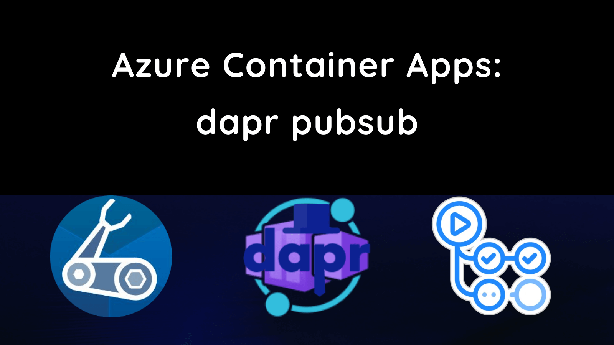
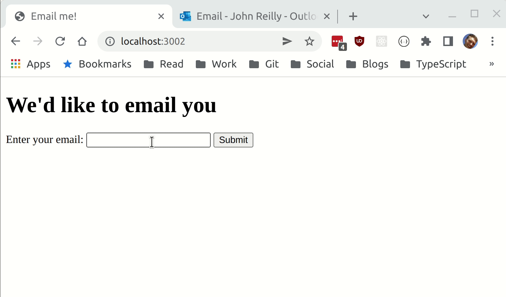
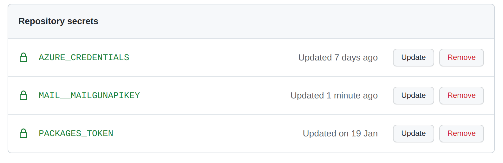
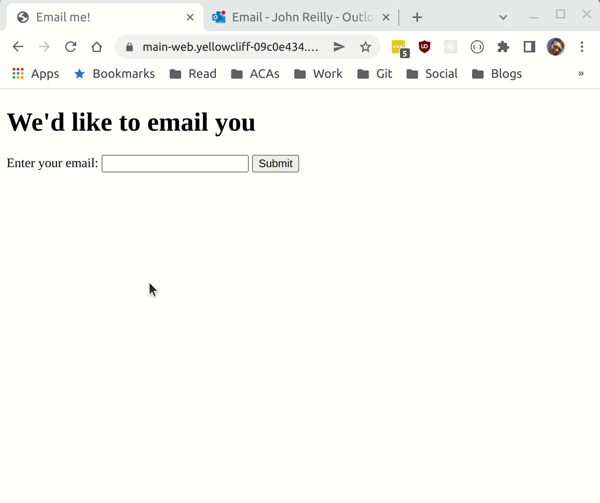

This post shows how to build and deploy two Azure Container Apps using Bicep and GitHub Actions. These apps will communicate using [dapr](https://docs.dapr.io/)'s [publish & subscribe (pubsub) building block](https://docs.dapr.io/developing-applications/building-blocks/pubsub/howto-publish-subscribe/).



<!--truncate-->

This post will build upon code written in a [previous post](../2022-01-22-azure-container-apps-dapr-bicep-github-actions-debug-devcontainer/index.md) which built and deployed a simple web application to Azure Container Apps using Bicep and GitHub Actions using the GitHub container registry. Behind the scenes, that app was made up of a .NET app and a Node.js app communicating via dapr's [service invocation building block](https://docs.dapr.io/developing-applications/building-blocks/service-invocation/howto-invoke-discover-services/).

There's a good chance you've just googled "pubsub dapr azure container apps" and you don't want to read through all this. You just want the code. That's fine. The code for this blogpost is [here](https://github.com/johnnyreilly/dapr-devcontainer-debug-and-deploy/releases/tag/v2.0.0).

## You got mail: service invocation

Right now we have a:

- Node.js web app and a
- .NET app

The web app, when called, uses dapr service invocation to acquire a weather forecast from a .NET app.

What we want to investigate is dapr's pubsub building block. But pubsub doesn't really "fit" into our current app. Let's alter it. Instead of showing users a weather forecast when they browse to the site, we'll instead look for our users to provide an email address, and we'll mail them a weather forecast.

This kind of app could work both using dapr service invocation or using pubsub. We're going to implement using our current service invocation approach first. Once that works, we'll then pivot that into using dapr pubsub.

This isn't rocket surgery; this is playing around with dapr and Azure Container Apps and seeing how they all hang together.

### .NET meet mailgun

Our existing .NET app needs the ability to send email. For that we're going to reach for [mailgun](https://app.mailgun.com/app/dashboard), and we'll use [RestSharp](https://restsharp.dev/) to call it. Let's add RestSharp as a dependency:

```shell
dotnet add package RestSharp
```

With that in place, let's turn to our `WeatherForecastController` and make it send an email.

```cs
using Config;

using Microsoft.AspNetCore.Mvc;
using Microsoft.Extensions.Options;

using RestSharp;
using RestSharp.Authenticators;

namespace WeatherService.Controllers;

[ApiController]
public class WeatherForecastController : ControllerBase
{
    private static readonly string[] Summaries = new[]
    {
        "Freezing", "Bracing", "Chilly", "Cool", "Mild", "Warm", "Balmy", "Hot", "Sweltering", "Scorching"
    };

    private readonly ILogger<WeatherForecastController> _logger;
    private readonly MailConfig _options;

    public WeatherForecastController(
        ILogger<WeatherForecastController> logger,
        IOptions<MailConfig> options
    )
    {
        _logger = logger;
        _options = options.Value;
    }

    public record SendWeatherForecastBody(string? Email);

    [HttpPost("SendWeatherForecast")]
    public async Task<string> SendWeatherForecast(SendWeatherForecastBody body)
    {
        try
        {
            if (string.IsNullOrEmpty(body.Email)) throw new Exception("Email required");

            var weatherForecast = Enumerable.Range(1, 5).Select(index => new WeatherForecast
            {
                Date = DateTime.Now.AddDays(index),
                TemperatureC = Random.Shared.Next(-20, 55),
                Summary = Summaries[Random.Shared.Next(Summaries.Length)]
            })
            .ToArray();

            var toEmailAddress = body.Email;
            var text = $@"The weather forecast is:

{string.Join("\n", weatherForecast.Select(wf => $"On {wf.Date} the weather will be {wf.Summary}"))}
";

            await SendSimpleMessage(
                toEmailAddress: toEmailAddress,
                text: text
            );

            return $"We have mailed {toEmailAddress} with the following:\n\n{text}";
        }
        catch (Exception exc)
        {
            _logger.LogError(exc, $"Problem!");

            return exc.Message;
        }
    }

    async Task<RestResponse> SendSimpleMessage(string toEmailAddress, string text)
    {
        RestClient client = new(new RestClientOptions
        {
            BaseUrl = new Uri("https://api.mailgun.net/v3")
        })
        {
            Authenticator =
            new HttpBasicAuthenticator("api", _options.MailgunApiKey)
        };
        RestRequest request = new();
        request.AddParameter("domain", "mg.priou.co.uk", ParameterType.UrlSegment);
        request.Resource = "{domain}/messages";
        request.AddParameter("from", "John Reilly <johnny_reilly@hotmail.com>");
        request.AddParameter("to", toEmailAddress);
        request.AddParameter("subject", "Weather forecast");
        request.AddParameter("text", text);

        return await client.PostAsync(request);
    }
}
```

In our new and improved controller we:

- Switch our `GET` endpoint to be a `POST` one instead, to reflect that we're going to take an action (sending an email) each time it's hit. (RESTful to the end)
- Rather than returning the weather forecast to our caller, we take the email address supplied and we send the weather forecast to it

You'll also notice we're passing a `IOptions<MailConfig>` to the constructor of our class, it's in this configuration object we store our Mailgun api key. So we're going to need to define a `MailConfig` class:

```cs
public class MailConfig
{
    public string MailgunApiKey { get; set; } = string.Empty;
}
```

And we need to update our `Program.cs` so it recognises `MailConfig` and configures it:

```cs
var builder = WebApplication.CreateBuilder(args);

builder.Services.Configure<MailConfig>(builder.Configuration.GetSection("Mail"));
// ...
```

Thanks to the default setup of .NET, we'll now be able to populate this using `appsettings.json` files and environment variables. Since our API key is a secret we'll avoid putting it in source control, and instead populate an environment variable that .NET can read:

```
MAIL__MAILGUNAPIKEY=key-goes-here
```

The `__` above is the convention that .NET follows for nesting with environment variables; this is equivalent to the following structure in an `appsettings.json` file:

```json
{
  "Mail": {
    "MailgunApiKey": "api-key-goes-here"
  }
  // ...
}
```

### Webservice gets a form

Now that we've tweaked our WeatherService, we need to tweak the web site that calls it. We'll do that by first adding some dependencies that allow our Koa web service to handle routing a little easier:

```shell
npm install @koa/router koa-body --save
npm install @types/koa__router --save-dev
```

Then we'll tweak our `index.ts` like so:

```ts
import Koa from 'koa';
import Router from '@koa/router';
import koaBody from 'koa-body';
import axios from 'axios';

// How we connect to the dotnet service with dapr
const daprSidecarBaseUrl = `http://localhost:${
  process.env.DAPR_HTTP_PORT || 3501
}`;
// app id header for service discovery
const weatherServiceAppIdHeaders = {
  'dapr-app-id': process.env.WEATHER_SERVICE_NAME || 'dotnet-app',
};

const app = new Koa();
const router = new Router();

app.use(async (ctx, next) => {
  try {
    await next();
    const status = ctx.status || 404;
    if (status === 404) ctx.throw(404);
  } catch (err: any) {
    ctx.status = err.status || 500;
    ctx.body = ctx.status === 404 ? 'not found alas' : `hmmm: ${ctx.status}`;
  }
});

const formHtml = (header: string) => `<!DOCTYPE html>
<html>
<head>
<title>Email me!</title>
</head>
<body>
<form method="post">
    <h1>${header}</h1>
    <label for="email">Enter your email:</label>
    <input type="email" id="email" name="email" required>
    <button type="submit">Submit</button>
</form>
</body>
</html>
`;

router.get('/', async (ctx, next) => {
  ctx.body = formHtml("We'd like to email you");
});

router.post('/', koaBody(), async (ctx, next) => {
  try {
    if (ctx.request.body.email) {
      await axios.post(
        `${daprSidecarBaseUrl}/SendWeatherForecast`,
        {
          email: ctx.request.body.email,
        },
        {
          headers: weatherServiceAppIdHeaders,
        },
      );

      ctx.body = formHtml('Message sent');
    } else {
      ctx.body = formHtml('No email supplied');
    }
  } catch (exc) {
    console.error('Problem calling weather service', exc);
    ctx.body = 'Something went wrong!';
  }
});

app.use(router.routes()).use(router.allowedMethods());

const portNumber = 3000;
app.listen(portNumber);
console.log(`listening on port ${portNumber}`);
```

The above leaves us with a very simple form based web app that sends an email containing weather forecast:



### Secrets in Bicep

Whilst we can run locally, we want to be able to deploy this. So we need to update our Bicep template to receive a `MAIL__MAILGUNAPIKEY` parameter:

```bicep
param branchName string

param webServiceImage string
param webServicePort int
param webServiceIsExternalIngress bool

param weatherServiceImage string
param weatherServicePort int
param weatherServiceIsExternalIngress bool

param containerRegistry string
param containerRegistryUsername string
@secure()
param containerRegistryPassword string

param tags object

@secure()
param MAIL__MAILGUNAPIKEY string

param location string = resourceGroup().location
var minReplicas = 1
var maxReplicas = 1

var branch = toLower(last(split(branchName, '/')))

var environmentName = '${branch}-env'
var workspaceName = '${branch}-log-analytics'
var appInsightsName = '${branch}-app-insights'
var webServiceContainerAppName = '${branch}-web'
var weatherServiceContainerAppName = '${branch}-weather'

var containerRegistryPasswordRef = 'container-registry-password'
var mailgunApiKeyRef = 'mailgun-api-key'

resource workspace 'Microsoft.OperationalInsights/workspaces@2021-12-01-preview' = {
  name: workspaceName
  location: location
  tags: tags
  properties: {
    sku: {
      name: 'PerGB2018'
    }
    retentionInDays: 30
    workspaceCapping: {}
  }
}

resource appInsights 'Microsoft.Insights/components@2020-02-02' = {
  name: appInsightsName
  location: location
  tags: tags
  kind: 'web'
  properties: {
    Application_Type: 'web'
    Flow_Type: 'Bluefield'
  }
}

resource environment 'Microsoft.App/managedEnvironments@2022-01-01-preview' = {
  name: environmentName
  location: location
  tags: tags
  properties: {
    daprAIInstrumentationKey: appInsights.properties.InstrumentationKey
    appLogsConfiguration: {
      destination: 'log-analytics'
      logAnalyticsConfiguration: {
        customerId: workspace.properties.customerId
        sharedKey: listKeys(workspace.id, workspace.apiVersion).primarySharedKey
      }
    }
  }
}

resource weatherServiceContainerApp 'Microsoft.App/containerApps@2022-01-01-preview' = {
  name: weatherServiceContainerAppName
  tags: tags
  location: location
  properties: {
    kubeEnvironmentId: environment.id
    configuration: {
      secrets: [
        {
          name: containerRegistryPasswordRef
          value: containerRegistryPassword
        }
        {
          name: mailgunApiKeyRef
          value: MAIL__MAILGUNAPIKEY
        }
      ]
      registries: [
        {
          server: containerRegistry
          username: containerRegistryUsername
          passwordSecretRef: containerRegistryPasswordRef
        }
      ]
      ingress: {
        external: weatherServiceIsExternalIngress
        targetPort: weatherServicePort
      }
    }
    template: {
      containers: [
        {
          image: weatherServiceImage
          name: weatherServiceContainerAppName
          env: [
            {
              name: 'MAIL__MAILGUNAPIKEY'
              secretRef: mailgunApiKeyRef
            }
          ]
        }
      ]
      scale: {
        minReplicas: minReplicas
        maxReplicas: maxReplicas
      }
      dapr: {
        enabled: true
        appPort: weatherServicePort
        appId: weatherServiceContainerAppName
      }
    }
  }
}

resource webServiceContainerApp 'Microsoft.App/containerApps@2022-01-01-preview' = {
  name: webServiceContainerAppName
  tags: tags
  location: location
  properties: {
    kubeEnvironmentId: environment.id
    configuration: {
      secrets: [
        {
          name: containerRegistryPasswordRef
          value: containerRegistryPassword
        }
      ]
      registries: [
        {
          server: containerRegistry
          username: containerRegistryUsername
          passwordSecretRef: containerRegistryPasswordRef
        }
      ]
      ingress: {
        external: webServiceIsExternalIngress
        targetPort: webServicePort
      }
    }
    template: {
      containers: [
        {
          image: webServiceImage
          name: webServiceContainerAppName
          env: [
            {
              name: 'WEATHER_SERVICE_NAME'
              value: weatherServiceContainerAppName
            }
          ]
        }
      ]
      scale: {
        minReplicas: minReplicas
        maxReplicas: maxReplicas
      }
      dapr: {
        enabled: true
        appPort: webServicePort
        appId: webServiceContainerAppName
      }
    }
  }
}

output webServiceUrl string = webServiceContainerApp.properties.latestRevisionFqdn
```

We can see that we treat the `MAIL__MAILGUNAPIKEY` as a secret. It's passed in using the `@secure` decorator and it's configured as a secret inside the `weatherServiceContainerApp` Azure Container App.

We have a GitHub Action that handles our deployment. We'll need to introduce the `MAIL__MAILGUNAPIKEY` secret both to the deploy step of the `build-and-deploy.yaml`:

```yaml
deploy:
  runs-on: ubuntu-latest
  needs: [build]
  steps:
    - name: Checkout repository
      uses: actions/checkout@v2

    - name: Azure Login
      uses: azure/login@v1
      with:
        creds: ${{ secrets.AZURE_CREDENTIALS }}

    - name: Deploy bicep
      uses: azure/CLI@v2
      if: github.event_name != 'pull_request'
      with:
        inlineScript: |
          REF_SHA='${{ github.ref }}.${{ github.sha }}'
          DEPLOYMENT_NAME="${REF_SHA////-}"
          echo "DEPLOYMENT_NAME=$DEPLOYMENT_NAME"

          TAGS='{"owner":"johnnyreilly", "email":"johnny_reilly@hotmail.com"}'
          az deployment group create \
            --resource-group ${{ env.RESOURCE_GROUP }} \
            --name "$DEPLOYMENT_NAME" \
            --template-file ./infra/main.bicep \
            --parameters \
                branchName='${{ github.event.number == 0 && 'main' ||  format('pr-{0}', github.event.number) }}' \
                webServiceImage='${{ needs.build.outputs.image-node }}' \
                webServicePort=3000 \
                webServiceIsExternalIngress=true \
                weatherServiceImage='${{ needs.build.outputs.image-dotnet }}' \
                weatherServicePort=5000 \
                weatherServiceIsExternalIngress=false \
                containerRegistry=${{ env.REGISTRY }} \
                containerRegistryUsername=${{ github.actor }} \
                containerRegistryPassword=${{ secrets.PACKAGES_TOKEN }} \
                tags="$TAGS" \
                MAIL__MAILGUNAPIKEY="${{ secrets.MAIL__MAILGUNAPIKEY }}"
```

And we'll need to create the associated secret as well:



## You got mail: pubsub!

So we're now at the point where we have a pubsub style app - but still implemented using the service invocation approach. It's time to start migrating to using dapr's pubsub capabilities. Now, caveat emptor, pivoting from service invocation involves a fair amount of code. I'll try and be as brief as I can as we make the switch. However there will be big ol' lumps of code blocks as we do this. You may find it easier to just examine the finished code. I will in no way feel bad if that's the path you follow.

### Publishing with dapr-client

The first thing we need, is for our Node.js app to publish using the dapr pubsub mechanism. The easiest way to do that is with the [dapr-client](https://docs.dapr.io/developing-applications/sdks/js/):

```shell
npm install dapr-client --save
```

We then switch out using axios to send our email command, to use `dapr-client` instead:

```ts
import Koa from 'koa';
import Router from '@koa/router';
import koaBody from 'koa-body';

import { DaprClient } from 'dapr-client';

const daprHost = 'localhost'; // Dapr Sidecar Host
const daprPort = `${process.env.DAPR_HTTP_PORT || 3501}`; // Dapr Sidecar Port

const client = new DaprClient(daprHost, daprPort);

const app = new Koa();
const router = new Router();

app.use(async (ctx, next) => {
  try {
    await next();
    const status = ctx.status || 404;
    if (status === 404) ctx.throw(404);
  } catch (err: any) {
    ctx.status = err.status || 500;
    ctx.body = ctx.status === 404 ? 'not found alas' : `hmmm: ${ctx.status}`;
  }
});

const formHtml = (header: string) => `<!DOCTYPE html>
<html>
<head>
<title>Email me!</title>
</head>
<body>
<form method="post">
    <h1>${header}</h1>
    <label for="email">Enter your email:</label>
    <input type="email" id="email" name="email" required>
    <button type="submit">Submit</button>
</form>
</body>
</html>
`;

router.get('/', async (ctx, next) => {
  ctx.body = formHtml("We'd like to email you");
});

router.post('/', koaBody(), async (ctx, next) => {
  try {
    if (ctx.request.body.email) {
      // Send a message
      const sent = await client.pubsub.publish(
        /* pubSubName */ 'weather-forecast-pub-sub',
        /* topic */ 'weather-forecasts',
        /* data */ {
          email: ctx.request.body.email,
        },
      );

      ctx.body = formHtml(`Message sent: ${sent}`);
    } else {
      ctx.body = formHtml('No email supplied');
    }
  } catch (exc) {
    console.error('Problem calling weather service', exc);
    ctx.body = 'Something went wrong!';
  }
});

app.use(router.routes()).use(router.allowedMethods());

const portNumber = 3000;
app.listen(portNumber);
console.log(`listening on port ${portNumber}`);
```

The thing to note above is the `client.pubsub.publish`; our WebService will now be publishing using pubsub, instead of using axios and service invocation.

### Subscribing

Our WeatherService needs to be able to receive what is published. To make that happen, we'll make use of the following NuGet package in WeatherService:

```shell
dotnet add package Dapr.AspNetCore --version 1.7.0
```

Our `Program.cs` is adjusted to cater for this:

```cs
using Config;

var builder = WebApplication.CreateBuilder(args);

builder.Services.Configure<MailConfig>(builder.Configuration.GetSection("Mail"));

builder.Services.AddControllers().AddDapr();
// Learn more about configuring Swagger/OpenAPI at https://aka.ms/aspnetcore/swashbuckle
builder.Services.AddEndpointsApiExplorer();
builder.Services.AddSwaggerGen();

var app = builder.Build();

// Configure the HTTP request pipeline.
if (app.Environment.IsDevelopment())
{
    app.UseSwagger();
    app.UseSwaggerUI();
}

app.UseAuthorization();

app.UseCloudEvents();

app.MapSubscribeHandler(); // This is the Dapr subscribe handler
app.MapControllers();

app.Run();
```

The significant pieces above are:

```cs
builder.Services.AddControllers().AddDapr();

// ...

app.UseCloudEvents();
app.MapSubscribeHandler(); // This is the Dapr subscribe handler
```

We'll also need to update our `WeatherForecastController.cs`:

```cs
using Config;

using Microsoft.AspNetCore.Mvc;
using Microsoft.Extensions.Options;

using RestSharp;
using RestSharp.Authenticators;

using Dapr;

namespace WeatherService.Controllers;

[ApiController]
public class WeatherForecastController : ControllerBase
{
    private static readonly string[] Summaries = new[]
    {
        "Freezing", "Bracing", "Chilly", "Cool", "Mild", "Warm", "Balmy", "Hot", "Sweltering", "Scorching"
    };

    private readonly ILogger<WeatherForecastController> _logger;
    private readonly MailConfig _options;

    public WeatherForecastController(
        ILogger<WeatherForecastController> logger,
        IOptions<MailConfig> options
    )
    {
        _logger = logger;
        _options = options.Value;
    }

    public record SendWeatherForecastBody(string? Email);

    [Topic(pubsubName: "weather-forecast-pub-sub", name: "weather-forecasts")]
    [HttpPost("SendWeatherForecast")]
    public async Task<ActionResult<string>> SendWeatherForecast(SendWeatherForecastBody body)
    {
        try
        {
            if (string.IsNullOrEmpty(body.Email)) throw new Exception("Email required");

            var weatherForecast = Enumerable.Range(1, 5).Select(index => new WeatherForecast
            {
                Date = DateTime.Now.AddDays(index),
                TemperatureC = Random.Shared.Next(-20, 55),
                Summary = Summaries[Random.Shared.Next(Summaries.Length)]
            })
            .ToArray();

            var toEmailAddress = body.Email;
            var text = $@"The weather forecast is:

{string.Join("\n", weatherForecast.Select(wf => $"On {wf.Date} the weather will be {wf.Summary}"))}
";

            await SendSimpleMessage(
                toEmailAddress: toEmailAddress,
                text: text
            );

            return Ok($"We have mailed {toEmailAddress} with the following:\n\n{text})");
        }
        catch (Exception exc)
        {
            _logger.LogError(exc, $"Problem!");

            return BadRequest(exc.Message);
        }
    }

    async Task<RestResponse> SendSimpleMessage(string toEmailAddress, string text)
    {
        RestClient client = new(new RestClientOptions
        {
            BaseUrl = new Uri("https://api.mailgun.net/v3")
        })
        {
            Authenticator =
            new HttpBasicAuthenticator("api", _options.MailgunApiKey)
        };
        RestRequest request = new();
        request.AddParameter("domain", "mg.priou.co.uk", ParameterType.UrlSegment);
        request.Resource = "{domain}/messages";
        request.AddParameter("from", "John Reilly <johnny_reilly@hotmail.com>");
        request.AddParameter("to", toEmailAddress);
        request.AddParameter("subject", "Weather forecast");
        request.AddParameter("text", text);

        return await client.PostAsync(request);
    }
}
```

Really the only new thing here is the `Topic` attribute on the `SendWeatherForecast` endpoint:

```cs
[Topic(pubsubName: "weather-forecast-pub-sub", name: "weather-forecasts")]
```

This is used (as you might imagine) to route messages.

The real difference to call out in what we've done so far, is that both our publisher (Node.js) and our subscriber (.NET) have become "dapr aware". Although there have been changes in our code to achieve this, they have not been extensive. Noisy, yes. But not big changes.

### Components

In order to communicate via pubsub, dapr needs some [components](https://docs.dapr.io/concepts/components-concept/) in place. We'll create a folder in the root of our project named `components`, and in there create three files:

#### `pubsub.yaml`

```yml
apiVersion: dapr.io/v1alpha1
kind: Component
metadata:
  name: weather-forecast-pub-sub
  namespace: default
spec:
  type: pubsub.redis
  version: v1
  metadata:
    - name: redisHost
      value: localhost:6379
    - name: redisPassword
      value: ''
scopes:
  - node-app
  - dotnet-app
```

#### `statestore.yaml`

```yml
apiVersion: dapr.io/v1alpha1
kind: Component
metadata:
  name: statestore
  namespace: default
spec:
  type: state.redis
  version: v1
  metadata:
    - name: redisHost
      value: localhost:6379
    - name: redisPassword
      value: ''
    - name: actorStateStore
      value: 'true'
```

#### `subscription.yaml`

```yml
apiVersion: dapr.io/v1alpha1
kind: Subscription
metadata:
  name: weather-forecast-pub-sub
spec:
  topic: weather-forecasts
  route: /SendWeatherForecast
  pubsubname: weather-forecast-pub-sub
scopes:
  - node-app
  - dotnet-app
```

These three files are fairly self-explanatory. It's worth drawing attention to the following though:

1. We're going to use these components when running locally and so we'll use Redis for our persistence. When we deploy to Azure Container Apps we'll use something more Azure specific.
2. We're granting access in these components to our node-app (WebService) and our dotnet-app (WeatherService)
3. We're wiring up our subscription in `subscription.yaml`- it's this that will be used to route traffic from publishing to subscription.

With the above in place we're almost ready to be able to run this locally and debug using VS Code. The final tweak is to make our apps aware of the dapr components. This is achieved by adding `"componentsPath": "./components",` to the entries in our `tasks.json` file. In full it looks like this:

```json
{
  // See https://go.microsoft.com/fwlink/?LinkId=733558
  // for the documentation about the tasks.json format
  "version": "2.0.0",
  "tasks": [
    {
      "label": "dotnet-build",
      "command": "dotnet",
      "type": "process",
      "args": [
        "build",
        "${workspaceFolder}/WeatherService/WeatherService.csproj",
        "/property:GenerateFullPaths=true",
        "/consoleloggerparameters:NoSummary"
      ],
      "problemMatcher": "$msCompile"
    },
    {
      "label": "daprd-debug-dotnet",
      "appId": "dotnet-app",
      "appPort": 5000,
      "httpPort": 3500,
      "grpcPort": 50000,
      "metricsPort": 9090,
      "componentsPath": "./components",
      "type": "daprd",
      "dependsOn": ["dotnet-build"]
    },
    {
      "label": "daprd-down-dotnet",
      "appId": "dotnet-app",
      "type": "daprd-down"
    },

    {
      "label": "npm-install",
      "type": "shell",
      "command": "npm install",
      "options": {
        "cwd": "${workspaceFolder}/WebService"
      }
    },
    {
      "label": "webservice-build",
      "type": "typescript",
      "tsconfig": "WebService/tsconfig.json",
      "problemMatcher": ["$tsc"],
      "group": {
        "kind": "build",
        "isDefault": true
      },
      "dependsOn": ["npm-install"]
    },
    {
      "label": "daprd-debug-node",
      "appId": "node-app",
      "appPort": 3000,
      "httpPort": 3501,
      "grpcPort": 50001,
      "metricsPort": 9091,
      "componentsPath": "./components",
      "type": "daprd",
      "dependsOn": ["webservice-build"]
    },
    {
      "label": "daprd-down-node",
      "appId": "node-app",
      "type": "daprd-down"
    }
  ]
}
```

With this in place we're ready to run our apps locally using pubsub. We can publish from the WebService and receive in the WeatherService. This results in the expected email being sent, as we would hope.

### Bicep

The missing piece is Azure. How do we deploy this to Azure Container Apps? Well, we have everything we need to do this, save for the Bicep. We need to augment the Bicep we already have to include our Azure Container Apps dapr components. The full template looks like this:

```bicep
param branchName string

param webServiceImage string
param webServicePort int
param webServiceIsExternalIngress bool

param weatherServiceImage string
param weatherServicePort int
param weatherServiceIsExternalIngress bool

param containerRegistry string
param containerRegistryUsername string
@secure()
param containerRegistryPassword string

param tags object

@secure()
param MAIL__MAILGUNAPIKEY string

param location string = resourceGroup().location

@description('Storage Account type')
@allowed([
  'Premium_LRS'
  'Premium_ZRS'
  'Standard_GRS'
  'Standard_GZRS'
  'Standard_LRS'
  'Standard_RAGRS'
  'Standard_RAGZRS'
  'Standard_ZRS'
])
param storageAccountType string = 'Standard_LRS'

@description('The name of the Storage Account')
param storageAccountName string = 'store${uniqueString(resourceGroup().id)}'

param serviceBusNamespace string = 'pubsub-namespace'

resource storageAccount 'Microsoft.Storage/storageAccounts@2021-06-01' = {
  name: storageAccountName
  location: location
  sku: {
    name: storageAccountType
  }
  kind: 'StorageV2'
  properties: {}
}

resource serviceBus 'Microsoft.ServiceBus/namespaces@2021-06-01-preview' = {
  name: serviceBusNamespace
  location: location
}

resource servicebus_authrule 'Microsoft.ServiceBus/namespaces/AuthorizationRules@2021-06-01-preview' existing = {
  name: 'RootManageSharedAccessKey'
  parent: serviceBus
}

resource topic 'Microsoft.ServiceBus/namespaces/topics@2021-06-01-preview' = {
  name: 'weather-forecasts'
  parent: serviceBus
}

var minReplicas = 1
var maxReplicas = 1

var branch = toLower(last(split(branchName, '/')))

var environmentName = 'shared-env'
var workspaceName = '${branch}-log-analytics'
var appInsightsName = '${branch}-app-insights'
var webServiceContainerAppName = '${branch}-web'
var weatherServiceContainerAppName = '${branch}-weather'

var containerRegistryPasswordRef = 'container-registry-password'
var mailgunApiKeyRef = 'mailgun-api-key'

resource workspace 'Microsoft.OperationalInsights/workspaces@2021-12-01-preview' = {
  name: workspaceName
  location: location
  tags: tags
  properties: {
    sku: {
      name: 'PerGB2018'
    }
    retentionInDays: 30
    workspaceCapping: {}
  }
}

resource appInsights 'Microsoft.Insights/components@2020-02-02' = {
  name: appInsightsName
  location: location
  tags: tags
  kind: 'web'
  properties: {
    Application_Type: 'web'
    Flow_Type: 'Bluefield'
  }
}

resource environment 'Microsoft.App/managedEnvironments@2022-01-01-preview' = {
  name: environmentName
  location: location
  tags: tags
  properties: {
    daprAIInstrumentationKey: appInsights.properties.InstrumentationKey
    appLogsConfiguration: {
      destination: 'log-analytics'
      logAnalyticsConfiguration: {
        customerId: workspace.properties.customerId
        sharedKey: listKeys(workspace.id, workspace.apiVersion).primarySharedKey
      }
    }
  }
  resource statestoreComponent 'daprComponents@2022-03-01' = {
    name: 'statestore'
    properties: {
      componentType: 'state.azure.blobstorage'
      version: 'v1'
      ignoreErrors: false
      initTimeout: '5s'
      secrets: [
        {
          name: 'storageaccountkey'
          value: listKeys(resourceId('Microsoft.Storage/storageAccounts/', storageAccount.name), storageAccount.apiVersion).keys[0].value
        }
      ]
      metadata: [
        {
          name: 'accountName'
          value: storageAccount.name
        }
        {
          name: 'containerName'
          value: 'storage_container_name'
        }
        {
          name: 'accountKey'
          secretRef: 'storageaccountkey'
        }
      ]
      scopes: [
        weatherServiceContainerAppName
        webServiceContainerAppName
      ]
    }
  }
  resource pubsubComponent 'daprComponents@2022-03-01' = {
    name: 'weather-forecast-pub-sub'
    properties: {
      componentType: 'pubsub.azure.servicebus'
      version: 'v1'
      metadata: [
        {
          name: 'connectionString'
          secretRef: 'sb-root-connectionstring'
        }
      ]
      secrets: [
        {
          name: 'sb-root-connectionstring'
          value: listKeys('${serviceBus.id}/AuthorizationRules/RootManageSharedAccessKey', serviceBus.apiVersion).primaryConnectionString
        }
      ]
      scopes: [
        weatherServiceContainerAppName
        webServiceContainerAppName
      ]
    }
  }
}

resource weatherServiceContainerApp 'Microsoft.App/containerApps@2022-01-01-preview' = {
  name: weatherServiceContainerAppName
  tags: tags
  location: location
  properties: {
    managedEnvironmentId: environment.id
    configuration: {
      dapr: {
        enabled: true
        appPort: weatherServicePort
        appId: weatherServiceContainerAppName
      }
      secrets: [
        {
          name: containerRegistryPasswordRef
          value: containerRegistryPassword
        }
        {
          name: mailgunApiKeyRef
          value: MAIL__MAILGUNAPIKEY
        }
      ]
      registries: [
        {
          server: containerRegistry
          username: containerRegistryUsername
          passwordSecretRef: containerRegistryPasswordRef
        }
      ]
      ingress: {
        external: weatherServiceIsExternalIngress
        targetPort: weatherServicePort
      }
    }
    template: {
      containers: [
        {
          image: weatherServiceImage
          name: weatherServiceContainerAppName
          env: [
            {
              name: 'MAIL__MAILGUNAPIKEY'
              secretRef: mailgunApiKeyRef
            }
          ]
        }
      ]
      scale: {
        minReplicas: minReplicas
        maxReplicas: maxReplicas
      }
    }
  }
}

resource webServiceContainerApp 'Microsoft.App/containerApps@2022-01-01-preview' = {
  name: webServiceContainerAppName
  tags: tags
  location: location
  properties: {
    managedEnvironmentId: environment.id
    configuration: {
      dapr: {
        enabled: true
        appPort: webServicePort
        appId: webServiceContainerAppName
      }
      secrets: [
        {
          name: containerRegistryPasswordRef
          value: containerRegistryPassword
        }
      ]
      registries: [
        {
          server: containerRegistry
          username: containerRegistryUsername
          passwordSecretRef: containerRegistryPasswordRef
        }
      ]
      ingress: {
        external: webServiceIsExternalIngress
        targetPort: webServicePort
      }
    }
    template: {
      containers: [
        {
          image: webServiceImage
          name: webServiceContainerAppName
          env: [
            {
              name: 'WEATHER_SERVICE_NAME'
              value: weatherServiceContainerAppName
            }
          ]
        }
      ]
      scale: {
        minReplicas: minReplicas
        maxReplicas: maxReplicas
      }
    }
  }
}

output webServiceUrl string = webServiceContainerApp.properties.latestRevisionFqdn
```

Now this is undeniably a big lump of Bicep. Let's drill into the significant differences:

1. We're creating an Azure storage account.
2. We're creating an Azure Service Bus and a topic under it named `'weather-forecasts'`.
3. Underneath our managed environment, we're creating a statestore (using the storage account) which is the Azure equivalent of our `statestore.yml`, but using Azure storage.
4. Also underneath our managed environment, we're creating a pubsub (using the service bus) which is the Azure equivalent of our `pubsub.yml`, but using our Azure ServiceBus.

It's also worth noting that we always have an instance of the services running; `minReplicas: 1`. This is because when we dial it down to 0, the Weather Service will stop running. Probably there's a fancy KEDA trigger that prevents this; I haven't figured it out.

### No declarative pubsub subscription support

Whilst you might be thinking "we're home free now!" - it turns out we're not. Whilst we'd created Azure equivalents of our `statestore.yml` and `pubsub.yml`, you'll note there didn't seem to be an equivalent of the `subscriptions` component in Bicep.

[It turns out support for declarative pub/sub subscriptions is not yet available](https://docs.microsoft.com/en-us/azure/container-apps/dapr-overview?tabs=bicep1%2Cyaml#known-limitations):

> Known limitations
> Declarative pub/sub subscriptions

So whilst we can take the code we have here and run locally, we cannot deploy it to Azure.

However, whilst there's no declaritive support for subscriptions, there is programmatic support. It involves more of a pivot in how we put together our code. But since it's the only game in town, we'll give it a go.

## You got mail: programmatic subscriptions!

We can get rid of our `subscriptions.yaml` file now - we're going programmatic instead of declarative.

We're going to replace our `WeatherForecastController.cs` with a `WeatherForecastEndpoints.cs` which contains very similar code, but uses the .NET 6 minimal API approach instead: (There appears to be a way to work with MVC but it's not clear how to use it, and it appears to be a more confusing approach than the .NET 6 minimal API approach.)

```cs
using Config;

using Microsoft.Extensions.Options;

using RestSharp;
using RestSharp.Authenticators;

using Dapr;

namespace WeatherService.Endpoints;

public static class WeatherForecastEndpoints
{
    private static readonly string[] Summaries = new[]
    {
        "Freezing", "Bracing", "Chilly", "Cool", "Mild", "Warm", "Balmy", "Hot", "Sweltering", "Scorching"
    };

    public record SendWeatherForecastBody(string? Email);

    public static IEndpointRouteBuilder MapWeatherForecastEndpoints(this IEndpointRouteBuilder endpoints)
    {
        endpoints.MapPost("/SendWeatherForecast",
            [Topic("weather-forecast-pub-sub", "weather-forecasts")]
            async (
                SendWeatherForecastBody body,
                ILogger<SendWeatherForecastBody> logger,
                IOptions<MailConfig> options
            ) =>
            {
                try
                {
                    if (string.IsNullOrEmpty(body.Email)) throw new Exception("Email required");

                    var weatherForecast = Enumerable.Range(1, 5).Select(index => new WeatherForecast
                    {
                        Date = DateTime.Now.AddDays(index),
                        TemperatureC = Random.Shared.Next(-20, 55),
                        Summary = Summaries[Random.Shared.Next(Summaries.Length)]
                    })
                    .ToArray();

                    var toEmailAddress = body.Email;
                    var text = $@"The weather forecast is:

{string.Join("\n", weatherForecast.Select(wf => $"On {wf.Date} the weather will be {wf.Summary}"))}
";

                    await SendSimpleMessage(
                        mailgunApiKey: options.Value.MailgunApiKey,
                        toEmailAddress: toEmailAddress,
                        text: text
                    );

                    return Results.Ok($"We have mailed {toEmailAddress} with the following:\n\n{text})");
                }
                catch (Exception exc)
                {
                    logger.LogError(exc, $"Problem!");

                    return Results.BadRequest(exc.Message);
                }
            });

        return endpoints;
    }

    static async Task<RestResponse> SendSimpleMessage(string mailgunApiKey, string toEmailAddress, string text)
    {
        RestClient client = new(new RestClientOptions
        {
            BaseUrl = new Uri("https://api.mailgun.net/v3")
        })
        {
            Authenticator =
            new HttpBasicAuthenticator("api", mailgunApiKey)
        };
        RestRequest request = new();
        request.AddParameter("domain", "mg.priou.co.uk", ParameterType.UrlSegment);
        request.Resource = "{domain}/messages";
        request.AddParameter("from", "John Reilly <johnny_reilly@hotmail.com>");
        request.AddParameter("to", toEmailAddress);
        request.AddParameter("subject", "Weather forecast");
        request.AddParameter("text", text);

        return await client.PostAsync(request);
    }
}
```

The significant thing to note above is the `[Topic("weather-forecast-pub-sub", "weather-forecasts")]` that we're adding to our `MapPost` in the `MapWeatherForecastEndpoints` method. This is the equivalent of the `subscriptions` component that we wanted to create in Bicep but couldn't. This is our programmatic subscription.

We also need to tweak our `Program.cs` to cater for the new `WeatherForecastEndpoints` class:

```cs
using Config;
using WeatherService.Endpoints;

var builder = WebApplication.CreateBuilder(args);

builder.Services.Configure<MailConfig>(builder.Configuration.GetSection("Mail"));

builder.Services.AddControllers().AddDapr();
// Learn more about configuring Swagger/OpenAPI at https://aka.ms/aspnetcore/swashbuckle
builder.Services.AddEndpointsApiExplorer();
builder.Services.AddSwaggerGen();

var app = builder.Build();

// Configure the HTTP request pipeline.
if (app.Environment.IsDevelopment())
{
    app.UseSwagger();
    app.UseSwaggerUI();
}

app.UseAuthorization();

app.UseCloudEvents();

app.MapSubscribeHandler(); // This is the Dapr subscribe handler

app.MapWeatherForecastEndpoints();

app.Run();
```

So the `app.MapWeatherForecastEndpoints();` is what wires up our `WeatherForecastEndpoints` class.

With that in place, we're ready to deploy to Azure.



We now have Azure Container Apps running in Azure, using the dapr pubsub component. Hopefully in future declarative subscribtions will be available also, but for now we can use the programmatic approach.
