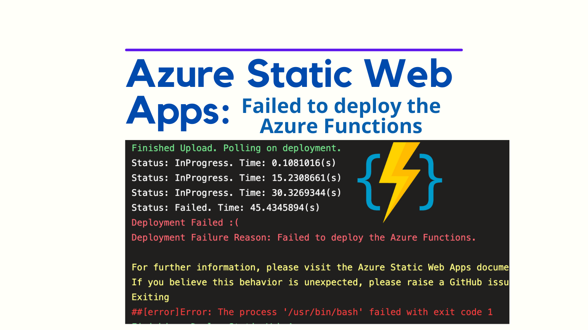
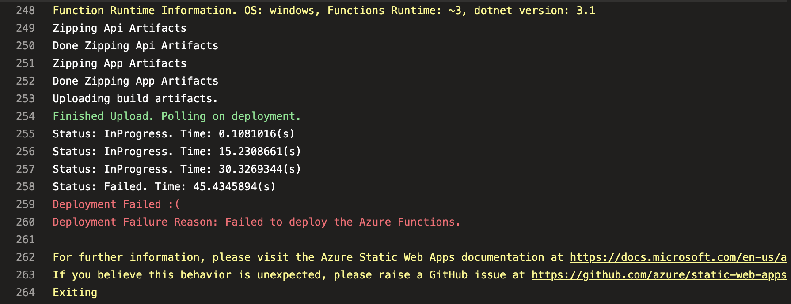
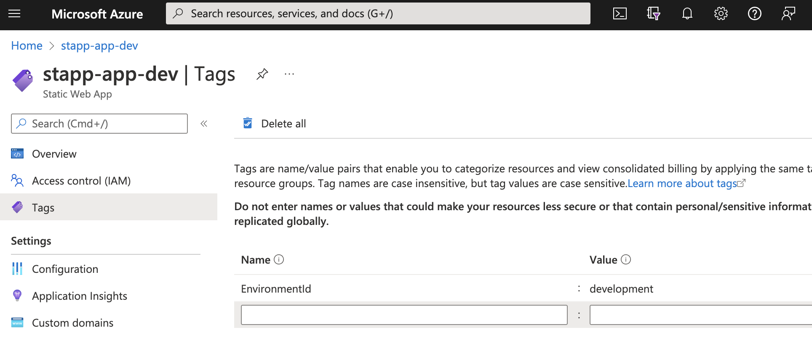

Azure Static Web Apps presently have an issue which blocks deployment of Azure Functions with the message "Failed to deploy the Azure Functions". This happens when the resource is tagged with an `EnvironmentId` tag and is discussed in [this GitHub issue](https://github.com/Azure/static-web-apps/issues/723). There is a workaround which we will examine.



<!--truncate-->

## Failed to deploy the Azure Functions

[Azure Static Web Apps](https://azure.microsoft.com/en-us/services/app-service/static/) are a combination of static front end hosting and an optional serverless API back end. The front end portion of Azure Static Web Apps is very plug and play. However there can be complexities when it comes to adding an API back end. One issue is a failure to deploy in the context of an Azure Pipeline which presents like this:



Above you can see the [`AzureStaticWebApp@0`](https://github.com/microsoft/azure-pipelines-tasks/tree/master/Tasks/AzureStaticWebAppV0) dedicated Azure Pipelines task that is used to deploy Azure Static Web Apps. It fails with the message "Failed to deploy the Azure Functions". There is no actionable feedback in this output, which makes coming up with remedies difficult.

As I was looking into this with Emad Khalifah of Microsoft Support, Emad pointed me to [this GitHub issue](https://github.com/Azure/static-web-apps/issues/723). Ironically, this had been raised by my colleage [John McCormick](https://github.com/johnmccormick99) back in February 2022.

The issue he experienced occurred when an `EnvironmentId` tag tag is present on the Azure Static Web Apps resource like so:



We do this in our organisation, and looking at the comments on the issue, it appears there are others out there doing the same. Given the name of the tag, this is not terribly surprising.

Unfortunately, this issue has not been resolved. Can we work around the issue? Yes.

## Fiddling with tags

In our organisation we enforce the tags we use in Azure strictly. So we found ourself in the bind of both needing tags for our own internal processes, but needing to work around the issue.

However, the excellent [Ryan Cook](https://github.com/ryanmatcook) came up with a workaround. It works like this:

- use the Azure CLI to remove the `EnvironmentId` tag from the static web app resource
- Deploy the static web app
- use the Azure CLI to add the `EnvironmentId` tag back to the static web app resource

It's hacky. It can require multiple runs to work (I ascribe this to eventual consistency issues in Azure; but that's not based on evidence). However, it can be a way forward. I acknowledge this is suboptimal.

Should anyone else bump on this issue, here is the (hacky) workaround:

```yml
- task: AzureCLI@2
  displayName: 'Remove EnvironmentId tag from resource group'
  inputs:
    azureSubscription: ${{ variables.serviceConnection }}
    scriptType: bash
    scriptLocation: inlineScript
    inlineScript: |
      az tag update --resource-id /subscriptions/$(subscriptionId)/resourcegroups/$(resourceGroup) --operation delete --tags EnvironmentId=$(environmentId)

# you may want to introduce a delay here, without a delay this can be somewhat unreliable

- task: AzureStaticWebApp@0
  name: DeployStaticWebApp
  displayName: Deploy Static Web App
  inputs:
    app_location: 'MyApp'
    output_location: 'dist'
    api_location: 'api'
    azure_static_web_apps_api_token: $(apiKey)

- task: AzureCLI@2
  displayName: 'Add EnvironmentId tag back to resource group'
  inputs:
    azureSubscription: ${{ variables.serviceConnection }}
    scriptType: bash
    scriptLocation: inlineScript
    inlineScript: |
      az tag update --resource-id /subscriptions/$(subscriptionId)/resourcegroups/$(resourceGroup) --operation merge --tags EnvironmentId=$(environmentId)
```

## Conclusion

Although I haven't tested it, the nature of the failure appears to be general; and so would likely affect deployments using GitHub Actions also. So if you're a GitHub Actions user, I suspect this approach could be tweaked and applied there also.

It would be tremendous to see [this issue](https://github.com/Azure/static-web-apps/issues/723) fixed within SWAs directly. It's not great that this issue has been marked as closed without (as far as we can tell) fixing the underlying problem.
