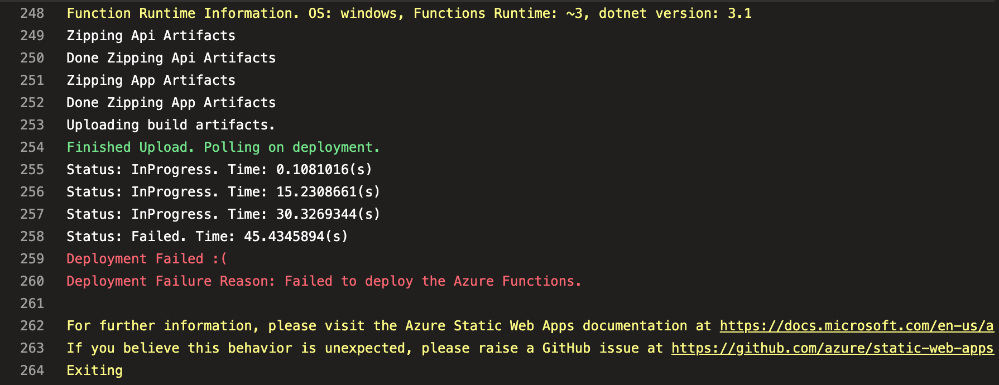

Azure Static Web Apps presently have an issue which blocks deployment with the message "Failed to deploy the Azure Functions". This post documents a workaround.


## Failed to deploy the Azure Functions

[Azure Static Web Apps](https://azure.microsoft.com/en-us/services/app-service/static/) are a combination of static front end hosting and an optional serverless API back end. The front end portion of Azure Static Web Apps is very plug and play, however there can be complexities when it comes to adding an API back end. One issue



https://github.com/Azure/static-web-apps/issues/723

Should anyone else bump on this, here is a (hacky) workaround. It would be tremendous to see this issue fixed within SWAs as well. It's not great that this has ben marked as closed.

```yml
- task: AzureCLI@2
  displayName: 'Remove EnvironmentId tag from resource group'
  inputs:
    azureSubscription: ${{ variables.serviceConnection }}
    scriptType: bash
    scriptLocation: inlineScript
    inlineScript: |
      az tag update --resource-id /subscriptions/$(subscriptionId)/resourcegroups/$(resourceGroup) --operation delete --tags EnvironmentId=$(environmentId)

# you may want to introduce a delay here, without a delay this can be somewhat unreliable

- task: AzureStaticWebApp@0
  name: DeployStaticWebApp
  displayName: Deploy Static Web App
  inputs:
    app_location: 'MyApp'
    output_location: 'dist'
    api_location: 'api'
    azure_static_web_apps_api_token: $(apiKey)

- task: AzureCLI@2
  displayName: 'Add EnvironmentId tag back to resource group'
  inputs:
    azureSubscription: ${{ variables.serviceConnection }}
    scriptType: bash
    scriptLocation: inlineScript
    inlineScript: |
      az tag update --resource-id /subscriptions/$(subscriptionId)/resourcegroups/$(resourceGroup) --operation merge --tags EnvironmentId=$(environmentId)
```
