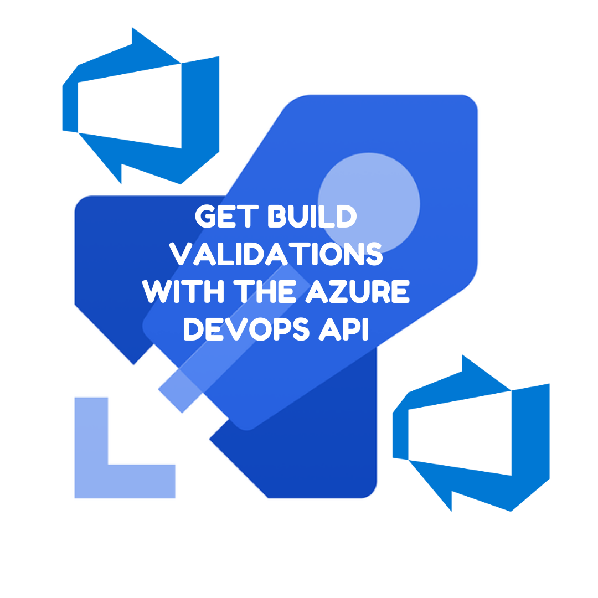

Build validations are a great way to protect your branches in Azure DevOps. It's possible to use the Azure DevOps API to acquire the build validations a project uses. This post shows you how using curl and the Node.js API.



<!--truncate-->

## Build validations

We care about our `main` branch. Before changes can be made to it, we want them to meet some kind of quality benchmark. In Azure DevOps these come in the form of branch policies. We're interested in a particular type of these called [build validations](https://docs.microsoft.com/en-us/azure/devops/repos/git/branch-policies?view=azure-devops&tabs=browser#build-validation):

> A build validation policy queues a new build when a new PR is created or changes are pushed to an existing PR that targets the branch. The build policy evaluates the build results to determine whether the PR can be completed.

If you want to examine whether a project uses build validations, you can do so using the Azure DevOps API. It's available under the [policy configurations endpoint](https://docs.microsoft.com/en-us/rest/api/azure/devops/policy/configurations/list?view=azure-devops-rest-7.1).

## curl build validations

To acquire build validations from the API we'll need a personal access token. We can make one of those here: https://dev.azure.com/organisation-name/_usersSettings/tokens (where `organisation-name` is the name of our organisation).

With that in hand, let's acquire the branch policies with a [curl](https://curl.se/):

```bash
curl  --user '':'PERSONAL_ACCESS_TOKEN' --header "Content-Type: application/json" --header "Accept:application/json" https://dev.azure.com/{organisation}/{project}/_apis/policy/configurations?api-version=7.1-preview.1
```

You'll retrieve a JSON array that represents all the branch policies that are in play, _including_ build validations. Below is an example of a retrieved build validation:

```json
[
  //...
  {
    "createdBy": {
      "displayName": "Project Collection Build Service (organisation-name)",
      "url": "https://spsprodweu1.vssps.visualstudio.com/A2426c3ce-09b0-4333-9218-58da7d53c564/_apis/Identities/aad5a5e5-baf9-40b3-ad30-0cb828c25629",
      "_links": {
        "avatar": {
          "href": "https://dev.azure.com/organisation-name/_apis/GraphProfile/MemberAvatars/svc.MjQyNmMzY2UtMDliMC00MzMzLTkyMTgtNThkYTdkNTNjNTY0OkJ1aWxkOmE1YTE3N2U2LTZhMzAtNGRiMi1iYzMxLTllOTE1M2U3Yjk0Nw"
        }
      },
      "id": "aad5a5e5-baf9-40b3-ad30-0cb828c25629",
      "uniqueName": "Build\\a5a177e6-6a30-4db2-bc31-9e9153e7b947",
      "imageUrl": "https://dev.azure.com/organisation-name/_api/_common/identityImage?id=aad5a5e5-baf9-40b3-ad30-0cb828c25629",
      "descriptor": "svc.MjQyNmMzY2UtMDliMC00MzMzLTkyMTgtNThkYTdkNTNjNTY0OkJ1aWxkOmE1YTE3N2U2LTZhMzAtNGRiMi1iYzMxLTllOTE1M2U3Yjk0Nw"
    },
    "createdDate": "2022-07-06T14:25:39.5585302Z",
    "isEnabled": true,
    "isBlocking": true,
    "isDeleted": false,
    "settings": {
      "buildDefinitionId": 1107,
      "queueOnSourceUpdateOnly": true,
      "manualQueueOnly": false,
      "displayName": "PR Validation",
      "validDuration": 720,
      "scope": [
        {
          "refName": "refs/heads/main",
          "matchKind": "Exact",
          "repositoryId": "dc4213a0-fc26-4afc-8b3e-4fd27eaaafa6"
        }
      ]
    },
    "isEnterpriseManaged": false,
    "_links": {
      "self": {
        "href": "https://dev.azure.com/organisation-name/ea861f16-ec9d-4256-a2a6-55dd7533af36/_apis/policy/configurations/1261"
      },
      "policyType": {
        "href": "https://dev.azure.com/organisation-name/ea861f16-ec9d-4256-a2a6-55dd7533af36/_apis/policy/types/0609b952-1397-4640-95ec-e00a01b2c241"
      }
    },
    "revision": 2,
    "id": 1261,
    "url": "https://dev.azure.com/organisation-name/ea861f16-ec9d-4256-a2a6-55dd7533af36/_apis/policy/configurations/1261",
    "type": {
      "id": "0609b952-1397-4640-95ec-e00a01b2c241",
      "url": "https://dev.azure.com/organisation-name/ea861f16-ec9d-4256-a2a6-55dd7533af36/_apis/policy/types/0609b952-1397-4640-95ec-e00a01b2c241",
      "displayName": "Build"
    }
  }
]
```

Note the `type` property with the `displayName` of `"Build"`. That's how we identify build validations in amongst the other branch policies. If you'd like to filter the output down to just build validations on the command line, you can by mixing your curl with a little [jq](https://stedolan.github.io/jq/):

```bash
curl  --user '':'PERSONAL_ACCESS_TOKEN' --header "Content-Type: application/json" --header "Accept:application/json" https://dev.azure.com/{organisation}/{project}/_apis/policy/configurations?api-version=7.1-preview.1 | jq -c '.value[] | select(.type.displayName == "Build")'
```

## Node.js API

If you'd like to achieve the same using TypeScript, you can. The [Azure DevOps Client for Node.js](https://github.com/microsoft/azure-devops-node-api) provides an API and (in large part) the types. Let's obtain the build validations for a project in Node.js using the client:

```ts
import * as nodeApi from 'azure-devops-node-api';

interface BuildValidation {
  buildDefinitionId: number | undefined;
  name: string | undefined;
  repositoryId: string | undefined;
}

async function getProjectBuildValidations(
  projectId: string,
): Promise<BuildValidation[]> {
  const authHandler = nodeApi.getPersonalAccessTokenHandler(
    pat,
    /** allowCrossOriginAuthentication */ true,
  );

  const webApi = new nodeApi.WebApi(orgUrl, authHandler);
  const policyApi = await webApi.getPolicyApi();

  const configurations = await policyApi.getPolicyConfigurations(projectId);

  const buildValidations = configurations
    .filter(
      // we only want the build validations
      (configuration) => configuration.type?.displayName === 'Build',
    )
    .map((configuration) => ({
      // map down to a custom type
      buildDefinitionId: configuration.settings.buildDefinitionId,
      name: configuration.settings.displayName,
      repositoryId:
        configuration.settings.scope?.length > 0
          ? configuration.settings.scope[0].repositoryId
          : undefined,
    }));

  return buildValidations;
}
```

The above `getProjectBuildValidations` function acquires build validations for a given project, and maps them into this custom type:

```ts
interface BuildValidation {
  /** the id of the azure pipeline which is triggered by the build validation */
  buildDefinitionId: number | undefined;
  /** the name of the build validation */
  name: string | undefined;
  /** if a build validation is tied to a repository (probable) this is the repository id */
  repositoryId: string | undefined;
}
```

Which leaves us with a delightfully strongly typed array of build validations!

## Conclusion

This post has detailed what build validations are in Azure DevOps. It has also demonstrated how to query the Azure DevOps API for them using the command line and using Node.js.
