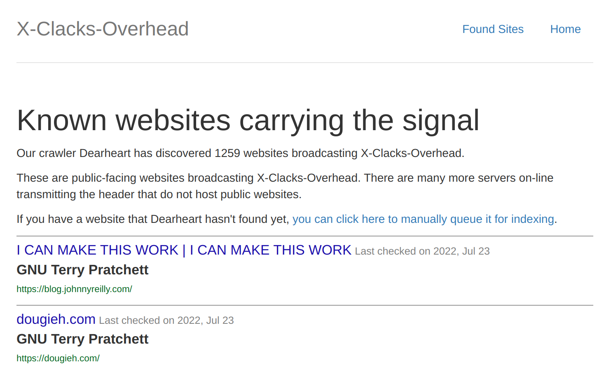

Terry Pratchett is remembered on the internet. A non-standardised HTTP header: `X-Clacks-Overhead` is broadcast by websites seeking to pay tribute to the great man. This post shows how we can make Azure Static Web Apps join in.


<!--truncate-->

## What is `X-Clacks-Overhead`?

This is well documented in the [`X-Clacks-Overhead`](https://xclacksoverhead.org/) website. To quote the highlights:

> X-Clacks-Overhead is a non-standardised HTTP header based upon the fictional work of the late, great, Sir Terry Pratchett...
>
> As a way to preserve the memory of Sir Terry Pratchett, the users of the [SubReddit for the Discworld series](https://www.reddit.com/r/discworld/) came up with [the idea behind the X-Clacks-Overhead HTTP Header](https://www.reddit.com/r/discworld/comments/2yt9j6/gnu_terry_pratchett/). It allows web authors to silently commemorate someone through the use of a non-invasive header that can be transmitted from server to server, or server to client without operational interference.
>
> You would only know the header is present if you analysed the transmission headers of your content requests on web sites serving the header.

Put simply, participating websites will broadcast the `X-Clacks-Overhead: GNU Terry Pratchett` header when they are serving content to a user.

## Azure Static Web Apps serving the `X-Clacks-Overhead` header

Now we understand what we want to do, we can make an Azure Static Web Apps project do just that.

We're going to need an `staticwebappconfig.json` in root of our app, so we can configure our SWA. To add extra headers in, you use the [`globalHeaders`](https://docs.microsoft.com/en-us/azure/static-web-apps/configuration#global-headers) setting:

```json
{
  "globalHeaders": {
    "X-Clacks-Overhead": "GNU Terry Pratchett"
  }
}
```

Above, we added the `X-Clacks-Overhead` header. When our app is deployed, it will automatically add this header to all requests:


The above screenshot shows this very blog broadcasting the `X-Clacks-Overhead` header. If you crack open devtools you can validate this for yourself. The pull request that added it in [can be found here](https://github.com/johnnyreilly/blog.johnnyreilly.com/pull/273).

## Who else is out there?

It's great to know you're in good company. [This page](https://xclacksoverhead.org/listing/the-signal) tracks websites that are broadcasting the `X-Clacks-Overhead` header. You can see from the image below that it has found this website too!



So if you'd like your Azure Static Web App to whisper Terry Pratchett's name under its breath; make it so!
