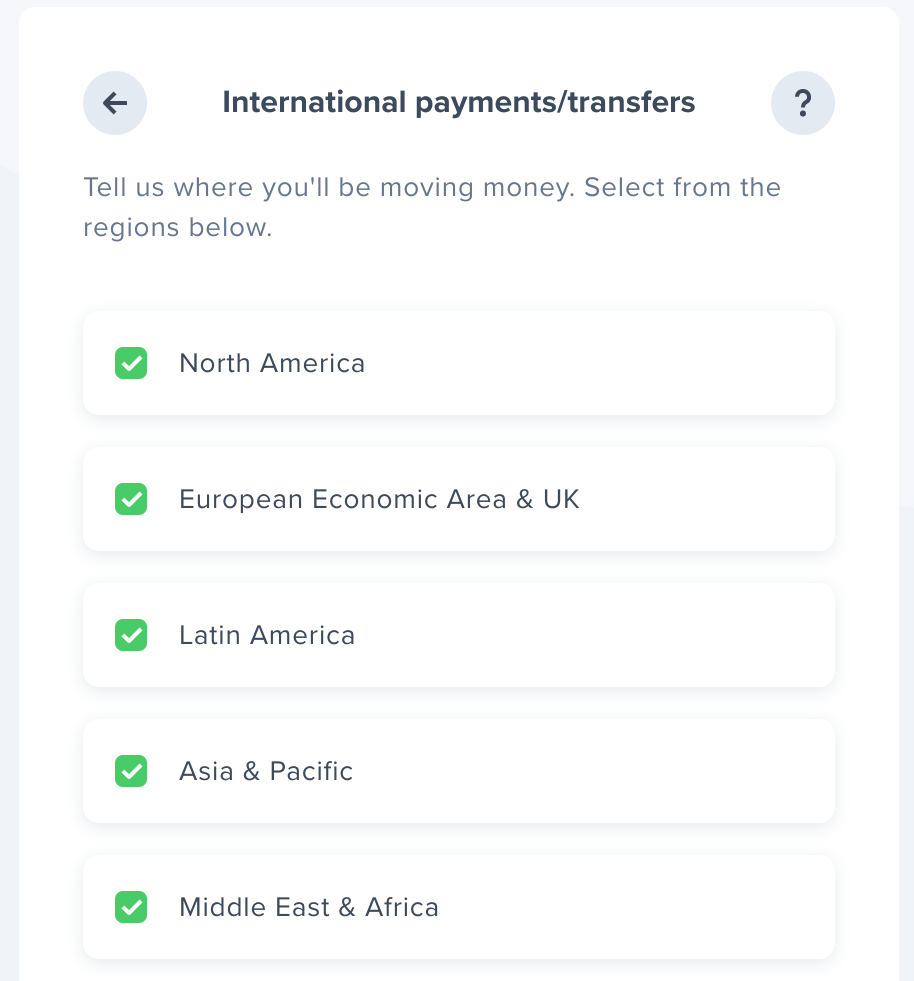
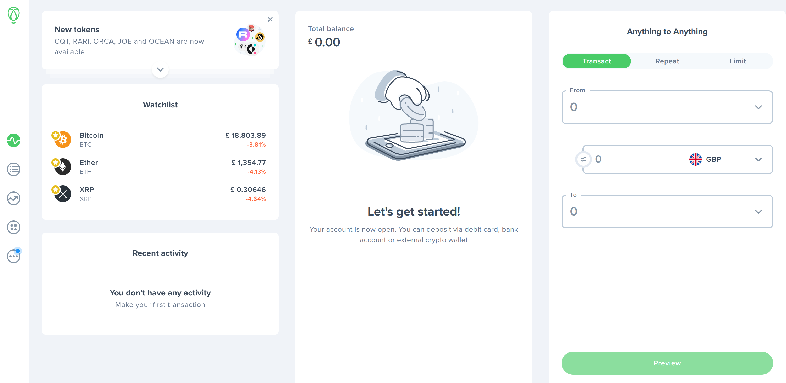

The Web Monetization API is a JavaScript browser API that allows the creation of a payment stream from the user agent to the website. This post walks through getting started adding it to a site.

## The Web Monetization API

I recently attended the [HalfStack at the Beach](https://halfstackconf.com/newquay/) conference and heard a talk from [Alex Lakatos](https://twitter.com/avolakatos) on the Web Monetization API. I hadn't heard about this previously, but my rough understanding of the concept was that it was a way to monetize a website. My blog already features a [Buy Me a Coffee](https://www.buymeacoffee.com/qUBm0Wh) link, which allows generous people to send me small amounts of money if they've found something I've written useful. The Web Monetization API appears to be that, but built into the browser and proposed proposed as a W3C standard at the [Web Platform Incubator Community Group](https://discourse.wicg.io/t/proposal-web-monetization-a-new-revenue-model-for-the-web/3785).

I was intrigued. Alex was kind enough to share some links with me, and I decided to take the Web Monetization API for a spin, and see what it was like. So this post is going to be exactly that. I'm a noob; I don't know how to use the Web Monetization API (or much about it TBH). Over the course of this post I'll try and integrate it into my blog. As I do that I'll share what I'm doing and how I found things; to try to provide a useful resource (and some feedback) on what adoption feels like.

## Getting started

Alex shared a link to https://webmonetization.org/ - in there I found a [quick start](https://webmonetization.org/docs/getting-started) which I decided to work through.

### Wallet

The first thing to do is [setting up a wallet](https://webmonetization.org/docs/getting-started#1-set-up-a-web-monetized-wallet). I imagine that this is comparable to having a bank account in a bank. There appear to be two options for this:

- [uphold](https://wallet.uphold.com/)
- [gatehub](https://gatehub.net/)

[Right now, uphold offers a greater number of features](https://webmonetization.org/docs/ilp-wallets/#digital-wallets), so I'll create a wallet with them.

The signup process was pretty straightforward. I got slightly confused was seeing this prompt:

I wasn't entirely sure what I needed. The Web Monetization API seemed most likely to be about transfers between users, so I went with that.

When it asked this question:

I opted to accept all regions. After the usual signup process, I was able to see able to see my new (empty) account:

### Payment pointer

The next thing we need to do is acquire our payment pointer. I found this tricky to track down and eventually Alex showed me where to go. On the right hand side of the dashboard, there is an "anything to anything" section:

Clicking on the "copy" button copies the payment pointer to the clipboard. I'll need this later. In my case that is: `$ilp.uphold.com/LwQQhXdpwxeJ`
