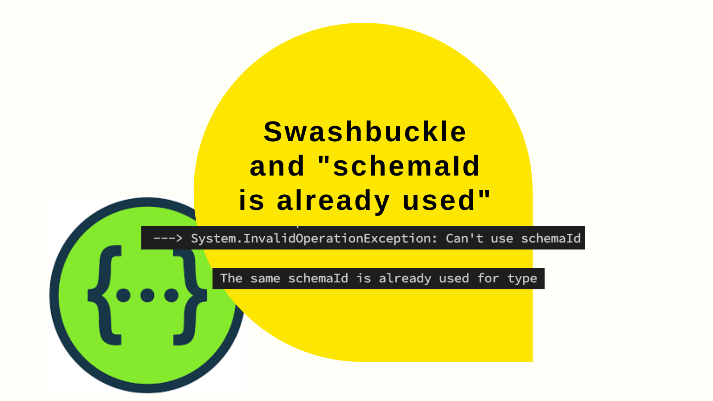

Swashbuckle can fail to generate a swagger / Open API document with the message "The same schemaId is already used...". This post explains what that means, and offers a way to work around it.



<!--truncate-->

## "The same schemaId is already used..."

When creating a swagger / Open API document with Swashbuckle, it's possible to encounter an error of this nature:

```
System.InvalidOperationException: Can't use schemaId "$MyType" for type "$OneNamespace.MyType". The same schemaId is already used for type "$OtherNamespace.MyType"
```

[Richard Morris](https://github.com/domaindrivendev) explains the reason for this [here](https://github.com/domaindrivendev/Swashbuckle.AspNetCore/issues/1607#issuecomment-788900097):

> By default, SB uses the short (unqualified name) which has its benefits because it keeps the docs simpler but also it’s downside if model names are duplicated in different namespaces.

The solution for this is using the `CustomSchemaIds` configuration option for Swashbuckle. This allows the customisation of type names, such that collisions are prevented. We need types to be unique strings. A simple way to tackle this is something like this:

```cs
services.AddSwaggerGen(options =>
{
    options.CustomSchemaIds(type => type.ToString());
});
```

However, the types created using the above approach can be verbose. Wouldn't it be nice if we could essentially have the names we had before, but just handle duplicates with an incrementing number?

## Nicer names with `SwashbuckleSchemaHelper`

We can do exactly this. What we'll do is put together a class called `SwashbuckleSchemaHelper`:

```cs
public class SwashbuckleSchemaHelper
{
    private readonly Dictionary<string, List<string>> _schemaNameRepetition = new();

    // borrowed from https://github.com/domaindrivendev/Swashbuckle.AspNetCore/blob/95cb4d370e08e54eb04cf14e7e6388ca974a686e/src/Swashbuckle.AspNetCore.SwaggerGen/SchemaGenerator/SchemaGeneratorOptions.cs#L44
    private string DefaultSchemaIdSelector(Type modelType)
    {
        if (!modelType.IsConstructedGenericType) return modelType.Name.Replace("[]", "Array");

        var prefix = modelType.GetGenericArguments()
            .Select(genericArg => DefaultSchemaIdSelector(genericArg))
            .Aggregate((previous, current) => previous + current);

        return prefix + modelType.Name.Split('`').First();
    }

    public string GetSchemaId(Type modelType)
    {
        string id = DefaultSchemaIdSelector(modelType);

        if (!_schemaNameRepetition.ContainsKey(id))
            _schemaNameRepetition.Add(id, new List<string>());

        var modelNameList = _schemaNameRepetition[id];
        var fullName = modelType.FullName ?? "";
        if (!string.IsNullOrEmpty(fullName) && !modelNameList.Contains(fullName))
            modelNameList.Add(fullName);

        int index = modelNameList.IndexOf(fullName);

        return $"{id}{(index >= 1 ? index.ToString() : "")}";
    }
}
```

The above class borrows the [`DefaultSchemaIdSelector`](https://github.com/domaindrivendev/Swashbuckle.AspNetCore/blob/95cb4d370e08e54eb04cf14e7e6388ca974a686e/src/Swashbuckle.AspNetCore.SwaggerGen/SchemaGenerator/SchemaGeneratorOptions.cs#L44) implementation from Swashbuckle itself. It creates the type name using that, and then uses a `Dictionary` to track the numbers of usages of it; suffixing a number where there are duplicates to indicate which duplicate is in play on this occasion. This number suffix is inspired [by an answer on Stack Overflow](https://stackoverflow.com/a/72677918/761388) and also by [Glenn Piper's comment here](https://github.com/domaindrivendev/Swashbuckle.AspNetCore/issues/1607#issuecomment-1258337736).

Usage of this looks like this:

```cs
services.AddSwaggerGen(options =>
{
    var schemaHelper = new SwashbuckleSchemaHelper();
    options.CustomSchemaIds(type => schemaHelper.GetSchemaId(type));
});
```

The result of using this approach is that you'll start to generate multiple types: `MyType` and `MyType2`, and importantly a goodbye to the "The same schemaId is already used..." message.
