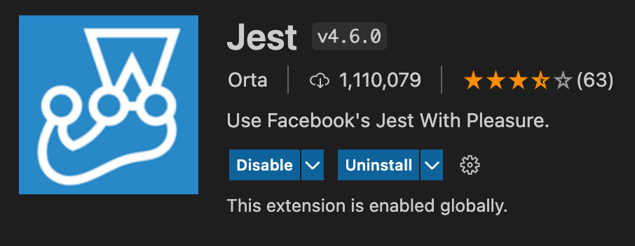
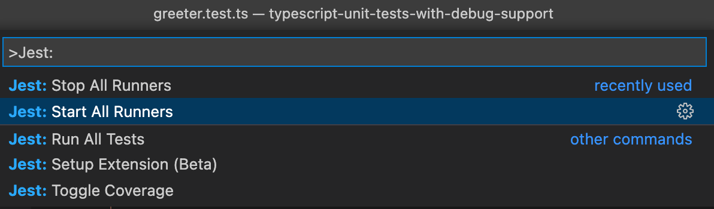
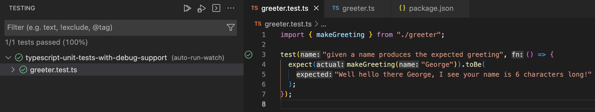

Unit tests are an important part of the development process. They are used to verify that the code is working as intended. This post will outline how to write unit tests using TypeScript. The post will also cover how to debug unit tests.


## Unit Tests

A description / explanation of the problem to solve. We want to run / debug tests and why.

## What framework to use?

An identification of the tools we're going to use and rationale for selection

## Setting up our tests

Doing it. Working through how to set up a typescript project in VS Code which has code, tests and a mechanism for running/ debugging them. This will likely be split into say 3 sections; getting the TS project in place, getting a test in place and the ability to run that test, finally how to get debugging set up

### Set up the TypeScript project

Let's create ourselves new project Node.js project:

```shell
typescript-unit-tests-with-debug-support
cd typescript-unit-tests-with-debug-support
npm init --yes
```

At this point we have an empty Node.js project. Let's bring TypeScript into the mix also:

```shell
npm install typescript
npx -p typescript tsc --init
```

We're now ready to start writing some code!

This is a post about demonstrating unit testing with TypeScript. So naturally we need something to test. We're going write a simple module called `greeter.ts` which has the following content:

```ts
export function makeGreeting(name: string): string {
  const lengthOfName = name.length;
  const greeting = `Well hello there ${name}, I see your name is ${lengthOfName} characters long!`;
  return greeting;
}
```

It contains a single simple function named `makeGreeting` which takes a single string parameter and constructs a greeting from that. The nature of the greeting is inconsequential, but remember later we want to be able to debug our test. So we want more than one line in our implementation.

### Set up the Jest project

The next step after setting up our TypeScript Node.js project, is adding tests, and the ability to run them, using Jest.

First of all we're going to need to add jest to our project and initialise it:

```shell
npm install --save-dev jest
npx jest --init
```

As part of the initialisation you should be prompted with a number of questions:

```
npx jest --init

The following questions will help Jest to create a suitable configuration for your project

✔ Would you like to use Typescript for the configuration file? … no
✔ Choose the test environment that will be used for testing › node
✔ Do you want Jest to add coverage reports? … no
✔ Which provider should be used to instrument code for coverage? › v8
✔ Automatically clear mock calls, instances, contexts and results before every test? … no
```

We'll select all the defaults. Next, we'll update our `package.json` `scripts` section to invoke Jest:

```json
  "scripts": {
    "test": "jest"
  },
```

At this point we're in a place where we can run tests on JavaScript. But we want to run tests against TypeScript. [Jest supports this scenario well](https://jestjs.io/docs/getting-started#using-typescript), using Babel. So we'll add the dependencies we need:

```shell
npm install --save-dev babel-jest @babel/core @babel/preset-env @babel/preset-typescript @types/jest
```

With all that done, let's see if we can write a test. We'll create a `greeter.test.ts` file to sit alongside `greeter.ts`:

```ts
import { makeGreeting } from './greeter';

test('given a name produces the expected greeting', () => {
  expect(makeGreeting('George')).toBe(
    'Well hello there George, I see your name is 6 characters long!'
  );
});
```

Then, let's see if we can run our tests with `npm run test`:


Success! We've now created a TypeScript project, written some code, writen a test for that code and we have the ability to run it.

### Set up debugging support

The final thing we wanted to tackle was adding debug support. In times past, this was often quite hard to set up. However it's become much easier due to the excellent [`vscode-jest`](https://github.com/jest-community/vscode-jest) project, which is dedicated to making "testing more intuitive and fun".

Inside VS Code, install the vscode-jest extension:



Once it's installed, you'll need to restart VS Code, and you may also need to enter the `Jest: Start All Runners` command:






## Conclusion

Conclusion

[This post was originally published on Meticulous.](https://meticulous.ai/blog/)
