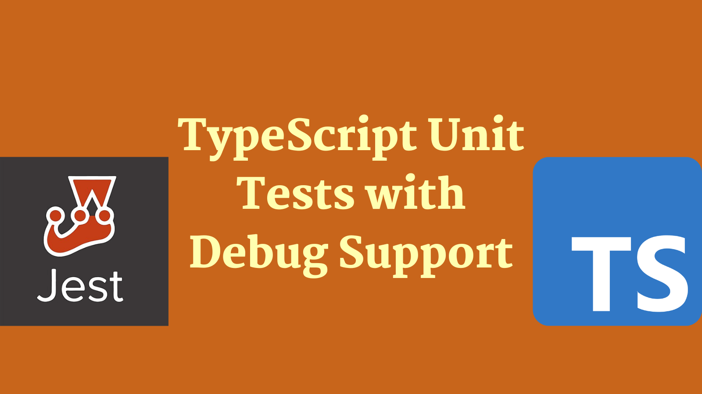

Unit tests are an important part of the development process. They are used to verify that the code is working as intended. This post will outline how to write unit tests using TypeScript. The post will also cover how to debug unit tests.

## Unit Tests

A description / explanation of the problem to solve. We want to run / debug tests and why.

## What framework to use?

An identification of the tools we're going to use and rationale for selection

## Setting up our tests

Doing it. Working through how to set up a typescript project in VS Code which has code, tests and a mechanism for running/ debugging them. This will likely be split into say 3 sections; getting the TS project in place, getting a test in place and the ability to run that test, finally how to get debugging set up

### Set up the TypeScript project

### Set up the Jest project

### Set up debugging support

## Conclusion

Conclusion

[This post was originally published on Meticulous.](https://meticulous.ai/blog/)
