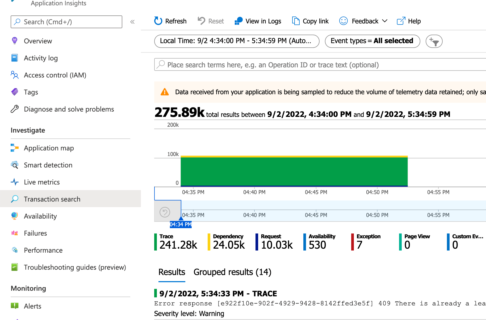
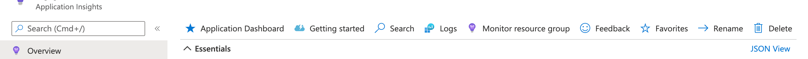

Logs matter. In Azure, logs generally live in Application Insights, in the Transaction Search section. This post reverse engineers the Azure Application Insights Transactions URL, and details how to construct a link to take you directly there, using both TypeScript and C#.


<!--truncate-->

## Bring me the logs!

If you've ever supported a production system, you will know this to be true: logs matter. Logs help you understand what's gone wrong. (You're never looking at logs when something has gone right.) When it comes to Azure, logs tend to reside in Application Insights, specifically Transactions:



Whilst Transaction Search is very powerful, it can also be a little tough to find the things that you need. In a system I'm working on now, we've found ourselves building an application that allows us to provide support. We use it to bring together disparate pieces of information across our estate. As we use it, we're usually looking at a particular slice of time. If we don't find what we need in our application we'll find a need to dig into the logs for the same period.

Rather than manually logging into Azure, finding Application Insights, going to Transactions and entering the time period, what if we could just go there at the click of a link? We can.

Look at the screenshot above, do you see the "Copy link" button? That button copies a URL to the clipboard which encapsulates the current search criteria. And it turns out we can reverse engineer it!

## Breaking down the link

First of all, let's take a look at the incredibly long URL that's copied to the clipboard:

```text
https://portal.azure.com/#blade/AppInsightsExtension/BladeRedirect/BladeName/searchV1/ResourceId/%2Fsubscriptions%2F4e41a677-9a57-4a7c-9c4c-e71bae5d998e%2Fresourcegroups%2Frg-maas-shared-storage-dev-001%2Fproviders%2Fmicrosoft.insights%2Fcomponents%2Fappi-maas-shared-dev/BladeInputs/%7B%22tables%22%3A%5B%22traces%22%5D%2C%22timeContextWhereClause%22%3A%22%7C+where+timestamp+%3E+datetime(%5C%222022-05-03T10%3A04%3A33.267Z%5C%22)+and+timestamp+%3C+datetime(%5C%222022-05-03T10%3A34%3A33.267Z%5C%22)%22%2C%22filterWhereClause%22%3A%22%7C+where+severityLevel+in+(%5C%223%5C%22)%7C+where+*+has+%5C%22healthcheck%5C%22%7C+order+by+timestamp+desc%22%2C%22originalParams%22%3A%7B%22eventTypes%22%3A%5B%7B%22value%22%3A%22availabilityResult%22%2C%22tableName%22%3A%22availabilityResults%22%2C%22label%22%3A%22Availability%22%7D%2C%7B%22value%22%3A%22request%22%2C%22tableName%22%3A%22requests%22%2C%22label%22%3A%22Request%22%7D%2C%7B%22value%22%3A%22exception%22%2C%22tableName%22%3A%22exceptions%22%2C%22label%22%3A%22Exception%22%7D%2C%7B%22value%22%3A%22pageView%22%2C%22tableName%22%3A%22pageViews%22%2C%22label%22%3A%22Page+View%22%7D%2C%7B%22value%22%3A%22trace%22%2C%22tableName%22%3A%22traces%22%2C%22label%22%3A%22Trace%22%7D%2C%7B%22value%22%3A%22customEvent%22%2C%22tableName%22%3A%22customEvents%22%2C%22label%22%3A%22Custom+Event%22%7D%2C%7B%22value%22%3A%22dependency%22%2C%22tableName%22%3A%22dependencies%22%2C%22label%22%3A%22Dependency%22%7D%5D%2C%22timeContext%22%3A%7B%22durationMs%22%3A1800000%2C%22endTime%22%3A%222022-05-03T10%3A34%3A33.267Z%22%7D%2C%22filter%22%3A%5B%5D%2C%22searchPhrase%22%3A%7B%22originalPhrase%22%3A%22healthcheck%22%2C%22_tokens%22%3A%5B%7B%22conjunction%22%3A%22and%22%2C%22value%22%3A%22healthcheck%22%2C%22isNot%22%3Afalse%2C%22kql%22%3A%22+*+has+%5C%22healthcheck%5C%22%22%7D%5D%7D%2C%22sort%22%3A%22desc%22%7D%7D
```

There's 1860 characters in there. That's a lot - but still less than the [general limit of 2000 characters](https://stackoverflow.com/questions/417142/what-is-the-maximum-length-of-a-url-in-different-browsers). This mighty long URL can be broken down into four distinct parts. Let's break it down:

### 1. Main Azure Portal routing

Firstly this:

```text
https://portal.azure.com/#blade/AppInsightsExtension/BladeRedirect/BladeName/searchV1/ResourceId/
```

This is a recognisable base URL and takes us to the relevant part of the Azure Portal.

### 2. ResourceId

Next we have a URL encoded ResourceId:

```text
%2Fsubscriptions%2F4e41a677-9a57-4a7c-9c4c-e71bae5d998e%2Fresourcegroups%2Frg-maas-shared-storage-dev-001%2Fproviders%2Fmicrosoft.insights%2Fcomponents%2Fappi-maas-shared-dev
```

If we run it through `decodeURIComponent` you can see it in it's raw form:

```js
decodeURIComponent(
  '%2Fsubscriptions%2F4e41a677-9a57-4a7c-9c4c-e71bae5d998e%2Fresourcegroups%2Frg-maas-shared-storage-dev-001%2Fproviders%2Fmicrosoft.insights%2Fcomponents%2Fappi-maas-shared-dev',
);

// creates: /subscriptions/4e41a677-9a57-4a7c-9c4c-e71bae5d998e/resourcegroups/rg-maas-shared-storage-dev-001/providers/microsoft.insights/components/appi-maas-shared-dev'
```

This is the ResourceId of the Application Insights instance that we're looking at. This is the same as the one we saw in the URL when we were looking at the Application Insights instance in the Azure Portal, and it's the ResourceId that can be obtained by clicking on the "JSON View" link:



### 3. More Azure Portal routing

The next part of the URL is just some more Azure Portal routing:

```text
/BladeInputs/
```

### 4. The query

Finally we have the (very long) query:

```text
%7B%22tables%22%3A%5B%22traces%22%5D%2C%22timeContextWhereClause%22%3A%22%7C+where+timestamp+%3E+datetime(%5C%222022-05-03T10%3A04%3A33.267Z%5C%22)+and+timestamp+%3C+datetime(%5C%222022-05-03T10%3A34%3A33.267Z%5C%22)%22%2C%22filterWhereClause%22%3A%22%7C+where+severityLevel+in+(%5C%223%5C%22)%7C+where+_+has+%5C%22healthcheck%5C%22%7C+order+by+timestamp+desc%22%2C%22originalParams%22%3A%7B%22eventTypes%22%3A%5B%7B%22value%22%3A%22availabilityResult%22%2C%22tableName%22%3A%22availabilityResults%22%2C%22label%22%3A%22Availability%22%7D%2C%7B%22value%22%3A%22request%22%2C%22tableName%22%3A%22requests%22%2C%22label%22%3A%22Request%22%7D%2C%7B%22value%22%3A%22exception%22%2C%22tableName%22%3A%22exceptions%22%2C%22label%22%3A%22Exception%22%7D%2C%7B%22value%22%3A%22pageView%22%2C%22tableName%22%3A%22pageViews%22%2C%22label%22%3A%22Page+View%22%7D%2C%7B%22value%22%3A%22trace%22%2C%22tableName%22%3A%22traces%22%2C%22label%22%3A%22Trace%22%7D%2C%7B%22value%22%3A%22customEvent%22%2C%22tableName%22%3A%22customEvents%22%2C%22label%22%3A%22Custom+Event%22%7D%2C%7B%22value%22%3A%22dependency%22%2C%22tableName%22%3A%22dependencies%22%2C%22label%22%3A%22Dependency%22%7D%5D%2C%22timeContext%22%3A%7B%22durationMs%22%3A1800000%2C%22endTime%22%3A%222022-05-03T10%3A34%3A33.267Z%22%7D%2C%22filter%22%3A%5B%5D%2C%22searchPhrase%22%3A%7B%22originalPhrase%22%3A%22healthcheck%22%2C%22_tokens%22%3A%5B%7B%22conjunction%22%3A%22and%22%2C%22value%22%3A%22healthcheck%22%2C%22isNot%22%3Afalse%2C%22kql%22%3A%22+_+has+%5C%22healthcheck%5C%22%22%7D%5D%7D%2C%22sort%22%3A%22desc%22%7D%7D
```

Initially this doesn't look like much. It's just a long string of characters. But if we run it through `decodeURIComponent` we can see that it's actually a JSON object:

```js
decodeURIComponent(
  '%7B%22tables%22%3A%5B%22traces%22%5D%2C%22timeContextWhereClause%22%3A%22%7C+where+timestamp+%3E+datetime(%5C%222022-05-03T10%3A04%3A33.267Z%5C%22)+and+timestamp+%3C+datetime(%5C%222022-05-03T10%3A34%3A33.267Z%5C%22)%22%2C%22filterWhereClause%22%3A%22%7C+where+severityLevel+in+(%5C%223%5C%22)%7C+where+_+has+%5C%22healthcheck%5C%22%7C+order+by+timestamp+desc%22%2C%22originalParams%22%3A%7B%22eventTypes%22%3A%5B%7B%22value%22%3A%22availabilityResult%22%2C%22tableName%22%3A%22availabilityResults%22%2C%22label%22%3A%22Availability%22%7D%2C%7B%22value%22%3A%22request%22%2C%22tableName%22%3A%22requests%22%2C%22label%22%3A%22Request%22%7D%2C%7B%22value%22%3A%22exception%22%2C%22tableName%22%3A%22exceptions%22%2C%22label%22%3A%22Exception%22%7D%2C%7B%22value%22%3A%22pageView%22%2C%22tableName%22%3A%22pageViews%22%2C%22label%22%3A%22Page+View%22%7D%2C%7B%22value%22%3A%22trace%22%2C%22tableName%22%3A%22traces%22%2C%22label%22%3A%22Trace%22%7D%2C%7B%22value%22%3A%22customEvent%22%2C%22tableName%22%3A%22customEvents%22%2C%22label%22%3A%22Custom+Event%22%7D%2C%7B%22value%22%3A%22dependency%22%2C%22tableName%22%3A%22dependencies%22%2C%22label%22%3A%22Dependency%22%7D%5D%2C%22timeContext%22%3A%7B%22durationMs%22%3A1800000%2C%22endTime%22%3A%222022-05-03T10%3A34%3A33.267Z%22%7D%2C%22filter%22%3A%5B%5D%2C%22searchPhrase%22%3A%7B%22originalPhrase%22%3A%22healthcheck%22%2C%22_tokens%22%3A%5B%7B%22conjunction%22%3A%22and%22%2C%22value%22%3A%22healthcheck%22%2C%22isNot%22%3Afalse%2C%22kql%22%3A%22+_+has+%5C%22healthcheck%5C%22%22%7D%5D%7D%2C%22sort%22%3A%22desc%22%7D%7D',
);

// creates: '{"tables":["traces"],"timeContextWhereClause":"|+where+timestamp+>+datetime(\\"2022-05-03T10:04:33.267Z\\")+and+timestamp+<+datetime(\\"2022-05-03T10:34:33.267Z\\")","filterWhereClause":"|+where+severityLevel+in+(\\"3\\")|+where+_+has+\\"healthcheck\\"|+order+by+timestamp+desc","originalParams":{"eventTypes":[{"value":"availabilityResult","tableName":"availabilityResults","label":"Availability"},{"value":"request","tableName":"requests","label":"Request"},{"value":"exception","tableName":"exceptions","label":"Exception"},{"value":"pageView","tableName":"pageViews","label":"Page+View"},{"value":"trace","tableName":"traces","label":"Trace"},{"value":"customEvent","tableName":"customEvents","label":"Custom+Event"},{"value":"dependency","tableName":"dependencies","label":"Dependency"}],"timeContext":{"durationMs":1800000,"endTime":"2022-05-03T10:34:33.267Z"},"filter":[],"searchPhrase":{"originalPhrase":"healthcheck","_tokens":[{"conjunction":"and","value":"healthcheck","isNot":false,"kql":"+_+has+\\"healthcheck\\""}]},"sort":"desc"}}'
```

And if we parse that JSON object we get:

```json
{
  "tables": ["traces"],
  "timeContextWhereClause": "|+where+timestamp+>+datetime(\"2022-05-03T10:04:33.267Z\")+and+timestamp+<+datetime(\"2022-05-03T10:34:33.267Z\")",
  "filterWhereClause": "|+where+severityLevel+in+(\"3\")|+where+_+has+\"healthcheck\"|+order+by+timestamp+desc",
  "originalParams": {
    "eventTypes": [
      {
        "value": "availabilityResult",
        "tableName": "availabilityResults",
        "label": "Availability"
      },
      {
        "value": "request",
        "tableName": "requests",
        "label": "Request"
      },
      {
        "value": "exception",
        "tableName": "exceptions",
        "label": "Exception"
      },
      {
        "value": "pageView",
        "tableName": "pageViews",
        "label": "Page+View"
      },
      {
        "value": "trace",
        "tableName": "traces",
        "label": "Trace"
      },
      {
        "value": "customEvent",
        "tableName": "customEvents",
        "label": "Custom+Event"
      },
      {
        "value": "dependency",
        "tableName": "dependencies",
        "label": "Dependency"
      }
    ],
    "timeContext": {
      "durationMs": 1800000,
      "endTime": "2022-05-03T10:34:33.267Z"
    },
    "filter": [],
    "searchPhrase": {
      "originalPhrase": "healthcheck",
      "_tokens": [
        {
          "conjunction": "and",
          "value": "healthcheck",
          "isNot": false,
          "kql": "+_+has+\"healthcheck\""
        }
      ]
    },
    "sort": "desc"
  }
}
```

We can clearly see in the object above the aspects that contribute to our query. It's worth highlighting that when I generated the above query, I had the `traces` table selected and I was searching for the phrase "healthcheck". If I had selected `requests` instead, the `tables` array would have contained `requests` instead of `traces`. If I had been searching for a different phrase, the `searchPhrase` and `filterWhereClause` objects would have contained different values.

## Reverse engineering a link

Now that we understand what makes up a URL, we're safe to build our own mechanisms to generate a URL.

## TypeScript URL builder

We'll start by creating the TypeScript version of the URL builder. We'll start by creating a new file called `urlBuilder.ts` and we'll add the following code:

```ts
function makeAzureApplicationInsightsTransactionUrl({
  applicationInsightsId,
  endDate,
  startDate,
}: {
  applicationInsightsId: string;
  startDate: Date;
  endDate: Date;
}) {
  const endDateAsString = endDate.toISOString(); // eg 2022-05-03T14:22:51.180Z
  const startDateAsString = startDate.toISOString();
  const durationMs = endDate.getTime() - startDate.getTime();
  const logsQuery = {
    tables: [
      'availabilityResults',
      'requests',
      'exceptions',
      'pageViews',
      'traces',
      'customEvents',
      'dependencies',
    ],
    timeContextWhereClause: `| where timestamp > datetime(${startDateAsString}) and timestamp < datetime("${endDateAsString}")`,
    filterWhereClause: '| order by timestamp desc',
    originalParams: {
      eventTypes: [
        {
          value: 'availabilityResult',
          tableName: 'availabilityResults',
          label: 'Availability',
        },
        { value: 'request', tableName: 'requests', label: 'Request' },
        {
          value: 'exception',
          tableName: 'exceptions',
          label: 'Exception',
        },
        {
          value: 'pageView',
          tableName: 'pageViews',
          label: 'Page View',
        },
        { value: 'trace', tableName: 'traces', label: 'Trace' },
        {
          value: 'customEvent',
          tableName: 'customEvents',
          label: 'Custom Event',
        },
        {
          value: 'dependency',
          tableName: 'dependencies',
          label: 'Dependency',
        },
      ],
      timeContext: {
        durationMs: durationMs,
        endTime: endDateAsString,
      },
      filter: [],
      searchPhrase: {
        originalPhrase: '',
        _tokens: [],
      },
      sort: 'desc',
    },
  };

  const baseUrl = `https://portal.azure.com/#blade/AppInsightsExtension/BladeRedirect/BladeName/searchV1/ResourceId/`;
  const encodedApplicationInsightsId = encodeURIComponent(
    applicationInsightsId,
  );
  const moreRouting = `/BladeInputs/`;
  const encodedLogsQuery = encodeURIComponent(JSON.stringify(logsQuery));
  const logsUrl = `${baseUrl}${encodedApplicationInsightsId}${moreRouting}${encodedLogsQuery}`;

  return logsUrl;
}
```

The above code is a function that takes in an object with the following properties:

- `applicationInsightsId` - the ID of the Application Insights resource
- `startDate` - the start date of the time range
- `endDate` - the end date of the time range

You can see that it takes these inputs and uses them to build up a URL made up of the four sections we identified earlier.

The URL it generates is the URL that will open the Application Insights logs blade in the Azure portal with the time range selected. This code is not including any kind of search phrase, but it could easily be adjusted to cater for that.

## C# URL builder

We can do the same thing in C#. It's a bit more verbose than the TypeScript version, but it's still pretty straightforward. We'll create a new file called `UrlBuilder.cs` and add the following code:

```cs
using System.Collections.Generic;
using Newtonsoft.Json;

namespace AzureApplicationInsightsTransactionSearchUrl
{
  public static class UrlBuilder
  {
    /// <summary>
    /// eg 2022-05-03T14:22:51.180Z
    /// </summary>
    public static string ToAzureLogsString(this DateTime value) =>
        value.ToString("yyyy-MM-ddTHH:mm:ss.fffK", CultureInfo.InvariantCulture);

    public static string MakeAzureApplicationInsightsTransactionUrl(
      string applicationInsightsId,
      DateTime startDate,
      DateTime endDate
    )
    {
      var endDateAsString = endDate.ToAzureLogsString();
      var startDateAsString = startDate.ToAzureLogsString();
      var durationMs = Convert.ToInt32((endDate - startDate).TotalMilliseconds);

      var logsQuery = new LogsQuery(
        Tables: new List<string> {
          "availabilityResults",
          "requests",
          "exceptions",
          "pageViews",
          "traces",
          "customEvents",
          "dependencies"
        },
        TimeContextWhereClause: $"| where timestamp > datetime(\"{startDateAsString}\") and timestamp < datetime(\"{endDateAsString}\")",
        FilterWhereClause: $"| order by timestamp desc",
        OriginalParams: new OriginalParams(
          EventTypes: new List<EventType>
          {
            new (
                Value: "availabilityResult",
                TableName: "availabilityResults",
                Label: "Availability"
            ),
            new (
                Value: "request",
                TableName: "requests",
                Label: "Request"
            ),
            new (
                Value: "exception",
                TableName: "exceptions",
                Label: "Exception"
            ),
            new (
                Value: "pageView",
                TableName: "pageViews",
                Label: "Page View"
            ),
            new (
                Value: "trace",
                TableName: "traces",
                Label: "Trace"
            ),
            new (
                Value: "customEvent",
                TableName: "customEvents",
                Label: "Custom Event"
            ),
            new (
                Value: "dependency",
                TableName: "dependencies",
                Label: "Dependency"
            ),
          },
          TimeContext: new TimeContext(
              DurationMs: durationMs,
              EndTime: endDateAsString
          ),
          Filter: new List<Filter>(),
          SearchPhrase: new SearchPhrase(
              OriginalPhrase: "",
              Tokens: new List<Token>()
          ),
          Sort: "desc"
        )
      );

      var baseUrl = "https://portal.azure.com/#blade/AppInsightsExtension/BladeRedirect/BladeName/searchV1/ResourceId/";
      var encodedApplicationInsightsId = WebUtility.UrlEncode(applicationInsightsId);
      var moreRouting = "/BladeInputs/";
      var encodedLogsQuery = WebUtility.UrlEncode(JsonConvert.SerializeObject(logsQuery));
      var logsUrl = $"{baseUrl}{encodedApplicationInsightsId}{moreRouting}{encodedLogsQuery}";

      return logsUrl;
    }
  }

  public record EventType(
      [property: JsonProperty("value")] string Value,
      [property: JsonProperty("tableName")] string TableName,
      [property: JsonProperty("label")] string Label
  );

  public record TimeContext(
      [property: JsonProperty("durationMs")] int DurationMs,
      [property: JsonProperty("endTime")] string EndTime
  );

  public record Dimension(
      [property: JsonProperty("displayName")] string DisplayName,
      [property: JsonProperty("tables")] IReadOnlyList<string> Tables,
      [property: JsonProperty("name")] string Name,
      [property: JsonProperty("draftKey")] string DraftKey
  );

  public record Operator(
      [property: JsonProperty("label")] string Label,
      [property: JsonProperty("value")] string Value,
      [property: JsonProperty("isSelected")] bool IsSelected
  );

  public record Filter(
      [property: JsonProperty("dimension")] Dimension Dimension,
      [property: JsonProperty("values")] IReadOnlyList<string> Values,
      [property: JsonProperty("operator")] Operator Operator
  );

  public record Token(
      [property: JsonProperty("conjunction")] string Conjunction,
      [property: JsonProperty("value")] string Value,
      [property: JsonProperty("isNot")] bool IsNot,
      [property: JsonProperty("kql")] string Kql
  );

  public record SearchPhrase(
      [property: JsonProperty("originalPhrase")] string OriginalPhrase,
      [property: JsonProperty("_tokens")] IReadOnlyList<Token> Tokens
  );

  public record OriginalParams(
      [property: JsonProperty("eventTypes")] IReadOnlyList<EventType> EventTypes,
      [property: JsonProperty("timeContext")] TimeContext TimeContext,
      [property: JsonProperty("filter")] IReadOnlyList<Filter> Filter,
      [property: JsonProperty("searchPhrase")] SearchPhrase SearchPhrase,
      [property: JsonProperty("sort")] string Sort
  );

  public record LogsQuery(
      [property: JsonProperty("tables")] IReadOnlyList<string> Tables,
      [property: JsonProperty("timeContextWhereClause")] string TimeContextWhereClause,
      [property: JsonProperty("filterWhereClause")] string FilterWhereClause,
      [property: JsonProperty("originalParams")] OriginalParams OriginalParams
  );
}
```

Note that most of the verbosity comes from the fact that we're using C# 9 record types to represent the JSON objects that we're serializing. If you're not familiar with C# 9 [record types](https://docs.microsoft.com/en-us/dotnet/csharp/whats-new/csharp-9#record-types). We're also using JSON.Net for our serialization, but you could use System.Text.Json if you wanted to. You would need to amend the `JsonProperty` attributes to be `JsonPropertyName` attributes instead.

## Conclusion

In this post we've understood what goes into the URL for Application Insights Transactions, and we've seen how to generate that URL in TypeScript and C#. We've also seen how to use the URL to search for transactions in Application Insights. I hope you found this post useful. Thanks for reading!
