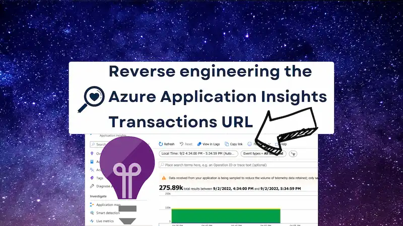
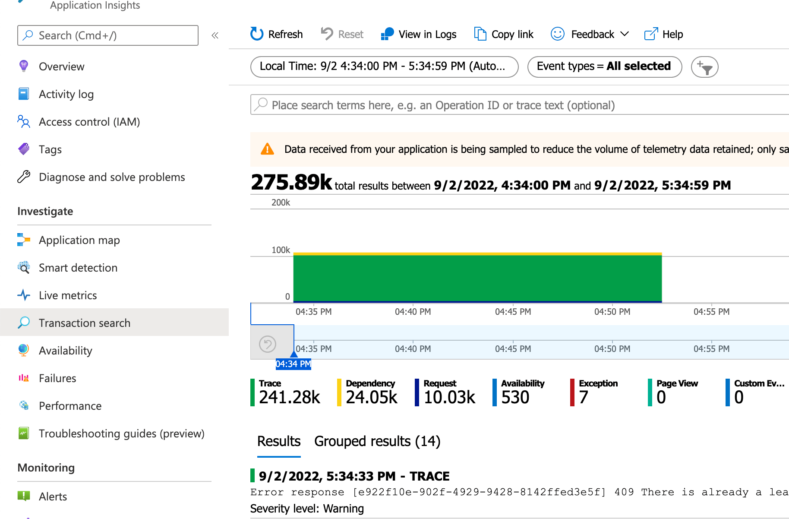

Logs matter. In Azure, logs generally live in Application Insights, in the Transaction Search section. This post reverse engineers the Azure Application Insights Transactions URL, and details how to construct a link to take you directly there, using both TypeScript and C#.



## Bring me the logs!

If you've ever supported a production system, you will know this to be true: logs matter. Logs help you understand what's gone wrong. (You're never looking at logs when something has gone right.) When it comes to Azure, logs tend to reside here:



Whilst Transaction Search is very powerful, it can also be a little tough to find the things that you need. In a system I'm working on now, we've found ourselves building a techops application that allows to provide support. We use it to bring together disparate pieces of information across our estate. As we use it, we're usually looking at a particular slice of time. If we don't find what we need in our application we'll find a need to dig into the logs for the same period.

Rather than logging into Azure, finding Application Insights, going to Transactions and entering the time period, what if we could just go there? We can. Look at the screenshot above, do you see the "Copy link" button? That button copies a URL to the clipboard which encapsulates the current search criteria. And it turns out we can reverse engineer it!

## Reverse engineering a link

Look at this (very verbose) URL:

https://portal.azure.com/#blade/AppInsightsExtension/BladeRedirect/BladeName/searchV1/ResourceId/%2Fsubscriptions%2F4e41a677-9a57-4a7c-9c4c-e71bae5d998e%2Fresourcegroups%2Frg-maas-shared-storage-dev-001%2Fproviders%2Fmicrosoft.insights%2Fcomponents%2Fappi-maas-shared-dev/BladeInputs/%7B%22tables%22%3A%5B%22traces%22%5D%2C%22timeContextWhereClause%22%3A%22%7C+where+timestamp+%3E+datetime(%5C%222022-05-03T10%3A04%3A33.267Z%5C%22)+and+timestamp+%3C+datetime(%5C%222022-05-03T10%3A34%3A33.267Z%5C%22)%22%2C%22filterWhereClause%22%3A%22%7C+where+severityLevel+in+(%5C%223%5C%22)%7C+where+*+has+%5C%22healthcheck%5C%22%7C+order+by+timestamp+desc%22%2C%22originalParams%22%3A%7B%22eventTypes%22%3A%5B%7B%22value%22%3A%22availabilityResult%22%2C%22tableName%22%3A%22availabilityResults%22%2C%22label%22%3A%22Availability%22%7D%2C%7B%22value%22%3A%22request%22%2C%22tableName%22%3A%22requests%22%2C%22label%22%3A%22Request%22%7D%2C%7B%22value%22%3A%22exception%22%2C%22tableName%22%3A%22exceptions%22%2C%22label%22%3A%22Exception%22%7D%2C%7B%22value%22%3A%22pageView%22%2C%22tableName%22%3A%22pageViews%22%2C%22label%22%3A%22Page+View%22%7D%2C%7B%22value%22%3A%22trace%22%2C%22tableName%22%3A%22traces%22%2C%22label%22%3A%22Trace%22%7D%2C%7B%22value%22%3A%22customEvent%22%2C%22tableName%22%3A%22customEvents%22%2C%22label%22%3A%22Custom+Event%22%7D%2C%7B%22value%22%3A%22dependency%22%2C%22tableName%22%3A%22dependencies%22%2C%22label%22%3A%22Dependency%22%7D%5D%2C%22timeContext%22%3A%7B%22durationMs%22%3A1800000%2C%22endTime%22%3A%222022-05-03T10%3A34%3A33.267Z%22%7D%2C%22filter%22%3A%5B%5D%2C%22searchPhrase%22%3A%7B%22originalPhrase%22%3A%22healthcheck%22%2C%22_tokens%22%3A%5B%7B%22conjunction%22%3A%22and%22%2C%22value%22%3A%22healthcheck%22%2C%22isNot%22%3Afalse%2C%22kql%22%3A%22+*+has+%5C%22healthcheck%5C%22%22%7D%5D%7D%2C%22sort%22%3A%22desc%22%7D%7D

There's a lot in there. However, it's actually made up of four distinct parts. Let's break it down:

### 1. Main Azure Portal routing

Firstly this:

https://portal.azure.com/#blade/AppInsightsExtension/BladeRedirect/BladeName/searchV1/ResourceId/

This is a recognisable URL and takes us to the relevant part of the Azure Portal.

### 2. ResourceId

When you look at the below it seems familiar. It's the

%2Fsubscriptions%2F4e41a677-9a57-4a7c-9c4c-e71bae5d998e%2Fresourcegroups%2Frg-maas-shared-storage-dev-001%2Fproviders%2Fmicrosoft.insights%2Fcomponents%2Fappi-maas-shared-dev

### 3. More Azure Portal routing

/BladeInputs/

### 4. The query

%7B%22tables%22%3A%5B%22traces%22%5D%2C%22timeContextWhereClause%22%3A%22%7C+where+timestamp+%3E+datetime(%5C%222022-05-03T10%3A04%3A33.267Z%5C%22)+and+timestamp+%3C+datetime(%5C%222022-05-03T10%3A34%3A33.267Z%5C%22)%22%2C%22filterWhereClause%22%3A%22%7C+where+severityLevel+in+(%5C%223%5C%22)%7C+where+_+has+%5C%22healthcheck%5C%22%7C+order+by+timestamp+desc%22%2C%22originalParams%22%3A%7B%22eventTypes%22%3A%5B%7B%22value%22%3A%22availabilityResult%22%2C%22tableName%22%3A%22availabilityResults%22%2C%22label%22%3A%22Availability%22%7D%2C%7B%22value%22%3A%22request%22%2C%22tableName%22%3A%22requests%22%2C%22label%22%3A%22Request%22%7D%2C%7B%22value%22%3A%22exception%22%2C%22tableName%22%3A%22exceptions%22%2C%22label%22%3A%22Exception%22%7D%2C%7B%22value%22%3A%22pageView%22%2C%22tableName%22%3A%22pageViews%22%2C%22label%22%3A%22Page+View%22%7D%2C%7B%22value%22%3A%22trace%22%2C%22tableName%22%3A%22traces%22%2C%22label%22%3A%22Trace%22%7D%2C%7B%22value%22%3A%22customEvent%22%2C%22tableName%22%3A%22customEvents%22%2C%22label%22%3A%22Custom+Event%22%7D%2C%7B%22value%22%3A%22dependency%22%2C%22tableName%22%3A%22dependencies%22%2C%22label%22%3A%22Dependency%22%7D%5D%2C%22timeContext%22%3A%7B%22durationMs%22%3A1800000%2C%22endTime%22%3A%222022-05-03T10%3A34%3A33.267Z%22%7D%2C%22filter%22%3A%5B%5D%2C%22searchPhrase%22%3A%7B%22originalPhrase%22%3A%22healthcheck%22%2C%22_tokens%22%3A%5B%7B%22conjunction%22%3A%22and%22%2C%22value%22%3A%22healthcheck%22%2C%22isNot%22%3Afalse%2C%22kql%22%3A%22+_+has+%5C%22healthcheck%5C%22%22%7D%5D%7D%2C%22sort%22%3A%22desc%22%7D%7D

##

```tsx
function makeAzureApplicationInsightsTransactionUrl({
  applicationInsightsId,
  endDate,
  startDate,
}: {
  applicationInsightsId: string;
  startDate: Date;
  endDate: Date;
}) {
  const endDateAsString = endDate.toISOString(); // eg 2022-05-03T14:22:51.180Z
  const startDateAsString = startDate.toISOString();
  const durationMs = endDate.getTime() - startDate.getTime();
  const logsQuery = {
    tables: [
      'availabilityResults',
      'requests',
      'exceptions',
      'pageViews',
      'traces',
      'customEvents',
      'dependencies',
    ],
    timeContextWhereClause: `| where timestamp > datetime(${startDateAsString}) and timestamp < datetime("${endDateAsString}")`,
    filterWhereClause: '| order by timestamp desc',
    originalParams: {
      eventTypes: [
        {
          value: 'availabilityResult',
          tableName: 'availabilityResults',
          label: 'Availability',
        },
        { value: 'request', tableName: 'requests', label: 'Request' },
        {
          value: 'exception',
          tableName: 'exceptions',
          label: 'Exception',
        },
        {
          value: 'pageView',
          tableName: 'pageViews',
          label: 'Page View',
        },
        { value: 'trace', tableName: 'traces', label: 'Trace' },
        {
          value: 'customEvent',
          tableName: 'customEvents',
          label: 'Custom Event',
        },
        {
          value: 'dependency',
          tableName: 'dependencies',
          label: 'Dependency',
        },
      ],
      timeContext: {
        durationMs: durationMs,
        endTime: endDateAsString,
      },
      filter: [],
      searchPhrase: {
        originalPhrase: '',
        _tokens: [],
      },
      sort: 'desc',
    },
  };

  const logsUrl = `https://portal.azure.com/#blade/AppInsightsExtension/BladeRedirect/BladeName/searchV1/ResourceId/${encodeURIComponent(
    applicationInsightsId
  )}/BladeInputs/${encodeURIComponent(JSON.stringify(logsQuery))}`;

  return logsUrl;
}
```

## This time with C#

```cs
using System.Collections.Generic;
using Newtonsoft.Json;

namespace AzureApplicationInsightsTransactionSearchUrl
{
    public static string? MakeAzureApplicationInsightsTransactionUrl(
        string applicationInsightsId,
        DateTime startDate,
        DateTime endDate
    )
    {
        var endDateAsString = endDate.ToAzureLogsString();
        var startDateAsString = startDate.ToAzureLogsString();
        var durationMs = Convert.ToInt32((endDate - startDate).TotalMilliseconds);

        var logsQuery = new LogsQuery(
            Tables: new List<string> {
                "availabilityResults",
                "requests",
                "exceptions",
                "pageViews",
                "traces",
                "customEvents",
                "dependencies"
             },
            TimeContextWhereClause: $"| where timestamp > datetime(\"{startDateAsString}\") and timestamp < datetime(\"{endDateAsString}\")",
            FilterWhereClause: $"| order by timestamp desc",
                OriginalParams: new OriginalParams(
                    EventTypes: new List<EventType>
                    {
                        new (
                            Value: "availabilityResult",
                            TableName: "availabilityResults",
                            Label: "Availability"
                        ),
                        new (
                            Value: "request",
                            TableName: "requests",
                            Label: "Request"
                        ),
                        new (
                            Value: "exception",
                            TableName: "exceptions",
                            Label: "Exception"
                        ),
                        new (
                            Value: "pageView",
                            TableName: "pageViews",
                            Label: "Page View"
                        ),
                        new (
                            Value: "trace",
                            TableName: "traces",
                            Label: "Trace"
                        ),
                        new (
                            Value: "customEvent",
                            TableName: "customEvents",
                            Label: "Custom Event"
                        ),
                        new (
                            Value: "dependency",
                            TableName: "dependencies",
                            Label: "Dependency"
                        ),
                    },
                    TimeContext: new TimeContext(
                        DurationMs: durationMs,
                        EndTime: endDateAsString
                    ),
                    Filter: new List<Filter>(),
                    SearchPhrase: new SearchPhrase(
                        OriginalPhrase: "",
                        Tokens: new List<Token>()
                    ),
                    Sort: "desc"
                )
            );

        string appInsights = ;
        var logsUrl = $"https://portal.azure.com/#blade/AppInsightsExtension/BladeRedirect/BladeName/searchV1/ResourceId/{WebUtility.UrlEncode(applicationInsightsId)}/BladeInputs/{WebUtility.UrlEncode(JsonConvert.SerializeObject(MakeLogsQuery(azureMonitorCommonAlert, searchFor)))}";
    }

    public record EventType(
        [property: JsonProperty("value")] string Value,
        [property: JsonProperty("tableName")] string TableName,
        [property: JsonProperty("label")] string Label
    );

    public record TimeContext(
        [property: JsonProperty("durationMs")] int DurationMs,
        [property: JsonProperty("endTime")] string EndTime
    );

    public record Dimension(
        [property: JsonProperty("displayName")] string DisplayName,
        [property: JsonProperty("tables")] IReadOnlyList<string> Tables,
        [property: JsonProperty("name")] string Name,
        [property: JsonProperty("draftKey")] string DraftKey
    );

    public record Operator(
        [property: JsonProperty("label")] string Label,
        [property: JsonProperty("value")] string Value,
        [property: JsonProperty("isSelected")] bool IsSelected
    );

    public record Filter(
        [property: JsonProperty("dimension")] Dimension Dimension,
        [property: JsonProperty("values")] IReadOnlyList<string> Values,
        [property: JsonProperty("operator")] Operator Operator
    );

    public record Token(
        [property: JsonProperty("conjunction")] string Conjunction,
        [property: JsonProperty("value")] string Value,
        [property: JsonProperty("isNot")] bool IsNot,
        [property: JsonProperty("kql")] string Kql
    );

    public record SearchPhrase(
        [property: JsonProperty("originalPhrase")] string OriginalPhrase,
        [property: JsonProperty("_tokens")] IReadOnlyList<Token> Tokens
    );

    public record OriginalParams(
        [property: JsonProperty("eventTypes")] IReadOnlyList<EventType> EventTypes,
        [property: JsonProperty("timeContext")] TimeContext TimeContext,
        [property: JsonProperty("filter")] IReadOnlyList<Filter> Filter,
        [property: JsonProperty("searchPhrase")] SearchPhrase SearchPhrase,
        [property: JsonProperty("sort")] string Sort
    );

    public record LogsQuery(
        [property: JsonProperty("tables")] IReadOnlyList<string> Tables,
        [property: JsonProperty("timeContextWhereClause")] string TimeContextWhereClause,
        [property: JsonProperty("filterWhereClause")] string FilterWhereClause,
        [property: JsonProperty("originalParams")] OriginalParams OriginalParams
    );
}
```
