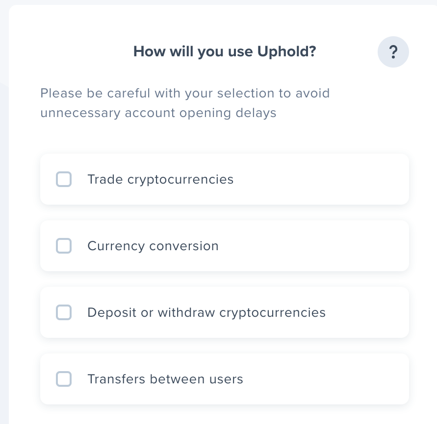
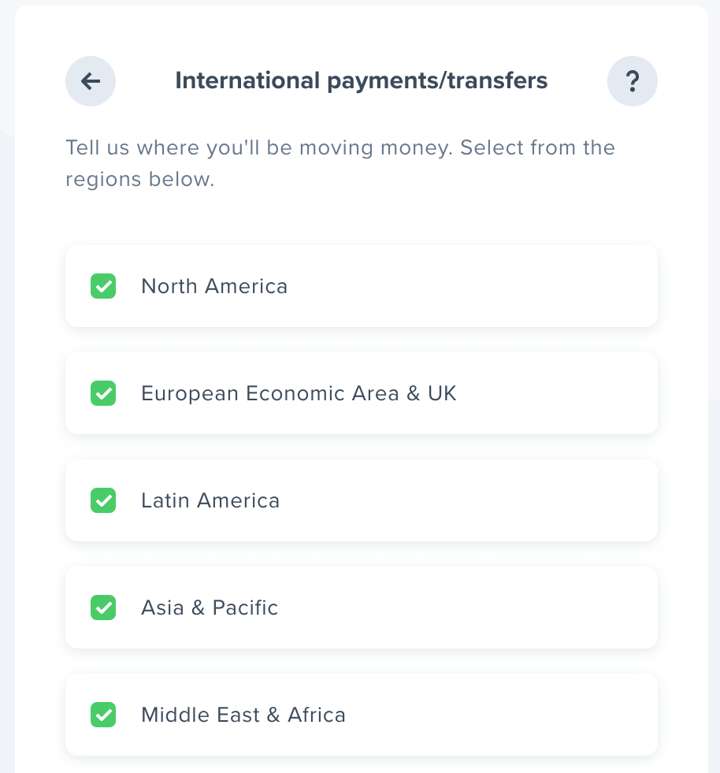
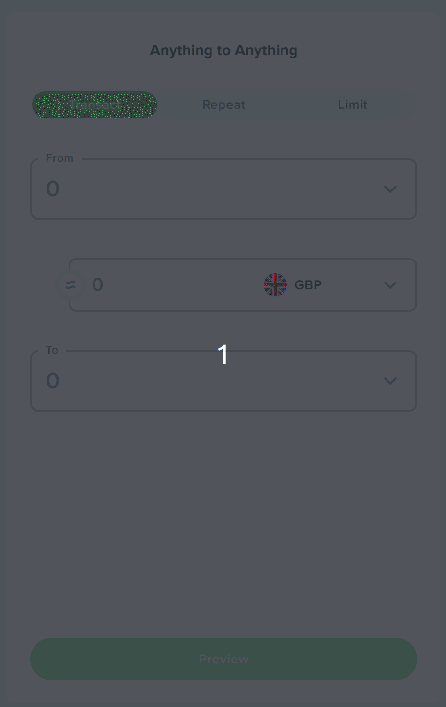

<head>
  <link rel="monetization" href="https://ilp.uphold.com/LwQQhXdpwxeJ" />
</head>

The Web Monetization API is a JavaScript browser API that allows the creation of a payment stream from the user agent to the website. This post walks through getting started adding it to a site.


## The Web Monetization API

I recently attended the [HalfStack at the Beach](https://halfstackconf.com/newquay/) conference and heard a talk from [Alex Lakatos](https://twitter.com/avolakatos) on the Web Monetization API. I hadn't heard about this previously, but my rough understanding of the concept was that it was a way to monetize a website. My blog already features a [Buy Me a Coffee](https://www.buymeacoffee.com/qUBm0Wh) link, which allows generous people to send me small amounts of money if they've found something I've written useful. The Web Monetization API appears to be that, but built into the browser and proposed proposed as a W3C standard at the [Web Platform Incubator Community Group](https://discourse.wicg.io/t/proposal-web-monetization-a-new-revenue-model-for-the-web/3785).

I was intrigued. Alex was kind enough to share some links with me, and I decided to take the Web Monetization API for a spin, and see what it was like. So this post is going to be exactly that. I'm a noob; I don't know how to use the Web Monetization API (or much about it TBH). Over the course of this post I'll try and integrate it into my blog. As I do that I'll share what I'm doing and how I found things; to try to provide a useful resource (and some feedback) on what adoption feels like.

Alex shared a link to https://webmonetization.org/ - in there I found a [quick start](https://webmonetization.org/docs/getting-started) which I decided to work through.

## Wallet

The first thing to do is [setting up a wallet](https://webmonetization.org/docs/getting-started#1-set-up-a-web-monetized-wallet). I imagine that this is comparable to having a bank account in a bank. There appear to be two options for this:

- [uphold](https://wallet.uphold.com/)
- [gatehub](https://gatehub.net/)

[Right now, uphold offers a greater number of features](https://webmonetization.org/docs/ilp-wallets/#digital-wallets), so I'll create a wallet with them.

## Uphold

The signup process was pretty straightforward. I got slightly confused was seeing this prompt:



I wasn't entirely sure what I needed. The Web Monetization API seemed most likely to be about transfers between users, so I went with that.

When it asked this question:



I opted to accept all regions. After the usual signup process, I was able to see able to see my new (empty) account:


## Payment pointer

The next thing we need to do is acquire our payment pointer. I found this tricky to track down and eventually Alex showed me where to go. On the right hand side of the dashboard, there is an "anything to anything" section:



Clicking on the "copy" button copies the payment pointer to the clipboard. I'll need this later. In my case that is: `$ilp.uphold.com/LwQQhXdpwxeJ`

## Meta tag

The next thing to do is to make a meta tag using the payment pointer. This is the tag that will tell the browser that the page supports Web Monetization. The tag looks like this:

```html
<meta name="monetization" content="$ilp.uphold.com/LwQQhXdpwxeJ" />
```

As you can see, the content attribute is the payment pointer I just acquired.

## Meta tag with Docusaurus

The final step here would be adding this meta tag to the pages served up by my site. I'm using Docusaurus for my blog, so I'll need to add it to the [`docusaurus.config.js` file](https://docusaurus.io/docs/next/seo#global-metadata):

```js
module.exports = {
  themeConfig: {
    metadata: [
      { name: 'monetization', content: '$ilp.uphold.com/LwQQhXdpwxeJ' },
    ],
    // This would become <meta name="monetization" content="$ilp.uphold.com/LwQQhXdpwxeJ"> in the generated HTML
  },
};
```

With that done, my site is web monetized! Or at least... I think it is... What does that mean? Well, I wasn't entirely sure. I reached out to Alex again, showed him my site and said "does this work?" He said:


And sure enough, I found Alex had indeed sent me the princely sum of 83 pence on Uphold! (I'm pretty sure he sent $1 - otherwise that specific amount would be a touch peculiar!)

## Coil

It turned out that Alex had used a browser extension called [Coil](https://coil.com/) to send me the money. It's a browser extension that allows you to send money to websites that support Web Monetization. It's a bit like a browser based Patreon or Buy Me a Coffee.

I'd set up an Uphold account so I could receive money from other people. Coil is like the flipside of that it seems, it lets you send money to others. It turned out that I could set up a Coil account using the Uphold account I'd just created to _send_ money:


So that's what I did. I entered my payment pointer into Coil and now I can send money to other people's sites that support Web Monetization. But what does that look like? Well, I decided to try it out on my own site. I installed the [Coil browser extension](https://coil.com/) and then went to my site and gave it a whirl:


I went to my blog and sure enough, I was able to send a tip to myself. I sent myself 83 pence again. I'm not sure what the difference is between this and the money Alex sent me, but I'm sure I'll find out.
