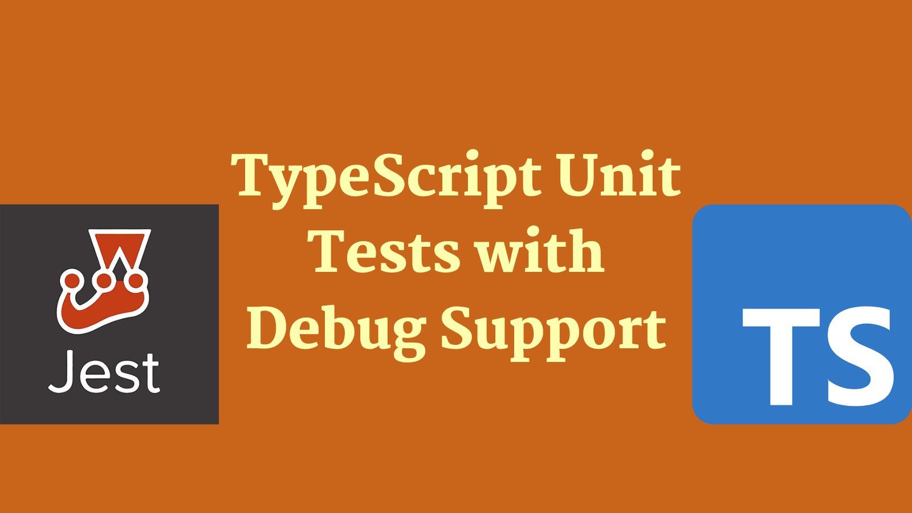
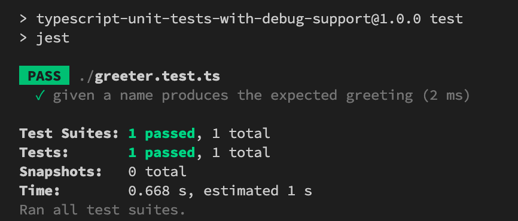
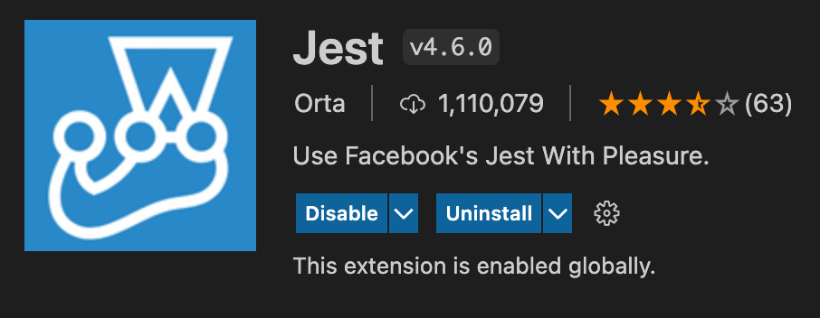
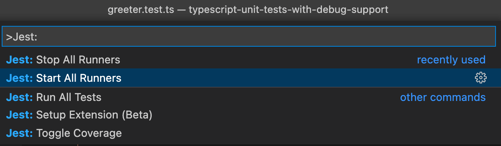
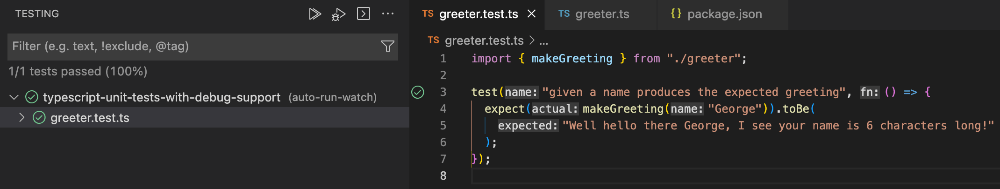
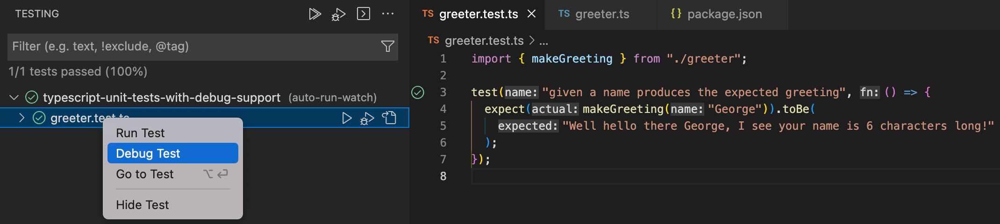
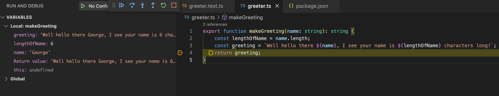

<head>
    <link rel="canonical" href="https://meticulous.ai/blog/typescript-unit-tests-with-debugging/" />
</head>

<!--truncate-->

Unit tests are an important part of the development process. They are used to verify that the code is working as intended. This post will outline how to write unit tests using TypeScript and how to debug them as well.



## Unit Tests

When we are writing unit tests to verify system behaviour, we have to make choices. We need to choose the test framework that we'll use to run our tests. In the JavaScript world we'll be choosing from options including Jest, Mocha, tape, Jasmine and others. There are numerous other testing tools like Cypress and Playwright which cover broader automated testing needs, but we're intentionally just thinking about unit tests right now and so we'll exclude those.

Of the various choices available, Jest is (at time of writing) very much the most popular. Since we have do not have a particular reason for favouring one of the frameworks that isn't as popular as Jest, that's what we'll use.

Tests are a wonderful tool for asserting system behaviour. However, they can fail for mysterious reasons. When that happens, it can be helpful to see what the computer can see. It can be helpful to be able to debug your tests in the way you might hope to debug your other code.

In this post:

1. We'll set up a TypeScript Node.js project, containing some code we'd like to test.
2. We'll configure our project to work with Jest and we'll write a test.
3. We'll debug our unit test.

Let's begin.

## Setting up our TypeScript project

First we'll create ourselves a new Node.js project:

```shell
mkdir typescript-unit-tests-with-debug-support
cd typescript-unit-tests-with-debug-support
npm init --yes
```

At this point we have an empty Node.js project. Let's add TypeScript to it as a dependency and initialise our TypeScript project:

```shell
npm install typescript
npx -p typescript tsc --init
```

We now have a fully working TypeScript Node.js project and we're ready to start writing some code!

This is a post about demonstrating unit testing with TypeScript. So naturally we need something to test. We're going write a simple module called `greeter.ts` which has the following content:

```ts
export function makeGreeting(name: string): string {
  const lengthOfName = name.length;
  const greeting = `Well hello there ${name}, I see your name is ${lengthOfName} characters long!`;
  return greeting;
}
```

`greeter.ts` is a TypeScript file that contains a single simple function. The `makeGreeting` function takes a string parameter and, over a number of lines, constructs a greeting string which the function returns. The nature of the greeting is inconsequential. However, remember later we want to be able to debug our test. We've intentionally written a function featuring more than one line of code. We've done this so we can demonstrate the benefits of debugging by showing the program state as it is in the process of executing.

## Setting up the Jest project

The next step after setting up our TypeScript Node.js project, is adding tests, and the ability to run them, using Jest.

First of all we're going to need to add Jest to our project and initially configure it:

```shell
npm install --save-dev jest
npx jest --init
```

As part of the initialisation you should be prompted with a number of questions:

```
npx jest --init

The following questions will help Jest to create a suitable configuration for your project

✔ Would you like to use Typescript for the configuration file? … no
✔ Choose the test environment that will be used for testing › node
✔ Do you want Jest to add coverage reports? … no
✔ Which provider should be used to instrument code for coverage? › v8
✔ Automatically clear mock calls, instances, contexts and results before every test? … no
```

We'll select all the defaults; including _not_ using TypeScript for the configuration file. We don't require a configuration file written in TypeScript to be able to write TypeScript tests. The initialisation will create a `jest.config.js` file which contains the configuration used to run our tests.

Next, we'll update the `scripts` section of our `package.json` to invoke Jest:

```json
  "scripts": {
    "test": "jest"
  },
```

At this point we're in a place where we can run tests written in JavaScript. But we want to run tests written in TypeScript. [Jest supports this scenario well](https://jestjs.io/docs/getting-started#using-typescript), using Babel. So we'll add the dependencies we need:

```shell
npm install --save-dev babel-jest @babel/core @babel/preset-env @babel/preset-typescript @types/jest
```

With all that done, let's see if we can write a test. We'll create a `greeter.test.ts` file to sit alongside `greeter.ts`:

```ts
import { makeGreeting } from './greeter';

test('given a name produces the expected greeting', () => {
  expect(makeGreeting('George')).toBe(
    'Well hello there George, I see your name is 6 characters long!',
  );
});
```

This simple test, invokes the `makeGreeting` function in our `greeter.ts` file and asserts the return value is as expected. Let us see if we can run our test with `npm run test`:



Success! We've now created a TypeScript project, written a function, written a test for that function and we have the ability to run it.

## Set up debugging support

The final thing we wanted to tackle was adding debug support. In times past, this was often quite tricky to configure. However, debugging has become much easier due to the excellent [`vscode-jest`](https://github.com/jest-community/vscode-jest) project, which is dedicated to making "testing more intuitive and fun". In fact, with this extension the experience is now very "plug and play" which is a great thing.

Inside VS Code, we will install the vscode-jest extension:



Once it's installed, we'll need to restart VS Code, and we may also need to enter the `Jest: Start All Runners` command in VS Codes power bar:



Once the Jest runners have started, we start to see the benefits that the VS Code Jest plugin offers. Where tests exist in our code, they are detected by the plugin and run. Depending upon whether tests are passing or failing we will be presented with a red cross or a green tick denoting failure or success directly alongside the code:



Using the test explorer, it's possible to run tests on demand. Even more excitingly, it's now possible to debug them too. If you examine the test explorer and right / command click on a given test, you'll be presented with the option to debug a test:



Excitingly this means exactly what we might hope. If we put breakpoints in our code, when the test runs we'll now hit them. We'll be able to debug and introspect each test that runs:



If you look at the screenshot above you'll see we've stopped on a breakpoint, we're able to examine the context of the program at the point that it has paused. We can step further on in our code, we can do all the useful things that debugging affords us. We have succeeded in debugging.

## Conclusion

In this piece we've taken a look at how to get up and running with a unit testable TypeScript project. Beyond that, we've demonstrated how we can debug our TypeScript tests using the VS Code editor.

[This post was originally published on Meticulous.](https://meticulous.ai/blog/typescript-unit-tests-with-debugging/)
