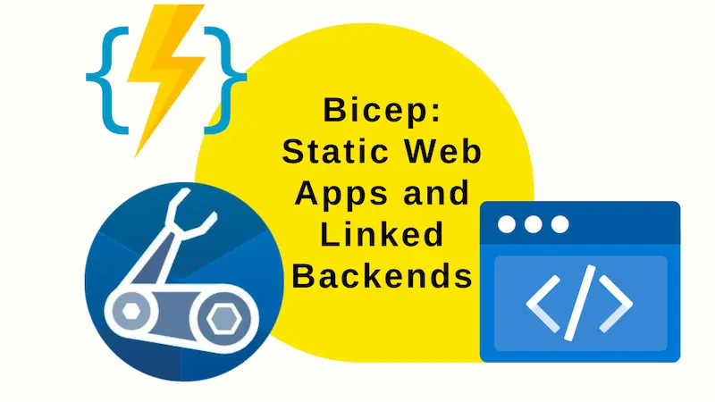
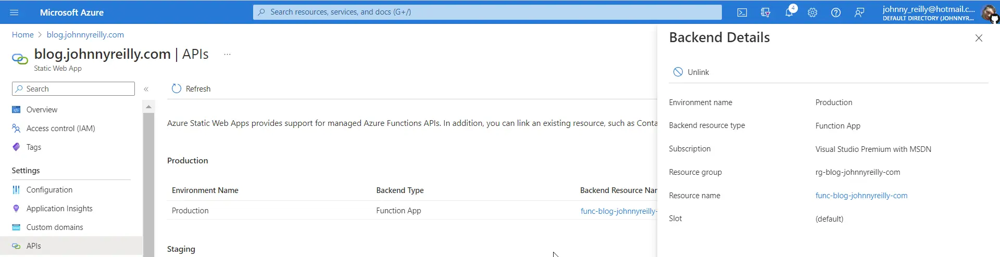

Azure Static Web Apps can be linked to Azure Functions, Azure Container Apps etc to provide the linked backend for a site. This post will demonstrate how to do this with Bicep.



<!--truncate-->

## Introduction

Azure Static Web Apps ship with their own slightly restricted Azure Functions backend; it does not have all of the triggers of the standard offering. If you should need that wider featureset, you can link to an existing Azure Functions instance instead. This is known as the "bring your own functions" approach and is [documented here](https://learn.microsoft.com/en-us/azure/static-web-apps/functions-bring-your-own). The back end doesn't have to be Azure Functions; it could be Azure Container Apps also. This post will demonstrate how to do this with Azure Functions and with Bicep.

## The Function App Bicep

You're going to need to create an Azure Function in your Bicep template. We'll do this here with a Bicep module called `function.bicep`:

```bicep
param functionAppName string
param location string
param hostingPlanName string
param storageAccountName string
param tags object

resource functionApp 'Microsoft.Web/sites@2022-03-01' = {
  name: functionAppName
  kind: 'functionapp,linux'
  location: location
  tags: tags
  properties: {
    siteConfig: {
      appSettings: [
        {
          name: 'FUNCTIONS_EXTENSION_VERSION'
          value: '~4'
        }
        {
          name: 'FUNCTIONS_WORKER_RUNTIME'
          value: 'node'
        }
        {
          name: 'AzureWebJobsStorage'
          value: 'DefaultEndpointsProtocol=https;AccountName=${storageAccount.name};EndpointSuffix=${environment().suffixes.storage};AccountKey=${storageAccount.listKeys().keys[0].value}'
        }
        {
          name: 'WEBSITE_CONTENTAZUREFILECONNECTIONSTRING'
          value: 'DefaultEndpointsProtocol=https;AccountName=${storageAccount.name};EndpointSuffix=${environment().suffixes.storage};AccountKey=${storageAccount.listKeys().keys[0].value}'
        }
        {
          name: 'WEBSITE_CONTENTSHARE'
          value: '${toLower(functionAppName)}a6e3'
        }
      ]
      cors: {
        allowedOrigins: [
          'https://portal.azure.com'
        ]
      }
      use32BitWorkerProcess: false
      ftpsState: 'FtpsOnly'
      linuxFxVersion: 'Node|16'
    }
    serverFarmId: serverFarm.id
    clientAffinityEnabled: false
    httpsOnly: true
  }
}

resource serverFarm 'Microsoft.Web/serverfarms@2022-03-01' = {
  name: hostingPlanName
  location: location
  kind: 'linux'
  tags: {}
  properties: {
    reserved: true
  }
  sku: {
    tier: 'Dynamic'
    name: 'Y1'
  }
  dependsOn: []
}

resource storageAccount 'Microsoft.Storage/storageAccounts@2022-05-01' = {
  name: storageAccountName
  location: location
  tags: {}
  sku: {
    name: 'Standard_LRS'
  }
  properties: {
    supportsHttpsTrafficOnly: true
    minimumTlsVersion: 'TLS1_2'
  }
  kind: 'StorageV2'
}

output functionAppResourceId string = functionApp.id
```

It also creates a storage account and a server farm to support the function app. You'll note it exports the resource name of the function app. We'll use this in the next step.

## The Static Web App Bicep

In our main Bicep template we'll create a static web app and link it to the function app we created in the previous step. We'll do this with a Bicep module called `main.bicep`:

```bicep
param location string
param branch string
param staticWebAppName string
param functionAppName string
param hostingPlanName string
param storageAccountName string
param tags object
@secure()
param repositoryToken string
param customDomainName string

module functionApp 'function.bicep' = {
  name: 'functionApp'
  params: {
    location: location
    tags: tags
    functionAppName: functionAppName
    hostingPlanName: hostingPlanName
    storageAccountName: storageAccountName
  }
}

resource staticWebApp 'Microsoft.Web/staticSites@2021-02-01' = {
  name: staticWebAppName
  location: location
  tags: tags
  sku: {
    // Free doesn't work with linked backends
    name: 'Standard'
    tier: 'Standard'
  }
  properties: {
    repositoryUrl: 'https://github.com/johnnyreilly/blog.johnnyreilly.com'
    repositoryToken: repositoryToken
    branch: branch
    provider: 'GitHub'
    stagingEnvironmentPolicy: 'Enabled'
    allowConfigFileUpdates: true
    buildProperties:{
      skipGithubActionWorkflowGeneration: true
    }
  }
}

resource customDomain 'Microsoft.Web/staticSites/customDomains@2021-02-01' = {
  parent: staticWebApp
  name: customDomainName
  properties: {}
}

resource staticWebAppBackend 'Microsoft.Web/staticSites/linkedBackends@2022-03-01' = {
  name: '${staticWebAppName}/backend'
  properties: {
    backendResourceId: functionApp.outputs.functionAppResourceId
    region: location
  }
}

output staticWebAppDefaultHostName string = staticWebApp.properties.defaultHostname // eg gentle-bush-0db02ce03.azurestaticapps.net
output staticWebAppId string = staticWebApp.id
output staticWebAppName string = staticWebApp.name
```

The crucial bit above is this:

```bicep
resource staticWebAppBackend 'Microsoft.Web/staticSites/linkedBackends@2022-03-01' = {
  name: '${staticWebAppName}/backend'
  properties: {
    backendResourceId: functionApp.outputs.functionAppResourceId
    region: location
  }
}
```

This links the static web app to the function app we created in the previous step. We use the `functionApp.outputs.functionAppResourceId` to get the resource ID of the function app from our module.

## The Deployment

Once this is deployed to Azure, if you click on the APIs section of the static web app you'll see the function app is now linked:


