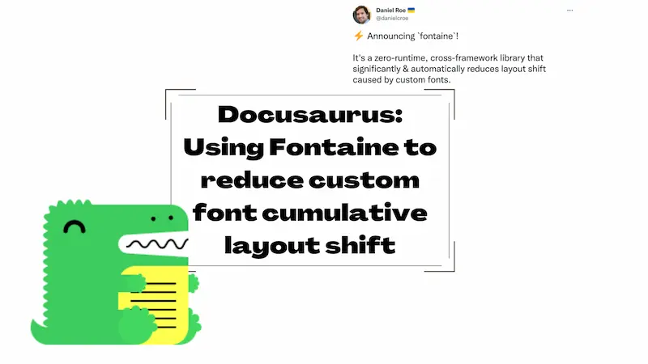
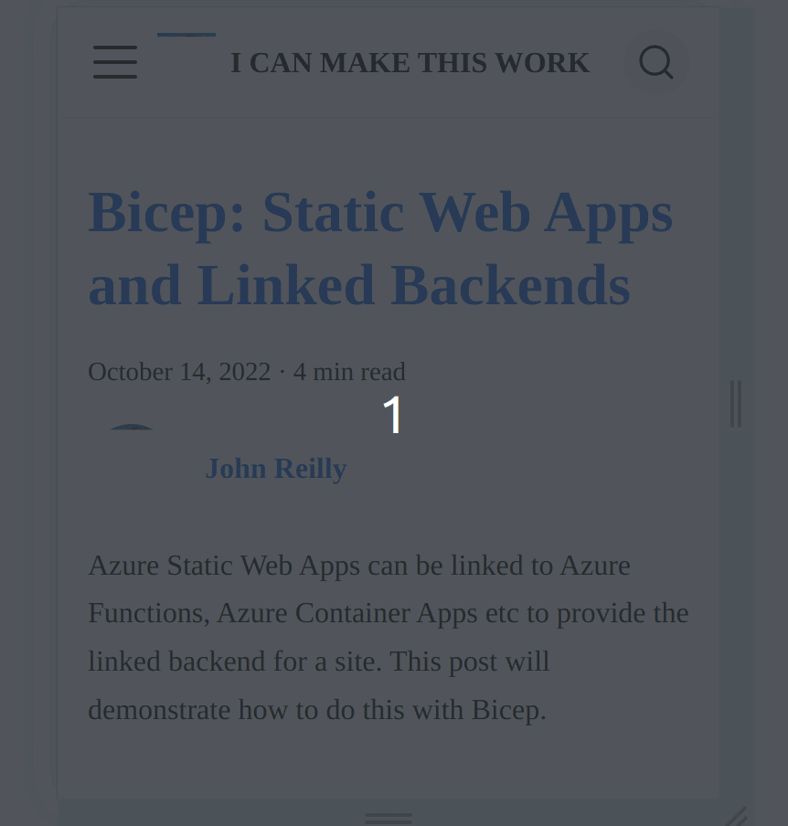
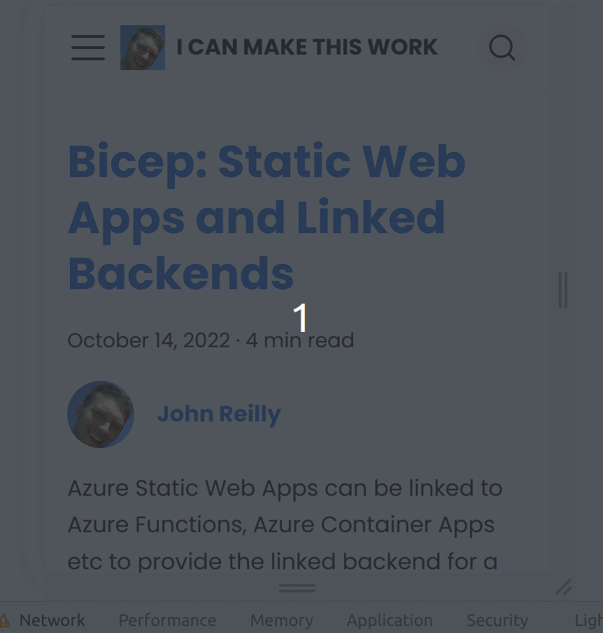

Custom font usage can introduce cumulative layout shift (CLS) to your website. This post shows how to use [fontaine](https://github.com/unjs/fontaine) to reduce this with Docusaurus sites.



## What is cumulative layout shift?

Cumulative layout shift (CLS) is a metric that measures the instability of content on a web page. It's a [Core Web Vitals](https://web.dev/vitals/) metric. It's a metric that's important to get right. It's a metric that's easy to get wrong.

You may well know it as "jank". It's the jank that you see when a page loads and the text moves around. It's an irritation. There's a great description of it in [this post on the topic](https://web.dev/cls/); let me quote it here:

> Have you ever been reading an article online when something suddenly changes on the page? Without warning, the text moves, and you've lost your place. Or even worse: you're about to tap a link or a button, but in the instant before your finger lands—BOOM—the link moves, and you end up clicking something else!

For the rest of this post I'm going to refer to CLS as "jank", as it's a more relatable term.

## My jank

My blog uses a custom font called [Poppins](https://fonts.google.com/specimen/Poppins). Lovely though it is, using the font introduces jank to my site. It's particularly noticeable on mobile phones. Here's a gif of the jank in action:



You see how the text shifts around as the custom font arrives? On the first line we either see:

- the fallback font rendering four words on one line: _"Bicep: Static Web Apps"_

  OR

- the custom font (Poppins) rendering three words on one line: _"Bicep: Static Web"_

It's very noticeable.

I've taken steps to reduce the jank, such as [font preloading](../2021-12-29-preload-fonts-with-docusaurus/index.md). But it's still there. I thought I was about done with the improvements I could make. But then....

## fontaine

One evening I was vaguely browsing Twitter when I came across a tweet from [Daniel Roe](https://twitter.com/danielcroe) which [announced a new tool called fontaine](https://twitter.com/danielcroe/status/1581428654479138817):


I was intrigued. I wanted to try it out. I wanted to see if it could reduce the jank on my blog.

## Using fontaine with Docusaurus

I added fontaine as a dependency to my blog:

```bash
yarn add -D fontaine
```

I then added cracked open my `docusaurus.config.js` file and wrote a small plugin to make use of fontaine:

```js
const fontaine = require('fontaine');

// ...

/** @type {import('@docusaurus/types').Config} */
const config = {
  // ...

  plugins: [
    // ...
    function fontainePlugin(_context, _options) {
      return {
        name: 'fontaine-plugin',
        configureWebpack(_config, _isServer) {
          return {
            plugins: [
              fontaine.fontaineTransform.webpack({
                fallbacks: [
                  'system-ui',
                  '-apple-system',
                  'BlinkMacSystemFont',
                  'Segoe UI',
                  'Roboto',
                  'Oxygen',
                  'Ubuntu',
                  'Cantarell',
                  'Open Sans',
                  'Helvetica Neue',
                  'sans-serif',
                ],
                // You may need to resolve assets like `/fonts/Poppins-Bold.ttf` to a particular directory
                resolvePath: (id) => '../fonts/' + id,
              }),
            ],
          };
        },
      };
    },
    // ...
  ],
  // ...
};
```

This didn't initially seem to make any difference. I put it up as a [work-in-progress PR](https://github.com/johnnyreilly/blog.johnnyreilly.com/pull/305) and wrote up my findings as best I could. Daniel was kind enough to take a look. He uncovered two issues:

- There was a bug in fontaine around how it handled CSS variables; [he implemented a fix](https://github.com/unjs/fontaine/commit/a708bb07ccc48f385c67ccc3b1eed280d8ee47fc)
- I needed to add update my font family to add the override font family to the CSS variable (as fontaine isn't yet able to connect the dots that this is being used as a font family).

```diff
-  --ifm-font-family-base: 'Poppins';
+  --ifm-font-family-base: 'Poppins', 'Poppins override';
```

I'll be honest, I didn't fully understand the second point. But Daniel was kind enough to [raise a PR incorporating both the tweaks](https://github.com/johnnyreilly/blog.johnnyreilly.com/pull/307). When I merged that PR, I saw the following:



Look at that! You can see the font loading, but there's no more jumping of words from one line to another. It's a huge improvement.

## Conclusion

fontaine can improve your CLS score. It's a great tool.

Prior to using it my blogs Cumulative Layout Shift was logged as 0.019, after using it it's logged as 0. This is good news.

I'm very grateful to Daniel for his help in getting it working with my blog. He went above and beyond, so thank you Daniel!
