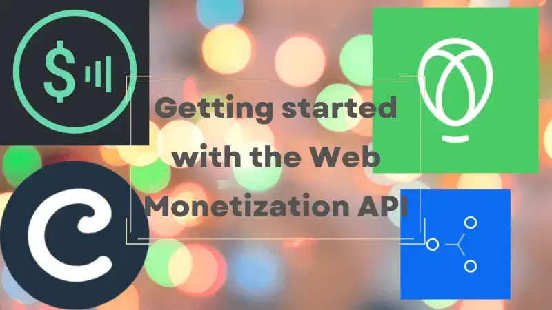
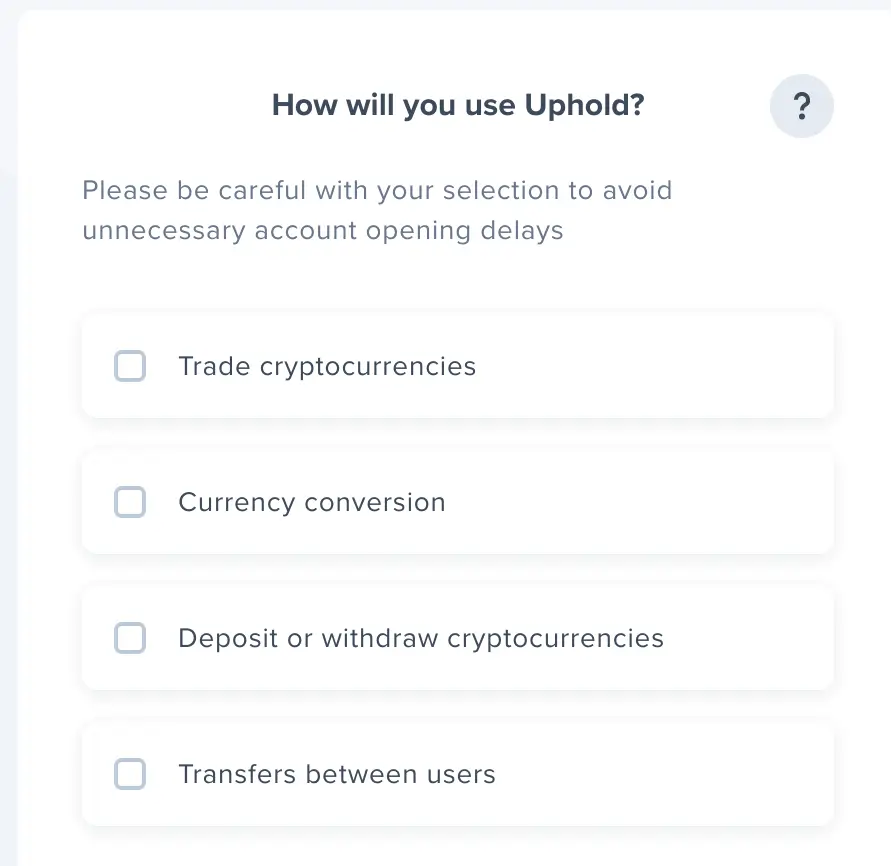
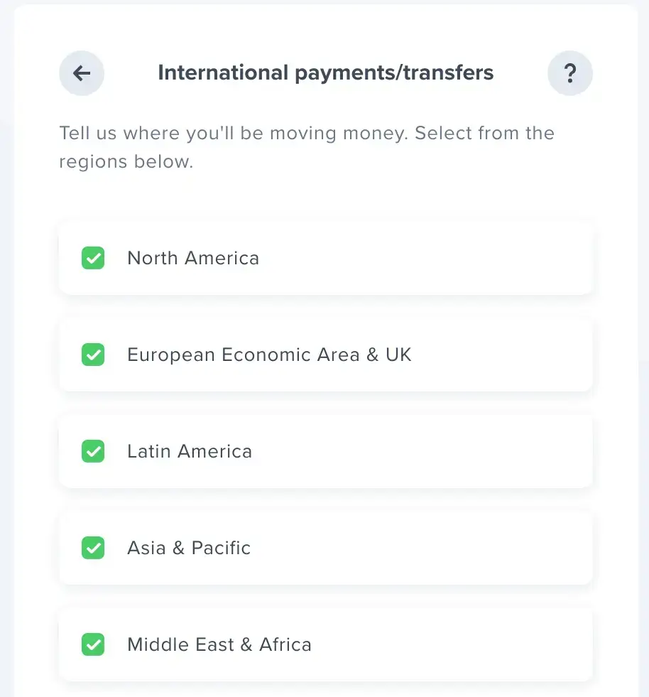
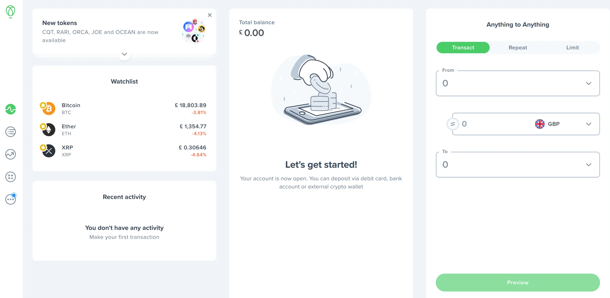
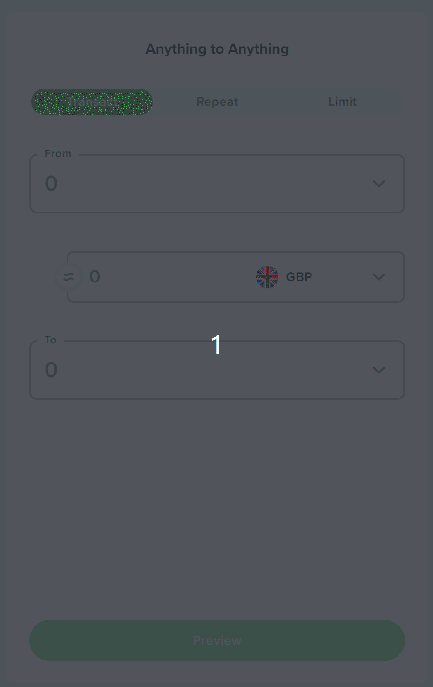
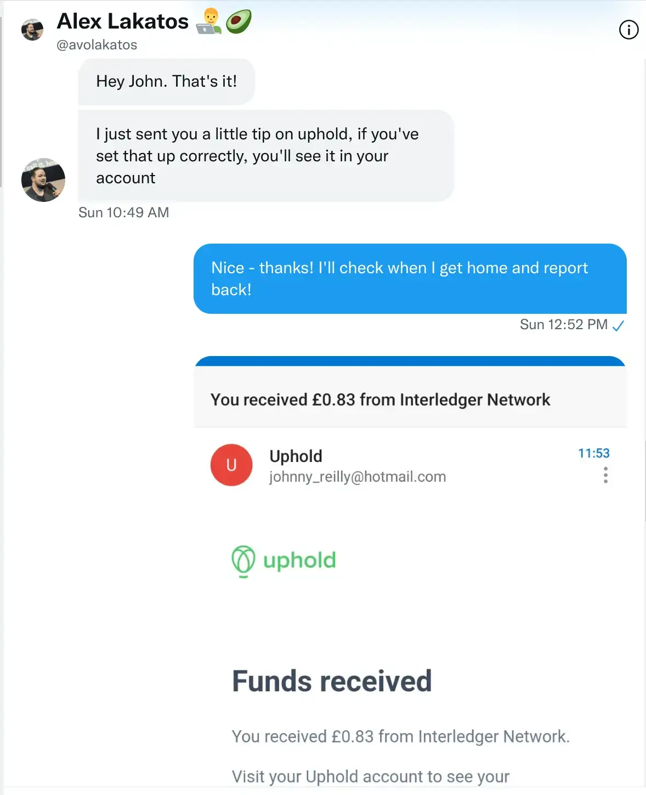
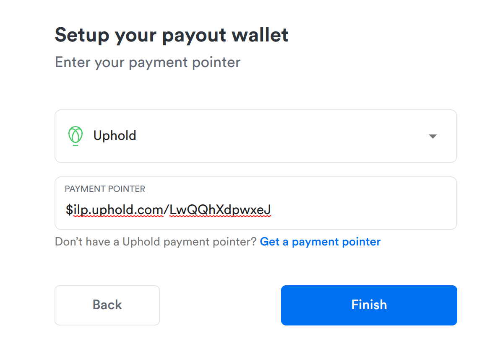
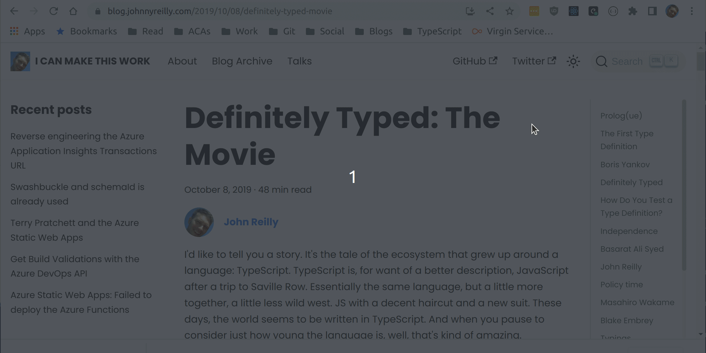
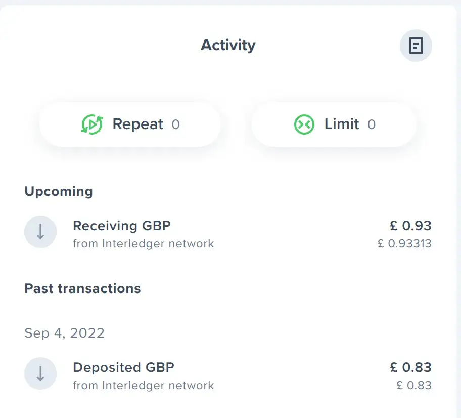

The Web Monetization API is a JavaScript browser API that allows the creation of a payment stream from the user agent to the website. This post walks through getting started adding it to a site.



<!--truncate-->

## The Web Monetization API

Over the summer I attended the [HalfStack at the Beach](https://halfstackconf.com/newquay/) conference and heard a talk from [Alex Lakatos](https://twitter.com/avolakatos) on the Web Monetization API. I hadn't heard about this API previously; it turns out it is a new way to monetize a website. My own blog already featured a [Buy Me a Coffee](https://www.buymeacoffee.com/qUBm0Wh) link, which allows generous people to send me small amounts of money if they've found something I've written useful. The Web Monetization API appears to be that, but built into the browser and proposed as a W3C standard at the [Web Platform Incubator Community Group](https://discourse.wicg.io/t/proposal-web-monetization-a-new-revenue-model-for-the-web/3785).

I was intrigued by the Web Monetization API. Alex was kind enough to share some links with me, and I decided to take it for a spin; to try out using it and to document the findings. This post is going to be exactly that. It's written from the perspective of someone who doesn't know the Web Monetization API save for what they've heard in a talk. Over the course of this post I'll try to get to know it a little better, and try to integrate it into [my blog](https://johnnyreilly.com). As I do that I'll share what I'm doing and how I found things; to try to provide a useful resource (and some feedback) on what adoption feels like.

I'll start with the https://webmonetization.org/ site - in there I found a [quick start](https://webmonetization.org/docs/getting-started) which I decided to work through.

## Wallet

The first thing to do, if you'd like to adopt Web Monetization, is [set up a wallet](https://webmonetization.org/docs/getting-started#1-set-up-a-web-monetized-wallet). This allows you to receive money from people - it's a bank account essentially; one that supports integration with Web Monetization. There appeared to be two options for this:

- [uphold](https://wallet.uphold.com/)
- [gatehub](https://gatehub.net/)

[Right now, uphold offers a greater number of features](https://webmonetization.org/docs/ilp-wallets/#digital-wallets), so decided to create a wallet with them.

## Uphold

The signup process was pretty straightforward. I got slightly confused was seeing this prompt:



I wasn't entirely sure what I needed. The Web Monetization API seemed most likely to be about transfers between users, so I went with that.

When it asked this question:



I opted to accept all regions. After the usual signup process, I was able to see able to see my new (empty) account:



## Payment pointer

The next thing we needed to do was acquire our payment pointer. This was a little tricky to track down and eventually Alex showed me where to go. On the right hand side of the dashboard, there is an "anything to anything" section:



Clicking on the "copy" button copies the payment pointer to the clipboard. I'll need this later. In my case that is: `$ilp.uphold.com/LwQQhXdpwxeJ`.

You might be looking at the payment pointer and thinking, "that looks kinda URL-y" ... And you'd be be right! Because `$ilp.uphold.com/LwQQhXdpwxeJ` is equivalent to this URL: `https://ilp.uphold.com/LwQQhXdpwxeJ`. We just swap out the `$` for `https://`.

## Monetization link tag

The next thing to do is to make a `link` tag using the payment pointer. This is the tag that will tell the browser that the page supports Web Monetization. That `link` tag should live in every page of our Web Monetized site. The tag looks like this:

```html
<link rel="monetization" href="https://ilp.uphold.com/LwQQhXdpwxeJ" />
```

As you can see, the `href` attribute is the payment pointer we just acquired; in its "https" form.

## Docusaurus link tag: updated 30/10/2022

The final step here would be adding this `link` tag to the pages served up by our site. In my case, I use Docusaurus to power my blog. To add an extra `link` tag with Docusaurus we need to add it to the [`docusaurus.config.js`](https://docusaurus.io/docs/next/seo#global-metadata) file.

If you're using [Docusaurus 2.2 or greater](https://docusaurus.io/blog/releases/2.2#config-headtags) you can use the new [`headTags` API](https://docusaurus.io/docs/api/docusaurus-config#headTags). Usage looks like this:

```js
module.exports = {
  // ...
  headTags: [
    {
      tagName: 'link',
      attributes: {
        rel: 'monetization',
        href: 'https://ilp.uphold.com/LwQQhXdpwxeJ',
      },
    },
    // This will become <link rel="monetization" href="https://ilp.uphold.com/LwQQhXdpwxeJ" /> in the generated HTML
  ],
  // ...
};
```

If you're using an older version of Docusaurus, you can the syntax for adding an extra `link` tag in the head comes in the form of a mini plugin:

```js
module.exports = {
  // ...
  plugins: [
    // ...
    function extraHeadTagsPlugin(context, options) {
      return {
        name: 'extra-head-tags-plugin',
        injectHtmlTags({ content }) {
          return {
            headTags: [
              {
                tagName: 'link',
                attributes: {
                  rel: 'monetization',
                  href: 'https://ilp.uphold.com/LwQQhXdpwxeJ',
                },
                // This will become <link rel="monetization" href="https://ilp.uphold.com/LwQQhXdpwxeJ" /> in the generated HTML
              },
            ],
          };
        },
      };
    },
    // ...
  ],
};
```

It's also worth knowing that historically the Web Monetization API used a `meta` tag instead of a `link` tag - and that tag used the `$` prefix instead of `https://`. That tag looked like this:

```html
<meta name="monetization" content="$ilp.uphold.com/LwQQhXdpwxeJ" />
```

But the `link` tag is the current standard, and that's what you should look to adopt.

## Hello world Web Monetization API?

With this done, my site is web monetized! Or at least... I think it is... What does that mean? Well, I wasn't entirely sure. I reached out to Alex again, showed him my site and said "does this work?" He said:



And sure enough, I found Alex had indeed sent me the princely sum of 83 pence ($1) on Uphold... It had worked!

## Coil

It turned out that Alex had used a browser extension called [Coil](https://coil.com/) to send me the money. It's a browser extension that allows you to send money to websites that support Web Monetization. It's a bit like a browser based Patreon or Buy Me a Coffee. But slightly different; [to quote their docs](https://help.coil.com/docs/general-info/intro-to-coil/index.html#how-is-coil-different-from-other-membership-services-like-patreon-and-flattr):

> With services like Patreon, you select which creators to support, then pay each creator separately, depending on the membership plans they offer. Coil streams payments in real time to any web monetized sites you visit.

So people can explicitly tip a website using Coil, or they can just use Coil to browse the web and the website will get a small amount of money from Coil. For years I've heard whispers of "micropayments are the missing piece of the web" - this seemed to be solving that problem and I was intrigued.

I'd set up an Uphold account so I could receive money from other people. Coil is like the flipside of that; it would let me send money to other people. You need that money to come from somewhere. It turned out that I could set up a Coil account using the Uphold account I'd just created:



So that's what I did. I entered my payment pointer into Coil and now I can send money to other people's sites that support Web Monetization. But what does that look like? Well, I decided to try it out on my own site. I installed the [Coil browser extension](https://coil.com/) and then went to my site and gave it a whirl:



I went to my blog and sure enough, I was able to send a tip to myself. When I flipped over to my Uphold account, I could see that the money was on its way!



Just as Alex had been able to send me $1 on September 4th, I was able to send myself $1 on September 10th! (Incidentally, the shift in amount from 83 pence to 93 pence between transactions is purely due to the changing value exchange rate between GBP and USD. At present the Pound is decreasing in value against the Dollar, so the amount of money I received in GBP when I tipped myself $1 worked out to be more than when Alex did.)

## Conclusion

In this post we have got to know the Web Monetization API, we've used it to monetize our own site and we've used it to tip ourselves. We've also seen how Coil works and how it can be used to tip other people's sites. I'm excited to see how this develops. It feels like a way to support people who are making things we care about on the web.

Thanks so much to [Alex Lakatos](https://twitter.com/avolakatos) for telling me about this in the first place and for answering all my questions!

[This post was originally published on LogRocket.](https://blog.logrocket.com/getting-started-web-monetization-api/)

<head>
    <link rel="canonical" href="https://blog.logrocket.com/getting-started-web-monetization-api/" />
</head>
