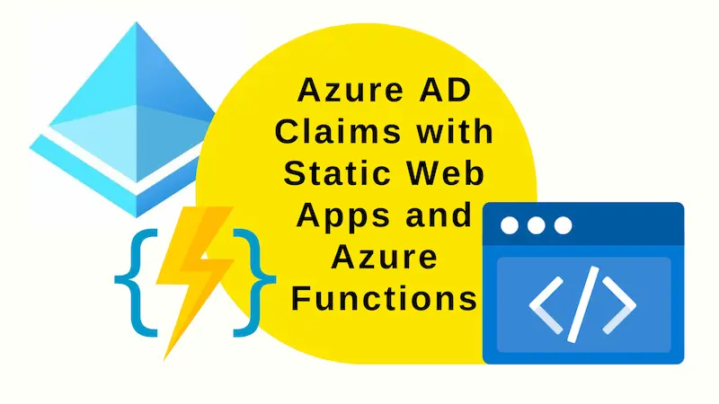

Azure AD Claims are not supplied to Azure Functions when linked with Azure Static Web Apps using the "bring your own functions" / linked backend approach. This post will demonstrate a workaround.



## Where's my claims?

There is a limitation around authorisation when having an Azure Function app as the linked backend to an Azure Static Web App. Essentially the Azure Functions app _does not_ receive the claims that the Static Web App receives.

We have a Static Web App, with an associated C# Function App (using the [Bring Your Own Functions](../2022-10-14-bicep-static-web-apps-linked-backends/index.md) approach). When we're authenticated with Azure AD and go to the auth endpoint: `/.auth/me` we see:

```json
{
  "clientPrincipal": {
    "identityProvider": "aad",
    "userId": "d9178465-3847-4d98-9d23-b8b9e403b323",
    "userDetails": "johnny_reilly@hotmail.com",
    "userRoles": ["authenticated", "anonymous"],
    "claims": [
      // ...
      {
        "typ": "http://schemas.microsoft.com/identity/claims/objectidentifier",
        "val": "d9178465-3847-4d98-9d23-b8b9e403b323"
      },
      {
        "typ": "http://schemas.xmlsoap.org/ws/2005/05/identity/claims/emailaddress",
        "val": "johnny_reilly@hotmail.com"
      },
      {
        "typ": "name",
        "val": "John Reilly"
      },
      {
        "typ": "roles",
        "val": "OurApp.Read"
      },
      // ...
      {
        "typ": "ver",
        "val": "2.0"
      }
    ]
  }
}
```

Note the claims in there. These include custom claims that we've configured such as roles with `OurApp.Read`.

So we can access claims successfully in the Static Web App (the front end). However, the associated Function App does not have access to the claims.

When we implemented a function in the Azure Function which surfaced roles:

```cs
[FunctionName("GetRoles")]
public static async Task<IActionResult> Run(
    [HttpTrigger(AuthorizationLevel.Anonymous, "get", "post", Route = "GetRoles")] HttpRequest req
)
{
    var roles = req.HttpContext.User?.Claims.Select(c => new { c.Type, c.Value });

    return new OkObjectResult(JsonConvert.SerializeObject(roles));
}
```

When this `/api/GetRoles` endpoint is accessed we see this:

```json
[
  {
    "Type": "http://schemas.xmlsoap.org/ws/2005/05/identity/claims/nameidentifier",
    "Value": "d9178465-3847-4d98-9d23-b8b9e403b323"
  },
  {
    "Type": "http://schemas.xmlsoap.org/ws/2005/05/identity/claims/name",
    "Value": "johnny_reilly@hotmail.com"
  },
  {
    "Type": "http://schemas.microsoft.com/ws/2008/06/identity/claims/role",
    "Value": "authenticated"
  },
  {
    "Type": "http://schemas.microsoft.com/ws/2008/06/identity/claims/role",
    "Value": "anonymous"
  }
]
```

At first look, this seems great; we have claims! But when we look again we realise that we have far less claims than we might have hoped for. Crucially, our custom claims like `OurApp.Read` are missing.

If we look directly at the `x-ms-client-principal` header, maybe we'll find what we need?

```cs
[FunctionName("GetRoles")]
public static async Task<IActionResult> GetRoles(
    [HttpTrigger(AuthorizationLevel.Anonymous, "get", Route = "GetRoles")] HttpRequest req
)
{
    var header = req.Headers["x-ms-client-principal"];
    var data = header.FirstOrDefault();
    if (data == null)
    {
        return new OkObjectResult("nothing");
    }

    var decoded = System.Convert.FromBase64String(data);
    var json = System.Text.ASCIIEncoding.ASCII.GetString(decoded);

    return new OkObjectResult(json);
}
```

Alas not - we still lack claims:

```json
{
  "identityProvider": "aad",
  "userId": "d9178465-3847-4d98-9d23-b8b9e403b323",
  "userDetails": "johnny_reilly@hotmail.com",
  "userRoles": ["authenticated", "anonymous"]
}
```

This is the problem: we want the same claims accessible in our Azure Function App that we do in our Azure Static Web App.

How can we achieve this?
