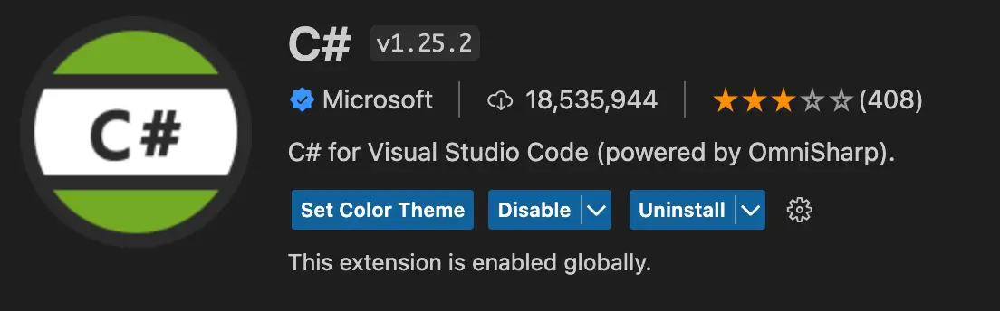

VS Code's debugging mechanism for Azure Functions on Mac OS frequently breaks. This post documents an approach to get it working.


<!--truncate-->

## The problem

I frequently use a Mac to develop Azure Functions. I use VS Code as my editor.

Debugging is can be very useful when you're developing; getting to understand what the computer can see at runtime is a superpower. Regrettably with Azure Functions, I often find that the debugger fails to attach. When this happens, I can't actually debug my Azure Functions.

This is a known issue. In fact, this blog post is me sharing a workaround that I've needed again and again, but keep losing. Not my own work, the work of [Bas Stottelaar](https://github.com/basilfx). I share it as a public service announcement - and to remind myself how to do it! [The original issue (and workaround) is here](https://github.com/OmniSharp/omnisharp-vscode/issues/4903#issuecomment-993015843). Yay Bas!

There appears to be something wrong with the standard code signing of `vsdbg` and / or `vsdbg-ui`. The workaround is to sign the binaries yourself.

## The workaround

You'll first need to generate a self signed certificate to be used for code signing. [There's a good resource on Stack Overflow covering this](https://stackoverflow.com/a/58363510/761388). You should only ever need to do this once. You can then use the same certificate every time you apply the workaround.

In fact it's probably worth emphasising that you'll likely need to apply this workaround again and again. It's not a permanent fix. The workaround script that you need to run is:

```bash
cd ~/.vscode/extensions/ms-dotnettools.csharp-1.25.2-darwin-x64/.debugger/x86_64
codesign --remove-signature vsdbg-ui && codesign --remove-signature vsdbg
codesign -s my-codesign-cert vsdbg-ui && codesign -s my-codesign-cert vsdbg
```

A thing to note about the above is the version in the path. You'll need to change that to match the version of the C# extension that you have installed. You can find the version in the VS Code extensions view:



In this case the version is `1.25.2`; as is reflected in the path above.

Once the script has been run, I've found that restarting VS Code is a good idea. Regrettably the "I cannot debug my Azure Functions" issue is likely to reoccur in future. When it does, the workaround will need to be reapplied.

In the long term, I'd love to see some debugging improvements for Azure Functions. Until that time, we have this.
