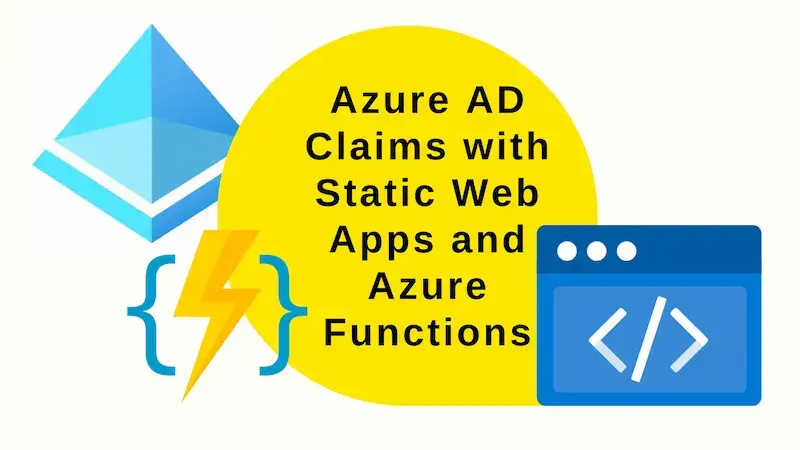

Azure AD Claims are not supplied to Azure Functions when linked with Azure Static Web Apps using the "bring your own functions" / linked backend approach. This post will demonstrate a workaround.



## Where's my claims?

There is a limitation around authorisation when having an Azure Function app as the linked backend to an Azure Static Web App. Essentially the Azure Functions app _does not_ receive the claims that the Static Web App receives.

We have a Static Web App, with an associated C# Function App (using the [Bring Your Own Functions](../2022-10-14-bicep-static-web-apps-linked-backends/index.md) approach). Both the Static Web App and Function App are associated with the same Azure AD app registration.

When we're authenticated with Azure AD and go to the auth endpoint: `/.auth/me` we see:

```json
{
  "clientPrincipal": {
    "identityProvider": "aad",
    "userId": "d9178465-3847-4d98-9d23-b8b9e403b323",
    "userDetails": "johnny_reilly@hotmail.com",
    "userRoles": ["authenticated", "anonymous"],
    "claims": [
      // ...
      {
        "typ": "http://schemas.microsoft.com/identity/claims/objectidentifier",
        "val": "d9178465-3847-4d98-9d23-b8b9e403b323"
      },
      {
        "typ": "http://schemas.xmlsoap.org/ws/2005/05/identity/claims/emailaddress",
        "val": "johnny_reilly@hotmail.com"
      },
      {
        "typ": "name",
        "val": "John Reilly"
      },
      {
        "typ": "roles",
        "val": "OurApp.Read"
      },
      // ...
      {
        "typ": "ver",
        "val": "2.0"
      }
    ]
  }
}
```

Note the claims in there. These include custom claims that we've configured such as roles with `OurApp.Read`.

So we can access claims successfully in the Static Web App (the front end). However, the associated Function App does not have access to the claims.

It's possible to see this by implementing a function which surfaces roles:

```cs
[FunctionName("GetRoles")]
public static async Task<IActionResult> Run(
    [HttpTrigger(AuthorizationLevel.Anonymous, "get", "post", Route = "GetRoles")] HttpRequest req
)
{
    var roles = req.HttpContext.User?.Claims.Select(c => new { c.Type, c.Value });

    return new OkObjectResult(JsonConvert.SerializeObject(roles));
}
```

When this `/api/GetRoles` endpoint is accessed we see this:

```json
[
  {
    "Type": "http://schemas.xmlsoap.org/ws/2005/05/identity/claims/nameidentifier",
    "Value": "d9178465-3847-4d98-9d23-b8b9e403b323"
  },
  {
    "Type": "http://schemas.xmlsoap.org/ws/2005/05/identity/claims/name",
    "Value": "johnny_reilly@hotmail.com"
  },
  {
    "Type": "http://schemas.microsoft.com/ws/2008/06/identity/claims/role",
    "Value": "authenticated"
  },
  {
    "Type": "http://schemas.microsoft.com/ws/2008/06/identity/claims/role",
    "Value": "anonymous"
  }
]
```

At first look, this seems great; we have claims! But when we look again we realise that we have far less claims than we might have hoped for. Crucially, our custom claims / app roles like `OurApp.Read` are missing.

## Maybe they're hiding in `x-ms-client-principal`?

If we look directly at the `x-ms-client-principal` header, maybe we'll find what we need?

```cs
[FunctionName("GetRoles")]
public static async Task<IActionResult> GetRoles(
    [HttpTrigger(AuthorizationLevel.Anonymous, "get", Route = "GetRoles")] HttpRequest req
)
{
    var header = req.Headers["x-ms-client-principal"];
    var data = header.FirstOrDefault();
    if (data == null)
    {
        return new OkObjectResult("nothing");
    }

    var decoded = System.Convert.FromBase64String(data);
    var json = System.Text.ASCIIEncoding.ASCII.GetString(decoded);

    return new OkObjectResult(json);
}
```

Alas not. We have the user's email and some simple roles ("authenticated" and "anonymous"), but no sign of our custom claims / app roles:

```json
{
  "identityProvider": "aad",
  "userId": "d9178465-3847-4d98-9d23-b8b9e403b323",
  "userDetails": "johnny_reilly@hotmail.com",
  "userRoles": ["authenticated", "anonymous"]
}
```

This is the problem: we want our Azure Function App to be able to make use of the same custom claims / app roles that we use for authorization in the Static Web App. How can we achieve this?

## Microsoft Graph API

The answer lies with the Microsoft Graph API. We can interrogate it to get the app role assignments for the user. This will give us the same information that we have in the Static Web App. (Well to be strictly accurate, it will be a slightly different set of claims. But what matters is it will be the app role assignment claims that we want to use for authorization.)

In order that we can interrogate the Microsoft Graph API, we need to register an application in Azure AD. We'll call this the "Graph API App". We'll also need to give it the appropriate permissions to access the Microsoft Graph API. We'll need the following permissions:


- [Application.Read.All](https://learn.microsoft.com/en-us/graph/permissions-reference#application-permissions-4) - to get more information about the app role assignments
- [User.Read](https://learn.microsoft.com/en-us/graph/permissions-reference#delegated-permissions-85) - to sign in
- [User.Read.All](https://learn.microsoft.com/en-us/graph/permissions-reference#application-permissions-81) - for acquiring the app role assignments

Of the above permissions, it's likely that you'll already have delegated `User.Read` in place; the other two you might need to add.
