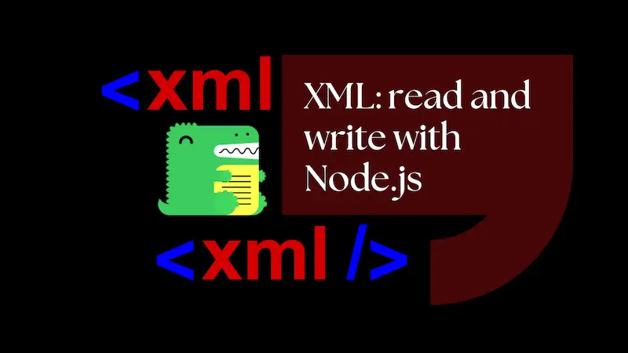

This post demonstrates reading and writing XML in Node.js using fast-xml-parser. We'll use Docusauruses XML sitemap as an example.



## Docusaurus sitemap

I was prompted to write this post by wanting to edit the sitemap on my Docusaurus blog. I wanted to remove the `/page/` and `/tag/` routes from the sitemap. They effectively serve as duplicate content and I don't want them to be indexed by search engines.

I was able to find the sitemap in the `build` folder of my Docusaurus site. It's called `sitemap.xml` and it's in the root of the `build` folder. It looks like this:

```xml
<?xml version="1.0" encoding="UTF-8"?><urlset xmlns="http://www.sitemaps.org/schemas/sitemap/0.9" xmlns:news="http://www.google.com/schemas/sitemap-news/0.9" xmlns:xhtml="http://www.w3.org/1999/xhtml" xmlns:image="http://www.google.com/schemas/sitemap-image/1.1" xmlns:video="http://www.google.com/schemas/sitemap-video/1.1">
  <url>
    <loc>https://blog.johnnyreilly.com/2012/01/07/standing-on-shoulders-of-giants</loc>
    <changefreq>weekly</changefreq>
    <priority>0.5</priority>
  </url>
  <url>
    <loc>https://blog.johnnyreilly.com/2022/09/20/react-usesearchparamsstate</loc>
    <changefreq>weekly</changefreq>
    <priority>0.5</priority>
  </url>
  <url>
    <loc>https://blog.johnnyreilly.com/page/10</loc>
    <changefreq>weekly</changefreq>
    <priority>0.5</priority>
  </url>
  <url>
    <loc>https://blog.johnnyreilly.com/tags/ajax</loc>
    <changefreq>weekly</changefreq>
    <priority>0.5</priority>
  </url>
  <!-- ... -->
</urlset>
```

## `fast-xml-parser`

After experimenting with a few different XML parsers I settled on [`fast-xml-parser`](https://github.com/NaturalIntelligence/fast-xml-parser). It's fast, it's simple and it's well maintained. It also handles XML namespaces and attributes well. (This appears to be rare in XML parsers.)

Let's scaffold up an example project alongside our Docusaurus site:

```bash
mkdir trim-xml
cd trim-xml
npx typescript --init
yarn init
yarn add @types/node fast-xml-parser ts-node typescript
```

And in the `package.json` file add a `start` script:

```json
{
  "scripts": {
    "start": "ts-node index.ts"
  }
}
```

Finally, create an empty `index.ts` file.

## Reading XML

Our Docusaurus sitemap is in the `build` folder of our Docusaurus site. Let's read it in and parse it into a JavaScript object:

```ts
import { XMLParser, XMLBuilder } from 'fast-xml-parser';
import fs from 'fs';
import path from 'path';

interface Sitemap {
  urlset: {
    url: { loc: string; changefreq: string; priority: number }[];
  };
}

async function trimXML() {
  const sitemapPath = path.resolve(
    '..',
    'blog-website',
    'build',
    'sitemap.xml'
  );

  console.log(`Loading ${sitemapPath}`);
  const sitemapXml = await fs.promises.readFile(sitemapPath, 'utf8');

  const parser = new XMLParser({
    ignoreAttributes: false,
  });
  let sitemap: Sitemap = parser.parse(sitemapXml);

  console.log(sitemap);
}

trimXML();
```

We're using the `XMLParser` class to parse the XML into a JavaScript object. We're also using the `ignoreAttributes` option to ensure that attributes are included in the parsed object. When we run this we get the following output:

```bash
Loading /home/john/code/github/blog.johnnyreilly.com/blog-website/build/sitemap.xml
{
  '?xml': { '@_version': '1.0', '@_encoding': 'UTF-8' },
  urlset: {
    url: [
      [Object], [Object], [Object], [Object], [Object], [Object],
      [Object], [Object], [Object], [Object], [Object], [Object],
      [Object], [Object], [Object], [Object], [Object], [Object],
      [Object], [Object], [Object], [Object], [Object], [Object],
      [Object], [Object], [Object], [Object], [Object], [Object],
      [Object], [Object], [Object], [Object], [Object], [Object],
      [Object], [Object], [Object], [Object], [Object], [Object],
      [Object], [Object], [Object], [Object], [Object], [Object],
      [Object], [Object], [Object], [Object], [Object], [Object],
      [Object], [Object], [Object], [Object], [Object], [Object],
      [Object], [Object], [Object], [Object], [Object], [Object],
      [Object], [Object], [Object], [Object], [Object], [Object],
      [Object], [Object], [Object], [Object], [Object], [Object],
      [Object], [Object], [Object], [Object], [Object], [Object],
      [Object], [Object], [Object], [Object], [Object], [Object],
      [Object], [Object], [Object], [Object], [Object], [Object],
      [Object], [Object], [Object], [Object],
      ... 1481 more items
    ],
    '@_xmlns': 'http://www.sitemaps.org/schemas/sitemap/0.9',
    '@_xmlns:news': 'http://www.google.com/schemas/sitemap-news/0.9',
    '@_xmlns:xhtml': 'http://www.w3.org/1999/xhtml',
    '@_xmlns:image': 'http://www.google.com/schemas/sitemap-image/1.1',
    '@_xmlns:video': 'http://www.google.com/schemas/sitemap-video/1.1'
  }
}
```

As we can see, the `fast-xml-parser` library has parsed the XML into a JavaScript object. We can see that the `urlset` element has an array of `url` elements. Each `url` element has a `loc`, `changefreq` and `priority` element. We can also see that the `urlset` element has a number of attributes. This matches the XML we saw earlier and the interface we defined.

## Filtering and writing XML

Now that we have the XML parsed into a JavaScript object we can filter it just like we would any other JavaScript object. We have all the power of JavaScript at our fingertips!

As I mentioned earlier, I want to remove all the URLs that are
