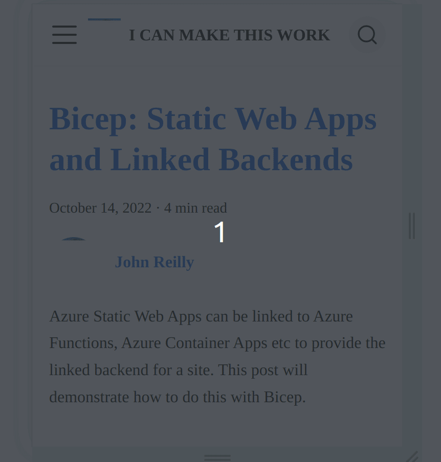

Custom font usage can introduce cumulative layout shift (or "jank") to your website. This post shows how to use [fontaine](https://github.com/unjs/fontaine) to reduce this with Docusaurus sites.


<!--truncate-->

## What is cumulative layout shift?

Cumulative layout shift (CLS) is a metric that measures the instability of content on a web page. It's a [Core Web Vitals](https://web.dev/vitals/) metric.

You may well know it as "jank". It's jank that you see when a page loads and the text moves around. It's an irritation. There's a great description of it in [this post on the topic](https://web.dev/cls/); let me quote it here:

> Have you ever been reading an article online when something suddenly changes on the page? Without warning, the text moves, and you've lost your place. Or even worse: you're about to tap a link or a button, but in the instant before your finger lands—BOOM—the link moves, and you end up clicking something else!

For the rest of this post I'll generally to refer to CLS as jank, as it's a more relatable term.

## What "jank" looks like

My blog uses a custom font called [Poppins](https://fonts.google.com/specimen/Poppins). Lovely though it is, using the font introduces jank to my site. It's particularly noticeable on mobile phones. Here's a gif of the jank in action:



You see how the text shifts around as the custom font arrives? On the first line we either see:

- the fallback font rendering four words on one line: _"Bicep: Static Web Apps"_

  OR

- the custom font (Poppins) rendering three words on one line: _"Bicep: Static Web"_

It's very noticeable. You can actually put a number on it. The number is the CLS score which you can determine with [Lighthouse](https://developer.chrome.com/docs/lighthouse/overview/). The CLS score is the sum of the layout shifts that occur on the page. The higher the score, the more jank there is. Cumulative Layout Shift was logged as **0.019** for the page above. That's not great.

I'd taken steps to reduce the issues experienced, such as [font preloading](../2021-12-29-preload-fonts-with-docusaurus/index.md). But the issues still remained, particularly on mobile networks where speed of loading is decreased, and it takes a longer time for the custom font to load.

I had rather given up on improving things further. But then....

## fontaine

One evening I was vaguely browsing Twitter when I came across a tweet from [Daniel Roe](https://twitter.com/danielcroe) which [announced a new tool called fontaine](https://twitter.com/danielcroe/status/1581428654479138817):


I was intrigued. I wanted to try it out. I wanted to see if it could reduce the jank on my blog.

## Using fontaine with Docusaurus

I added fontaine as a dependency to my blog:

```bash
yarn add -D fontaine
```

I then added cracked open my `docusaurus.config.js` file and wrote a small plugin to make use of fontaine:

```js
const fontaine = require('fontaine');

// ...

/** @type {import('@docusaurus/types').Config} */
const config = {
  // ...

  plugins: [
    // ...
    function fontainePlugin(_context, _options) {
      return {
        name: 'fontaine-plugin',
        configureWebpack(_config, _isServer) {
          return {
            plugins: [
              fontaine.FontaineTransform.webpack({
                fallbacks: [
                  'system-ui',
                  '-apple-system',
                  'BlinkMacSystemFont',
                  'Segoe UI',
                  'Roboto',
                  'Oxygen',
                  'Ubuntu',
                  'Cantarell',
                  'Open Sans',
                  'Helvetica Neue',
                  'sans-serif',
                ],
                // You may need to resolve assets like `/fonts/Poppins-Bold.ttf` to a particular directory
                resolvePath: (id) => '../fonts/' + id,
              }),
            ],
          };
        },
      };
    },
    // ...
  ],
  // ...
};
```

This didn't initially seem to make any difference. I put it up as a [work-in-progress PR](https://github.com/johnnyreilly/blog.johnnyreilly.com/pull/305) and wrote up my findings as best I could. Daniel was kind enough to take a look. He uncovered two issues:

- There was a bug in fontaine around how it handled CSS variables; [he implemented a fix](https://github.com/unjs/fontaine/commit/a708bb07ccc48f385c67ccc3b1eed280d8ee47fc)
- Docusaurus uses custom fonts through the mechanism of CSS variables. This indirection confuses fontaine as it can't read those variables. To accomodate this, we needed to update my CSS variable to add the override font family to the CSS variable:

```diff
-  --ifm-font-family-base: 'Poppins';
+  --ifm-font-family-base: 'Poppins', 'Poppins override';
```

Behind the scenes, there is a 'Poppins override' `@font-face` rule that has been created by fontaine. By manually adding this override font family to our CSS variable, we make our site use the fallback 'Poppins override' `@font-face` rule with the correct font metrics that fontaine generates.

It's worth emphasising that for the typical user of fontaine, this is not something they need to do. It's only necessary for Docusaurus users because they use custom fonts through CSS variables. Using fontaine is very "plug and play" for most users.

Daniel was kind enough to [raise a PR incorporating both the tweaks](https://github.com/johnnyreilly/blog.johnnyreilly.com/pull/307). When I merged that PR, I saw the following:


Look at that! You can see the font loading, but there's no more jumping of words from one line to another. It's a huge improvement.

## Conclusion

If you want to improve your CLS score, fontaine is a great tool. This post demonstrates using it with Docusaurus. But please note that this is a generally useful tool that you can use with Vite, Next.js and others. It's not specific to Docusaurus.

Prior to using fontaine, my blogs Cumulative Layout Shift was logged as **0.019**. After incorporating it, the same score is logged as **0**. This is good news!

I'm very grateful to Daniel for his help in getting it working with my blog. He went above and beyond, so thank you Daniel!

In testament to what a great idea fontaine is built upon, in the time I've been writing this post [`@next/font`](https://nextjs.org/blog/next-13#nextfont) has been announced, which is based upon a similar idea.

[This post was originally published on LogRocket.](https://blog.logrocket.com/docusaurus-using-fontaine-reduce-cumulative-layout-shift/)

<head>
    <link rel="canonical" href="https://blog.logrocket.com/docusaurus-using-fontaine-reduce-cumulative-layout-shift/" />
</head>
