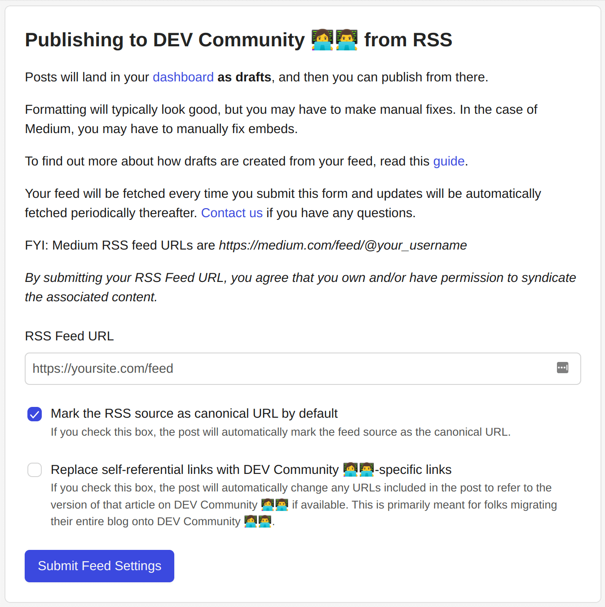
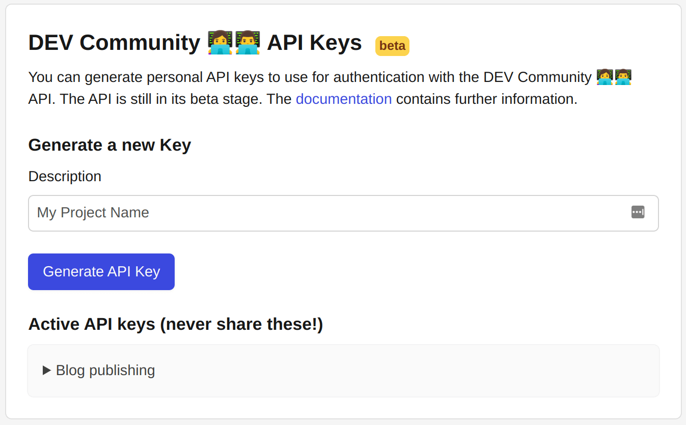
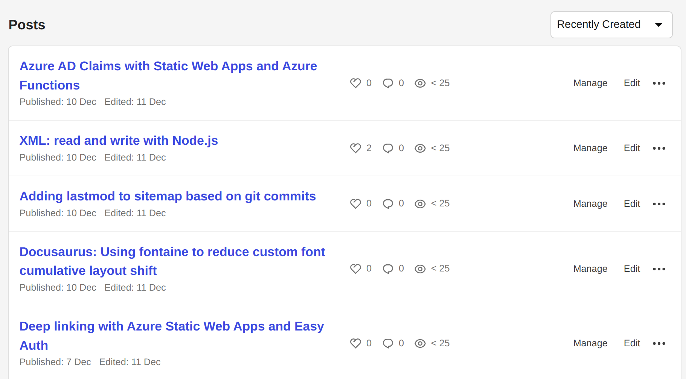

The dev.to API provides a way to cross post your Docusaurus blogs to dev.to. This post describes how to do that with TypeScript, Node.js and the dev.to API.


<!--truncate-->

## Why not use "Publishing to DEV Community 👩‍💻👨‍💻 from RSS"?

If you take a look at the [dev.to settings (under extensions)](https://dev.to/settings/extensions) you'll see that you can post to dev.to using an RSS feed:



This is great, but it has a number of downsides:

- every post published to your blog will be published to dev.to - there's no fine grained control
- every post published arrives as "draft" - you have to manually push it "live".
- _most significantly_ - it handles code snippets poorly. Everything ends up as a single line of text. This is a real shame because code snippets are a key part of a blog post.

So after initially setting this up, I decided to look for a better way.

## The dev.to API

[It turns out that dev.to have an API.](https://developers.forem.com/api). The API is pretty well documented and it's pretty easy to use. The docs mention version 0 and version 1 of the API. Version 0 is officially deprecated, but version 1 appears to be incomplete - certainly the docs are. I ended up using version 0 for this post despite attempting to use version 1; I'll update this post when v1 gets there.

The only thing you need to do to use the API is [generate an API key](https://dev.to/settings/extensions):



## TypeScript console app

I'm going to use a TypeScript console app to do the work. Let's scaffold up an example project alongside our Docusaurus site:

```bash
mkdir from-docusaurus-to-devto
cd from-docusaurus-to-devto
npx typescript --init
yarn init
yarn add @types/node ts-node typescript @docusaurus/utils
```

And in the `package.json` file add a `start` script:

```json
{
  "scripts": {
    "start": "ts-node index.ts"
  }
}
```

Finally, create an empty `index.ts` file. We'll fill this in shortly.

## TypeScript dev.to API client

Before we do that, we're going to need a dev.to API client. Let's create a `devtoApiClient.ts` file and add the following:

```ts
export interface User {
  name: string;
  username: string;
  twitter_username: string;
  github_username: string;
  user_id: number;
  website_url: string;
  profile_image: string;
  profile_image_90: string;
}

export interface ArticleToPublish {
  title: string;
  body_markdown: string;
  published: boolean;
  main_image: string | undefined;
  canonical_url: string;
  description?: string;
  tags: string[];
}

export interface Article {
  type_of: string;
  id: number;
  title: string;
  description: string;
  published: boolean;
  published_at: string;
  slug: string;
  path: string;
  url: string;
  comments_count: number;
  public_reactions_count: number;
  page_views_count: number;
  positive_reactions_count: number;
  cover_image: string | null;
  canonical_url: string;
  published_timestamp: string;
  tag_list: string[];
  user: User;
  body_markdown: string;
  body_html: string;
  reading_time_minutes: number;
}

export interface DevToApiClient {
  getArticles: () => Promise<Article[]>;
  createArticle: (article: ArticleToPublish) => Promise<void>;
  updateArticle: (id: number, article: ArticleToPublish) => Promise<void>;
}

export function devtoApiClientFactory(apiKey: string): DevToApiClient {
  const baseUrl = 'https://dev.to/api';

  return {
    getArticles: async () => {
      try {
        const articles: Article[] = [];
        let page = 1;
        const pageSize = 100;
        while (true) {
          const url = `${baseUrl}/articles/me/published?page=${page}&page_size=${pageSize}`;
          const res = await fetch(url, {
            headers: {
              'api-key': apiKey,
              accept: 'application/vnd.forem.api-v1+json',
            },
          });
          if (!res.ok) {
            console.error(res);
            throw new Error(`Failed to get articles ${url}`);
          }
          const data = (await res.json()) as Article[];
          if (data.length === 0) break;

          page += 1;
          articles.push(...data);
        }
        return articles;
      } catch (e) {
        console.error('Failed to get articles', e);
        throw new Error('Failed to get articles');
      }
    },

    createArticle: async (article: ArticleToPublish) => {
      try {
        const url = `${baseUrl}/articles`;
        const res = await fetch(url, {
          headers: {
            'api-key': apiKey,
            'Content-Type': 'application/json',
          },
          method: 'POST',
          body: JSON.stringify({
            article,
          }),
        });
        if (!res.ok) {
          console.error(res);
          console.error(await res.json());
          throw new Error(`Failed to create article ${article.canonical_url}`);
        }
        const data = (await res.json()) as Article;
        const { body_html, body_markdown, ...rest } = data;
        console.log(`Created article ${article.canonical_url}`, rest);
      } catch (e) {
        console.error('Failed to create article', e);
        throw new Error('Failed to create article');
      }
    },

    updateArticle: async (id: number, article: ArticleToPublish) => {
      try {
        const url = `${baseUrl}/articles/${id}`;
        const res = await fetch(url, {
          headers: {
            'api-key': apiKey,
            'Content-Type': 'application/json',
          },
          method: 'PUT',
          body: JSON.stringify({
            article,
          }),
        });
        if (!res.ok) {
          console.error(res);
          console.error(await res.json());
          throw new Error(`Failed to update article ${article.canonical_url}`);
        }
        const data = (await res.json()) as Article;
        const { body_html, body_markdown, ...rest } = data;
        console.log(`Updated article ${article.canonical_url}`, rest);
      } catch (e) {
        console.error('Failed to update article', e);
        throw new Error('Failed to update article');
      }
    },
  };
}
```

This is a simple API client that uses the [Fetch API](https://developer.mozilla.org/en-US/docs/Web/API/Fetch_API) to make requests to the dev.to API. It's not a complete implementation of the API, but we only need a few article related endpoints to do the following:

- Get all the articles that have been published to dev.to
- Create a new article
- Update an existing article

## From blog post markdown to published blog posts

Now we can use the API client in our `index.ts` file:

```ts
import fs from 'fs';
import path from 'path';
import { parseFrontMatter } from '@docusaurus/utils';
import {
  Article,
  DevToApiClient,
  devtoApiClientFactory,
} from './devtoApiClient';

const rootUrl = 'https://johnnyreilly.com';
const rootGitHubUrl =
  'https://raw.githubusercontent.com/johnnyreilly/blog.johnnyreilly.com/main/blog-website/blog/';
const docusaurusBlogDirectory = '../blog-website/blog';

const markdownImageRexEx = /!\[.*\]\((.*)\)/g;
const markdownRelativeBlogUrlRegex = /\[.*\]\(\.\.\/(.*)\/index.md\)/g;

async function getLastXBlogPostsToPublish({
  numberOfPosts,
}: {
  numberOfPosts: number;
}) {
  const blogPosts = await fs.promises.readdir(docusaurusBlogDirectory, {
    withFileTypes: true,
  });
  const blogPostDirectoryNames = blogPosts
    .slice(0)
    .reverse()
    .filter((post) => post.isDirectory())
    .map((post) => post.name)
    .slice(0, numberOfPosts);

  return blogPostDirectoryNames;
}

async function publishBlogPostToDevTo({
  blogFilePathRelative,
  articlesByCanonicalUrl,
  devtoApiClient,
}: {
  blogFilePathRelative: string;
  articlesByCanonicalUrl: Map<string, Article>;
  devtoApiClient: DevToApiClient;
}) {
  const blogFilePath = path.join(
    docusaurusBlogDirectory,
    blogFilePathRelative,
    'index.md',
  );
  console.log(`Processing ${blogFilePath}`);

  const blogFileContent = await fs.promises.readFile(blogFilePath, 'utf8');
  const { frontMatter, content } = parseFrontMatter(blogFileContent);

  const canonicalUrl = makeCanonicalUrl(
    blogFilePathRelative,
    frontMatter['slug'] as string | undefined,
  );
  const contentWithCanonicalUrls = enrichMarkdownWithCanonicalUrls(content);
  const contentWithGitHubImages = enrichMarkdownWithImagesFromGitHub(
    contentWithCanonicalUrls,
    blogFilePathRelative,
  );
  const tags = frontMatter['tags'] as string[];
  const title = frontMatter['title'] as string;
  const published = true;
  const main_image = makeMainImage(frontMatter, blogFilePathRelative);
  const trimmedTags = tags.slice(0, 4).map((tag) => tag.replace(/\W/g, ''));

  const body_markdown = `---
title: ${title}
published: ${published}
tags: ${trimmedTags.join(',')}
canonical_url: ${canonicalUrl}
---
${contentWithGitHubImages}`;

  const article = {
    title,
    body_markdown,
    published,
    main_image,
    canonical_url: canonicalUrl,
    tags: trimmedTags,
  };

  console.log(`\n---------------------------------------------------\n\n`);
  const existingArticle = articlesByCanonicalUrl.get(canonicalUrl);

  if (existingArticle) {
    console.log(`Updating article ${canonicalUrl}`);
    await devtoApiClient.updateArticle(existingArticle.id, article);
  } else {
    console.log(`Creating article ${canonicalUrl}`);
    await devtoApiClient.createArticle(article);
  }
}

function makeMainImage(
  frontMatter: { [key: string]: unknown },
  blogFilePathRelative: string,
) {
  const image =
    typeof frontMatter['image'] === 'string'
      ? (frontMatter['image'] as string)
      : '';
  const main_image = image
    ? rootGitHubUrl +
      blogFilePathRelative +
      '/' +
      image.substring(image.indexOf('/') + 1)
    : undefined;
  return main_image;
}

function makeCanonicalUrl(
  blogFilePathRelative: string,
  frontMatterSlug?: string,
) {
  const parsedBlogFileName = `${rootUrl}/${blogFilePathRelative
    .substring(0, 10)
    .split('-')
    .join('/')}/${blogFilePathRelative.substring(11)}`;

  const canonicalUrl = frontMatterSlug
    ? `${rootUrl}/${frontMatterSlug}`
    : parsedBlogFileName;
  return canonicalUrl;
}

function enrichMarkdownWithImagesFromGitHub(
  content: string,
  blogFilePathRelative: string,
) {
  return Array.from(content.matchAll(markdownImageRexEx))
    .map((matches) => {
      const [completeMatch, url] = matches;
      const withGitHubUrl = completeMatch.replace(
        url,
        rootGitHubUrl + blogFilePathRelative + '/' + url,
      );
      console.log(`Replacing ${completeMatch} with ${withGitHubUrl}`);
      return { oldImage: completeMatch, newImage: withGitHubUrl };
    })
    .reduce(
      (contentInProgress, { oldImage, newImage }) =>
        contentInProgress.replace(oldImage, newImage),
      content,
    );
}

function enrichMarkdownWithCanonicalUrls(content: string) {
  return Array.from(content.matchAll(markdownRelativeBlogUrlRegex))
    .map((matches) => {
      const [
        /* eg [I wanted to add the last modified date to my blog posts.](../2022-11-25-adding-lastmod-to-sitemap-git-commit-date/index.md) */
        completeMatch,
        /* eg 2022-11-25-adding-lastmod-to-sitemap-git-commit-date */
        relativeBlogPath,
      ] = matches;

      const withCanonicalUrl = completeMatch.replace(
        `../${relativeBlogPath}/index.md`,
        makeCanonicalUrl(relativeBlogPath),
      );
      console.log(`Replacing ${completeMatch} with ${withCanonicalUrl}`);
      return { oldImage: completeMatch, newImage: withCanonicalUrl };
    })
    .reduce(
      (contentInProgress, { oldImage, newImage }) =>
        contentInProgress.replace(oldImage, newImage),
      content,
    );
}

function makeDevtoApiClient() {
  const devToApiKey = process.env.DEVTO_APIKEY;

  if (!devToApiKey) {
    console.log('No dev.to API key specified!');
    process.exit(1);
  }

  return devtoApiClientFactory(devToApiKey);
}

const sleep = async ({ seconds }: { seconds: number }) =>
  new Promise((resolve) => setTimeout(resolve, seconds * 1000));

async function run() {
  const devtoApiClient = makeDevtoApiClient();
  const articles = await devtoApiClient.getArticles();
  const articlesByCanonicalUrl = new Map<string, Article>(
    Array.from(articles).map((article) => [article.canonical_url, article]),
  );
  const blogPostsToPublish = await getLastXBlogPostsToPublish({
    numberOfPosts: 5,
  });

  for (const blogFilePathRelative of blogPostsToPublish) {
    await publishBlogPostToDevTo({
      blogFilePathRelative,
      articlesByCanonicalUrl,
      devtoApiClient,
    });

    console.log('Sleeping for 5 seconds because rate limiting...');
    await sleep({ seconds: 5 });
  }
}

// do it!
run();
```

There's a lot happening here, let me summarise it:

- Grab the last 5 blog posts from the Docusaurus blog directory; this is the number of posts I want to publish to dev.to on each run
- For each blog post, parse the front matter and the content
- Build up the article object to send to dev.to. We do a few tricks here to make the article look nice:
  - To make the URL we'll use the `slug` front matter if it exists, otherwise use the date and title
  - Enrich the images in the content with the GitHub URLs so we can use images from the blog post
  - Use the first 4 tags from the front matter - dev.to only allows 4 tags. Also we'll strip those tags of any non-word characters
  - Default to `published` immediately
- If the article already exists on dev.to, update it, otherwise create it

Because dev.to practise rate limiting on their API, I've added a 5 second sleep between each article to ensure we don't get blocked. It's a little arbitrary, but it works well enough.

Does it work? Let's find out!



It works! I've published 5 posts to dev.to from my blog. [I can now go to dev.to and see them.](https://dev.to/johnnyreilly)

## Running the script from GitHub Actions

Now that we have the script, we need to run it. I'm going to use GitHub Actions to do this, but you could use any CI/CD tool you like.

I add a new `deploy_to_devto_job` to my existing workflow and I set it to run on every push to the `main` branch. I don't want to publish to dev.to on every pull request; I want to publish once a blog post is published. So I add an `if` condition to the job to check that the event is not a pull request.

```yaml
deploy_to_devto_job:
  name: Publish to dev.to 🗞️
  needs: build_and_deploy_swa_job
  if: github.event_name != 'pull_request'
  runs-on: ubuntu-latest
  steps:
    - uses: actions/checkout@v3

    - name: Setup Node.js 🔧
      uses: actions/setup-node@v3
      with:
        node-version: '18'
        cache: 'yarn'

    - name: Publish to dev.to 🗞️
      run: |
        cd from-docusaurus-to-devto
        yarn install --frozen-lockfile
        DEVTO_APIKEY=${{ secrets.DEVTO_APIKEY }} yarn start
```

If you'd like to use this you'll need to add a `DEVTO_APIKEY` secret to your repository secrets. You can get this from your dev.to account settings. Remember to keep it secret!

## Conclusion

This is all a bit of an experiment to see what happens if I start to cross publish my blog posts to dev.to. I'm not sure if I'll keep doing it, but I'm going to trial it and see how it goes.

You can use this approach with your own blog site - you'll need to do a little path and URL fiddling, but everything else should be just as you need.
