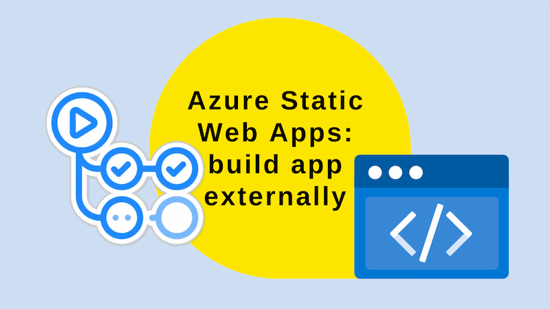

Azure Static Web Apps can generally build themselves with Oryx. If you need finer grained control of your build, you can with `skip_app_build: true` and some GitHub Actions.



<!--truncate-->

## Build with Oryx

I love Azure Static Web Apps. [My blog](https://johnnyreilly.com) is built with them. I've written about them many times.

One of the things I like about Azure Static Web Apps is that they can build themselves. You can just push your code to GitHub and they'll build it using a tool called [Oryx](https://github.com/microsoft/Oryx). This is great for simple scenarios. Actually, it's good for medium to complex scenarios too. However, if you ever get to that "break glass" moment where you need to do something unusual with your build, you can.

Let's start by looking at a simple Azure Static Web Apps configuration:

```yaml
- name: Static Web App - get API key for deployment
  id: static_web_app_apikey
  uses: azure/CLI@v2
  with:
    inlineScript: |
      APIKEY=$(az staticwebapp secrets list --name '${{ env.STATICWEBAPPNAME }}' | jq -r '.properties.apiKey')
      echo "APIKEY=$APIKEY" >> $GITHUB_OUTPUT

- name: Static Web App - build and deploy
  id: static_web_app_build_and_deploy
  uses: Azure/static-web-apps-deploy@v1
  with:
    azure_static_web_apps_api_token: ${{ steps.static_web_app_apikey.outputs.APIKEY }}
    repo_token: ${{ secrets.GITHUB_TOKEN }} # Used for Github integrations (i.e. PR comments)
    action: 'upload'
    app_location: '/blog-website' # App source code path
    output_location: 'build' # Built app content directory - optional

    # For more information regarding Static Web App workflow configurations, please visit: https://aka.ms/swaworkflowconfig
    api_location: '' # Api source code path - optional
```

Above is an old version of what my blog used to build and deploy itself. With the yaml above, Oryx built the app and deployed it. [I wanted to add the last modified date to my blog posts.](../2022-11-25-adding-lastmod-to-sitemap-git-commit-date/index.md) It would have been fiddly to do this in Oryx.

## Build externally

So, I decided to build the app externally and then deploy it. I did this by tweaking the yaml above to add some extra steps:

```yaml
- name: Get API key 🔑
  id: static_web_app_apikey
  uses: azure/CLI@v2
  with:
    inlineScript: |
      APIKEY=$(az staticwebapp secrets list --name '${{ env.STATICWEBAPPNAME }}' | jq -r '.properties.apiKey')
      echo "APIKEY=$APIKEY" >> $GITHUB_OUTPUT

- name: Setup Node.js 🔧
  uses: actions/setup-node@v3
  with:
    node-version: '18'
    cache: 'yarn'

- name: Install and build site 🔧
  run: |
    cd blog-website
    yarn install --frozen-lockfile
    yarn run build
    # copy staticwebapp.config.json to build folder
    cp staticwebapp.config.json build/staticwebapp.config.json

- name: Deploy site 🚀
  id: static_web_app_build_and_deploy
  uses: Azure/static-web-apps-deploy@v1
  with:
    azure_static_web_apps_api_token: ${{ steps.static_web_app_apikey.outputs.APIKEY }}
    repo_token: ${{ secrets.GITHUB_TOKEN }} # Used for Github integrations (i.e. PR comments)
    action: 'upload'
    skip_app_build: true
    app_location: '/blog-website/build' # App source code path
    # output_location: 'build' # Built app content directory - optional

    # For more information regarding Static Web App workflow configurations, please visit: https://aka.ms/swaworkflowconfig
    api_location: '' # Api source code path - optional
```

What's changed? Well, I've added a few steps:

- Setup Node.js - essentially, this is just installing Node.js so we can build the app
- Install and build site - this is where we actually do install the dependencies and build the app
- Significantly (and [thanks to Vivek Jilla for this tip](https://github.com/Azure/static-web-apps/issues/1017#issuecomment-1356786140)), we copy the `staticwebapp.config.json` file to the build folder. This is important because it contains the routing information for the app. Without it, any rules you have in your `staticwebapp.config.json` file won't be applied.
- We set `skip_app_build: true` - this tells Azure Static Web Apps to skip the build step and point it at the `build` folder instead, where the built app (with `staticwebapp.config.json`) can be found.

With this in place I'm now able to build the app externally and deploy it to Azure Static Web Apps. This is great for when you need to do something a little more complex than Oryx can handle.
