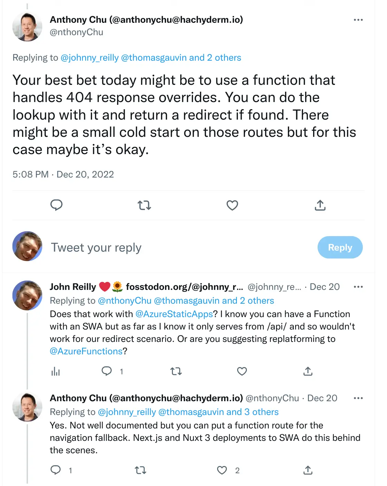
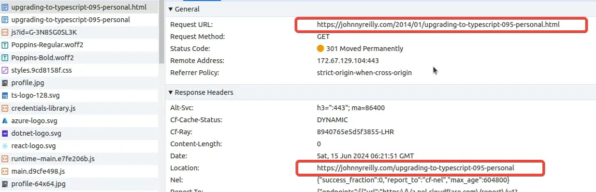

Azure Static Web Apps can perform URL redirects using the `routes` section in the `staticwebapp.config.json`. However it is limited. This post will demonstrate dynamic URL redirects with Azure Functions.


<!--truncate-->

## The limits of `routes` in `staticwebapp.config.json`

I recently found myself fixing up some redirects for my blog, which runs on Azure Static Web Apps. I had quite a few redirects to implement and I ended up with [a very large `routes` section](https://learn.microsoft.com/en-us/azure/static-web-apps/configuration#routes). It was so large that I exceeded [the 20kb limit that affect Azure Static Web Apps](https://learn.microsoft.com/en-us/azure/static-web-apps/configuration#restrictions).

I bemoaned this on Twitter and got some great advice from [Anthony Chu who works on Azure Static Web Apps](https://twitter.com/nthonyChu):

[](https://twitter.com/nthonyChu/status/1605248878009208832)

Anthony went on to [share details of an example implementation that Nuxt.js has implemented](https://twitter.com/nthonyChu/status/1605429770715402240). I took this as a challenge to implement something similar for my blog. Let's see how we got on.

## Adding an Azure Function to our Azure Static Web App

The first thing we need to do is add an Azure Function to our Azure Static Web App. All Static Web Apps can be backed by an Azure Function App. [We can create a simple JavaScript HttpTrigger Azure Function following this guide](https://learn.microsoft.com/en-us/azure/static-web-apps/add-api?tabs=react#create-the-api). I used JavScript as it seemed like the simplest option. If we wanted a different language we could use one.

We're going to name the single function `fallback`, so it will be served up at `/api/fallback`. The code of the function is:

```js
//@ts-check
const { parseURL } = require('ufo');
const routes = require('./redirects');

/**
 *
 * @param { import("@azure/functions").Context } context
 * @param { import("@azure/functions").HttpRequest } req
 */
async function fallback(context, req) {
  const originalUrl = req.headers['x-ms-original-url'];
  if (originalUrl) {
    // This URL has been proxied as there was no static file matching it.
    context.log(`x-ms-original-url: ${originalUrl}`);

    const parsedURL = parseURL(originalUrl);

    const matchedRoute = routes.find((route) =>
      parsedURL.pathname.includes(route.route),
    );

    if (matchedRoute) {
      context.log(`Redirecting ${originalUrl} to ${matchedRoute.redirect}`);

      context.res = {
        status: matchedRoute.statusCode,
        headers: { location: matchedRoute.redirect },
      };
      return;
    }
  }

  context.log(
    `No explicit redirect for ${originalUrl} so will redirect to 404`,
  );

  context.res = {
    status: 302,
    headers: {
      location: originalUrl
        ? `/404?originalUrl=${encodeURIComponent(originalUrl)}`
        : '/404',
    },
  };
}

module.exports = fallback;
```

What's happening here? Well, we're using the `ufo` package to parse the URL which we grab from the `x-ms-original-url` header. We then look for a match in our `redirects.js`, which is a _big_ list of potential redirects.

If we find a match, we redirect based upon that match. Otherwise we redirect to the custom 404 screen in our app. And we include the original URL in the query string for visibility. (With this in place, any unhandled redirects should show up in Google Analytics etc.)

## JSDoc types with `@azure/functions`

You'll notice that we're using JSDoc types in the above code and enabling type checking through use of [`// @ts-check`](https://www.typescriptlang.org/docs/handbook/intro-to-js-ts.html#ts-check). We're providing types to our function through the [`@azure/functions`](https://www.npmjs.com/package/@azure/functions) package which we've added as a `devDependency`. You don't have to do this, but it's a nice way to get some type safety.

## Consuming the Azure Function from our Azure Static Web App

Now our Azure Function is in place, we need to configure our Azure Static Web App to use it. In our `staticwebapp.config.json` we'll make some changes:

```json
  "navigationFallback": {
    "rewrite": "/api/fallback"
  },
  "platform": {
    "apiRuntime": "node:18"
  },
  "routes": [
    {
      "route": "/404",
      "statusCode": 404
    },
```

Here we:

- Point to our apps navigation fallback to our `fallback` function (`/api/fallback`) - this will be called whenever a URL is not matched by a static file.
- We declare an `apiRuntime` of Node.js 18 - this is the version of Node.js that our Azure Function is using.
- Whenever the `/404` route is hit in our app, we ensure the status code presented is 404.
- We remove the `route` redirects we had in place as these will now be handled by `/api/fallback` (this isn't shown in the above snippet)

## Deploying our Azure Function

We need to deploy our Function, and we achieve that by tweaking the our GitHub Action that deploys our Static Web App. We add the following:

```yml
api_location: '/blog-website/api'
```

And now our Azure Function will be built and deployed alongside our blog.

## Testing our Azure Function

We can demonstrate this works pretty easily. Let's take a super old blog post of mine, where I upgraded to TypeScript 0.9.5 (!!!) The route has changed since I originally posted back in 2014. If we go to https://johnnyreilly.com/2014/01/upgrading-to-typescript-095-personal.html (the old Blogger URL), we'll be redirected (301'd to be specific - signalling a permanent move) to https://johnnyreilly.com/upgrading-to-typescript-095-personal - the new URL. This is demonstrated in the following screenshot - note the `location` header in the response:



This particular redirect is driven by [an entry in our `redirects.js`](https://github.com/johnnyreilly/blog.johnnyreilly.com/blob/e21d3faf897505e860fc351260ab45ef6fa21d60/blog-website/api/fallback/redirects.js#L475-L479) file:

```json
  {
    route: '/2014/01/upgrading-to-typescript-095-personal.html',
    redirect: '/upgrading-to-typescript-095-personal',
    statusCode: 301,
  },
```

## Conclusion

I'd love it if there was a way to do this without an Azure Function. Imagine a `staticwebapp.config.js` that could be used to configure redirects. That would be awesome. But for now, this is a pretty good solution. Thanks to Anthony Chu for the inspiration and the example. (And thanks to the Nuxt.js team for the example too!)

[If you'd like to see what it looked like when this landed in this very blog, then look at this pull request](https://github.com/johnnyreilly/blog.johnnyreilly.com/pull/384).
