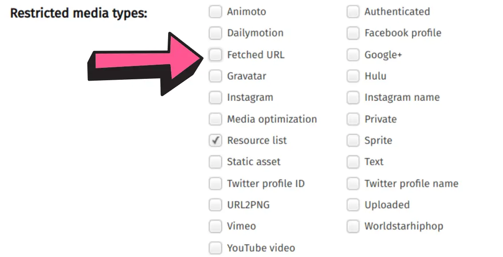
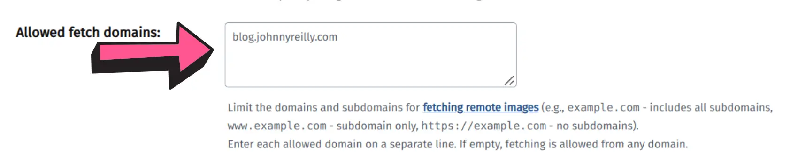
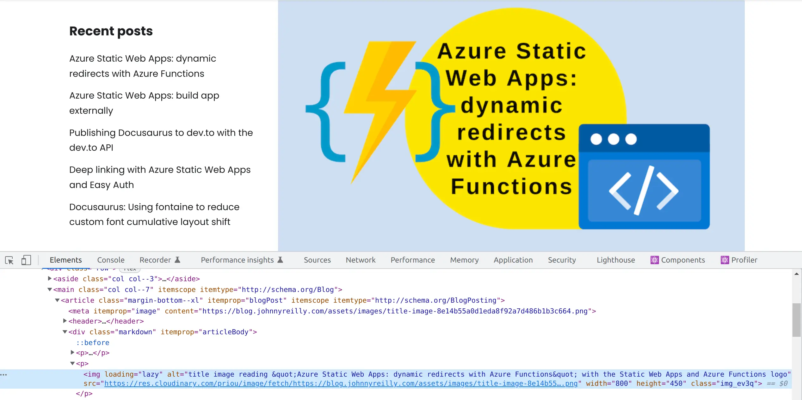

Cloudinary offers an image CDN which can improve performance of your site. This post details how to get Docusaurus to use Cloudinary to serve optimised images.


## What is Cloudinary?

To quote [Cloudinary's website](https://cloudinary.com/blog/delivering_all_your_websites_images_through_a_cdn):

> Most leading blogs deliver their assets (images, JS, CSS, etc.) through state-of-the-art CDNs and utilize online resizing technologies. With faster, off-site access, they greatly improve their users’ browsing experience, while reducing load on their servers.
>
> Using Cloudinary you can use these same technologies today, in your website or blog, without any hassle.

Consumption of the CDN is very simple. You simply prefix the URL of the image you want to serve with the URL of the Cloudinary CDN. For example, if you want to serve the following image:

`https://blog.johnnyreilly.com/img/profile-64x64.jpg`

you can serve it from Cloudinary with the following URL:

`https://res.cloudinary.com/demo/image/fetch/https://blog.johnnyreilly.com/img/profile-64x64.jpg`.

You see? All we did was prefix `https://res.cloudinary.com/demo/image/fetch/` to the URL of the image we wanted to serve. That's it. When you visit the URL, you'll see the image served from Cloudinary. Behind the scenes, Cloudinary will fetch the image from the original source and serve it to you.

:::note

The `demo` part of the URL is the name of the Cloudinary account. You can create your own account and use that instead.

:::

## Cloudinary account settings

Once you have created your account, you'll need to tweak the settings. There's two tweaks, one mandatory and one that's optional.

### Disable restricted media types: Fetched URL

First the mandatory one. We need to uncheck the `Disable restricted media types: Fetched URL` setting. The double negative shenanigans make this confusing; to read it another way we are "allowing fetching URLs". Much clearer! We need to do this is because we're fetching the image from a URL. If we didn't make the change, Cloudinary would refuse to serve the image. It wouldn't even try to fetch it.



:::caution

Remember to scroll down and hit the "Save" button. (Otherwise your changes won't be saved.)

:::

### Allowed fetch domains

The second setting is optional. If you want to restrict the domains from which you can fetch images, you can do so. You might want to do this if you want to prevent others from making use of your Cloudinary account and blowing your limits. I'm not sure how likely that is, but it's a possibility.



Above I'm restricting my account to only fetch images from my own site; `blog.johnnyreilly.com`. To my mind, it's the Cloudinary content security policy for fetching images.

## Docusaurus Cloudinary remark image plugin

Now we have our Cloudinary account set up, we can use it with Docusaurus. To do so, we need to create a remark plugin. This is a plugin for the [remark](https://github.com/remarkjs/remark/) markdown processor. It's a plugin that will transform the markdown image syntax into a Cloudinary URL.

The plugin takes the form of a JavaScript file we'll call `docusaurus-cloudinary-remark-plugin.js`:

```js
//@ts-check
const visit = require('unist-util-visit');

/**
 * Create a remark plugin that will replace image URLs with Cloudinary URLs
 * @param {*} options cloudName your Cloudinary’s cloud name eg demo, baseUrl the base URL of your website eg https://blog.johnnyreilly.com - should not include a trailing slash, will likely be the same as the config.url in your docusaurus.config.js
 * @returns remark plugin that will replace image URLs with Cloudinary URLs
 */
function imageCloudinaryRemarkPluginFactory(
  /** @type {{ cloudName: string; baseUrl: string }} */ options
) {
  const { cloudName, baseUrl } = options;
  const srcRegex = / src={(.*)}/;

  /** @type {import('unified').Plugin<[], import('hast').Root>} */
  return (tree) => {
    visit(tree, ['element', 'jsx'], (node) => {
      if (node.type === 'element' && node['tagName'] === 'img') {
        // handles nodes like this:

        // {
        //   type: 'element',
        //   tagName: 'img',
        //   properties: {
        //     src: 'https://some.website.com/cat.gif',
        //     alt: null
        //   },
        //   ...
        // }

        const url = node['properties'].src;

        node[
          'properties'
        ].src = `https://res.cloudinary.com/${cloudName}/image/fetch/${url}`;
      } else if (node.type === 'jsx' && node['value']?.includes(''
        // }

        const match = node['value'].match(srcRegex);
        if (match) {
          const urlOrRequire = match[1];
          node['value'] = node['value'].replace(
            srcRegex,
            ` src={${`\`https://res.cloudinary.com/${cloudName}/image/fetch/${baseUrl}\$\{${urlOrRequire}\}\``}}`
          );
        }
      }
    });
  };
}

module.exports = imageCloudinaryRemarkPluginFactory;
```

This plugin is a factory function that takes two parameters: the name of your Cloudinary account and the base URL of your website. It returns a remark plugin that will transform the markdown image syntax into a Cloudinary URL.

If you look at the code, you'll see that it handles two different types of image syntax; an `img` tag and a JSX image tag. The `img` tag is a very simple transform; it just prefixes the `src` attribute with `https://res.cloudinary.com/${cloudName}/image/fetch/` where `${cloudName}` is the name of your Cloudinary account; eg `demo`.

The JSX image tag is a little more complex. It's a little more complex because we have a complete JSX node which contains an `img` element. The `src` attribute is a JavaScript expression. It's not a string. It's a JavaScript expression that will be evaluated at runtime through some webpack goodness.

This means that we need to do a little more work to transform it into a Cloudinary URL. We need to wrap the expression in backticks and prefix it with `https://res.cloudinary.com/${cloudName}/image/fetch/${baseUrl}` where `${baseUrl}` is the base URL of your website. We also need to prefix the expression with a `$` to indicate that it's a JavaScript expression. Tough to read but it works.

## Using the plugin

Now we have our plugin, we can use it. We need to add it to our `docusaurus.config.js` file. We do this by adding it to the `rehypePlugins` array:

```js
//@ts-check
const docusaurusCloudinaryRemarkPlugin = require('./docusaurus-cloudinary-remark-plugin');

const url = 'https://blog.johnnyreilly.com';

/** @type {import('@docusaurus/types').Config} */
const config = {
  // ...
  presets: [
    [
      '@docusaurus/preset-classic',
      /** @type {import('@docusaurus/preset-classic').Options} */
      ({
        // ...
        blog: {
          // ...
          rehypePlugins: [
            [
              docusaurusCloudinaryRemarkPlugin,
              {
                cloudName: 'demo',
                baseUrl: url,
              },
            ],
          ],
          // ...
        },
        // ...
      }),
    ],
  ],
  // ...
};

module.exports = config;
```

Note that we pass in the name of our Cloudinary account and the base URL of our website. We can now run our website and see the images being transformed into Cloudinary URLs:



Excellent! We're now serving our images from the Cloudinary CDN.

## Introducing `remark-cloudinary-docusaurus`

But who wants to make a remark plugin? I don't. I want to use a remark plugin. So I created one. It's called [`remark-cloudinary-docusaurus`](https://github.com/johnnyreilly/remark-cloudinary-docusaurus) and you can find it on npm. It's a drop-in replacement for the plugin we created above. You can add it like this (use whichever package manager CLI tool you prefer):

```bash
npm i remark-cloudinary-docusaurus
```

And then usage is:

```js
//@ts-check
const docusaurusCloudinaryRemarkPlugin = require('remark-cloudinary-docusaurus');

const url = 'https://blog.johnnyreilly.com';

/** @type {import('@docusaurus/types').Config} */
const config = {
  // ...
  presets: [
    [
      '@docusaurus/preset-classic',
      /** @type {import('@docusaurus/preset-classic').Options} */
      ({
        // ...
        blog: {
          // ...
          rehypePlugins: [
            [
              docusaurusCloudinaryRemarkPlugin,
              {
                cloudName: 'demo',
                baseUrl: url,
              },
            ],
          ],
          // ...
        },
        // ...
      }),
    ],
  ],
  // ...
};

module.exports = config;
```

## What about pull request previews?

We've done all the hard stuff, now let's do some finessing. We want to make sure that our pull request previews still work. My blog runs on Azure Static Web Apps and benefits from a [staging environments / pull request previews feature that lets you see a change before it is merged](../2022-02-08-azure-static-web-apps-a-netlify-alternative/index.md). It's useful not only for human intrigue, but for running [tools like Lighthouse against your site to catch issues](../2022-03-20-lighthouse-meet-github-actions/index.md).

We don't want to be serving images from the Cloudinary CDN when we're running a pull request preview. We could make it work, but it doesn't seem worth the candle. We can just serve the images from our website.

However, to support that we need to have a mechanism to detect when we're running a pull request preview. We can do that by setting an environment variable in our Azure Static Web Apps configuration:

```yml
- name: Install and build site 🔧
  run: |
    cd blog-website
    yarn install --frozen-lockfile
    USE_CLOUDINARY=${{ github.event_name != 'pull_request' }} yarn run build
```

The above code sets an environment variable called `USE_CLOUDINARY` to `false` if the GitHub Action is running for a pull request, and `true` if not. [You'll note that I'm building my website externally to the Azure Static Web Apps build process](../2022-12-18-azure-static-web-apps-build-app-externally/index.md). If I was building my website as part of the Azure Static Web Apps build process, I'd use the [custom `app_build_command` feature](https://learn.microsoft.com/en-us/azure/static-web-apps/build-configuration?tabs=github-actions#custom-build-commands) to set the environment variable.

With our environment variable in place, we can conditionally add the plugin to our `rehypePlugins` array:

```js
//@ts-check
const docusaurusCloudinaryRemarkPlugin = require('remark-cloudinary-docusaurus');

const USE_CLOUDINARY = process.env['USE_CLOUDINARY'] === 'true';

const url = 'https://blog.johnnyreilly.com';

/** @type {import('@docusaurus/types').Config} */
const config = {
  // ...
  presets: [
    [
      '@docusaurus/preset-classic',
      /** @type {import('@docusaurus/preset-classic').Options} */
      ({
        // ...
        blog: {
          // ...
          rehypePlugins: USE_CLOUDINARY
            ? [
                [
                  docusaurusCloudinaryRemarkPlugin,
                  {
                    cloudName: 'demo',
                    baseUrl: url,
                  },
                ],
              ]
            : [],
          // ...
        },
        // ...
      }),
    ],
  ],

  // ...
};

module.exports = config;
```

With that in place, images will be served from the Cloudinary CDN when we're running our website normally, but will be served from our website when we're running a pull request preview.

## Conclusion

We've seen how we can use a remark plugin to transform markdown image syntax into Cloudinary URLs. We've also seen how we can use an environment variable to conditionally add the plugin to our Docusaurus configuration.
