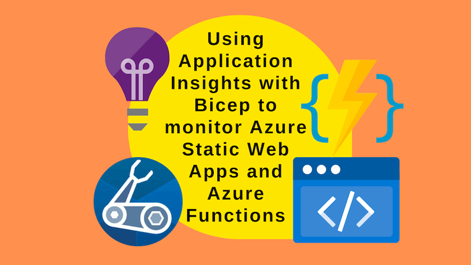
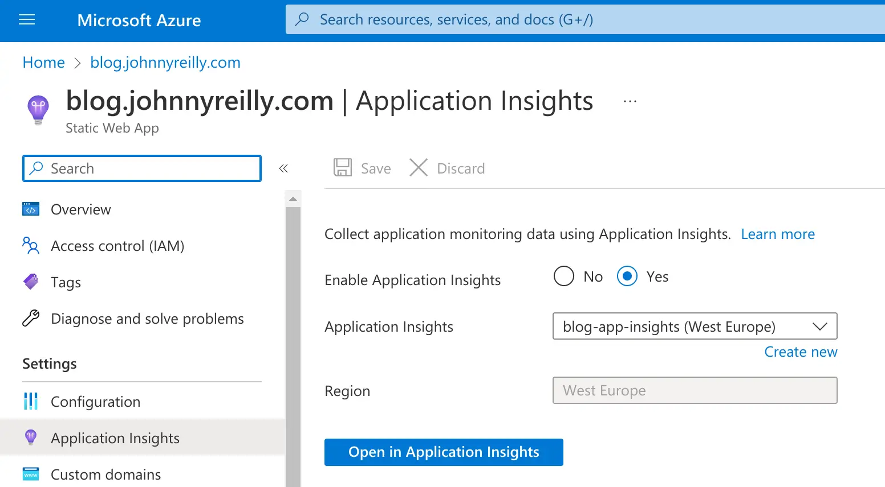
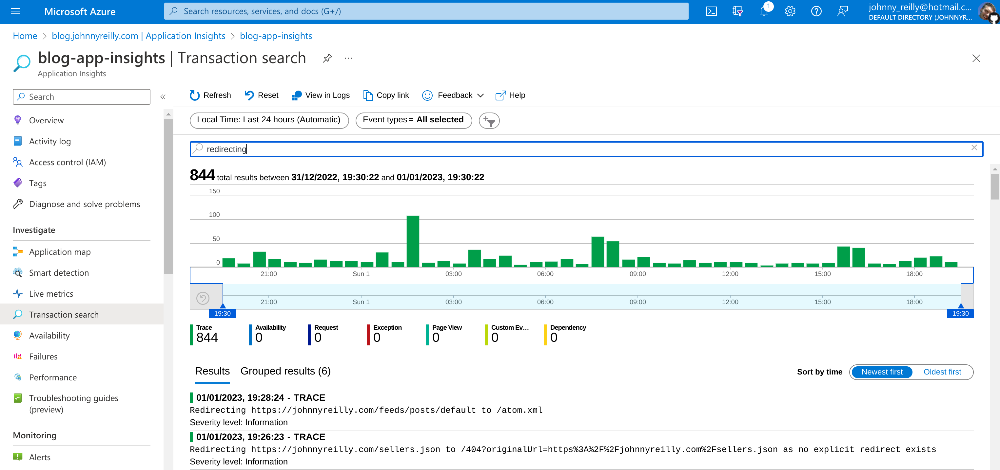

Application Insights are a great way to monitor Azure Static Web Apps and Azure Functions. But how do you deploy that using Bicep? Let's find out!



<!--truncate-->

## Updated 9 March 2023

I've updated this post to use the correct configuration approach for Static Web Apps with Azure Functions. Historically they used to be configured separately but that's no longer the case. You can see some discussion of this [on this GitHub issue](https://github.com/Azure/static-web-apps/issues/1089#issuecomment-1458710885).

To be super clear; the [`Microsoft.Web/staticSites/config@2022-03-01` `functionappsettings` is deprecated](https://learn.microsoft.com/en-us/azure/templates/microsoft.web/staticsites/config-functionappsettings?pivots=deployment-language-bicep). Don't use it. Use the `appsettings` resource alone instead.

## Monitoring Azure Static Web Apps

This post should possibly win some kind of "least pithy blog title" award. But it's definitely descriptive. Let's get into it.

I recently wrote [about using dynamic redirects in Azure Static Web Apps using the Azure Function they support](../2022-12-22-azure-static-web-apps-dynamic-redirects-azure-functions/index.md). I wanted to monitor the redirects that were being performed. I knew I could do this with Application Insights. But how do I deploy Application Insights using Bicep?

[My blog](https://johnnyreilly.com) runs on Azure Static Web Apps which is deployed using Bicep. [I've written about deploying Azure Static Web Apps with Bicep previously](../2023-02-01-migrating-from-github-pages-to-azure-static-web-apps/index.md). I wanted to add Application Insights to that deployment.

## Deploying Application Insights with Bicep

The first thing we need to do is deploy the Application Insights workspace. This is a resource that is required for Application Insights to work. And then deploy an Application Insights resource that uses it. We can achieve that with the following `appInsights.bicep` Bicep module:

```bicep
param location string
param tags object
param workspaceName string = 'appInsightsWorkspace'
param appInsightsName string = 'appInsights'

// https://learn.microsoft.com/en-us/azure/templates/microsoft.operationalinsights/workspaces?pivots=deployment-language-bicep
resource workspace 'Microsoft.OperationalInsights/workspaces@2022-10-01' = {
  name: workspaceName
  location: location
  tags: tags
  properties: {
    sku: {
      name: 'PerGB2018'
    }
    retentionInDays: 30
    workspaceCapping: {}
  }
}

// https://learn.microsoft.com/en-us/azure/templates/microsoft.insights/components?pivots=deployment-language-bicep
resource appInsights 'Microsoft.Insights/components@2020-02-02' = {
  name: appInsightsName
  location: location
  kind: 'other'
  properties: {
    Application_Type: 'web'
    Flow_Type: 'Bluefield'
    WorkspaceResourceId: workspace.id
    RetentionInDays: 90
    IngestionMode: 'LogAnalytics'
    publicNetworkAccessForIngestion: 'Enabled'
    publicNetworkAccessForQuery: 'Enabled'
  }
}

output appInsightsId string = appInsights.id
```

## Using the Application Insights module

We can now use the module in our `main.bicep` file:

```bicep
param location string
param branch string
param staticWebAppName string
param tags object
@secure()
param repositoryToken string
param rootCustomDomainName string
param blogCustomDomainName string
param workspaceName string = 'blog-app-insights-workspace'
param appInsightsName string = 'blog-app-insights'

module appInsights './appInsights.bicep' = {
  name: 'appInsights'
  params: {
    location: location
    tags: tags
    workspaceName: workspaceName
    appInsightsName: appInsightsName
  }
}

resource appInsightsResource 'Microsoft.Insights/components@2020-02-02' existing = {
  name: appInsightsName
}

module staticWebApp './staticWebApp.bicep' = {
  name: 'staticWebApp'
  params: {
    location: location
    branch: branch
    staticWebAppName: staticWebAppName
    tags: tags
    repositoryToken: repositoryToken
    rootCustomDomainName: rootCustomDomainName
    blogCustomDomainName: blogCustomDomainName
    appInsightsId: appInsights.outputs.appInsightsId
    appInsightsConnectionString: appInsightsResource.properties.ConnectionString
    appInsightsInstrumentationKey: appInsightsResource.properties.InstrumentationKey
  }
}

output staticWebAppDefaultHostName string = staticWebApp.outputs.staticWebAppDefaultHostName
output staticWebAppId string = staticWebApp.outputs.staticWebAppId
output staticWebAppName string = staticWebApp.outputs.staticWebAppName
```

There's a few things to note here:

- We have two modules. One for the Application Insights workspace and one for the Azure Static Web App.
- The Static Web App module _depends_ on the outputs from the Application Insights module. This is because we need the `id`, `InstrumentationKey` and `ConnectionString` properties of the Application Insights resource.

## Configuring the Azure Static Web App to use Application Insights

At this point we have something that deploys the Application Insights. The interesting part now is how we configure the Azure Static Web App to use Application Insights. We need to do that in the `staticWebApp.bicep` file:

```bicep
param location string
param branch string
param staticWebAppName string
param tags object
@secure()
param repositoryToken string
param rootCustomDomainName string
param blogCustomDomainName string
param appInsightsId string
@secure()
param appInsightsInstrumentationKey string
@secure()
param appInsightsConnectionString string

var tagsWithHiddenLinks = union({
  'hidden-link: /app-insights-resource-id': appInsightsId
  'hidden-link: /app-insights-instrumentation-key': appInsightsInstrumentationKey
  'hidden-link: /app-insights-conn-string': appInsightsConnectionString
}, tags)

resource staticWebApp 'Microsoft.Web/staticSites@2022-03-01' = {
  name: staticWebAppName
  location: location
  tags: tagsWithHiddenLinks
  sku: {
    name: 'Free'
    tier: 'Free'
  }
  properties: {
    repositoryUrl: 'https://github.com/johnnyreilly/blog.johnnyreilly.com'
    repositoryToken: repositoryToken
    branch: branch
    provider: 'GitHub'
    stagingEnvironmentPolicy: 'Enabled'
    allowConfigFileUpdates: true
    buildProperties:{
      skipGithubActionWorkflowGeneration: true
    }
  }
}

resource staticWebAppAppSettings 'Microsoft.Web/staticSites/config@2022-03-01' = {
  name: 'appsettings'
  kind: 'string'
  parent: staticWebApp
  properties: {
    APPINSIGHTS_INSTRUMENTATIONKEY: appInsightsInstrumentationKey
    APPLICATIONINSIGHTS_CONNECTION_STRING: appInsightsConnectionString
  }
}

resource rootCustomDomain 'Microsoft.Web/staticSites/customDomains@2022-03-01' = {
  parent: staticWebApp
  name: rootCustomDomainName
  properties: {}
}

resource blogCustomDomain 'Microsoft.Web/staticSites/customDomains@2022-03-01' = {
  parent: staticWebApp
  name: blogCustomDomainName
  properties: {}
}

output staticWebAppDefaultHostName string = staticWebApp.properties.defaultHostname
output staticWebAppId string = staticWebApp.id
output staticWebAppName string = staticWebApp.name
```

There's some code here you can ignore; the part related to custom domains for instance.

But there's two relevant things to note:

1. Configuring the Azure Static Web App and Azure Function to use Application Insights
2. Connecting the Azure Static Web App to the Application Insights resource in the Azure Portal

### 1. Configuring the Azure Static Web App and Azure Function to use Application Insights

First of all, let's look at how we get data flowing from the Azure Static Web App and Azure Function to Application Insights:

```bicep
resource staticWebAppAppSettings 'Microsoft.Web/staticSites/config@2022-03-01' = {
  name: 'appsettings'
  kind: 'string'
  parent: staticWebApp
  properties: {
    APPINSIGHTS_INSTRUMENTATIONKEY: appInsightsInstrumentationKey
    APPLICATIONINSIGHTS_CONNECTION_STRING: appInsightsConnectionString
  }
}
```

We're setting the `APPINSIGHTS_INSTRUMENTATIONKEY` and `APPLICATIONINSIGHTS_CONNECTION_STRING` application settings on the Azure Static Web App and its associated Azure Function. These settings are what tells the Azure Static Web App and Azure Function to use Application Insights. Please note that the configuration above is _shared_ by the Azure Static Web App and Azure Function.

### 2. Connecting the Azure Static Web App to the Application Insights resource in the Azure Portal

The other thing we need to do is to connect the Azure Static Web App to the Application Insights resource in the Azure Portal. What that means is that when you click on the Application Insights resource in the Azure Portal, you'll have a button which takes you from the Azure Static Web App in the portal to Application Insights resource:



This is done by setting the `hidden-link` tags on the Azure Static Web App resource. Here's how we do that:

```bicep
var tagsWithHiddenLinks = union({
  'hidden-link: /app-insights-resource-id': appInsightsId
  'hidden-link: /app-insights-instrumentation-key': appInsightsInstrumentationKey
  'hidden-link: /app-insights-conn-string': appInsightsConnectionString
}, tags)

resource staticWebApp 'Microsoft.Web/staticSites@2022-03-01' = {
  name: staticWebAppName
  location: location
  tags: tagsWithHiddenLinks
  // ...
}
```

## Conclusion

With this in place, we can now deploy our Azure Static Web App with an Application Insights resource using Bicep and have the Azure Static Web App connected to, and providing data to, the Application Insights resource. Monitoring awaits!


