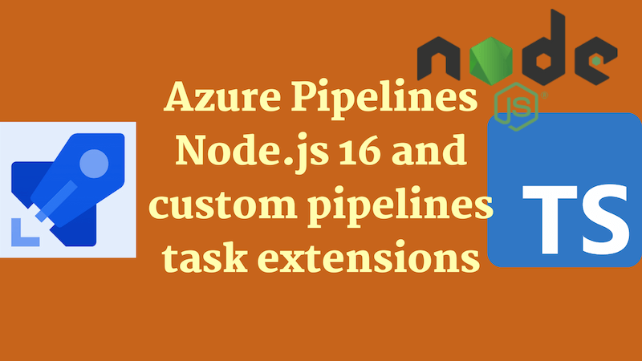

Support for Node.js 16 for Azure Pipelines custom pipelines task extensions has arrived. From a TypeScript perspective, this post documents how to migrate from a Node.js 10 custom task to one that runs on Node 16 using [`azure-pipelines-task-lib`](https://www.npmjs.com/package/azure-pipelines-task-lib).



## Updated 26th September 2024 - Node.js 20 support available

It's now possible to use Node.js 20 in tasks! See more details below:

- https://aka.ms/node-runner-guidance
- [There is a guide on how to migrate tasks to Node.js 20 here](https://github.com/microsoft/azure-pipelines-tasks/blob/master/docs/migrateNode20.md)

What's more we're going to start to see [warnings emitted in pipelines](https://learn.microsoft.com/en-us/azure/devops/release-notes/2024/pipelines/sprint-240-update#tasks-that-use-an-end-of-life-node-runner-version-to-execute-emit-warnings) when an EOL Node version is used.

<!--truncate-->

## The road to Node.js 16

Azure Pipelines custom pipelines task extensions have been around for a while. They're a great way to extend the functionality of Azure Pipelines. They're written in TypeScript and run on Node.js. [You can learn how to write one here](https://learn.microsoft.com/en-us/azure/devops/extend/develop/add-build-task?view=azure-devops). However, until recently they were restricted to only be able to run on Node.js 6 or Node.js 10. This was a problem as [support for Node 6 ended in 2018 and Node 10 ended in 2020](https://endoflife.date/nodejs).

A [GitHub issue was opened to track support for different Node versions with custom tasks](https://github.com/microsoft/azure-pipelines-agent/issues/3195), but it remained unresolved for a long time. [In October 2022 it was announced that Node.js 16 support was available](https://learn.microsoft.com/en-us/azure/devops/release-notes/2022/sprint-210-update#node-16-task-runner-in-pipeline-agent).

## Migrating a task to Node.js 16

There's an official migration guide to help you migrate your task from Node.js 6 or Node.js 10 to Node.js 16. It's [available here](https://github.com/microsoft/azure-pipelines-tasks/blob/3ab93334eb3e5c1f3750403e3b6f976909ae45c3/docs/migrateNode16.md). It gave me a couple of pointers but I wanted to document the process in a bit more detail. Also, I wanted to show how you can start to get some benefits from being on Node.js 16 with TypeScript.

The version of the [`azure-pipelines-task-lib`](https://www.npmjs.com/package/azure-pipelines-task-lib) being used in the `package.json` should be incremented to `4.0.0` or higher. If you haven't already, it's worth updating the `@types/node` version to `16.0.0` or higher. This will give you access to the types of the Node 16 APIs.

The migration guide suggests updating the `task.json` to have a `Node16` property alongside the existing `Node10` one:

```diff
"execution": {
  "Node10": {
    "target": "bash.js",
    "argumentFormat": ""
  },
+  "Node16": {
+    "target": "bash.js",
+    "argumentFormat": ""
+  }
}
```

I'm rather unclear as to the benefits of having a `Node10` and a `Node16` alongside each other; there's no useful reason to do so that I can come up with. I may be missing something.

Either way, in my own case I wanted to take advantage of the Node 16 environment and so I removed the `Node10` property entirely. My `task.json` now looks like this:

```json
  "execution": {
    "Node16": {
      "target": "index.js"
    }
  }
```

This was all I needed to do, to get to the point of having a Node 16 compatible task. But we want to go a little further.

## Updating TypeScript to use Node 16

Now we have Node 16, we can now start using some of the APIs available there if we'd like, and we can stop transpiling to an older version of JavaScript. To do this we need to update our TypeScript configuration in our `tsconfig.json` file:

```diff
-    "target": "es6" /* Specify ECMAScript target version: 'ES3' (default), 'ES5', 'ES2015', 'ES2016', 'ES2017', 'ES2018', 'ES2019', 'ES2020', or 'ESNEXT'. */,
-    "lib": [] /* Specify library files to be included in the compilation. */,
+    "target": "es2021" /* Specify ECMAScript target version: 'ES3' (default), 'ES5', 'ES2015', 'ES2016', 'ES2017', 'ES2018', 'ES2019', 'ES2020', or 'ESNEXT'. */,
+    "lib": ["ES2021"] /* Specify library files to be included in the compilation. */,
```

Here we're just changing the emitted JavaScript to be more modern. We're also updating the `lib` property to include the `ES2021` library. This will give us access to the types of the Node 16 APIs.

## How do we know we're using Node 16?

Great question! I was suspicious that the task was still running on Node 10. I wanted to know for sure. I ran a migrated task with system diagnostics enabled:

![Screenshot of Azure Pipelines including the text "##[debug]Using node path: /home/vsts/agents/2.213.2/externals/node16/bin/node"](screenshot-azure-pipelines-node-16.png)

As we can see, we're using Node 16. This is great news!

```bash
##[debug]Using node path: /home/vsts/agents/2.213.2/externals/node16/bin/node
```

## Conclusion

That's it, we're now writing modern custom pipelines task extensions using Node.js 16 and TypeScript. [Microsoft have commented](https://learn.microsoft.com/en-us/azure/devops/release-notes/2022/sprint-210-update#node-16-task-runner-in-pipeline-agent) on the lack of alignment between Node task runners and the Node release cycle:

> The original design of the Node task runner did not make Node version upgrades straightforward for task authors, and as a result has not kept up with the latest Node releases. We've heard feedback from customers on this, and are now making a number of changes to enable Azure Pipelines agents to keep installed Node versions in sync with the Node release cadence and support lifecycle while minimizing impacts on task and pipeline authors.

So, by the sounds of it, the problem is being taken seriously and will be addressed.
