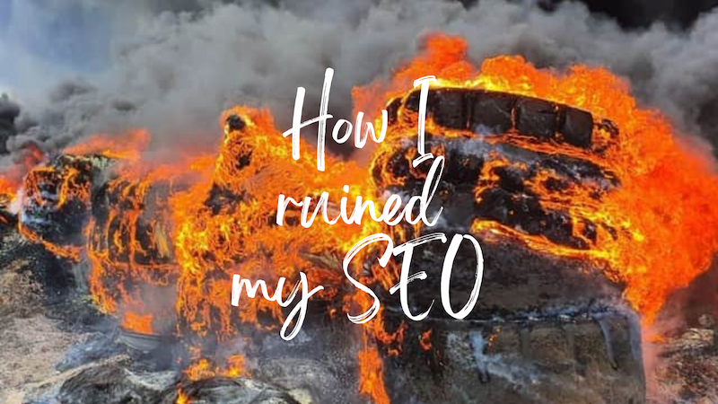
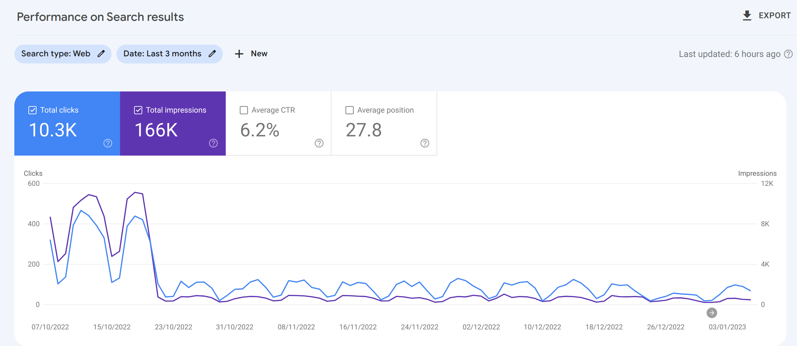
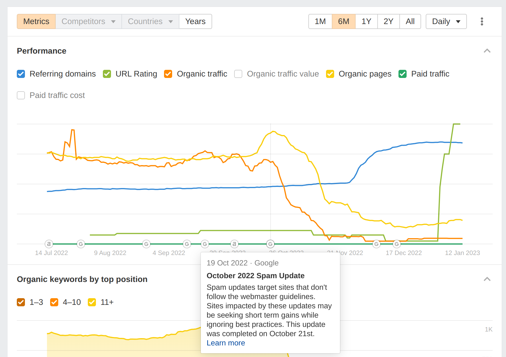

In October 2022 traffic to my blog dropped like a stone. What happened? Somehow I ruined my SEO. Don't be me. I'll tell you what I got up to and hopefully you can avoid doing the same.

## What I did on my holidays

Naturally I blame all of this on a holiday to the Swanage. I was away for a week, and whilst I was away I did not have access to a laptop. This is intentional by the way; I spend too much time on computers one way or another. I force myself to disconnect on holidays. But whilst I didn't have the ability to program, I had the ability to ponder.

I found myself going down a rabbit hole on SEO. I'd never really thought about it previously, and I thought "what would happen if I made some tweaks?" My half expectation was that I'd slightly improve my SEO. Probably not by much, but I'd learn something and it'd be fun. What actually happened was that in October 2022, traffic more or less dried up.

And probably because of my actions. I'm not sure what I did wrong, but I'm going to share what I did and maybe you can tell me what I did wrong.

Frustratingly, the feedback loop on SEO is anything but tight. You make a change, and then weeks (or months) later you see the results. And by then you've forgotten what you did. So I'm going to try and document what I did and what I think I did wrong.

Incidentally, I'm hoping someone will read this and tell me what I did wrong. I did something. I assume I did something. Come with me and embrace your inner Sherlock. I'm going to share evidence and maybe you can draw some conclusions.

## docusaurus 2.2

can't see why that would be issue

## fontaine

plugged in fontaine - that should be fine

## png -> webp \*

## Google Analytics - sharing my g-tag with the world (by mistake)

docusaurus g tag \*

https://github.com/facebook/docusaurus/pull/8313 - remove gtag

whhops https://twitter.com/johnny_reilly/status/1590585546451333120

## redirects - too little too late?

client side redirects boom \* https://github.com/johnnyreilly/blog.johnnyreilly.com/commit/e641431314c4b6a19d375f1c7bc14f5bd6456ec9 november
feedback loop

https://developers.google.com/search/updates/spam-updates
https://developers.google.com/search/docs/essentials/spam-policies - but I'm not doing anything wrong here
