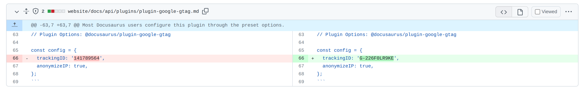

In October 2022 traffic to my blog dropped like a stone. What happened? Somehow I ruined my SEO. Don't be me. I'll tell you what I got up to and hopefully you can avoid doing the same.

## What I did on my holidays

Naturally I blame all of this on a holiday to the Swanage. I was away for a week, and whilst I was away I did not have access to a laptop. This is intentional by the way; I spend too much time on computers one way or another. I force myself to disconnect on holidays. But whilst I didn't have the ability to program, I had the ability to ponder.

I found myself going down a rabbit hole on SEO. I'd never really thought about it previously, and I thought "what would happen if I made some tweaks?" My half expectation was that I'd slightly improve my SEO. Probably not by much, but I'd learn something and it'd be fun. What actually happened was that in October 2022, traffic more or less dried up.

And probably because of my actions. I'm not sure what I did wrong, but I'm going to share what I did and maybe you can tell me what I did wrong.

Frustratingly, the feedback loop on SEO is anything but tight. You make a change, and then weeks (or months) later you see the results. And by then you've forgotten what you did. So I'm going to try and document what I did and what I think I did wrong.

Incidentally, I'm hoping someone will read this and tell me what I did wrong. I did something. I assume I did something. Come with me and embrace your inner Sherlock. I'm going to share evidence and maybe you can draw some conclusions.

So what did I get up to in the time before my traffic fell off a cliff? Let's begin.

## Upgraded to Docusaurus 2.2

I can't see why that would be issue. I don't think it is.

## Added fontaine

[I started using fontaine on my blog](https://github.com/johnnyreilly/blog.johnnyreilly.com/pull/305). If you haven't tried it out, [you can find it here](https://github.com/danielroe/fontaine). It helps reduce cumulative layout shift. The flash of unstyled content jank. I can't see why that would be an issue. It should improve my blogs core web vitals and help stuff rank better, not worse. I think this is a red herring.

## Google Analytics - sharing my g-tag with the Docusaurus docs

Here's where I suspect we may have a candidate. I did a foolish thing. You may be aware that Google are sunsetting Google Analytics as was, in favour of Google Analytics 4. I was using Google Analytics to track my blog traffic and thought "oh well I best migrate then".

Migration involved using in a new plugin for Docusaurus. However, the docs weren't great. I managed to work out how to get it working, and I thought I'd help the community by [submitting a docs PR](https://github.com/facebook/docusaurus/pull/7252). Can you see where this is going?

Yup. I managed to land my GA4 tag in the actual Docusaurus docs... I know, I know. I'm a mug. You might be wondering how I found out. Well the real giveaway was that I've never written any blogposts in Chinese.

I started seeing unfamiliar entries in my search traffic. I couldn't work out what was going on. It didn't make sense. Then I my PR and the terrible truth became apparent. It is a truth universally acknowledged, that a developer in possession of a good keyboard, must **copy and paste**.

Nightmare.

I did try to roll this back, [submit PRs to remove the tag](https://github.com/facebook/docusaurus/pull/8313), but not every one was merged. In the end I gave up and created a new GA4 property and started again. Out there right now, there are still websites sending my old GA4 tag traffic to Google. What a horlicks.

I don't know if Google tracks for sites sharing analytics tags and deranks them as a consequence, but I suspect it's a possibility. Who knows? (Maybe you do? Tell me!)

## Googles new spam update

https://ahrefs.com/google-algorithm-updates#october-2022-spam-update-2022-10-19

https://developers.google.com/search/updates/spam-updates
https://developers.google.com/search/docs/essentials/spam-policies - but I'm not doing anything wrong here

## png -> webp \*

## redirects - too little too late?

client side redirects boom \* https://github.com/johnnyreilly/blog.johnnyreilly.com/commit/e641431314c4b6a19d375f1c7bc14f5bd6456ec9 november
feedback loop

## Help me Obi-Wan, you're my only hope

I'm hoping someone will read this and tell me what I did wrong. I did something. I assume I did something. If you know, please let me know. I really want to understand!
