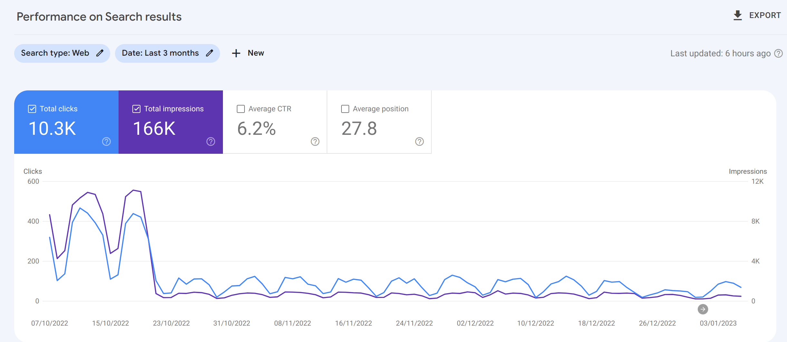
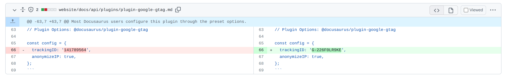
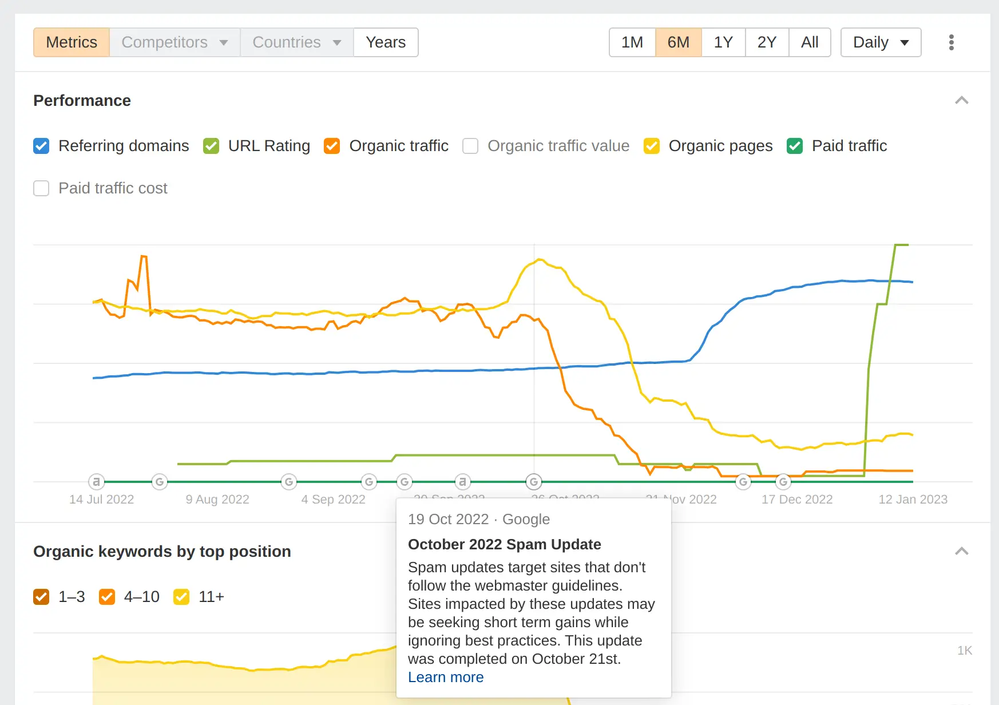
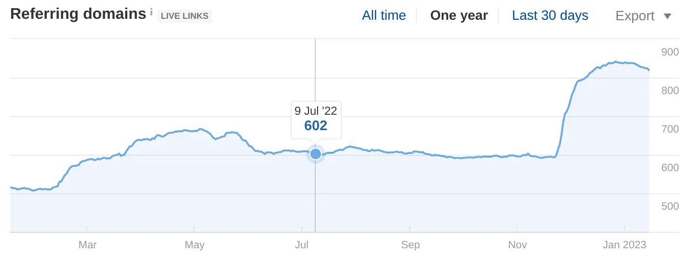
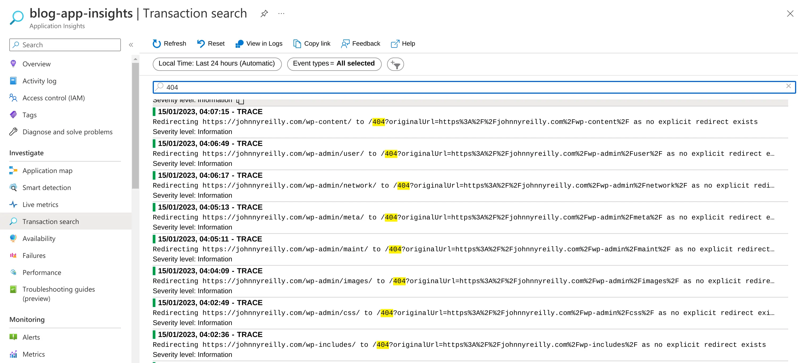

In October 2022 traffic to my blog dropped like a stone. What happened? Somehow I ruined my SEO. Don't be me. I'll tell you what I got up to and hopefully you can avoid doing the same.

## Updated 20/11/2023: SEO fixed!

There's a follow up to this named ["How we fixed my SEO"](../2023-11-28-how-we-fixed-my-seo/index.md) that you may enjoy.

<!--truncate-->

## What I did on my holidays

Naturally I blame all of this on a holiday to the British seaside. I was away for a week, and whilst I was away I did not have access to a laptop. This is intentional by the way; I spend too much time on computers one way or another. I force myself to disconnect on holidays. But whilst I didn't have the ability to program, I had the ability to ponder.

I found myself going down a rabbit hole on SEO. I'd never really thought about it previously, and I thought "what would happen if I made some tweaks?" My expectation was that I'd slightly improve my SEO. Probably not by much, but I'd learn something and it'd be fun. What actually happened was that in October 2022 (after my fiddling), traffic from search engines more or less dried up. Not quite the plan.

Odds are, the was probably because of my actions. I'm not sure what I did wrong, but I'm going to share what I did and maybe you can tell me where I pulled the pin out of the hand grenade.

Frustratingly, the feedback loop on SEO is anything but tight. You make a change, and then weeks (or months) later you see the results. And by then you've forgotten what you did. So I'm going to try and document what I did and what I think I did wrong.

Incidentally, I'm hoping someone will read this and tell me what I did wrong. I did something. I assume I did something. Come with me and embrace your inner Sherlock. I'm going to share evidence and maybe you can draw some conclusions.

So what did I get up to? In the time before my traffic fell off a cliff I did all kinds of things. Let's begin.

## Upgraded to Docusaurus 2.2

My blog runs on Docusaurus. I upgraded from 2.1 to 2.2. I can't see why that would be an issue. I don't think it is.

## Added fontaine

[I started using fontaine on my blog](https://github.com/johnnyreilly/blog.johnnyreilly.com/pull/305). If you haven't tried it out, [you can find it here](https://github.com/danielroe/fontaine). It helps reduce Cumulative Layout Shift. The flash of unstyled content jank that you can see when you first land on a site, before fonts have loaded. I can't see why that would be an issue. It should improve my blogs Core Web Vitals and help stuff rank better, not worse. I think this is a red herring.

## Google Analytics - sharing my g-tag with the Docusaurus docs

Here's where I suspect we may have a candidate. I did a foolish thing. You may be aware that Google are sunsetting Google Analytics as was, in favour of Google Analytics 4. I was using Google Analytics to track my blog traffic and thought "oh well I best migrate then".

Migration involved using in a new plugin for Docusaurus. However, the docs weren't great. I managed to work out how to get it working, and I thought I'd help the community by [submitting a docs PR](https://github.com/facebook/docusaurus/pull/7252). Can you see where this is going?

Yup. I managed to land my GA4 tag in the actual Docusaurus docs... I know, I know. I'm a mug. You might be wondering how I found out. Well the real giveaway was that I've never written any blogposts in Chinese.

I started seeing unfamiliar entries in my search traffic. I couldn't work out what was going on. It didn't make sense. Then I remembered my PR and the terrible truth became apparent:

> It is a truth universally acknowledged, that a developer in possession of a good keyboard, must **copy and paste**.

Nightmare. Other people were using my GA4 tag.

I did try to roll this back; search GitHub for my tag and [submit PRs to remove it](https://github.com/facebook/docusaurus/pull/8313). But not every PR was merged. In the end I gave up and created a new GA4 property and started again. Out there right now, there are still websites sending my old GA4 tag traffic to Google. What a horlicks.

I don't know if Google tracks for sites sharing analytics tags and deranks them as a consequence, but I suspect it's a possibility. Who knows? (Maybe you do? Tell me!)

## Googles new spam update

When I started to see traffic tail off, I started to look around for clues. It turns out there's a subculture of SEO tools out there. I'm not sure how I missed them before. I found [ahrefs](https://ahrefs.com) and [semrush](https://semrush.com); others too. This graph from ahrefs caught my eye:

You can see everything going South for me in October. What you can also see are Google search updates on the X axis. It turns out Google regularly update their search algorithm. [Interestingly, one of their updates coincides with my traffic tailing off](https://ahrefs.com/google-algorithm-updates#october-2022-spam-update-2022-10-19).

> ### October 2022 Spam Update
>
> Spam updates target sites that don't follow the webmaster guidelines. Sites impacted by these updates may be seeking short term gains while ignoring best practices. This update was completed on October 21st.
>
> [Google Search spam updates and your site ↗](https://developers.google.com/search/updates/spam-updates)

"Bingo!" I thought. "This is it!" But as I dug through the details, I became doubtful. Nothing on my site looks spammy. In my opinion obviously. But try as I might, I couldn't see it any other way. My content isn't spammy. Unless I'm missing something? Am I?

## From PNG to WebP and back again

Most of the images on my blog were PNGs. Lighthouse would regularly suggest migrating to a newer image format. I read around and the suggestion generally was that WebP was the way to go. So I did. But I think I made a bit of a mistake. As the images were converted, their filenames changed.

Because I didn't think it mattered, I didn't implement redirects. My view was "the blog posts have references to the new image names - that's likely all that matters". I'd lay money that's a mistake; that I should have implemented redirects and the site is being penalised.

Again, do tell me if I'm running with a false assumption here.

Oh the "and back again". I make use of [Open Graph sharing previews on my blog](../2021-12-12-open-graph-sharing-previews-guide/index.md) - so people using my links on social media get a nice preview of the content. [I learned from Steve Fenton that open graph doesn't always support WebP](https://www.stevefenton.co.uk/blog/2022/10/webp-opengraph-images/). Which sucks.

So I decided to revert my Open Graph images back to being PNGs; with entirely different names. Again I didn't implement redirects - no wonder Google loves me!

## Backlinks / referring domains

As I did my deepdive into SEO, I learned that backlinks and referring domains are important. I had a lot of them; I've been blogging for a long time. However, I suspect I had rather scorched the earth by failing to implement redirects. This chart from ahrefs shows the impact:

My assumption here is that by failing to implement redirects, I've lost a lot of backlinks. Previous 200s had transitioned to be 404s and Google had noticed.

## RSS feeds

I mentioned that I've been blogging a long time. Consequently I have a lot of blog posts. I also have [Atom](https://johnnyreilly.com/atom.xml) / [RSS](https://johnnyreilly.com/rss.xml) feeds on my blog. I didn't realise that there are limits on the size of these feeds. It doesn't appear to be standardised; but when I took a look at my feeds in various feed readers, I found they were erroring due to the size of the feeds.

I decided to start truncating the number of entries in my feeds. It's not so hard to do, just a post build step which [reads, amends and writes the XML](../2022-11-22-xml-read-and-write-with-node-js/index.md).

With this in place RSS readers seemed to be happier. And given a number of publications read my RSS feeds, it's likely that this will increase my backlinks over time.

I also contributed a [PR to Docusaurus](https://github.com/facebook/docusaurus/pull/8378) that will allow everyone to configure and adjust the number of entries in their feeds directly through Docusaurus; as opposed to afterwards in a post build step.

## Dynamic redirects - too little too late?

As I've mentioned, I broke links by not implementing redirects. It might be closing the stable door after the horse has bolted, but I decided to go back and implement redirects. In December 2022 [I implemented dynamic redirects on my blog using Azure Static Web Apps and Azure Functions](../2022-12-22-azure-static-web-apps-dynamic-redirects-azure-functions/index.md).

I implemented redirects for:

- images
- blog posts (from my old Blogger URLs to my new Docusaurus URLs)
- RSS / Atom feeds (Blogger had both of these but at different endpoints)
- renamed blog posts (I renamed a number of blog posts over time to be more SEO friendly)

I also decided to do some research. [I plugged Application Insights into my blog](../2023-01-01-application-insights-bicep-azure-static-web-apps/index.md) and started logging out when redirects were being hit. I also started logging out when 404s were being hit. I wanted to see if I was missing anything. I've been checking the logs every day since, and adding new redirects as I go.

Will this help over time? Answers on a postcard please. Or toot / tweet / email / DM me.

As an aside, looking at the logs in itself has been a lesson:

Someone on the internet is _always_ trying to hack you. And usually under the assumption you're running WordPress / PHP.

## Help me Obi-Wan, you're my only hope

As you can see, I've done a lot of tinkering. I'm not quite sure what torched my SEO. It may be one thing, it may be a combination of things. I don't know if there's a road back.

I'm hoping someone will read this and tell me what I did wrong. I did something. Or at least I assume I'm the cause. Maybe I'm not? Maybe I'm missing something entirely. If you know, please let me know. I really want to understand!

## Discussion on Hacker News

This was disussed on Hacker News. [You can read the discussion here](https://news.ycombinator.com/item?id=34389421).
