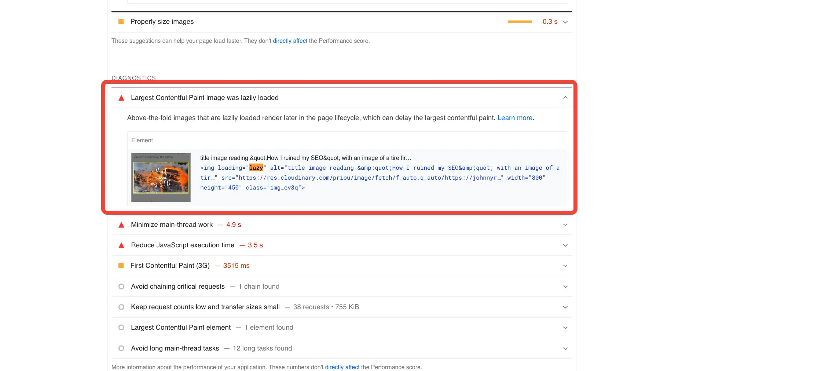
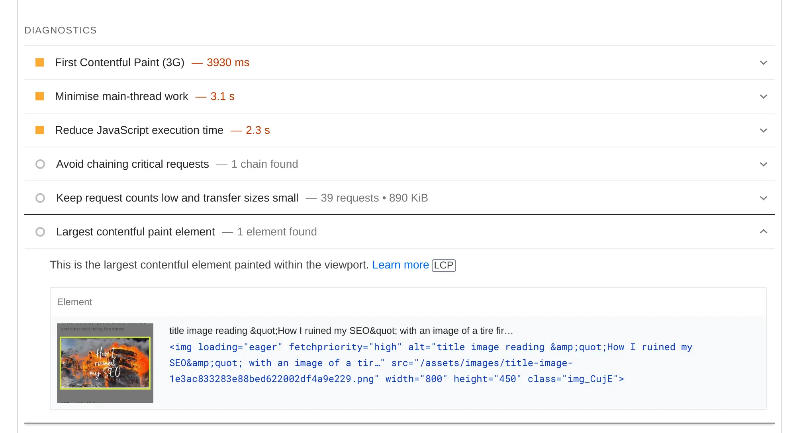

By using `fetchpriority` on your Largest Contentful Paint you can improve your Core Web Vitals. This post implements that with Docusaurus v2. There is a follow on post that details [migrating this plugin to Docusaurus v3](../2023-10-09-docusaurus-3-how-to-migrate-rehype-plugins/index.md).


<!--truncate-->

## Avoiding lazy loading on the Largest Contentful Paint

At the weekend [I wrote a post documenting how I believe I ruined the SEO on my blog](../2023-01-15-how-i-ruined-my-seo/index.md). That post ended up [trending on Hacker News](https://news.ycombinator.com/item?id=34389421). People made suggestions around things I could do that could improve things. One post in particular caught my eye from [Growtika](https://growtika.com) saying:

> Page speed: It's one of the most important ranking factor. You don't have to get 100 score, but passing the core web vitals score and having higher score on mobile is recommended.
>
> https://pagespeed.web.dev/report?url=https%3A%2F%2Fjohnnyreilly.com%2F&form_factor=mobile
>
> A cool trick to improve the result fast is by removing the lazy load effect from the LCP:



Another person chimed in with:

> Indeed. Even better, making it high priority instead of normal: https://addyosmani.com/blog/fetch-priority/

## `fetchpriority`

I hadn't heard of `fetchpriority` before this, but the linked article by [Addy Osmani](https://addyosmani.com) carried this tip:

> Add `fetchpriority="high"` to your Largest Contentful Paint (LCP) image to get it to load sooner. Priority Hints sped up Etsy’s LCP by 4% with some sites seeing an improvement of up to 20-30% in their lab tests. In many cases, fetchpriority should lead to a nice boost for LCP.

I was keen to try this out. Somewhat interestingly, I was the person responsible for [originally contributing lazy loading to Docusaurus](https://github.com/facebook/docusaurus/pull/6598). For what it's worth, lazy loading is a _good thing_ to do. It's just that in this case, it was causing the LCP to be lazy loaded. I wanted to change that.

## Swizzling the image component

Since my initial contribution, the [implementation had been tweaked to allow user control via Swizzling](https://github.com/facebook/docusaurus/pull/6990). By the way, [swizzling is a great feature of Docusaurus](https://docusaurus.io/docs/swizzling). It allows you to override the default implementation of a component. In this case, I wanted to override the `Img` component and opt out of lazy loading. I did this by running the following command:

```bash
yarn swizzle @docusaurus/theme-classic MDXComponents/Img -- --eject
```

This created a file at `src/theme/MDXComponents/Img.js`. I then made the following change:

```diff
import React from 'react';
import clsx from 'clsx';
import styles from './styles.module.css';
function transformImgClassName(className) {
  return clsx(className, styles.img);
}
export default function MDXImg(props) {
  return (
    // eslint-disable-next-line jsx-a11y/alt-text
    
  );
}
```

Getting rid of the `loading="lazy"` attribute was all I needed to do. This gets us to the point where none of our images are lazy loaded anymore. Stage 1 complete!

## Adding `fetchpriority="high"` to the LCP with a custom plugin

The next thing to do was to write a small Rehype plugin to add `fetchpriority="high"` to the LCP. I did this by creating a new JavaScript file called `image-fetchpriority-rehype-plugin.js`:

```js
// @ts-check
const visit = require('unist-util-visit');

/**
 * Create a rehype plugin that will make the first image eager loaded with fetchpriority="high" and lazy load all other images
 * @returns rehype plugin that will make the first image eager loaded with fetchpriority="high" and lazy load all other images
 */
function imageFetchPriorityRehypePluginFactory() {
  /** @type {Map<string, string>} */ const files = new Map();

  /** @type {import('unified').Transformer} */
  return (tree, vfile) => {
    visit(tree, ['element', 'jsx'], (node) => {
      if (node.type === 'element' && node['tagName'] === 'img') {
        // handles nodes like this:
        // {
        //   type: 'element',
        //   tagName: 'img',
        //   properties: {
        //     src: 'https://some.website.com/cat.gif',
        //     alt: null
        //   },
        //   ...
        // }

        const key = `img|${vfile.history[0]}`;
        const imageAlreadyProcessed = files.get(key);
        const fetchpriorityThisImage =
          !imageAlreadyProcessed ||
          imageAlreadyProcessed === node['properties']['src'];

        if (!imageAlreadyProcessed) {
          files.set(key, node['properties']['src']);
        }

        if (fetchpriorityThisImage) {
          node['properties'].fetchpriority = 'high';
          node['properties'].loading = 'eager';
        } else {
          node['properties'].loading = 'lazy';
        }
      } else if (node.type === 'jsx' && node['value']?.includes(''
        // }

        // if (!vfile.history[0].includes('blog/2023-01-15')) return;

        const key = `jsx|${vfile.history[0]}`;
        const imageAlreadyProcessed = files.get(key);
        const fetchpriorityThisImage =
          !imageAlreadyProcessed || imageAlreadyProcessed === node['value'];

        if (!imageAlreadyProcessed) {
          files.set(key, node['value']);
        }

        if (fetchpriorityThisImage) {
          node['value'] = node['value'].replace(
            /<img /g,
            '<img loading="eager" fetchpriority="high" ',
          );
        } else {
          node['value'] = node['value'].replace(
            /<img /g,
            '<img loading="lazy" ',
          );
        }
      }
    });
  };
}

module.exports = imageFetchPriorityRehypePluginFactory;
```

The above plugin runs over the AST of the MDX file and adds `fetchpriority="high"` to the first image. It also adds `loading="eager"` to the first image and `loading="lazy"` to all other images.

Interestingly, when I was writing it I discovered that the visitor is invoked multiple times for the same elements. I'm not quite sure why, but the logic in the plugin uses a `Map` to keep track of which images have already been processed. TL;DR it works!

I then added the plugin to the `docusaurus.config.js` file:

```js
//@ts-check
const imageFetchPriorityRehypePlugin = require('./image-fetchpriority-rehype-plugin');

/** @type {import('@docusaurus/types').Config} */
const config = {
  // ...
  presets: [
    [
      '@docusaurus/preset-classic',
      /** @type {import('@docusaurus/preset-classic').Options} */
      ({
        // ...
        blog: {
          // ...
          rehypePlugins: [imageFetchPriorityRehypePlugin],
          // ...
        },
        // ...
      }),
    ],
  ],
  // ...
};

module.exports = config;
```

## What does it look like when applied?

Now we have this in place, if we run the same test with [pagespeed](https://pagespeed.web.dev/) we have different results:



We're now _not_ lazy loading the image and we're also making it a high priority fetch. Great news!

I'd like for this to be the default behaviour for Docusaurus. I'm not sure if it's possible to do this in a way that's straightforward. [I've raised an issue on the Docusaurus repo to see if it's possible](https://github.com/facebook/docusaurus/issues/8552).
