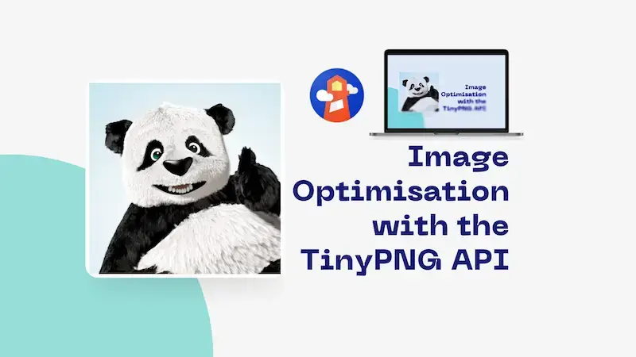
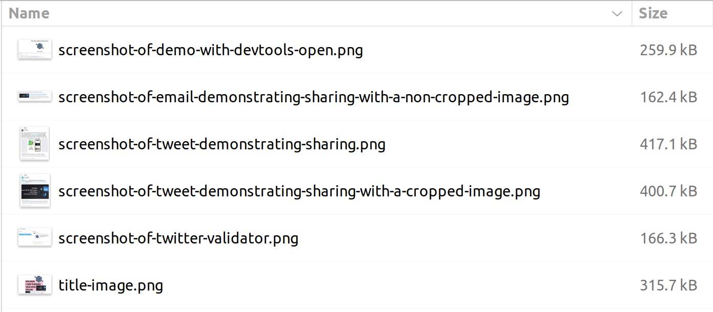
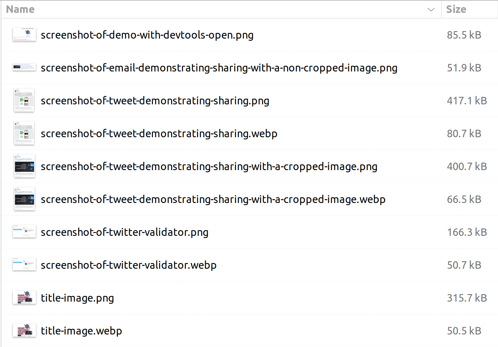

Image optimisation can be automated with the TinyPNG API. This post demonstrates how to do that.



<!--truncate-->

## Images and optimisation

Images are a big part of the web. They're also a big part of the web's payload. If we're not careful, we can end up with a site that's slow to load and expensive to host. I run [Lighthouse](https://developer.chrome.com/docs/lighthouse/overview/) on my blog and I'm always looking for ways to improve the performance of the site. One of the things that Lighthouse flags is image optimisation.

It's a good idea to optimise our images; to make sure they're not unhelpfully large. We can do this manually using tools like [TinyPNG](https://tinypng.com/) or [Squoosh](https://squoosh.app/). However, it's also possible to automate this process. In this post, I'll show you how to do that using the TinyPNG API.

## The TinyPNG API

The [TinyPNG API](https://tinypng.com/developers) is a paid service. We can get a free API key which allows us to optimise 500 images per month. If we need to optimise more than that, we'll need to pay for a subscription. I rarely find I optimise more than 500 images per month so I'm happy with the free plan.

It's worth noting that the name "TinyPNG" is a bit of a misnomer. The API supports a number of image formats including PNG, JPEG and WebP. It's not just for PNGs. In fact we'll be using the WebP format in this post.

You can just use the API directly. However, I prefer to use a client library. We'll be using [the Node.js](https://tinypng.com/developers/reference/nodejs) library.

## Making a command line tool

We're going to initialise a simple Node.js console application called "tinify" using [TypeScript](https://www.typescriptlang.org/) and [`ts-node`](https://typestrong.org/ts-node/):

```bash
mkdir tinify
cd tinify
npm init -y
npm install @types/node tinify ts-node typescript
npx tsc --init
```

You'll note that we're using the `tinify` npm package [which is developed here](https://github.com/tinify/tinify-nodejs). Handily this package ships with TypeScript definitions, so we don't need to install a separate types package.

In our `package.json` file we'll add a `start` script to run our application:

```json
  "scripts": {
    "start": "ts-node index.ts"
  },
```

In our `tsconfig.json` file we'll also up the `target` to a new ECMAScript emit version to allow us to use some newer language features. We don't need this for TinyPNG, but it's nice to use the newer features:

```json
{
  "compilerOptions": {
    "target": "es2021"
  }
}
```

Now we can create our `index.ts` file:

```ts
import fs from 'fs';
import path from 'path';
import tinify from 'tinify';

function setUpTinify() {
  if (!process.env.TINIFY_KEY) {
    console.log(
      'Run with: TINIFY_KEY=$YOUR_API_KEY IMAGE_DIR=$YOUR_IMAGE_DIRECTORY yarn start',
    );
    process.exit(1);
  }

  tinify.key = process.env.TINIFY_KEY;
}

function getImageFilesFromDirectory(dir: string) {
  return fs
    .readdirSync(dir)
    .filter(
      (file) =>
        file.endsWith('.jpg') ||
        file.endsWith('.jpeg') ||
        file.endsWith('.webp') ||
        file.endsWith('.png'),
    )
    .map((file) => path.resolve(dir, file))
    .filter((file) => fs.statSync(file).size > 0);
}

async function processImageFiles(imageFiles: string[]) {
  let processed = 0;
  let totalOriginalSizeKb = 0n;
  let totalNewSizeKb = 0n;
  let failed: string[] = [];

  for (const imageFilePath of imageFiles) {
    try {
      console.log(`
🖼️  Processing ${imageFilePath}
`);
      const originalImageFilePrefix = imageFilePath.substring(
        0,
        imageFilePath.lastIndexOf('.'),
      );

      const originalStats = await fs.promises.stat(imageFilePath, {
        bigint: true,
      });
      const originalSizeKb = originalStats.size / 1024n;

      const source = tinify.fromFile(imageFilePath);
      const converted = source.convert({ type: ['image/webp', 'image/png'] });
      const convertedExtension = await converted.result().extension();
      const newImageFilePath = `${originalImageFilePrefix}.${convertedExtension}`;
      await converted.toFile(newImageFilePath);

      const newStats = await fs.promises.stat(newImageFilePath, {
        bigint: true,
      });
      const newSizeKb = newStats.size / 1024n;

      const imageFileName = path.basename(imageFilePath);
      const newImageFileName = path.basename(newImageFilePath);

      totalOriginalSizeKb += originalSizeKb;
      totalNewSizeKb += newSizeKb;

      console.log(`- 🔴 ${originalSizeKb}kb - ${imageFileName}
- 🟢 ${newSizeKb}kb - ${newImageFileName}
- 🔽 ${calculatePercentageReduction({ originalSizeKb, newSizeKb }).toFixed(
        2,
      )}% reduction

✅ Processed! (${++processed} of ${imageFiles.length})

----------------------`);
    } catch (e) {
      console.log(`\n❌ Failed to process ${imageFilePath}`);
      failed.push(imageFilePath);
    }
  }

  console.log(`
************************************************
* Total savings for ${imageFiles.length} images 
- 🔴 ${totalOriginalSizeKb}kb
- 🟢 ${totalNewSizeKb}kb
- 🔽 ${calculatePercentageReduction({
    originalSizeKb: totalOriginalSizeKb,
    newSizeKb: totalNewSizeKb,
  }).toFixed(2)}% reduction
************************************************
`);

  if (failed.length > 0) console.log('Failed to process', failed);
}

function calculatePercentageReduction({
  originalSizeKb,
  newSizeKb,
}: {
  originalSizeKb: bigint;
  newSizeKb: bigint;
}) {
  return (
    ((Number(originalSizeKb) - Number(newSizeKb)) / Number(originalSizeKb)) *
    100
  );
}

async function run() {
  setUpTinify();

  let directory = process.env.IMAGE_DIR;

  if (!directory) {
    console.log('No directory specified!');
    process.exit(1);
  }

  const imageFiles = getImageFilesFromDirectory(directory);
  console.log(`Found ${imageFiles.length} image files in ${directory}`);
  await processImageFiles(imageFiles);
}

// do it!
run();
```

There's a number of things happening here. Let me walk it through; each time we run:

1. We're checking that we have a TinyPNG API key and an image directory specified. If not, we'll exit with an error message.
2. We're getting a list of image files from the specified directory. We look for files with the extensions `.jpg`, `.jpeg`, `.webp` and `.png` (those formats supported by TinyPNG). We also filter out any files that are empty.
3. We're looping through the image files and processing them one by one. We're using the `tinify` package to shrink the image; and we say we'll accept either `webp` or `png` as our target format. Tinify will decide which is the most optimal format upon each request and render accordingly. Finally we're saving the new files to the same directory as the original file. We're also calculating the percentage reduction in file size.

If we wanted to look just at the code that does the actual conversion, it's this:

```ts
const source = tinify.fromFile(imageFilePath);
const converted = source.convert({ type: ['image/webp', 'image/png'] });
const convertedExtension = await converted.result().extension();
const newImageFilePath = `${originalImageFilePrefix}.${convertedExtension}`;
await converted.toFile(newImageFilePath);
```

## Using the tool

With our tool written, we now need to test it out. I've a directory of images that I want to compress: `~/code/github/open-graph-sharing-previews/images-to-shrink`



Now let's run our tool against that directory and see what happens:

```bash
TINIFY_KEY=YOUR_API_KEY_GOES_HERE IMAGE_DIR=~/code/github/open-graph-sharing-previews/images-to-shrink yarn start

yarn run v1.22.18
$ ts-node index.ts
Found 6 image files in /home/john/code/github/open-graph-sharing-previews/images-to-shrink

🖼️  Processing /home/john/code/github/open-graph-sharing-previews/images-to-shrink/screenshot-of-demo-with-devtools-open.png

- 🔴 253kb - screenshot-of-demo-with-devtools-open.png
- 🟢 83kb - screenshot-of-demo-with-devtools-open.png
- 🔽 67.19% reduction

✅ Processed! (1 of 6)

----------------------

🖼️  Processing /home/john/code/github/open-graph-sharing-previews/images-to-shrink/screenshot-of-email-demonstrating-sharing-with-a-non-cropped-image.png

- 🔴 158kb - screenshot-of-email-demonstrating-sharing-with-a-non-cropped-image.png
- 🟢 50kb - screenshot-of-email-demonstrating-sharing-with-a-non-cropped-image.png
- 🔽 68.35% reduction

✅ Processed! (2 of 6)

----------------------

🖼️  Processing /home/john/code/github/open-graph-sharing-previews/images-to-shrink/screenshot-of-tweet-demonstrating-sharing-with-a-cropped-image.png

- 🔴 391kb - screenshot-of-tweet-demonstrating-sharing-with-a-cropped-image.png
- 🟢 64kb - screenshot-of-tweet-demonstrating-sharing-with-a-cropped-image.webp
- 🔽 83.63% reduction

✅ Processed! (3 of 6)

----------------------

🖼️  Processing /home/john/code/github/open-graph-sharing-previews/images-to-shrink/screenshot-of-tweet-demonstrating-sharing.png

- 🔴 407kb - screenshot-of-tweet-demonstrating-sharing.png
- 🟢 78kb - screenshot-of-tweet-demonstrating-sharing.webp
- 🔽 80.84% reduction

✅ Processed! (4 of 6)

----------------------

🖼️  Processing /home/john/code/github/open-graph-sharing-previews/images-to-shrink/screenshot-of-twitter-validator.png

- 🔴 162kb - screenshot-of-twitter-validator.png
- 🟢 49kb - screenshot-of-twitter-validator.webp
- 🔽 69.75% reduction

✅ Processed! (5 of 6)

----------------------

🖼️  Processing /home/john/code/github/open-graph-sharing-previews/images-to-shrink/title-image.png

- 🔴 308kb - title-image.png
- 🟢 49kb - title-image.webp
- 🔽 84.09% reduction

✅ Processed! (6 of 6)

----------------------

************************************************
* Total savings for 6 images
- 🔴 1679kb
- 🟢 373kb
- 🔽 77.78% reduction
************************************************

Done in 25.23s.
```

Isn't that impressive? We've reduced the file size of all of these images by an average amount of 77.78%! That's a huge saving.

If we look a little closer, we'll see that on two occasions the format has remained as a PNG file and the size has shrunk. In four cases, the format has changed to a WebP file. When we look at our directory again, we'll see that the files have been updated, and some new WebP files have been created:



## Conclusion

We've seen how we can use the TinyPNG API to optimise our images. We've also built a tool that uses the TinyPNG API to optimise the images in a given directory.

It's all automated. We can now run this script whenever we want to optimise the images in any directory!

[This post was originally published on LogRocket.](https://blog.logrocket.com/automate-image-optimization-tinypng-api/)

<head>
    <link rel="canonical" href="https://blog.logrocket.com/automate-image-optimization-tinypng-api/" />
</head>
