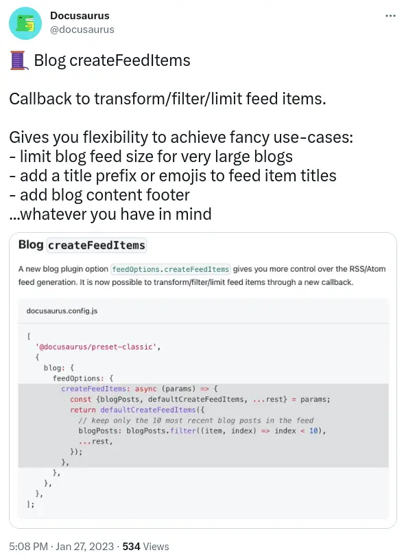

A new API landed in Docusaurus 2.3.0 - it's called `createFeedItems`. It's a great API that allows you to tweak the Atom / RSS / JSON feeds for your blog. This post shows how to use it with the git commit date.

## `createFeedItems` API

[I worked on the createFeedItems API for Docusaurus](https://github.com/facebook/docusaurus/pull/8378). When the feature was announced on Twitter, there were a number of suggested use cases:

As someone who worked on the API, you naturally might imagine that I'd have some ideas for how to use it. I do!

There's two particular use cases that I've been thinking about:

1. Trimming the number of feed items
2. Using the git commit date for the feed item date

The reason I want to trim the number of feed items is because I have written a lot of blog posts. I learned that some RSS readers were choking on the size of my feed and rendering it unusable. So I thought a decent approach would be to trim the number of feed items to a more manageable number.

The second use case is a lot more fun! I want to use the git commit date for the feed item date. I tend to go back and edit my posts, particularly in the recent months after publishing. I don't want the date of the feed item to be the date of the post. I want it to be the date of the most recent commit.
