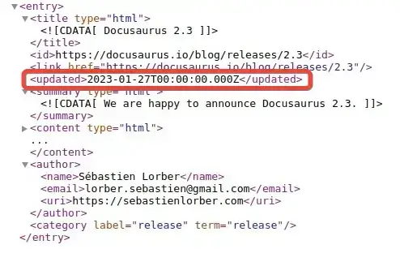

A new API landed in Docusaurus 2.3.0 - it's called `createFeedItems`. It's a great API that allows you to tweak the Atom / RSS / JSON feeds for your blog. This post shows how to use it with the git commit date.

This post builds upon a technique we've previously used to drive the `lastmod` properties of our sitemap. [You can read about driving `lastmod` from git commit here](../2022-11-25-adding-lastmod-to-sitemap-git-commit-date/index.md).


<!--truncate-->

## Updated 27/11/2023 - Docusaurus 3

This post was originally written targetting Docusaurus 2. Now Docusaurus 3 is landing, this post has been updated to cater for Docusaurus 3 usage.

## `createFeedItems` API

[I worked on the createFeedItems API for Docusaurus](https://github.com/facebook/docusaurus/pull/8378). When the [feature was announced](https://twitter.com/docusaurus/status/1619019412610191379), there were a number of suggested use cases:

[](https://twitter.com/docusaurus/status/1619019412610191379)

As someone who worked on the API, you naturally might imagine that I'd have some ideas for how to use it. I do!

There's two particular use cases that I've been thinking about:

1. Trimming the number of feed items
2. Using the latest git commit date for the feed item date

The reason I want to trim the number of feed items is because I have written a lot of blog posts. I learned that some RSS readers were choking on the size of my feed and rendering it unusable. So I thought a decent approach would be to trim the number of feed items to a more manageable number.

The second use case is a lot more fun! I want to use the git commit date for the feed item date. Docusaurus uses the date of post itself to drive this by default. You can see this by looking at the [Docusaurus atom feed](https://docusaurus.io/blog/atom.xml):



That's not a bad default. However, I tend to go back and edit my posts, particularly in the recent weeks after publishing. I don't want the date of the feed item to be the date of the post. I want it to be the date of the most recent commit. That way, if I go back and edit a post, the feed item date will be updated.

We're going to implement both of these.

## `createFeedItems` API usage

The `createFeedItems` API is a function that takes a list of feed items and returns a list of feed items. I find looking at code easier than reading about code so let's look at [the example code from the docs](https://docusaurus.io/docs/blog#feed):

```js
/** @type {import('@docusaurus/types').Config} */
const config = {
  // ...
  presets: [
    [
      '@docusaurus/preset-classic',
      {
        blog: {
          feedOptions: {
            type: 'all',
            copyright: `Copyright © ${new Date().getFullYear()} Facebook, Inc.`,
            createFeedItems: async (params) => {
              const { blogPosts, defaultCreateFeedItems, ...rest } = params;
              return defaultCreateFeedItems({
                // keep only the 10 most recent blog posts in the feed
                blogPosts: blogPosts.filter((item, index) => index < 10),
                ...rest,
              });
            },
          },
        },
      },
    ],
  ],
};
```

As we can see - this is a function, which receives a single parameter. That parameter is an object with a number of properties. The most important of these is `blogPosts`. This is a list of blog posts. We can filter this list and return a new list. We can also call `defaultCreateFeedItems` to get the default behaviour. We can then tweak the result of that call.

Importantly it's an `async` function. This means that we can do async work in it. We're going to use that when we get the git commit date.

## Our implementation

Now we know how to use the API, let's implement it to handle our use cases. To get the git commit date, we're going to use a package called [`simple-git`](https://github.com/steveukx/git-js). We'll add this as a dependency of our Docusaurus project:

```bash
yarn add simple-git
```

We're going to create a new file to sit alongside our `docusaurus.config.js` file. We'll call it `createFeedItems.mjs` (as it's an ESM file):

```js
//@ts-check
import path from 'path';
import { simpleGit } from 'simple-git';

/** @type {import('@docusaurus/plugin-content-blog').CreateFeedItemsFn} */
export async function createFeedItems(params) {
  const { blogPosts, defaultCreateFeedItems, ...rest } = params;

  const feedItems = await defaultCreateFeedItems({
    blogPosts,
    ...rest,
  });

  for (const feedItem of feedItems) {
    // blogPost.metadata.permalink: '/2023/01/22/image-optimisation-tinypng-api',
    // feedItem.link: 'https://johnnyreilly.com/2023/01/22/image-optimisation-tinypng-api',
    const relatedBlogEntry = blogPosts.find((blogPost) =>
      feedItem.link.endsWith(blogPost.metadata.permalink),
    );
    if (!relatedBlogEntry) {
      console.log('blogFilePath not found', feedItem.link);
      throw new Error(`blogFilePath not found ${feedItem.link}`);
    }

    // source: '@site/blog/2023-01-22-image-optimisation-tinypng-api/index.md',
    const gitLatestCommitString = await getGitLatestCommitDateFromFilePath(
      relatedBlogEntry.metadata.source.replace('@site/', 'blog-website/'),
    );
    const gitLatestCommitDate = gitLatestCommitString
      ? new Date(gitLatestCommitString)
      : undefined;
    if (gitLatestCommitDate) {
      feedItem.date = gitLatestCommitDate;
    }
  }

  // keep only the 20 most recently updated blog posts in the feed
  const latest20FeedItems = Array.from(feedItems)
    .sort((a, b) => b.date.getDate() - a.date.getDate())
    .slice(0, 20);

  return latest20FeedItems;
}

/**
 * Given a file path, return the last commit date
 * @param {string} filePath
 * @returns
 */
async function getGitLatestCommitDateFromFilePath(filePath) {
  const git = getSimpleGit();

  const log = await git.log({
    file: filePath,
  });

  const latestCommitDate = log.latest?.date;

  return latestCommitDate;
}

/** @type {import('simple-git').SimpleGit | undefined} */
let git;

/**
 * get a simple git instance
 * @returns SimpleGit
 */
function getSimpleGit() {
  if (!git) {
    const baseDir = path.resolve(process.cwd(), '..');

    /** @type {Partial<import('simple-git').SimpleGitOptions>} */
    const options = {
      baseDir,
      binary: 'git',
      maxConcurrentProcesses: 6,
      trimmed: false,
    };

    git = simpleGit(options);
  }

  return git;
}
```

What's happening here? Well, the `createFeedItems` function is taking the blog posts that come in and then calling `defaultCreateFeedItems` to get the default behaviour. We then iterate over the feed items and for each one we find the related blog post. We then use `simple-git` to get the last commit date for the blog post. We then set the feed item's date to the last commit date. We then sort the feed items by date and take the first 20. We then return those 20 feed items.

It's as simple as that. There's a few bits in there which are specific to my blog (like the `blog-website` directory) but you can see how you can tweak this to suit your needs.

With this implemented, we'll reference this in our `docusaurus.config.js` file:

```js
//@ts-check
import { createFeedItems } from './createFeedItems.mjs';

/** @type {import('@docusaurus/types').Config} */
const config = {
  // ...
  presets: [
    [
      '@docusaurus/preset-classic',
      /** @type {import('@docusaurus/preset-classic').Options} */
      ({
        // ...
        feedOptions: {
          // ...
          createFeedItems,
          // ...
        },
        // ...
      }),
    ],
  ],
  // ...
};

export default config;
```

And we're done! We can now run `yarn build` and see the results:


Look for yourself at [johnnyreilly.com/atom.xml](https://johnnyreilly.com/atom.xml) or [johnnyreilly.com/rss.xml](https://johnnyreilly.com/rss.xml).

## Conclusion

Here we've learned how to use the `createFeedItems` API to customise the feed items that are generated. We've also seen how to use `simple-git` to get the last commit date for a file. We've then used that to set the date of the feed item to the last commit date.
