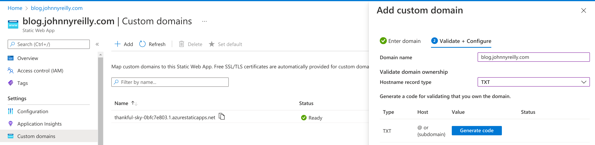
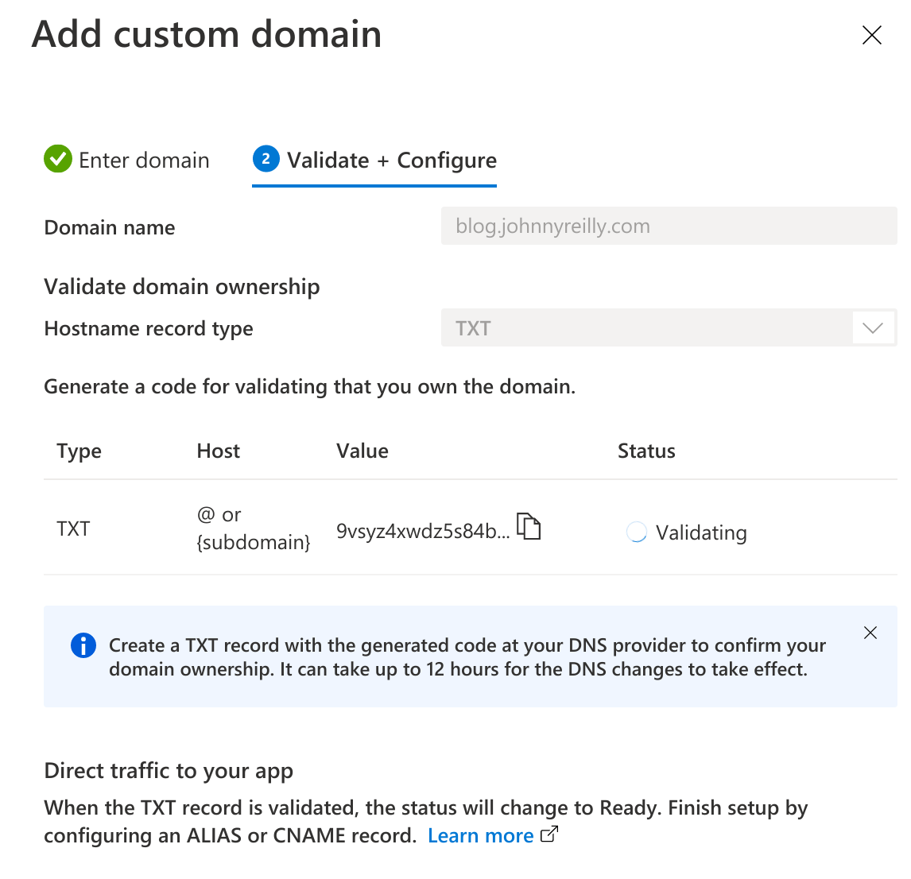
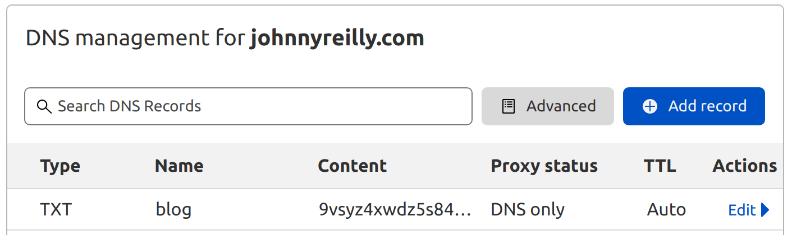
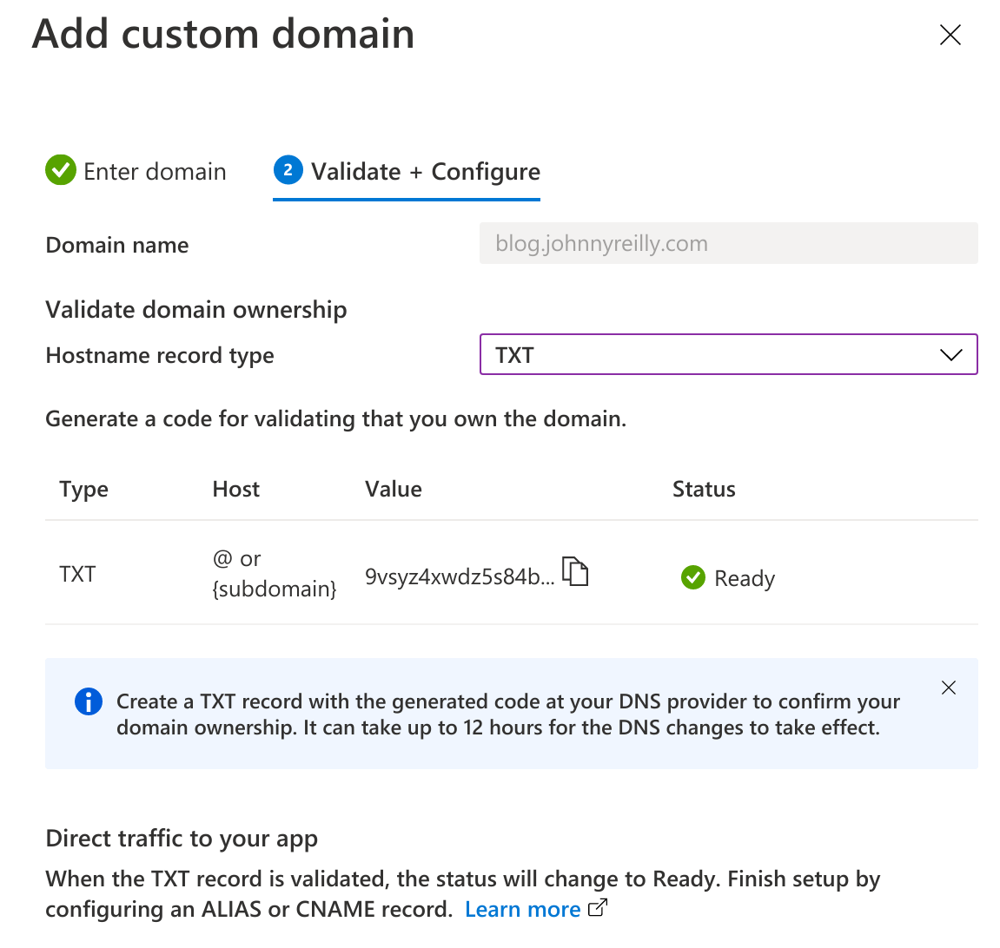
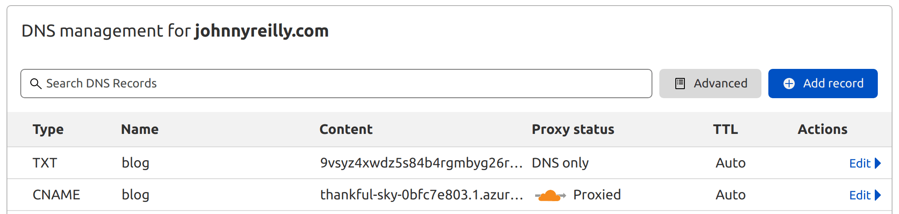

import FAQStructuredData from '../../src/theme/MDXComponents/FAQStructuredData';

export const faqs = [
{
question:
'Why should I migrate from GitHub Pages to Azure Static Web Apps?',
answer:
"If you like the idea of using a single platform for hosting your static website and deploying previews, then Azure Static Web Apps is a great option. It's also free to use!",
},
{
question: 'What is Bicep and how can it be used for migration?',
answer:
"Bicep is a Domain Specific Language (DSL) for deploying Azure resources. It's a great way to define your infrastructure as code. You can use Bicep to deploy your Azure Static Web App. You can also deploy an Azure Static Web App using the Azure Portal or the Azure CLI.",
},
{
question:
'How do I enable staging environments / deployment previews in Azure Static Web Apps?',
answer:
"You don't need to do anything special to enable staging environments. They're enabled by default.",
},
];

You can use Bicep and GitHub Actions to build and deploy to a static website on Azure Static Web Apps. This post demonstrates how.


<!--truncate-->

## Why migrate?

This blog has been hosted on GitHub Pages for some time. It also makes use of Netlify for deployment previews. These are both great, but it's always niggled that there's two mechanisms in play; each separately configured. It's time to simplify.

[Azure Static Web Apps](https://azure.microsoft.com/en-us/services/app-service/static/) supports both hosting static websites and deployment previews (known as "staging environments"). So we're going to migrate across to use Static Web Apps in place of both of GitHub Pages and Netlify. I'm choosing to use Bicep to do this as I tend towards using infrastructure as code. If you wanted to roll with a more "point and click" approach in the Azure Portal, you could do that too. Simply ignore the Bicep related portions of the post.

## Bicep

The first thing we're going to need is a Bicep template to deploy our SWA. In our GitHub repo we're going to add a `infra` folder, and in there we'll create a `main.bicep` file:

```bicep
param location string
param branch string
param name string
param tags object
@secure()
param repositoryToken string
param customDomainName string

resource staticWebApp 'Microsoft.Web/staticSites@2021-02-01' = {
  name: name
  location: location
  tags: tags
  sku: {
    name: 'Free'
    tier: 'Free'
  }
  properties: {
    repositoryUrl: 'https://github.com/johnnyreilly/blog.johnnyreilly.com'
    repositoryToken: repositoryToken
    branch: branch
    provider: 'GitHub'
    stagingEnvironmentPolicy: 'Enabled'
    allowConfigFileUpdates: true
    buildProperties:{
      skipGithubActionWorkflowGeneration: true
    }
  }
}

// resource customDomain 'Microsoft.Web/staticSites/customDomains@2021-02-01' = {
//   parent: staticWebApp
//   name: customDomainName
//   properties: {}
// }

output staticWebAppDefaultHostName string = staticWebApp.properties.defaultHostname // eg gentle-bush-0db02ce03.azurestaticapps.net
output staticWebAppId string = staticWebApp.id
output staticWebAppName string = staticWebApp.name
```

Most of the Bicep template above is self-explanatory. There's a few things to highlight:

- We're using the "Free" SKU which means we don't have to pay to run our website.
- We need to provide a `repositoryToken` - this is a little surprising as you'll see later in the template that we supply the `skipGithubActionWorkflowGeneration: true` which means we're _not_ requiring our SWA to interact with GitHub on our behalf - but it seems that there's a requirement for a GitHub token anyway. We'll roll with it.
- We're enabling deployment previews / staging environments with `stagingEnvironmentPolicy: 'Enabled'`
- The `branch` is always set to `main` - we have to let Azure know this so it knows which branch is the primary branch and hence which other ones will have staging environments.
- It also includes a section for the custom domain which is commented out - we'll uncomment that later once we've set up our custom domain / DNS.

## Setting up a resource group

With our Bicep in place, we're going to need a resource group to send it to. We're going to create ourselves a resource group in West Europe:

```shell
az group create -g rg-blog-johnnyreilly-com -l westeurope
```

## Secrets for GitHub Actions

We're aiming to set up a GitHub Action to handle our deployment which depends upon some secrets.

### `AZURE_CREDENTIALS` - GitHub logging into Azure

First a `AZURE_CREDENTIALS` secret that facilitates GitHub logging into Azure. We'll use the Azure CLI to create this:

```shell
az ad sp create-for-rbac --name "myApp" --role contributor \
    --scopes /subscriptions/{subscription-id}/resourceGroups/{resource-group} \
    --sdk-auth
```

Remember to replace the `{subscription-id}` with your subscription id and `{resource-group}` with the name of your resource group (`rg-blog-johnnyreilly-com` if you're following along). This command will pump out a lump of JSON that looks something like this:

```json
{
  "clientId": "a-client-id",
  "clientSecret": "a-client-secret",
  "subscriptionId": "a-subscription-id",
  "tenantId": "a-tenant-id",
  "activeDirectoryEndpointUrl": "https://login.microsoftonline.com",
  "resourceManagerEndpointUrl": "https://management.azure.com/",
  "activeDirectoryGraphResourceId": "https://graph.windows.net/",
  "sqlManagementEndpointUrl": "https://management.core.windows.net:8443/",
  "galleryEndpointUrl": "https://gallery.azure.com/",
  "managementEndpointUrl": "https://management.core.windows.net/"
}
```

Take this and save it as the `AZURE_CREDENTIALS` secret in GitHub.

### `WORKFLOW_TOKEN` - Azure accessing the GitHub container registry

We also need a secret for updating workflows from Azure. Azure Static Web Apps can update your workflow - they need access to do this when we're deploying. To facilitate this we'll set up a `WORKFLOW_TOKEN` secret. This is a GitHub personal access token with the `workflow` scope. [Follow the instructions here to create the token.](https://docs.github.com/en/authentication/keeping-your-account-and-data-secure/creating-a-personal-access-token)

Ironically, we're not planning to use this functionality, but the validation for the Bicep template will fail if it isn't supplied.

## Deploying with GitHub Actions

With our secrets configured, we're now well placed to update our GitHub Action. We'll tweak the content of `.github/workflows/build-and-deploy.yaml` file in our repository to the following:

```yaml
name: Build and Deploy

on:
  push:
    branches:
      - main
  pull_request:
    types: [opened, synchronize, reopened, closed]
    branches:
      - main

env:
  RESOURCE_GROUP: rg-blog-johnnyreilly-com
  LOCATION: westeurope
  STATICWEBAPPNAME: blog.johnnyreilly.com
  TAGS: '{"owner":"johnnyreilly", "email":"johnny_reilly@hotmail.com"}'

jobs:
  build_and_deploy_swa_job:
    if: github.event_name == 'push' || (github.event_name == 'pull_request' && github.event.action != 'closed')
    runs-on: ubuntu-latest
    name: Build and deploy
    steps:
      - uses: actions/checkout@v2
        with:
          submodules: true

      - name: Azure Login
        uses: azure/login@v1
        with:
          creds: ${{ secrets.AZURE_CREDENTIALS }}

      - name: Set Deployment Name
        id: deployment_name
        run: |
          REF_SHA='${{ github.ref }}.${{ github.sha }}'
          DEPLOYMENT_NAME="${REF_SHA////-}"
          echo "DEPLOYMENT_NAME=$DEPLOYMENT_NAME" >> $GITHUB_OUTPUT

      - name: Static Web App - change details
        id: static_web_app_what_if
        if: github.event_name == 'pull_request'
        uses: azure/CLI@v2
        with:
          inlineScript: |
            az deployment group what-if \
              --resource-group ${{ env.RESOURCE_GROUP }} \
              --name "${{ steps.deployment_name.outputs.DEPLOYMENT_NAME }}" \
              --template-file ./infra/main.bicep \
              --parameters \
                  branch='main' \
                  location='${{ env.LOCATION }}' \
                  name='${{ env.STATICWEBAPPNAME }}' \
                  tags='${{ env.TAGS }}' \
                  repositoryToken='${{ secrets.WORKFLOW_TOKEN }}' \
                  customDomainName='${{ env.STATICWEBAPPNAME }}'

      - name: Static Web App - deploy infra
        id: static_web_app_deploy
        if: github.event_name != 'pull_request'
        uses: azure/CLI@v2
        with:
          inlineScript: |
            az deployment group create \
              --resource-group ${{ env.RESOURCE_GROUP }} \
              --name "${{ steps.deployment_name.outputs.DEPLOYMENT_NAME }}" \
              --template-file ./infra/main.bicep \
              --parameters \
                  branch='main' \
                  location='${{ env.LOCATION }}' \
                  name='${{ env.STATICWEBAPPNAME }}' \
                  tags='${{ env.TAGS }}' \
                  repositoryToken='${{ secrets.WORKFLOW_TOKEN }}' \
                  customDomainName='${{ env.STATICWEBAPPNAME }}'

      - name: Static Web App - get API key for deployment
        id: static_web_app_apikey
        uses: azure/CLI@v2
        with:
          inlineScript: |
            APIKEY=$(az staticwebapp secrets list --name '${{ env.STATICWEBAPPNAME }}' | jq -r '.properties.apiKey')
            echo "APIKEY=$APIKEY" >> $GITHUB_OUTPUT

      - name: Static Web App - build and deploy
        id: static_web_app_build_and_deploy
        uses: Azure/static-web-apps-deploy@v1
        with:
          azure_static_web_apps_api_token: ${{ steps.static_web_app_apikey.outputs.APIKEY }}
          repo_token: ${{ secrets.GITHUB_TOKEN }} # Used for Github integrations (i.e. PR comments)
          action: 'upload'
          ###### Repository/Build Configurations - These values can be configured to match your app requirements. ######
          # For more information regarding Static Web App workflow configurations, please visit: https://aka.ms/swaworkflowconfig
          app_location: '/blog-website' # App source code path
          api_location: '' # Api source code path - optional
          output_location: 'build' # Built app content directory - optional
          ###### End of Repository/Build Configurations ######

      - name: Static Web App - get preview URL
        id: static_web_app_preview_url
        uses: azure/CLI@v2
        with:
          inlineScript: |
            DEFAULTHOSTNAME=$(az staticwebapp show -n '${{ env.STATICWEBAPPNAME }}' | jq -r '.defaultHostname')
            echo $DEFAULTHOSTNAME

            PREVIEW_URL="https://${DEFAULTHOSTNAME/.[1-9]./-${{github.event.pull_request.number }}.${{ env.LOCATION }}.1.}"
            echo $PREVIEW_URL

            echo "PREVIEW_URL=$PREVIEW_URL" >> $GITHUB_OUTPUT

    outputs:
      preview-url: ${{steps.static_web_app_preview_url.outputs.PREVIEW_URL}}

  close_pull_request_job:
    if: github.event_name == 'pull_request' && github.event.action == 'closed'
    runs-on: ubuntu-latest
    name: Cleanup Pull Request staging environment
    steps:
      - name: Azure Login
        uses: azure/login@v1
        with:
          creds: ${{ secrets.AZURE_CREDENTIALS }}

      - name: Get API key for deployment
        id: apikey
        uses: azure/CLI@v2
        with:
          inlineScript: |
            APIKEY=$(az staticwebapp secrets list --name '${{ env.STATICWEBAPPNAME }}' | jq -r '.properties.apiKey')
            echo "APIKEY=$APIKEY" >> $GITHUB_OUTPUT

      - name: Close Pull Request
        id: closepullrequest
        uses: Azure/static-web-apps-deploy@v1
        with:
          azure_static_web_apps_api_token: ${{ steps.apikey.outputs.APIKEY }}
          action: 'close'
```

The above workflow does the following:

- For main branch deployments it releases our static web app making use of Bicep. For pull requests it tells us if there's any changes that the current PR would make to our SWA as a consequence.
- It acquires an API Key from Azure which can then be used to perform a deployment.
- It deploys [using the dedicated GitHub Action for SWAs](https://github.com/Azure/static-web-apps-deploy)
- It calculates the preview URL for a given pull request (it isn't used as yet, but could be)
- When a pull request is closed it triggers the GitHub Action to clean up the preview environment.

## DNS and custom domains

Once our GitHub Action has run for the first time on the main branch, we'll be deploying to Azure Static Web Apps.

Once we've started deploying there, we want to get our custom domain set up to point to it. To do this, we're going to fire up the [Azure Portal](https://portal.azure.com) and go to add a custom domain:



We're going to add a TXT record for my blog. Azure generates a code for us:



We need to take that code and go a register it with our DNS provider. In my case that's Cloudflare, so we can go there and add it:



After a while (I think about twenty minutes in my case), this lead to the domain name being validated:



Now that we have a custom domain set up in Azure, we want to uncomment the `resource customDomain` portion of the Bicep template now as well:

```bicep
resource customDomain 'Microsoft.Web/staticSites/customDomains@2021-02-01' = {
  parent: staticWebApp
  name: customDomainName
  properties: {}
}
```

This will mean that subsequent deployments to Azure do _not_ wipe out our newly configured domain name.

We're now ready to start pointing our DNS to the Static Web Apps instance. We jump back across to Cloudflare and we amend the CNAME record that currently points to johnnyreilly.github.io, and switch it to point to the auto-generated domain in Azure:



And just like that, we're hosted on Static Web Apps!

<FAQStructuredData faqs={faqs} />
