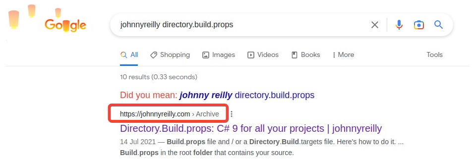

By default, Docusaurus blogs don't add breadcrumb Structured Data to their blog posts. It's not hard to make it happen though; this post shows how to add it using the JSON-LD format.

<!--truncate-->

Take a look at this:

What you're looking at is a [blog post of mine](../2021-07-14-directory-build-props-c-sharp-9-for-all/index.md) showing up in Google search results, with a breadcrumb that I've highlighted. What is a breadcrumb to Google?

> Google Search uses breadcrumb markup in the body of a web page to categorize the information from the page in search results.

[You can read more on breadcrumbs here](https://developers.google.com/search/docs/appearance/structured-data/breadcrumb). This post is about how to add breadcrumbs to your Docusaurus blog posts to help Google categorise your blog posts. It's worth noting that what we're going to do here is add a JSON-LD breadcrumb to the blog post. There's no physical breadcrumb on the page itself. It could be nice to add a physical breadcrumb to the page itself, but that's not what we're going to do here as it would not be trivial to do so.

Docusaurus already has Structured Data support for blog posts; [in fact it was me that originally contributed it](https://github.com/facebook/docusaurus/pull/5322). We're going to enrich the Structured Data for blog posts by adding a breadcrumb as well as the existing Article / BlogPosting Structured Data.

If you'd like to learn more about React, JSON-LD and Structured Data, I've written a [post on the topic](../2021-10-15-structured-data-seo-and-react/index.md).

## Adding a breadcrumb to a blog post

https://github.com/johnnyreilly/blog.johnnyreilly.com/pull/416

added JSON-LD breadcrumbs to blog posts and archive pages:

https://developers.google.com/search/docs/appearance/structured-data/breadcrumb

npm run swizzle @docusaurus/theme-classic BlogArchivePage -- --wrap --danger
npm run swizzle @docusaurus/theme-classic BlogPostPage -- --wrap --danger

https://github.com/johnnyreilly/blog.johnnyreilly.com/pull/416

Added multiple breadcrumb lists to blog posts to include tags as well

https://github.com/johnnyreilly/blog.johnnyreilly.com/commit/e69633ca6cc6cae98cd405580e9659594ac92f8a
