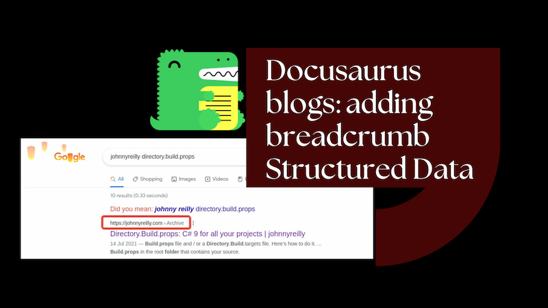
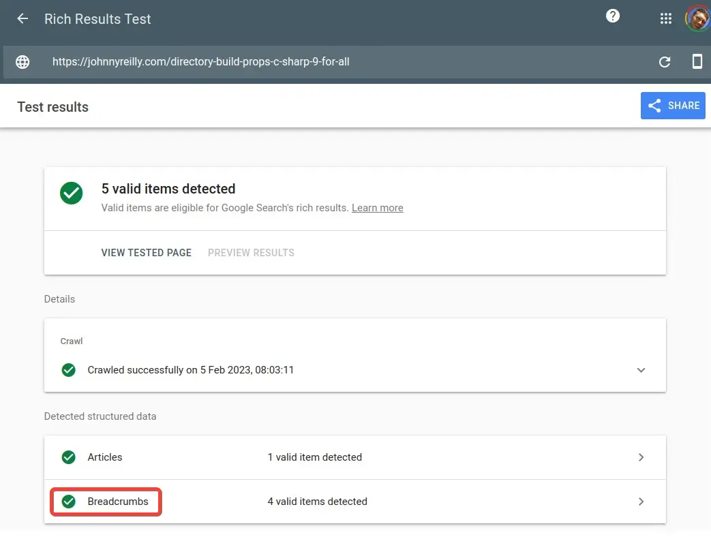
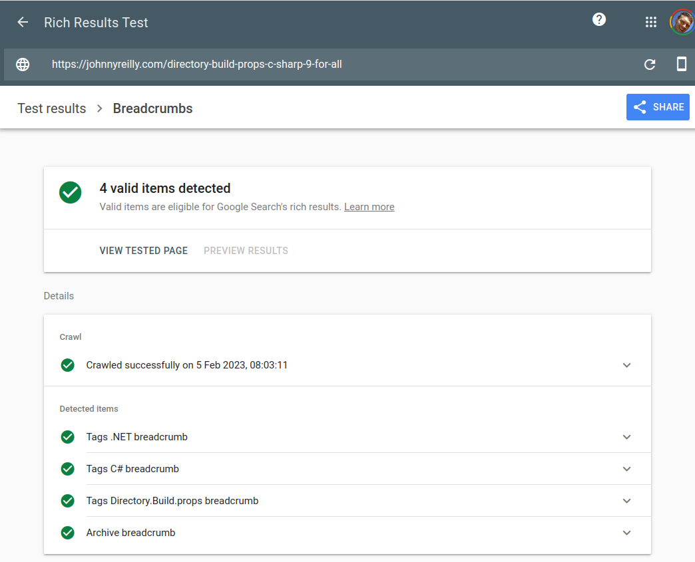
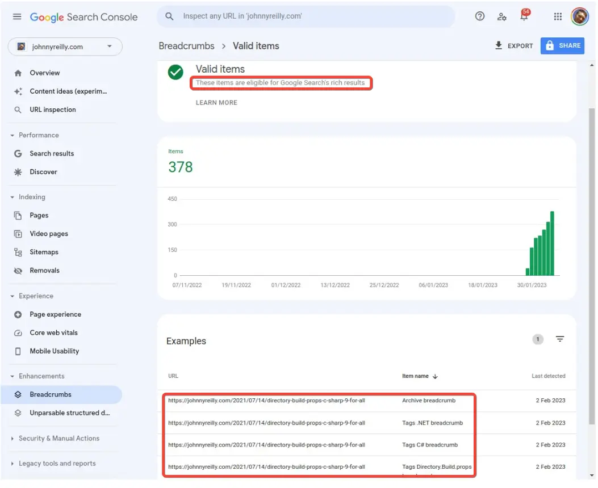

By default, Docusaurus blogs don't add breadcrumb structured data to their blog posts. It's not hard to make it happen though; this post shows how to add it using the JSON-LD format.



<!--truncate-->

## What are breadcrumbs?

Take a look at this:


What you're looking at is a [blog post of mine](../2021-07-14-directory-build-props-c-sharp-9-for-all/index.md) showing up in Google search results. Significantly, it has a breadcrumb which I've highlighted. It indicates that the blog post sits under the blogs "Archive" page, which in turn sits under the home page of the site.

This breadcrumb was driven by structured data that my blog surfaces. Structured data is a form of metadata that is intended to be easily machine readable; and consequently helpful to search engines like Google. Now, what is a breadcrumb to Google?

> Google Search uses breadcrumb markup in the body of a web page to categorize the information from the page in search results.

[You can read more on breadcrumbs in the Google documentation](https://developers.google.com/search/docs/appearance/structured-data/breadcrumb). This post is about how to add breadcrumbs to your Docusaurus blog posts, to help Google categorise your blog posts.

It's worth noting that what we're going to do here is add a JSON-LD structured data breadcrumb to the blog post. There's going to be no physical breadcrumb on the page itself. It could be nice to add a physical breadcrumb, but that's not what we're going to do here as it would not be a trivial addition. (As an aside, Docusaurus does use physical breadcrumbs in its documentation pages; which surface structured data.)

Docusaurus already has structured data support for blog posts; [in fact I had a hand in that](https://github.com/facebook/docusaurus/pull/5322). I like me some structured data 😉. The existing structured data is article / `BlogPosting` metadata. We're going to enrich the structured data for blog posts by adding a `BreadcrumbList` as well.

Incidentally, if you'd like to learn more about React, JSON-LD and structured data, I've [written about it, and done a short talk on the topic](../2021-10-15-structured-data-seo-and-react/index.md).

## Adding a breadcrumb to a blog post

With all that preamble out of the way, let's get to the good stuff. We're going to add a breadcrumb to a blog post. To do that, we need to adjust two components in Docusaurus; the `BlogArchivePage` and the `BlogPostPage`. We're going to do this by swizzling. Let's crack open the terminal and get started:

```bash
npm run swizzle @docusaurus/theme-classic BlogArchivePage -- --wrap --danger
npm run swizzle @docusaurus/theme-classic BlogPostPage -- --wrap --danger
```

This will create two files in the `src/theme/` directory:

- `src/theme/BlogArchivePage/index.js`
- `src/theme/BlogPostPage/index.js`

You'll note from the command that we've used the `--wrap` flag. This is because we want to wrap the existing component. If we didn't use the `--wrap` flag, we'd be replacing the existing component. We're wrapping rather than replacing as it will make maintenance easier as Docusaurus evolves.

## Adding a breadcrumb to the blog archive page

We're now going to replace the generated `BlogArchivePage` component with the following:

```jsx
import React from 'react';
import BlogArchivePage from '@theme-original/BlogArchivePage';
import useDocusaurusContext from '@docusaurus/useDocusaurusContext';

export default function BlogArchivePageWrapper(props) {
  const { siteConfig } = useDocusaurusContext();

  // https://developers.google.com/search/docs/appearance/structured-data/breadcrumb#json-ld
  const breadcrumbStructuredData = {
    '@context': 'https://schema.org',
    '@type': 'BreadcrumbList',
    name: 'Archive breadcrumb',
    itemListElement: [
      {
        '@type': 'ListItem',
        position: 1,
        name: 'Home',
        item: siteConfig.url,
      },
      {
        '@type': 'ListItem',
        position: 2,
        name: 'Archive',
      },
    ],
  };

  return (
    <>
      <script
        type="application/ld+json"
        dangerouslySetInnerHTML={{
          __html: JSON.stringify(breadcrumbStructuredData),
        }}
      />
      <BlogArchivePage {...props} />
    </>
  );
}
```

Here we're constructing a JSON-LD structured data object that represents a breadcrumb. We're then adding it to the page as a script tag with the `type` of `application/ld+json`. And we're rendering the wrapped `BlogArchivePage` component. This is so that we can add the structured data breadcrumb to the page without having to duplicate the existing code.

There's two entries in the `itemListElement` array. The first is the home page of the site. The second is the archive page itself. We're not going to add a link to the archive page as it's the current page.

## Adding a breadcrumb to the blog post page

Okay, one down - one to go. We're now going to replace the generated `BlogPostPage` component with the following:

```jsx
import React from 'react';
import BlogPostPage from '@theme-original/BlogPostPage';
import useDocusaurusContext from '@docusaurus/useDocusaurusContext';

export default function BlogPostPageWrapper(props) {
  const { siteConfig } = useDocusaurusContext();

  /** @type {import('@docusaurus/plugin-content-blog').BlogPostMetadata} */ const blogMetaData =
    props.content.metadata;

  // https://developers.google.com/search/docs/appearance/structured-data/breadcrumb#json-ld
  const archiveBreadcrumbStructuredData = {
    '@context': 'https://schema.org',
    '@type': 'BreadcrumbList',
    name: 'Archive breadcrumb',
    itemListElement: [
      {
        '@type': 'ListItem',
        position: 1,
        name: 'Home',
        item: siteConfig.url,
      },
      {
        '@type': 'ListItem',
        position: 2,
        name: 'Archive',
        item: `${siteConfig.url}/archive`,
      },
      {
        '@type': 'ListItem',
        position: 3,
        name: blogMetaData.title,
      },
    ],
  };

  const tagsBreadcrumbStructuredData = blogMetaData.tags.map((tag) => ({
    '@context': 'https://schema.org',
    '@type': 'BreadcrumbList',
    name: `Tags ${tag.label} breadcrumb`,
    itemListElement: [
      {
        '@type': 'ListItem',
        position: 1,
        name: 'Home',
        item: siteConfig.url,
      },
      {
        '@type': 'ListItem',
        position: 2,
        name: 'Tags',
        item: `${siteConfig.url}/tags`,
      },
      {
        '@type': 'ListItem',
        position: 3,
        name: tag.label,
        item: `${siteConfig.url}${tag.permalink}`,
      },
      {
        '@type': 'ListItem',
        position: 4,
        name: blogMetaData.title,
      },
    ],
  }));

  const breadcrumbStructuredData = [
    archiveBreadcrumbStructuredData,
    ...tagsBreadcrumbStructuredData,
  ];

  return (
    <>
      <script
        type="application/ld+json"
        dangerouslySetInnerHTML={{
          __html: JSON.stringify(breadcrumbStructuredData),
        }}
      />
      <BlogPostPage {...props} />
    </>
  );
}
```

Again, we're constructing a JSON-LD structured data object that represents a breadcrumb. But this time we're going to add multiple breadcrumbs to the page. The first is the archive breadcrumb. The other breadcrumbs are generated for each tag.

I'm somewhat on the fence as to whether it's useful to have a breadcrumb for each tag. [In fact, originally I didn't have it when I first added support](https://github.com/johnnyreilly/blog.johnnyreilly.com/pull/416). But I've added it in as it's not a lot of work and it's not a lot of code. I'm not sure if it's useful or not. [I've added it now](https://github.com/johnnyreilly/blog.johnnyreilly.com/commit/e69633ca6cc6cae98cd405580e9659594ac92f8a); I'm going to leave it in in place for a bit and see how it goes.

## Using the Rich Results test to validate the breadcrumbs

Once we've shipped the changes we can test them using the [Google Rich Results Test](https://search.google.com/test/rich-results). The screenshot below was taken after I'd deployed the changes and [the test was run](https://search.google.com/test/rich-results?url=https%3A%2F%2Fjohnnyreilly.com%2Fdirectory-build-props-c-sharp-9-for-all).





We can also check the breadcrumbs in the [Google Search Console](https://search.google.com/search-console/r/breadcrumbs):



So that's it, now we have breadcrumbs on the blog posts.

## Conclusion

This is a useful addition to the blog. I'd like it more if it was a physical breadcrumb as well; not just an "invisible" one. [I've opened an issue with Docusaurus to see if that's possible](https://docusaurus.io/feature-requests/p/add-breadcrumb-for-blog-posts). I would imagine, if that does get added, it would likely be a single breadcrumb rather than multiple ones. But let me not preempt; let's see what comes of it.
